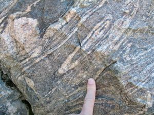

Devils Tower, Wyoming.

# **1 Understanding Science**

**STUDENT LEARNING OUTCOMES**

**At the end of this chapter, students should be able to:**

- Contrast objective versus subjective observations, and quantitative versus qualitative observations
- Identify a pseudoscience based on its lack of falsifiability
- Contrast the methods used by Aristotle and Galileo to describe the natural environment
- Explain the scientific method and apply it to a problem or question
- Describe the foundations of modern geology, such as the principle of uniformitarianism
- Contrast uniformitarianism with catastrophism
- Explain why studying geology is important
- Identify how Earth materials are transformed by rock cycle processes
- Describe the steps involved in a reputable scientific study
- Explain rhetorical arguments used by science deniers

## 1.1 **What is Science?**

Scientists seek to understand the fundamental principles that explain natural patterns and processes. Science is more than just a body of knowledge, science provides a means to evaluate and create new knowledge without bias. Scientists use objective evidence over subjective evidence, to reach sound and logical conclusions.

An objective observation is without personal bias and the same by all individuals. Humans are biased by nature, so they cannot be completely objective; the goal is to be as unbiased as possible. A subjective observation is based on a person’s feelings and beliefs and is unique to that individual.

Another way scientists avoid bias is by using quantitative over qualitative measurements whenever possible. A quantitative measurement is expressed with a specific numerical value. Qualitative observations are general or relative descriptions. For example, describing a rock as red or heavy is a qualitative observation. Determining a rock’s color by measuring wavelengths of reflected light or its density by measuring the proportions of minerals it contains is quantitative. Numerical values are more precise than general descriptions, and they can be analyzed using statistical calculations. This is why quantitative measurements are much more useful to scientists than qualitative observations.

Establishing truth in science is difficult because all scientific claims are falsifiable, which means any initial hypothesis may be tested and proven false. Only after exhaustively eliminating false results, competing ideas, and possible variations does a hypothesis become regarded as a reliable scientific theory. This meticulous scrutiny reveals weaknesses or flaws in a hypothesis and is the strength that supports all scientific ideas and procedures. In fact, proving current ideas are wrong has been the driving force behind many scientific careers.

Falsifiability separates science from pseudoscience. Scientists are wary of explanations of natural phenomena that discourage or avoid falsifiability. An explanation that cannot be tested or does not meet scientific standards is not considered science, but pseudoscience. Pseudoscience is a collection of ideas that may appear scientific but does not use the scientific method. Astrology is an example of pseudoscience. It is a belief system that attributes the movement of celestial bodies to influencing human behavior. Astrologers rely on celestial observations, but their conclusions are not based on experimental evidence and their statements are not falsifiable. This is not to be confused with astronomy which is the scientific study of celestial bodies and the cosmos.

Science is also a social process. Scientists share their ideas with peers at conferences, seeking guidance and feedback. Research papers and data submitted for publication are rigorously reviewed by qualified peers, scientists who are experts in the same field. The scientific review process aims to weed out misinformation, invalid research results, and wild speculation. Thus, it is slow, cautious, and conservative. Scientists tend to wait until a hypothesis is supported by overwhelming amount of evidence from many independent researchers before accepting it as scientific theory.

**▶ Did you get it? Click here to find out.**

                            if (window.qmn_quiz_data === undefined) {
                                    window.qmn_quiz_data = new Object();
                            }
                    window.qmn_quiz_data["2"] = {"quiz_id":"2","quiz_name":"1.1-01","disable_answer":0,"ajax_show_correct":0,"progress_bar":0,"contact_info_location":"0","qpages":{"1":{"id":"1","quizID":"2","pagekey":"CB1RXtSU","hide_prevbtn":"0"}},"skip_validation_time_expire":0,"timer_limit_val":0,"disable_scroll_next_previous_click":0,"disable_scroll_on_result":0,"disable_first_page":"0","enable_result_after_timer_end":0,"enable_quick_result_mc":"1","end_quiz_if_wrong":0,"form_disable_autofill":0,"disable_mathjax":0,"enable_quick_correct_answer_info":"0","quick_result_correct_answer_text":"Correct! Objective statements are statements of fact.","quick_result_wrong_answer_text":"Incorrect. Objective statements involve facts, not opinions.","quiz_processing_message":"","quiz_limit_choice":"Limit of choice is reached.","not_allow_after_expired_time":0,"scheduled_time_end":false,"error_messages":{"email_error_text":"Not a valid e-mail address!","number_error_text":"This field must be a number!","incorrect_error_text":"The entered text is not correct!","empty_error_text":"Please complete all required fields!","url_error_text":"The entered URL is not valid!","minlength_error_text":"Required atleast %minlength% characters.","maxlength_error_text":"Maximum %maxlength% characters allowed.","recaptcha_error_text":"ReCaptcha is missing"},"first_page":false}
                    

1.1-01 Which is an objective statement? 

					Tacos are a Mexican dish, whereas pasta is Italian.					

					Banana cupcakes are the best.					

					My father is a good man.					

					Geology is an important science.					

					Everyone should take a geology class.					

None

 Time's upCancel
                            if (window.qmn_quiz_data === undefined) {
                                    window.qmn_quiz_data = new Object();
                            }
                    window.qmn_quiz_data["22"] = {"quiz_id":"22","quiz_name":"1.1-02","disable_answer":0,"ajax_show_correct":0,"progress_bar":0,"contact_info_location":"0","qpages":{"1":{"id":"1","quizID":"13","pagekey":"AnoergqT","hide_prevbtn":"0"}},"skip_validation_time_expire":0,"timer_limit_val":0,"disable_scroll_next_previous_click":0,"disable_scroll_on_result":0,"disable_first_page":"0","enable_result_after_timer_end":0,"enable_quick_result_mc":"1","end_quiz_if_wrong":0,"form_disable_autofill":0,"disable_mathjax":0,"enable_quick_correct_answer_info":"2","quick_result_correct_answer_text":"Yes! Pseudoscienc involves claims that cannot be tested to see if they are correct.","quick_result_wrong_answer_text":"Incorrect.","quiz_processing_message":"","quiz_limit_choice":"Limit of choice is reached.","not_allow_after_expired_time":0,"scheduled_time_end":false,"error_messages":{"email_error_text":"Not a valid e-mail address!","number_error_text":"This field must be a number!","incorrect_error_text":"The entered text is not correct!","empty_error_text":"Please complete all required fields!","url_error_text":"The entered URL is not valid!","minlength_error_text":"Required atleast %minlength% characters.","maxlength_error_text":"Maximum %maxlength% characters allowed.","recaptcha_error_text":"ReCaptcha is missing"},"first_page":false}
                    

1.1-02 What distinguishes science from pseudoscience? 

Pseudoscience uses experimentation to objectively reach conclusions.					

					In science, we just know that things are the way they are.					

					Concepts must be falsifiable to be considered science.					

					Science deals with the mainstream ideas, pseudoscience does not.					

					Measurements can prove a concept to be correct and scientific.					

None

 Time's upCancel
                            if (window.qmn_quiz_data === undefined) {
                                    window.qmn_quiz_data = new Object();
                            }
                    window.qmn_quiz_data["52"] = {"quiz_id":"52","quiz_name":"01.1-3","disable_answer":0,"ajax_show_correct":0,"progress_bar":0,"contact_info_location":"0","qpages":{"1":{"id":"1","quizID":"52","pagekey":"ZU1rYcRL","hide_prevbtn":"0"}},"skip_validation_time_expire":0,"timer_limit_val":0,"disable_scroll_next_previous_click":0,"disable_scroll_on_result":0,"disable_first_page":"0","enable_result_after_timer_end":0,"enable_quick_result_mc":"1","end_quiz_if_wrong":0,"form_disable_autofill":0,"disable_mathjax":0,"enable_quick_correct_answer_info":"2","quick_result_correct_answer_text":"Yes. It can take a long time to check and verify results.","quick_result_wrong_answer_text":"Oops.","quiz_processing_message":"","quiz_limit_choice":"Limit of choice is reached.","not_allow_after_expired_time":0,"scheduled_time_end":false,"error_messages":{"email_error_text":"Not a valid e-mail address!","number_error_text":"This field must be a number!","incorrect_error_text":"The entered text is not correct!","empty_error_text":"Please complete all required fields!","url_error_text":"The entered URL is not valid!","minlength_error_text":"Required atleast %minlength% characters.","maxlength_error_text":"Maximum %maxlength% characters allowed.","recaptcha_error_text":"ReCaptcha is missing"},"first_page":false}
                    

01.1-3 Why is science normally a slow process? 

					All experiments take a long time to complete.					

					Because their work is intense, scientists take long vacations.					

					The process of weeding out misinformation and verifying results takes lots of time.					

					Scientifc meetings are usually drawn out arguments.					

					Pseudoscientists are constantly slowing things down.					

None

 Time's upCancel

## **1.2 The Scientific Method**

Diagram of the cyclical nature of the scientific method.Modern science is based on the scientific method, a procedure that follows these steps:

- Formulate a question or observe a problem
- Devise an evidence-based hypothesis
- Apply objective experimentation and observation
- Analyze collected data and interpret results
- Submit findings for peer review and/or publication

The scientific method has a long history in human thought but was first fully formed by Ibn al-Haytham more than 1,000 years ago. At the forefront of the scientific method – the key that separates science from pseudoscience – is that scientific conclusions are based on objective evidence, not opinion or hearsay.

#### **Step One: Observation, Problem, or Research Question**

The procedure begins with identifying a problem or research question, such as a geological phenomenon that is not well explained in the scientific community’s collective knowledge. This step usually involves reviewing the scientific literature to understand previous studies that may be related to the question.

#### **Step Two: Hypothesis**

Once the problem or question is well defined, the scientist proposes a possible answer, a hypothesis, before conducting further investigations that may include experiments or field work. This hypothesis must be specific, falsifiable, and should be based on other scientific work. Hypotheses are not just guesses, because they are based, in part, on available but often limited evidence. Geologists often develop multiple working hypotheses because they usually cannot impose strict experimental controls or may have limited opportunities to visit a field location to gather more information.

#### **Step Three: Experiment and Hypothesis Revision**

The next step is developing an experiment that may support or refute the hypothesis. The term *experiment* sometimes causes confusion, because many people mistakenly think experiments are only done in a lab. However, experiments can consist of observing natural processes in the field, or creating computer models, or doing any of a number of other kinds of investigations. Regardless of what form an experiment takes, it always includes the systematic gathering of objective data. This data is interpreted to determine whether it contradicts or supports the hypothesis, which may be revised and tested again. When a hypothesis holds up under experimentation, it is ready to be shared with other experts in the field.

#### **Step Four: Peer Review, Publication, and Replication**

Scientists share the results of their research by giving talks at meetings or publishing articles in scientific journals such as Science and Nature. Reputable journals and publishing houses will not publish an experimental study until they have determined its methods are scientifically rigorous and the conclusions are supported by evidence. Before an article is published, it undergoes a rigorous peer review by scientific experts who scrutinize the methods, results, and discussion. Once an article is published, other scientists may attempt to replicate the results. This replication is necessary to confirm the reliability of the study’s reported results. A hypothesis that seemed compelling in one study might be proven false in studies conducted by other scientists. New technology can be applied to published studies, which can aid in confirming or rejecting once-accepted ideas and/or hypotheses.

#### **Step Five: Theory Development**

After a hypothesis has been repeatedly tested for falsifiability through documented and independent studies, and passes all the tests, it may eventually become accepted as a scientific theory. In casual conversation, the word *theory* implies guesswork or speculation. In the language of science, an explanation or conclusion made in a theory carries much more weight because it is supported by experimental verification and widely accepted by the scientific community.

While a hypothesis provides a tentative explanation *before *an experiment, a theory is the best explanation *after *being confirmed by multiple independent experiments. Confirmation of a theory may take years, or even longer. For example, the continental drift hypothesis first proposed by Alfred Wegener in 1912 was initially dismissed. After decades of additional evidence collection by other scientists using more advanced technology, Wegener’s hypothesis was accepted and revised as the theory of plate tectonics.

The theory of evolution by natural selection is another example. Originating from the work of Charles Darwin in the mid-19th century, the theory of evolution has withstood generations of scientific testing for falsifiability. While it has been updated and revised to accommodate knowledge gained using modern technologies, the theory of evolution continues to be supported by the latest evidence. Today we know that evolution can occur quickly, perhaps in a matter of years or days. It was a long time after Darwin before this notion became accepted.

**▶ Did you get it? Click here to find out.**

                            if (window.qmn_quiz_data === undefined) {
                                    window.qmn_quiz_data = new Object();
                            }
                    window.qmn_quiz_data["13"] = {"quiz_id":"13","quiz_name":"1.2-01","disable_answer":0,"ajax_show_correct":0,"progress_bar":0,"contact_info_location":"0","qpages":{"1":{"id":"1","quizID":"13","pagekey":"AnoergqT","hide_prevbtn":"0"}},"skip_validation_time_expire":0,"timer_limit_val":0,"disable_scroll_next_previous_click":0,"disable_scroll_on_result":0,"disable_first_page":"0","enable_result_after_timer_end":0,"enable_quick_result_mc":"1","end_quiz_if_wrong":0,"form_disable_autofill":0,"disable_mathjax":0,"enable_quick_correct_answer_info":"0","quick_result_correct_answer_text":"Correct! Hypotheses are rational proposed explanations that are starting points for further scientific investigation.","quick_result_wrong_answer_text":"Incorrect. Hypotheses are rational proposed explanations that are starting points for further scientific investigation.","quiz_processing_message":"","quiz_limit_choice":"Limit of choice is reached.","not_allow_after_expired_time":0,"scheduled_time_end":false,"error_messages":{"email_error_text":"Not a valid e-mail address!","number_error_text":"This field must be a number!","incorrect_error_text":"The entered text is not correct!","empty_error_text":"Please complete all required fields!","url_error_text":"The entered URL is not valid!","minlength_error_text":"Required atleast %minlength% characters.","maxlength_error_text":"Maximum %maxlength% characters allowed.","recaptcha_error_text":"ReCaptcha is missing"},"first_page":false}
                    

1.2-01 A hypothesis is _________________________. 

					a well-tested and generally accepted explanation for some observed natural phenomen					

					a tentative explanation for some observed phenomena that is the starting point for further investigation					

					a statement or description of some observed natural phenomena that appears always to be true					

					a standard model of some sort used to describe everyday occurrences					

					the same thing as a guess					

None

 Time's upCancel
                            if (window.qmn_quiz_data === undefined) {
                                    window.qmn_quiz_data = new Object();
                            }
                    window.qmn_quiz_data["14"] = {"quiz_id":"14","quiz_name":"1.2-02","disable_answer":0,"ajax_show_correct":0,"progress_bar":0,"contact_info_location":"0","qpages":{"1":{"id":"1","quizID":"13","pagekey":"AnoergqT","hide_prevbtn":"0"}},"skip_validation_time_expire":0,"timer_limit_val":0,"disable_scroll_next_previous_click":0,"disable_scroll_on_result":0,"disable_first_page":"0","enable_result_after_timer_end":0,"enable_quick_result_mc":"1","end_quiz_if_wrong":0,"form_disable_autofill":0,"disable_mathjax":0,"enable_quick_correct_answer_info":"0","quick_result_correct_answer_text":"Yes. Scientific theories are well tested and substantiated scientific explanations for some aspect of the natural world. Theories are the foundation of all science.","quick_result_wrong_answer_text":"Incorrect. Theories are hypotheses that have been tested so many times that the vast majority of scientists believe them to be true.","quiz_processing_message":"","quiz_limit_choice":"Limit of choice is reached.","not_allow_after_expired_time":0,"scheduled_time_end":false,"error_messages":{"email_error_text":"Not a valid e-mail address!","number_error_text":"This field must be a number!","incorrect_error_text":"The entered text is not correct!","empty_error_text":"Please complete all required fields!","url_error_text":"The entered URL is not valid!","minlength_error_text":"Required atleast %minlength% characters.","maxlength_error_text":"Maximum %maxlength% characters allowed.","recaptcha_error_text":"ReCaptcha is missing"},"first_page":false}
                    

1.2-02 To scientists, a theory is _________________________. 

					a well-tested and generally accepted explanation for some observed natural phenomen					

					a tentative explanation for some observed phenomena that is the starting point for further investigation					

					a statement or description of some observed natural phenomena that appears always to be true					

					a standard model of some sort used to describe everyday occurrences					

					the same thing as a guess					

None

 Time's upCancel
                            if (window.qmn_quiz_data === undefined) {
                                    window.qmn_quiz_data = new Object();
                            }
                    window.qmn_quiz_data["53"] = {"quiz_id":"53","quiz_name":"01.2-3","disable_answer":0,"ajax_show_correct":0,"progress_bar":0,"contact_info_location":"0","qpages":{"1":{"id":"1","quizID":"53","pagekey":"32mvPohb","hide_prevbtn":"0"}},"skip_validation_time_expire":0,"timer_limit_val":0,"disable_scroll_next_previous_click":0,"disable_scroll_on_result":0,"disable_first_page":"0","enable_result_after_timer_end":0,"enable_quick_result_mc":"1","end_quiz_if_wrong":0,"form_disable_autofill":0,"disable_mathjax":0,"enable_quick_correct_answer_info":"2","quick_result_correct_answer_text":"True! An important part of science is others\u2019 reviewing and commenting on your work, to check for bias, reproducibility, and even assistance with future study.","quick_result_wrong_answer_text":"False\u2026 An important part of science is PEER REVIEW. Others\u2019 reviewing and commenting on your work, to check for bias, reproducibility, and even assistance with future study is vital.","quiz_processing_message":"","quiz_limit_choice":"Limit of choice is reached.","not_allow_after_expired_time":0,"scheduled_time_end":false,"error_messages":{"email_error_text":"Not a valid e-mail address!","number_error_text":"This field must be a number!","incorrect_error_text":"The entered text is not correct!","empty_error_text":"Please complete all required fields!","url_error_text":"The entered URL is not valid!","minlength_error_text":"Required atleast %minlength% characters.","maxlength_error_text":"Maximum %maxlength% characters allowed.","recaptcha_error_text":"ReCaptcha is missing"},"first_page":false}
                    

01.2-1 In the scientific method, which of these steps would normally follow experimentation and sharing of results? 

					hypothesis development					

					peer review					

					observation of natural phenomena					

theory development					

					experimentation					

None

 Time's upCancel

## 1.3 Early Scientific Thought

Western scientific thought began in the ancient city of Athens, Greece. Athens was governed as a democracy, which encouraged individuals to think independently, at a time when most civilizations were ruled by monarchies or military conquerors. Foremost among the early philosopher/scientists to use empirical thinking was Aristotle, born in 384 BCE. Empiricism emphasizes the value of evidence gained from experimentation and observation. Aristotle studied under Plato and tutored Alexander the Great. Alexander would later conquer the Persian Empire, and in the process spread Greek culture as far east as India.

Aristotle applied an empirical method of analysis called deductive reasoning, which applies known principles of thought to establish new ideas or predict new outcomes. Deductive reasoning starts with generalized principles and logically extends them to new ideas or specific conclusions. If the initial principle is valid, then it is highly likely the conclusion is also valid. An example of deductive reasoning is if A=B, and B=C, then A=C. Another example is if all birds have feathers, and a sparrow is a bird, then a sparrow must also have feathers. The problem with deductive reasoning is if the initial principle is flawed, the conclusion will inherit that flaw. Here is an example of a flawed initial principle leading to the wrong conclusion; if all animals that fly are birds, and bats also fly, then bats must also be birds.

This type of empirical thinking contrasts with inductive reasoning, which begins from new observations and attempts to discern underlying generalized principles. A conclusion made through inductive reasoning comes from analyzing measurable evidence, rather than making a logical connection. For example, to determine whether bats are birds a scientist might list various characteristics observed in birds–the presence of feathers, a toothless beak, hollow bones, lack of forelegs, and externally laid eggs. Next, the scientist would check whether bats share the same characteristics, and if they do not, draw the conclusion that bats are not birds.

Both types of reasoning are important in science because they emphasize the two most important aspects of science: observation and inference. Scientists test existing principles to see if they accurately infer or predict their observations. They also analyze new observations to determine if the inferred underlying principles still support them.

Greek culture was spread by Alexander and then absorbed by the Romans, who help further extend Greek knowledge into Europe through their vast infrastructure of roads, bridges, and aqueducts. After the fall of the Roman Empire in 476 CE, scientific progress in Europe stalled. Scientific thinkers of medieval times had such high regard for Aristotle’s wisdom and knowledge they faithfully followed his logical approach to understanding nature for centuries. By contrast, science in the Middle East flourished and grew between 800 and 1450 CE, along with culture and the arts.

Near the end of the medieval period, empirical experimentation became more common in Europe. During the Renaissance, which lasted from the 14th through 17th centuries, artistic and scientific thought experienced a great awakening. European scholars began to criticize the traditional Aristotelian approach and by the end of the Renaissance period, empiricism was poised to become a key component of the scientific revolution that would arise in the 17th century.

An early example of how Renaissance scientists began to apply a modern empirical approach is their study of the solar system. In the second century, the Greek astronomer Claudius Ptolemy observed the Sun, Moon, and stars moving across the sky. Applying Aristotelian logic to his astronomical calculations, he deductively reasoned all celestial bodies orbited around the Earth, which was located at the center of the universe. Ptolemy was a highly regarded mathematician, and his mathematical calculations were widely accepted by the scientific community.  The view of the cosmos with Earth at its center is called the geocentric model. This geocentric model persisted until the Renaissance period when some revolutionary thinkers challenged the centuries-old hypothesis.

By contrast, early Renaissance scholars such as astronomer Nicolaus Copernicus (1473-1543) proposed an alternative explanation for the perceived movement of the Sun, Moon, and stars. Sometime between 1507 and 1515, he provided credible mathematical proof for a radically new model of the cosmos, one in which the Earth and other planets orbited around a centrally located Sun. After the invention of the telescope in 1608, scientists used their enhanced astronomical observations to support this heliocentric, Sun-centered, model.

Two scientists, Johannes Kepler and Galileo Galilei, are credited with jump-starting the scientific revolution. They accomplished this by building on Copernicus’s work and challenging long-established ideas about nature and science.

Johannes Kepler (1571-1630) was a German mathematician and astronomer who expanded on the heliocentric model—improving Copernicus’ original calculations and describing the planetary motion as elliptical paths. Galileo Galilei (1564 – 1642) was an Italian astronomer who used the newly developed telescope to observe the four largest moons of Jupiter. This was the first piece of direct evidence to contradict the geocentric model since moons orbiting Jupiter could not also be orbiting Earth.

Galileo strongly supported the heliocentric model and attacked the geocentric model, arguing for a more scientific approach to determine the credibility of an idea. Because of this, he found himself at odds with prevailing scientific views and the Catholic Church. In 1633 he was found guilty of heresy and placed under house arrest, where he would remain until his death in 1642.

Galileo is regarded as the first modern scientist because he conducted experiments that would prove or disprove falsifiable ideas and based his conclusions on mathematical analysis of quantifiable evidence—a radical departure from the deductive thinking of Greek philosophers such as Aristotle. His methods marked the beginning of a major shift in how scientists studied the natural world, with an increasing number of them relying on evidence and experimentation to form their hypotheses. It was during this revolutionary time that geologists such as James Hutton and Nicolas Steno also made great advances in their scientific fields of study.

**▶ Did you get it? Click here to find out.**

                            if (window.qmn_quiz_data === undefined) {
                                    window.qmn_quiz_data = new Object();
                            }
                    window.qmn_quiz_data["15"] = {"quiz_id":"15","quiz_name":"1.3-01","disable_answer":0,"ajax_show_correct":0,"progress_bar":0,"contact_info_location":"0","qpages":{"1":{"id":"1","quizID":"13","pagekey":"AnoergqT","hide_prevbtn":"0"}},"skip_validation_time_expire":0,"timer_limit_val":0,"disable_scroll_next_previous_click":0,"disable_scroll_on_result":0,"disable_first_page":"0","enable_result_after_timer_end":0,"enable_quick_result_mc":"1","end_quiz_if_wrong":0,"form_disable_autofill":0,"disable_mathjax":0,"enable_quick_correct_answer_info":"0","quick_result_correct_answer_text":"Yes. Deductive reasoning involves general knowledge or understandings that are applied to specirfic examples to reach conclusions.","quick_result_wrong_answer_text":"Incorrect. Deduction means taking specific understandings and using them to make conclusions about specific examples.","quiz_processing_message":"","quiz_limit_choice":"Limit of choice is reached.","not_allow_after_expired_time":0,"scheduled_time_end":false,"error_messages":{"email_error_text":"Not a valid e-mail address!","number_error_text":"This field must be a number!","incorrect_error_text":"The entered text is not correct!","empty_error_text":"Please complete all required fields!","url_error_text":"The entered URL is not valid!","minlength_error_text":"Required atleast %minlength% characters.","maxlength_error_text":"Maximum %maxlength% characters allowed.","recaptcha_error_text":"ReCaptcha is missing"},"first_page":false}
                    

1.3-01 Which is an example of deductive reasoning? 

					A volcano that erupts on Earth today will not erupt any differently in the future					

					Gravity worked the same way in the past as it does today					

					If plate tectonics is true, then eventually, a new supercontinent like Pangea will form again					

					Because certain earthquake waves do not travel through the outer core of the Earth means that it is liquid					

					Most Finnish people have blonde hair and blue eyes. Jaakko is a Finn, so he probably has blonde hair and blue eyes					

None

 Time's upCancel
                            if (window.qmn_quiz_data === undefined) {
                                    window.qmn_quiz_data = new Object();
                            }
                    window.qmn_quiz_data["16"] = {"quiz_id":"16","quiz_name":"1.3-02","disable_answer":0,"ajax_show_correct":0,"progress_bar":0,"contact_info_location":"0","qpages":{"1":{"id":"1","quizID":"13","pagekey":"AnoergqT","hide_prevbtn":"0"}},"skip_validation_time_expire":0,"timer_limit_val":0,"disable_scroll_next_previous_click":0,"disable_scroll_on_result":0,"disable_first_page":"0","enable_result_after_timer_end":0,"enable_quick_result_mc":"1","end_quiz_if_wrong":0,"form_disable_autofill":0,"disable_mathjax":0,"enable_quick_correct_answer_info":"2","quick_result_correct_answer_text":"Correct! New observations provide evidence of never-before described phenomena and are important to inductive reasoning.","quick_result_wrong_answer_text":"Incorrect. Induction involves using new evidence to develop new hypotheses or conclusions that can be applied more widely.","quiz_processing_message":"","quiz_limit_choice":"Limit of choice is reached.","not_allow_after_expired_time":0,"scheduled_time_end":false,"error_messages":{"email_error_text":"Not a valid e-mail address!","number_error_text":"This field must be a number!","incorrect_error_text":"The entered text is not correct!","empty_error_text":"Please complete all required fields!","url_error_text":"The entered URL is not valid!","minlength_error_text":"Required atleast %minlength% characters.","maxlength_error_text":"Maximum %maxlength% characters allowed.","recaptcha_error_text":"ReCaptcha is missing"},"first_page":false}
                    

1.3-02 Which of the following is an example of inductive reasoning, in contrast with Aristotelian deductive reasoning? 

					Because certain earthquake waves do not travel through the outer core of the Earth means that it is liquid					

					A volcano that erupts on Earth today will not erupt differently in the future					

					If Plate Tectonics is true, then eventually, a new supercontinent like Pangea will form again					

					A new mineral was discovered on Mars, leading to a brand new hypothesis about water on Mars					

					Most Finnish people have blonde hair and blue eyes. Jaakko is a Finn, so he probably has blonde hair and blue eyes					

None

 Time's upCancel
                            if (window.qmn_quiz_data === undefined) {
                                    window.qmn_quiz_data = new Object();
                            }
                    window.qmn_quiz_data["54"] = {"quiz_id":"54","quiz_name":"01.3-3","disable_answer":0,"ajax_show_correct":0,"progress_bar":0,"contact_info_location":"0","qpages":{"1":{"id":"1","quizID":"54","pagekey":"GURRSPnX","hide_prevbtn":"0"}},"skip_validation_time_expire":0,"timer_limit_val":0,"disable_scroll_next_previous_click":0,"disable_scroll_on_result":0,"disable_first_page":"0","enable_result_after_timer_end":0,"enable_quick_result_mc":"1","end_quiz_if_wrong":0,"form_disable_autofill":0,"disable_mathjax":0,"enable_quick_correct_answer_info":"2","quick_result_correct_answer_text":"That\u2019s it! Something orbiting Jupiter could not also be orbiting the Earth, meaning Earth could not be the center.","quick_result_wrong_answer_text":"Nope. Something orbiting Jupiter could not also be orbiting the Earth, meaning Earth could not be the center.","quiz_processing_message":"","quiz_limit_choice":"Limit of choice is reached.","not_allow_after_expired_time":0,"scheduled_time_end":false,"error_messages":{"email_error_text":"Not a valid e-mail address!","number_error_text":"This field must be a number!","incorrect_error_text":"The entered text is not correct!","empty_error_text":"Please complete all required fields!","url_error_text":"The entered URL is not valid!","minlength_error_text":"Required atleast %minlength% characters.","maxlength_error_text":"Maximum %maxlength% characters allowed.","recaptcha_error_text":"ReCaptcha is missing"},"first_page":false}
                    

01.3-3 What evidence was found by Galileo that proved the Earth could not be the center of the universe? 

					orbit of Saturn					

					moons orbiting around Jupiter					

					craters on the moon					

					many asteroids in the Asteroid belt					

					comet return time to Earth					

None

 Time's upCancel
                            if (window.qmn_quiz_data === undefined) {
                                    window.qmn_quiz_data = new Object();
                            }
                    window.qmn_quiz_data["55"] = {"quiz_id":"55","quiz_name":"01.3-4","disable_answer":0,"ajax_show_correct":0,"progress_bar":0,"contact_info_location":"0","qpages":{"1":{"id":"1","quizID":"55","pagekey":"xmCTS6Cu","hide_prevbtn":"0"}},"skip_validation_time_expire":0,"timer_limit_val":0,"disable_scroll_next_previous_click":0,"disable_scroll_on_result":0,"disable_first_page":"0","enable_result_after_timer_end":0,"enable_quick_result_mc":"1","end_quiz_if_wrong":0,"form_disable_autofill":0,"disable_mathjax":0,"enable_quick_correct_answer_info":"2","quick_result_correct_answer_text":"Yes! \u2018Helios\u2019 means Sun in Greek. Interestingly, since it was discovered in the Sun\u2019s atmosphere before it was found on Earth, the element Helium was named after the Sun!","quick_result_wrong_answer_text":"Try again. Hint: \u2018helios\u2019 means Sun in Greek. Interestingly, since it was discovered in the Sun\u2019s atmosphere before it was found on Earth, the element Helium was named after the Sun!","quiz_processing_message":"","quiz_limit_choice":"Limit of choice is reached.","not_allow_after_expired_time":0,"scheduled_time_end":false,"error_messages":{"email_error_text":"Not a valid e-mail address!","number_error_text":"This field must be a number!","incorrect_error_text":"The entered text is not correct!","empty_error_text":"Please complete all required fields!","url_error_text":"The entered URL is not valid!","minlength_error_text":"Required atleast %minlength% characters.","maxlength_error_text":"Maximum %maxlength% characters allowed.","recaptcha_error_text":"ReCaptcha is missing"},"first_page":false}
                    

01.3-4 The idea that the Sun was the center of the Solar System was first proposed by Nicolaus Copernicus in 1543 and is known as the ______. 

					geocentric model					

					suncentric model					

					solar orbital model					

					heliocentric model					

					divinitycentric model					

None

 Time's upCancel
                            if (window.qmn_quiz_data === undefined) {
                                    window.qmn_quiz_data = new Object();
                            }
                    window.qmn_quiz_data["56"] = {"quiz_id":"56","quiz_name":"01.3.5","disable_answer":0,"ajax_show_correct":0,"progress_bar":0,"contact_info_location":"0","qpages":{"1":{"id":"1","quizID":"56","pagekey":"JiGfLk0T","hide_prevbtn":"0"}},"skip_validation_time_expire":0,"timer_limit_val":0,"disable_scroll_next_previous_click":0,"disable_scroll_on_result":0,"disable_first_page":"0","enable_result_after_timer_end":0,"enable_quick_result_mc":"1","end_quiz_if_wrong":0,"form_disable_autofill":0,"disable_mathjax":0,"enable_quick_correct_answer_info":"2","quick_result_correct_answer_text":"Yes! New observations provide evidence of never-before described phenomena and are important to inductive reasoning.","quick_result_wrong_answer_text":"No. New observations provide evidence of never-before described phenomena and are important to inductive reasoning.","quiz_processing_message":"","quiz_limit_choice":"Limit of choice is reached.","not_allow_after_expired_time":0,"scheduled_time_end":false,"error_messages":{"email_error_text":"Not a valid e-mail address!","number_error_text":"This field must be a number!","incorrect_error_text":"The entered text is not correct!","empty_error_text":"Please complete all required fields!","url_error_text":"The entered URL is not valid!","minlength_error_text":"Required atleast %minlength% characters.","maxlength_error_text":"Maximum %maxlength% characters allowed.","recaptcha_error_text":"ReCaptcha is missing"},"first_page":false}
                    

01.3-05 Which of the following is the advantage of inductive reasoning, in contrast with deductive (Aristotelian) reasoning? 

					use of replication; experiments can be repeated					

focus on conclusions instead of hypotheses					

					focus is on observations instead of inferences					

					feasoning is more sound and better supported					

					because numbers can be used to do calculations					

None

 Time's upCancel

## 1.4 Foundations of Modern Geology

As part of the scientific revolution in Europe, modern geologic principles developed in the 17th and 18th centuries. One major contributor was Nicolaus Steno (1638-1686), a Danish priest who studied anatomy and geology. Steno was the first to propose the Earth’s surface could change over time. He suggested sedimentary rocks, such as sandstone and shale, originally formed in horizontal layers with the oldest on the bottom and progressively younger layers on top.

In the 18th century, Scottish naturalist James Hutton (1726–1797) studied rivers and coastlines and compared the sediments they left behind to exposed sedimentary rock strata. He hypothesized the ancient rocks must have been formed by processes like those producing the features in the oceans and streams. Hutton also proposed the Earth was much older than previously thought. Modern geologic processes operate slowly. Hutton realized if these processes formed rocks, then the Earth must be very old, possibly hundreds of millions of years old.

Hutton’s idea is called the principle of uniformitarianism and states that natural processes operate the same now as in the past, i.e. the laws of nature are uniform across space and time. Geologist often state “the present is the key to the past,” meaning they can understand ancient rocks by studying modern geologic processes.

Prior to the acceptance of uniformitarianism, scientists such as German geologist Abraham Gottlob Werner (1750-1817) and French anatomist Georges Cuvier (1769-1832) thought rocks and landforms were formed by great catastrophic events. Cuvier championed this view, known as catastrophism, and stated, “The thread of operation is broken; nature has changed course, and none of the agents she employs today would have been sufficient to produce her former works.” He meant processes that operate today did not operate in the past. Known as the father of vertebrate paleontology, Cuvier made significant contributions to the study of ancient life and taught at Paris’s Museum of Natural History. Based on his study of large vertebrate fossils, he was the first to suggest species could go extinct. However, he thought new species were introduced by special creation after catastrophic floods.

Hutton’s ideas about uniformitarianism and Earth’s age were not well received by the scientific community of his time. His ideas were falling into obscurity when Charles Lyell, a British lawyer and geologist (1797-1875), wrote the *Principles of Geology *in the early 1830s and later, *Elements of Geology*. Lyell’s books promoted Hutton’s principle of uniformitarianism, his studies of rocks and the processes that formed them, and the idea that Earth was possibly over 300 million years old. Lyell and his three-volume *Principles of Geology* had a lasting influence on the geologic community and public at large, who eventually accepted uniformitarianism and millionfold age for the Earth. The principle of uniformitarianism became so widely accepted, that geologists regarded catastrophic change as heresy. This made it harder for ideas like the sudden demise of the dinosaurs by asteroid impact to gain traction.

A contemporary of Lyell, Charles Darwin (1809-1882) took *Principles of Geology* on his five-year trip on the HMS Beagle. Darwin used uniformitarianism and deep geologic time to develop his initial ideas about evolution. Lyell was one of the first to publish a reference to Darwin’s idea of evolution.

The next big advancement, and perhaps the largest in the history of geology, is the theory of plate tectonics and continental drift. Dogmatic acceptance of uniformitarianism inhibited the progress of this idea, mainly because of the permanency placed on the continents and their positions. Ironically, the slow and steady movement of plates would fit well into a uniformitarianism model. However, much time passed and a great deal of scientific resistance had to be overcome before the idea took hold. This happened for several reasons. Firstly, the movement was so slow it was overlooked. Secondly, the best evidence was hidden under the ocean. Finally, the accepted theories were anchored by a large amount of inertia. Instead of being bias-free, scientists resisted and ridiculed the emerging idea of plate tectonics. This example of dogmatic thinking is still to this day a tarnish on the geoscience community.

Plate tectonics is most commonly attributed to Alfred Wegener, the first scientist to compile a large data set supporting the idea of continents shifting places over time. He was mostly ignored and ridiculed for his ideas, but later workers like Marie Tharp, Bruce Heezen, Harry Hess, Laurence Morley, Frederick Vine, Drummond Matthews, Kiyoo Wadati, Hugo Benioff, Robert Coats, and J. Tuzo Wilson benefited from advances in sub-sea technologies. They discovered, described, and analyzed new features like the mid-ocean ridge, the alignment of earthquakes, and magnetic striping. Gradually these scientists introduced a paradigm shift that revolutionized geology into the science we know today.

**▶ Did you get it? Click here to find out.**

                            if (window.qmn_quiz_data === undefined) {
                                    window.qmn_quiz_data = new Object();
                            }
                    window.qmn_quiz_data["18"] = {"quiz_id":"18","quiz_name":"1.4-01","disable_answer":0,"ajax_show_correct":0,"progress_bar":0,"contact_info_location":"0","qpages":{"1":{"id":"1","quizID":"13","pagekey":"AnoergqT","hide_prevbtn":"0"}},"skip_validation_time_expire":0,"timer_limit_val":0,"disable_scroll_next_previous_click":0,"disable_scroll_on_result":0,"disable_first_page":"0","enable_result_after_timer_end":0,"enable_quick_result_mc":"1","end_quiz_if_wrong":0,"form_disable_autofill":0,"disable_mathjax":0,"enable_quick_correct_answer_info":"2","quick_result_correct_answer_text":"Correct! This is best expressed in Hutton\u2019s famous phrase, \u201cThe present is the key to the past.\u201d","quick_result_wrong_answer_text":"Incorrect. They COMPARED ancient rocks\/fossils to modern counterparts. This is best expressed in Hutton\u2019s famous phrase, \u201cThe present is the key to the past.\u201d","quiz_processing_message":"","quiz_limit_choice":"Limit of choice is reached.","not_allow_after_expired_time":0,"scheduled_time_end":false,"error_messages":{"email_error_text":"Not a valid e-mail address!","number_error_text":"This field must be a number!","incorrect_error_text":"The entered text is not correct!","empty_error_text":"Please complete all required fields!","url_error_text":"The entered URL is not valid!","minlength_error_text":"Required atleast %minlength% characters.","maxlength_error_text":"Maximum %maxlength% characters allowed.","recaptcha_error_text":"ReCaptcha is missing"},"first_page":false}
                    

1.4-01 What simple scientific technique did geologists like Hutton, Steno, and Lyell use to draw fundamental geologic conclusions? 

					Analyzing the chemistry of many different kinds of rocks					

					Performing experiments to replicate the rocks they found					

					Comparing ancient rocks/fossils to modern counterparts					

					Studying gems and metal deposits to understand their geology					

					Digging underground to observe three-dimensional structures					

None

 Time's upCancel
                            if (window.qmn_quiz_data === undefined) {
                                    window.qmn_quiz_data = new Object();
                            }
                    window.qmn_quiz_data["23"] = {"quiz_id":"23","quiz_name":"1.4-02","disable_answer":0,"ajax_show_correct":0,"progress_bar":0,"contact_info_location":"0","qpages":{"1":{"id":"1","quizID":"13","pagekey":"AnoergqT","hide_prevbtn":"0"}},"skip_validation_time_expire":0,"timer_limit_val":0,"disable_scroll_next_previous_click":0,"disable_scroll_on_result":0,"disable_first_page":"0","enable_result_after_timer_end":0,"enable_quick_result_mc":"1","end_quiz_if_wrong":0,"form_disable_autofill":0,"disable_mathjax":0,"enable_quick_correct_answer_info":"2","quick_result_correct_answer_text":"Yes! Uniformitarianism means that the laws of nature have not changed over time.","quick_result_wrong_answer_text":"Incorrect.","quiz_processing_message":"","quiz_limit_choice":"Limit of choice is reached.","not_allow_after_expired_time":0,"scheduled_time_end":false,"error_messages":{"email_error_text":"Not a valid e-mail address!","number_error_text":"This field must be a number!","incorrect_error_text":"The entered text is not correct!","empty_error_text":"Please complete all required fields!","url_error_text":"The entered URL is not valid!","minlength_error_text":"Required atleast %minlength% characters.","maxlength_error_text":"Maximum %maxlength% characters allowed.","recaptcha_error_text":"ReCaptcha is missing"},"first_page":false}
                    

1.4-02 Which of these assumptions is required for uniformitarianism to hold true? 

Volcanoes and floods and similar landscape-shaping forces must have had the same intensity in the past as they do now.					

					Geologic time is vast and all processes must have occurred slowly.					

					Processes have been following the same set of rules of nature since the beginning of time.					

					The geologic features and layers that we see today were formed by a series of brief catastrophic events.					

					Every geologic process that operated on Earth in the past has to still operate today.					

None

 Time's upCancel
                            if (window.qmn_quiz_data === undefined) {
                                    window.qmn_quiz_data = new Object();
                            }
                    window.qmn_quiz_data["20"] = {"quiz_id":"20","quiz_name":"1.4-03","disable_answer":0,"ajax_show_correct":0,"progress_bar":0,"contact_info_location":"0","qpages":{"1":{"id":"1","quizID":"13","pagekey":"AnoergqT","hide_prevbtn":"0"}},"skip_validation_time_expire":0,"timer_limit_val":0,"disable_scroll_next_previous_click":0,"disable_scroll_on_result":0,"disable_first_page":"0","enable_result_after_timer_end":0,"enable_quick_result_mc":"1","end_quiz_if_wrong":0,"form_disable_autofill":0,"disable_mathjax":0,"enable_quick_correct_answer_info":"2","quick_result_correct_answer_text":"Yes. The development of plate tectonic theory was a game changer. Alfred Wegener is given the most credit for the development, but many other people played major roles. The theory became accepted by most in the scientific community around 1970.","quick_result_wrong_answer_text":"Incorrect! The development of plate tectonic theory was moe important than just about anyting else. Alfred Wegener is given the most credit for the development, but many other people played major roles. The theory became accepted by most in the scientific community around 1970.","quiz_processing_message":"","quiz_limit_choice":"Limit of choice is reached.","not_allow_after_expired_time":0,"scheduled_time_end":false,"error_messages":{"email_error_text":"Not a valid e-mail address!","number_error_text":"This field must be a number!","incorrect_error_text":"The entered text is not correct!","empty_error_text":"Please complete all required fields!","url_error_text":"The entered URL is not valid!","minlength_error_text":"Required atleast %minlength% characters.","maxlength_error_text":"Maximum %maxlength% characters allowed.","recaptcha_error_text":"ReCaptcha is missing"},"first_page":false}
                    

1.4-03 What paradigm shift in geology most changed the way geologists look at the world? 

					evolution					

plate tectonics 

extinction 

					deep time					

					uniformitarianism					

None

 Time's upCancel
                            if (window.qmn_quiz_data === undefined) {
                                    window.qmn_quiz_data = new Object();
                            }
                    window.qmn_quiz_data["55"] = {"quiz_id":"55","quiz_name":"01.3-4","disable_answer":0,"ajax_show_correct":0,"progress_bar":0,"contact_info_location":"0","qpages":{"1":{"id":"1","quizID":"55","pagekey":"xmCTS6Cu","hide_prevbtn":"0"}},"skip_validation_time_expire":0,"timer_limit_val":0,"disable_scroll_next_previous_click":0,"disable_scroll_on_result":0,"disable_first_page":"0","enable_result_after_timer_end":0,"enable_quick_result_mc":"1","end_quiz_if_wrong":0,"form_disable_autofill":0,"disable_mathjax":0,"enable_quick_correct_answer_info":"2","quick_result_correct_answer_text":"Yes! \u2018Helios\u2019 means Sun in Greek. Interestingly, since it was discovered in the Sun\u2019s atmosphere before it was found on Earth, the element Helium was named after the Sun!","quick_result_wrong_answer_text":"Try again. Hint: \u2018helios\u2019 means Sun in Greek. Interestingly, since it was discovered in the Sun\u2019s atmosphere before it was found on Earth, the element Helium was named after the Sun!","quiz_processing_message":"","quiz_limit_choice":"Limit of choice is reached.","not_allow_after_expired_time":0,"scheduled_time_end":false,"error_messages":{"email_error_text":"Not a valid e-mail address!","number_error_text":"This field must be a number!","incorrect_error_text":"The entered text is not correct!","empty_error_text":"Please complete all required fields!","url_error_text":"The entered URL is not valid!","minlength_error_text":"Required atleast %minlength% characters.","maxlength_error_text":"Maximum %maxlength% characters allowed.","recaptcha_error_text":"ReCaptcha is missing"},"first_page":false}
                    

01.3-4 The idea that the Sun was the center of the Solar System was first proposed by Nicolaus Copernicus in 1543 and is known as the ______. 

					geocentric model					

					suncentric model					

					solar orbital model					

					heliocentric model					

					divinitycentric model					

None

 Time's upCancel
                            if (window.qmn_quiz_data === undefined) {
                                    window.qmn_quiz_data = new Object();
                            }
                    window.qmn_quiz_data["56"] = {"quiz_id":"56","quiz_name":"01.3.5","disable_answer":0,"ajax_show_correct":0,"progress_bar":0,"contact_info_location":"0","qpages":{"1":{"id":"1","quizID":"56","pagekey":"JiGfLk0T","hide_prevbtn":"0"}},"skip_validation_time_expire":0,"timer_limit_val":0,"disable_scroll_next_previous_click":0,"disable_scroll_on_result":0,"disable_first_page":"0","enable_result_after_timer_end":0,"enable_quick_result_mc":"1","end_quiz_if_wrong":0,"form_disable_autofill":0,"disable_mathjax":0,"enable_quick_correct_answer_info":"2","quick_result_correct_answer_text":"Yes! New observations provide evidence of never-before described phenomena and are important to inductive reasoning.","quick_result_wrong_answer_text":"No. New observations provide evidence of never-before described phenomena and are important to inductive reasoning.","quiz_processing_message":"","quiz_limit_choice":"Limit of choice is reached.","not_allow_after_expired_time":0,"scheduled_time_end":false,"error_messages":{"email_error_text":"Not a valid e-mail address!","number_error_text":"This field must be a number!","incorrect_error_text":"The entered text is not correct!","empty_error_text":"Please complete all required fields!","url_error_text":"The entered URL is not valid!","minlength_error_text":"Required atleast %minlength% characters.","maxlength_error_text":"Maximum %maxlength% characters allowed.","recaptcha_error_text":"ReCaptcha is missing"},"first_page":false}
                    

01.3-05 Which of the following is the advantage of inductive reasoning, in contrast with deductive (Aristotelian) reasoning? 

					use of replication; experiments can be repeated					

					focus on conclusions instead of hypotheses 

focus is on observations instead of inferences					

					feasoning is more sound and better supported					

					because numbers can be used to do calculations					

None

 Time's upCancel

## 1.5 The Study of Geology

Geologists apply the scientific method to learn about Earth’s materials and processes. Geology plays an important role in society; its principles are essential to locating, extracting, and managing natural resources; evaluating the environmental impacts of using or extracting these resources; as well as understanding and mitigating the effects of natural hazards.

Geology often applies information from physics and chemistry to the natural world, like understanding the physical forces in a landslide or the chemical interaction between water and rocks. The term comes from the Greek word *geo*, meaning Earth, and *logos*, meaning to think or reckon with.

### 1.5.1 Why Study Geology?

Geology plays a key role in how we use natural resources—any naturally occurring material that can be extracted from the Earth for economic gain. Our developed modern society, like all societies before it, is dependent on geologic resources. Geologists are involved in extracting fossil fuels, such as coal and petroleum; metals such as copper, aluminum, and iron; and water resources in streams and underground reservoirs inside soil and rocks. They can help conserve our planet’s finite supply of nonrenewable resources, like petroleum, which is fixed in quantity and depleted by consumption. Geologists can also help manage renewable resources that can be replaced or regenerated, such as solar or wind energy, and timber.

Resource extraction and usage impacts our environment, which can negatively affect human health. For example, burning fossil fuels releases chemicals into the air that are unhealthy for humans, especially children. Mining activities can release toxic heavy metals, such as lead and mercury, into the soil and waterways. Our choices will have an effect on Earth’s environment for the foreseeable future. Understanding the remaining quantity, extractability, and renewability of geologic resources will help us better sustainably manage those resources.

Geologists also study natural hazards created by geologic processes. Natural hazards are phenomena that are potentially dangerous to human life or property. No place on Earth is completely free of natural hazards, so one of the best ways people can protect themselves is by understanding geology. Geology can teach people about the natural hazards in an area and how to prepare for them. Geologic hazards include landslides, earthquakes, tsunamis, floods, volcanic eruptions, and sea-level rise.

Finally, geology is where other scientific disciplines intersect in the concept known as Earth System Science. In science, a system is a group of interactive objects and processes. Earth System Science views the entire planet as a combination of systems that interact with each other via complex relationships. This geology textbook provides an introduction to science in general and will often reference other scientific disciplines.

Earth System Science includes five basic systems (or spheres), the Geosphere (the solid body of the Earth), the Atmosphere (the gas envelope surrounding the Earth), the Hydrosphere(water in all its forms at and near the surface of the Earth), the Cryosphere (frozen water part of Earth), and the Biosphere (life on Earth in all its forms and interactions, including humankind).

Rather than viewing geology as an isolated system, earth system scientists study how geologic processes shape not only the world but all the spheres it contains. They study how these multidisciplinary spheres relate, interact, and change in response to natural cycles and human-driven forces. They use elements from physics, chemistry, biology, meteorology, environmental science, zoology, hydrology, and many other sciences.

### **1.5.2 Rock Cycle**

The most fundamental view of Earth’s materials is the rock cycle, which describes the major materials that comprise the Earth, the processes that form them, and how they relate to each other. It usually begins with hot molten liquid rock called magma or lava. Magma forms under the Earth’s surface in the crust or mantle. Lava is molten rock that erupts onto the Earth’s surface. When magma or lava cools, it solidifies through a process called crystallization in which minerals grow within the magma or lava. The resulting rocks are igneous rocks. I*gnis* is Latin for fire.

Igneous rocks, as well as other types of rocks on Earth’s surface, are exposed to weathering and erosion, which produces sediments. Weathering is the physical and chemical breakdown of rocks into smaller fragments. Erosion is the removal of those fragments from their original location. The broken-down and transported fragments or grains are considered sediments, such as gravel, sand, silt, and clay. These sediments may be transported by streams and rivers, ocean currents, glaciers, and wind.

Sediments come to rest in a process known as deposition. As the deposited sediments accumulate—often underwater, such as in a shallow marine environment—the older sediments get buried by the new deposits. The deposits are compacted by the weight of the overlying sediments and individual grains are cemented together by minerals in groundwater. These processes of compaction and cementation are called lithification. Lithified sediments are considered sedimentary rock, such as sandstone and shale. Other sedimentary rocks are made by direct chemical precipitation of minerals rather than eroded sediments, and are known as chemical sedimentary rocks.

Pre-existing rocks may be transformed into a metamorphic rock; *meta- *means change and *-morphos* means form or shape. When rocks are subjected to extreme increases in temperature or pressure, the mineral crystals are enlarged or altered into entirely new minerals with similar chemical make up. High temperatures and pressures occur in rocks buried deep within the Earth’s crust or that come into contact with hot magma or lava. If the temperature and pressure conditions melt the rocks to create magma and lava, the rock cycle begins anew with the creation of new rocks.

### **1.5.3 Plate Tectonics and Layers of Earth**

The theory of **plate tectonics** is the fundamental unifying principle of geology and the rock cycle. Plate tectonics describes how Earth’s layers move relative to each other, focusing on the tectonic or lithospheric plates of the outer layer. Tectonic plates float, collide, slide past each other, and split apart on an underlying mobile layer called the **asthenosphere**. Major landforms are created at the plate boundaries, and rocks within the tectonic plates move through the rock cycle. Plate tectonics is discussed in more detail in Chapter 2.

Earth’s three main geological layers can be categorized by chemical composition, or the chemical makeup: crust, mantle, and core. The crust is the outermost layer and is composed of mostly silicon, oxygen, aluminum, iron, and magnesium. There are two types, continental crust, and oceanic crust. The continental** crust** is about 50 km (30 mi) thick and is composed of low-density igneous and sedimentary rocks. The oceanic** crust** is approximately 10 km (6 mi) thick and made of high-density igneous basalt-type rocks. The oceanic crust makes up most of the ocean floor, covering about 70% of the planet. Tectonic plates are made of crust and a portion of the upper mantle, forming a rigid physical layer called the lithosphere.

The **mantle**, the largest chemical layer by volume, lies below the crust and extends down to about 2,900 km (1,800 mi) below the Earth’s surface. The mostly solid mantle is made of peridotite, a high-density composed of silica, iron, and magnesium. The upper part of the mantle is very hot and flexible, which allows the overlying tectonic plates to float and move about on it. Under the mantle is the Earth’s core, which is 3,500 km (2,200 mi) thick and made of iron and nickel. The core consists of two parts, a liquid **outer core,** and a solid **inner core**. Rotations within the solid and liquid metallic core generate Earth’s magnetic field (see figure).

### **1.5.4 Geologic Time and Deep Time**

“The result, therefore, of our present enquiry is, that we find no vestige of a beginning; no prospect of an end.” (James Hutton, 1788)

One of the early pioneers of geology, James Hutton, wrote this about the age of the Earth after many years of geological study. Although he wasn’t exactly correct—there is a beginning and will be an end to planet Earth—Hutton was expressing the difficulty humans have in perceiving the vastness of geological time. Hutton did not assign an age to the Earth, although he was the first to suggest the planet was very old.
Today we know Earth is approximately 4.54 ± 0.05 billion years old. This age was first calculated by Caltech professor Clair Patterson in 1956, who measured the half-lives of lead isotopes to radiometrically date a meteorite recovered in Arizona. Studying geologic time, also known as deep time, can help us overcome a perspective of Earth that is limited to our short lifetimes. Compared to the geologic scale, the human lifespan is very short, and we struggle to comprehend the depth of geologic time and the slowness of geologic processes. For example, the study of earthquakes only goes back about 100 years; however, there is geologic evidence of large earthquakes occurring thousands of years ago. And scientific evidence indicates earthquakes will continue for many centuries into the future.

Eons are the largest divisions of time, and from oldest to youngest are named Hadean, Archean, Proterozoic, and Phanerozoic. The three oldest eons are sometimes collectively referred to as Precambrian time.

Life first appeared more than 3,800 million of years ago (Ma). From 3,500 Ma to 542 Ma, or 88% of geologic time, the predominant life forms were single-celled organisms such as bacteria. More complex organisms appeared only more recently, during the current Phanerozoic Eon, which includes the last 542 million years or 12% of geologic time.

The name Phanerozoic comes from *phaneros*, which means visible, and *zoic*, meaning life. This eon marks the proliferation of multicellular animals with hard body parts, such as shells, which are preserved in the geological record as fossils. Land-dwelling animals have existed for 360 million years, or 8% of geologic time. The demise of the dinosaurs and subsequent rise of mammals occurred around 65 Ma, or 1.5% of geologic time. Our human ancestors belonging to the genus *Homo* have existed since approximately 2.2 Ma—0.05% of geological time or just 1/2,000th the total age of Earth.

The Phanerozoic Eon is divided into three eras: Paleozoic, Mesozoic, and Cenozoic. Paleozoic means *ancient life*, and organisms of this era included invertebrate animals, fish, amphibians, and reptiles. The Mesozoic (*middle life*) is popularly known as the Age of Reptiles and is characterized by the abundance of dinosaurs, many of which evolved into birds. The mass extinction of the dinosaurs and other apex predator reptiles marked the end of the Mesozoic and the beginning of the Cenozoic. Cenozoic means *new life* and is also called the Age of Mammals, during which mammals evolved to become the predominant land-dwelling animals. Fossils of early humans, or hominids, appear in the rock record only during the last few million years of the Cenozoic. The geologic time scale, geologic time, and geologic history are discussed in more detail in chapters 7 and 8.

### 1.5.5   The Geologist’s Tools

In its simplest form, a geologist’s tool may be a rock hammer used for sampling a fresh surface of a rock. A basic tool set for fieldwork might also include:

- Magnifying lens for looking at mineralogical details
- Compass for measuring the orientation of geologic features
- Map for documenting the local distribution of rocks and minerals
- Magnet for identifying magnetic minerals like magnetite
- Dilute solution of hydrochloric acid to identify carbonate-containing minerals like calcite or limestone.

In the laboratory, geologists use optical microscopes to closely examine rocks and soil for mineral composition and grain size. Laser and mass spectrometers precisely measure the chemical composition and geological age of minerals. Seismographs record and locate earthquake activity, or when used in conjunction with ground penetrating radar, locate objects buried beneath the surface of the earth. Scientists apply computer simulations to turn their collected data into testable, theoretical models. Hydrogeologists drill wells to sample and analyze underground water quality and availability. Geochemists use scanning electron microscopes to analyze minerals at the atomic level, via x-rays. Other geologists use gas chromatography to analyze liquids and gases trapped in glacial ice or rocks.

Technology provides new tools for scientific observation, which leads to new evidence that helps scientists revise and even refute old ideas. Because the ultimate technology will never be discovered, the ultimate observation will never be made. And this is the beauty of science—it is ever-advancing and always discovering something new.

**▶ Did you get it? Click here to find out.**

                            if (window.qmn_quiz_data === undefined) {
                                    window.qmn_quiz_data = new Object();
                            }
                    window.qmn_quiz_data["59"] = {"quiz_id":"59","quiz_name":"01.5-1","disable_answer":0,"ajax_show_correct":0,"progress_bar":0,"contact_info_location":"0","qpages":{"1":{"id":"1","quizID":"59","pagekey":"7k64kpL1","hide_prevbtn":"0"}},"skip_validation_time_expire":0,"timer_limit_val":0,"disable_scroll_next_previous_click":0,"disable_scroll_on_result":0,"disable_first_page":"0","enable_result_after_timer_end":0,"enable_quick_result_mc":"1","end_quiz_if_wrong":0,"form_disable_autofill":0,"disable_mathjax":0,"enable_quick_correct_answer_info":"2","quick_result_correct_answer_text":"Yes! The lithosphere (made of the crust and the uppermost mantle) is what is moving around.","quick_result_wrong_answer_text":"No. It is not just the crust - I bet you said that!?","quiz_processing_message":"","quiz_limit_choice":"Limit of choice is reached.","not_allow_after_expired_time":0,"scheduled_time_end":false,"error_messages":{"email_error_text":"Not a valid e-mail address!","number_error_text":"This field must be a number!","incorrect_error_text":"The entered text is not correct!","empty_error_text":"Please complete all required fields!","url_error_text":"The entered URL is not valid!","minlength_error_text":"Required atleast %minlength% characters.","maxlength_error_text":"Maximum %maxlength% characters allowed.","recaptcha_error_text":"ReCaptcha is missing"},"first_page":false}
                    

Which layer of Earth makes up the plates that drift because of plate tectonics? 

crust 

					mantle					

core 

					lithosphere					

					asthenosphere					

None

 Time's upCancel
                            if (window.qmn_quiz_data === undefined) {
                                    window.qmn_quiz_data = new Object();
                            }
                    window.qmn_quiz_data["57"] = {"quiz_id":"57","quiz_name":"01.5-2","disable_answer":0,"ajax_show_correct":0,"progress_bar":0,"contact_info_location":"0","qpages":{"1":{"id":"1","quizID":"57","pagekey":"JO3LpmSO","hide_prevbtn":"0"}},"skip_validation_time_expire":0,"timer_limit_val":0,"disable_scroll_next_previous_click":0,"disable_scroll_on_result":0,"disable_first_page":"0","enable_result_after_timer_end":0,"enable_quick_result_mc":"1","end_quiz_if_wrong":0,"form_disable_autofill":0,"disable_mathjax":0,"enable_quick_correct_answer_info":"2","quick_result_correct_answer_text":"Yes! Igneous rocks form when a magma crystallizes.","quick_result_wrong_answer_text":"No. Unfortunately.","quiz_processing_message":"","quiz_limit_choice":"Limit of choice is reached.","not_allow_after_expired_time":0,"scheduled_time_end":false,"error_messages":{"email_error_text":"Not a valid e-mail address!","number_error_text":"This field must be a number!","incorrect_error_text":"The entered text is not correct!","empty_error_text":"Please complete all required fields!","url_error_text":"The entered URL is not valid!","minlength_error_text":"Required atleast %minlength% characters.","maxlength_error_text":"Maximum %maxlength% characters allowed.","recaptcha_error_text":"ReCaptcha is missing"},"first_page":false}
                    

01.5-2 What process creates new igneous rocks? 

					erosion					

					melting					

					lithification					

deformation and foliation 

					crystallization					

None

 Time's upCancel
                            if (window.qmn_quiz_data === undefined) {
                                    window.qmn_quiz_data = new Object();
                            }
                    window.qmn_quiz_data["58"] = {"quiz_id":"58","quiz_name":"01.5-3","disable_answer":0,"ajax_show_correct":0,"progress_bar":0,"contact_info_location":"0","qpages":{"1":{"id":"1","quizID":"58","pagekey":"zQTJuOi7","hide_prevbtn":"0"}},"skip_validation_time_expire":0,"timer_limit_val":0,"disable_scroll_next_previous_click":0,"disable_scroll_on_result":0,"disable_first_page":"0","enable_result_after_timer_end":0,"enable_quick_result_mc":"1","end_quiz_if_wrong":0,"form_disable_autofill":0,"disable_mathjax":0,"enable_quick_correct_answer_info":"2","quick_result_correct_answer_text":"Yes! The outer core is molten iron alloy.","quick_result_wrong_answer_text":"No. The obvious answer is the inner core, but that is incorrect.","quiz_processing_message":"","quiz_limit_choice":"Limit of choice is reached.","not_allow_after_expired_time":0,"scheduled_time_end":false,"error_messages":{"email_error_text":"Not a valid e-mail address!","number_error_text":"This field must be a number!","incorrect_error_text":"The entered text is not correct!","empty_error_text":"Please complete all required fields!","url_error_text":"The entered URL is not valid!","minlength_error_text":"Required atleast %minlength% characters.","maxlength_error_text":"Maximum %maxlength% characters allowed.","recaptcha_error_text":"ReCaptcha is missing"},"first_page":false}
                    

01.5-3 Which layer of the Earth is liquid? 

					the lithosphere					

					the mantle					

					the asthenosphere					

					the outer core 

					the inner core					

None

 Time's upCancel

## **1.6 Science Denial and Evaluating Sources
**

Introductory science courses usually deal with accepted scientific theory and do not include opposing ideas, even though these alternate ideas may be credible. This makes it easier for students to understand the complex material. Advanced students will encounter more controversies as they continue to study their discipline.

Some groups of people argue that some established scientific theories are wrong, not based on their scientific merit but rather on the ideology of the group. This section focuses on how to identify evidence-based information and differentiate it from pseudoscience.

### 1.6.1 Science Denial

Science denial happens when people argue that established scientific theories are wrong, not based on scientific merit but rather on subjective ideology—such as for social, political, or economic reasons. Organizations and people use science denial as a rhetorical argument against issues or ideas they oppose. Three examples of science denial versus science are: 1) teaching evolution in public schools, 2) linking tobacco smoke to cancer, and 3) linking human activity to climate change. Among these, denial of climate change is strongly connected with geology. A climate denier specifically denies or doubts the objective conclusions of geologists and climate scientists.

Science denial generally uses three false arguments. The first argument tries to undermine the credibility of the scientific conclusion by claiming the research methods are flawed or the theory is not universally accepted—the science is unsettled. The notion that scientific ideas are not absolute creates doubt for non-scientists; however, a lack of universal truths should not be confused with scientific uncertainty. Because science is based on falsifiability, scientists avoid claiming universal truths and use language that conveys uncertainty. This allows scientific ideas to change and evolve as more evidence is uncovered.

The second argument claims the researchers are not objective and are motivated by an ideology or economic agenda. This is an *ad hominem* argument in which a person’s character is attacked instead of the merit of their argument. They claim results have been manipulated so researchers can justify asking for more funding. They claim that because the researchers are funded by a federal grant, they are using their results to lobby for expanded government regulation.

The third argument is to demand a balanced view, equal time in media coverage and educational curricula, to engender the false illusion of two equally valid arguments. Science deniers frequently demand equal coverage of their proposals, even when there is little scientific evidence supporting their ideology. For example, science deniers might demand religious explanations be taught as an alternative to the well-established theory of evolution. Or that all possible causes of climate change be discussed as equally probable, regardless of the body of evidence. Conclusions derived using the scientific method should not be confused with those based on ideologies.

Furthermore, conclusions about nature derived from ideologies have no place in scientific research and education. For example, it would be inappropriate to teach the flat earth model in a modern geology course because this idea has been disproved by the scientific method. Unfortunately, widespread scientific illiteracy allows these arguments to be used to suppress scientific knowledge and spread misinformation.

The formation of new conclusions based on the scientific method is the only way to change scientific conclusions. We wouldn’t teach Flat Earth geology along with plate tectonics because Flat Earthers don’t follow the scientific method. The fact that scientists avoid universal truths and change their ideas as more evidence is uncovered shouldn’t be seen as meaning that the science is unsettled. Because of widespread scientific illiteracy, these arguments are used by those who wish to suppress science and misinform the general public.

In a classic case of science denial, beginning in the 1960s and for the next three decades, the tobacco industry and its scientists used rhetorical arguments to deny a connection between tobacco usage and cancer. Once it became clear scientific studies overwhelmingly found that using tobacco dramatically increased a person’s likelihood of getting cancer, their next strategy was to create a sense of doubt about the science. The tobacco industry suggested the results were not yet fully understood and more study was needed. They used this doubt to lobby for delaying legislative action that would warn consumers of the potential health hazards. This same tactic is currently being employed by those who deny the significance of human involvement in climate change.

### **1.6.2 Evaluating Sources of Information**

In the age of the internet, information is plentiful. Geologists, scientists, or anyone exploring scientific inquiry must discern valid sources of information from pseudoscience and misinformation. This evaluation is especially important in scientific research because scientific knowledge is respected for its reliability. Textbooks such as this one can aid this complex and crucial task. At its roots, quality information comes from the scientific method, beginning with the empirical thinking of Aristotle. The application of the scientific method helps produce unbiased results. A valid inference or interpretation is based on objective evidence or data. Credible data and inferences are clearly labeled, separated, and differentiated. Anyone looking over the data can understand how the author’s conclusion was derived or come to an alternative conclusion. Scientific procedures are clearly defined so the investigation can be replicated to confirm the original results or expanded further to produce new results. These measures make a scientific inquiry valid and its use as a source reputable. Of course, substandard work occasionally slips through and retractions are published from time to time. An infamous article linking the MMR vaccine to autism appeared in the highly reputable journal *Lancet* in 1998. Journalists discovered the author had multiple conflicts of interest and fabricated data, and the article was retracted in 2010.

In addition to methodology, data, and results, the authors of a study should be investigated. When looking into any research, the author(s) should be investigated. An author’s credibility is based on multiple factors, such as having a degree in a relevant topic or being funded by an unbiased source.

The same rigor should be applied to evaluating the publisher, ensuring the results reported come from an unbiased process. The publisher should be easy to discover. Good publishers will show the latest papers in the journal and make their contact information and identification clear.  Reputable journals show their peer-review style.  Some journals are predatory, where they use unexplained and unnecessary fees to submit and access journals. Reputable journals have recognizable editorial boards. Often, a reliable journal will associate with a trade, association, or recognized open-source initiative.

One of the hallmarks of scientific research is peer review.  Research should be transparent to peer review. This allows the scientific community to reproduce experimental results, correct and retract errors, and validate theories. This allows the reproduction of experimental results, corrections of errors, and proper justification of the research to experts.

Citation is not only imperative to avoid plagiarism, but also allows readers to investigate an author’s line of thought and conclusions. When reading scientific works, it is important to confirm the citations are from reputable scientific research. Most often, scientific citations are used to reference paraphrasing rather than quotes. The number of times a work is cited is said to measure of the influence an investigation has within the scientific community, although this technique is inherently biased.

**▶ Did you get it? Click here to find out.**

                            if (window.qmn_quiz_data === undefined) {
                                    window.qmn_quiz_data = new Object();
                            }
                    window.qmn_quiz_data["21"] = {"quiz_id":"21","quiz_name":"1.6-01","disable_answer":0,"ajax_show_correct":0,"progress_bar":0,"contact_info_location":"0","qpages":{"1":{"id":"1","quizID":"13","pagekey":"AnoergqT","hide_prevbtn":"0"}},"skip_validation_time_expire":0,"timer_limit_val":0,"disable_scroll_next_previous_click":0,"disable_scroll_on_result":0,"disable_first_page":"0","enable_result_after_timer_end":0,"enable_quick_result_mc":"1","end_quiz_if_wrong":0,"form_disable_autofill":0,"disable_mathjax":0,"enable_quick_correct_answer_info":"2","quick_result_correct_answer_text":"Correct! Separation of data and analysis, trusted institutions, and peer review all add to the credibility of research. A scientist&#039;s past record of success does not mean that everything the scientist says is correct.","quick_result_wrong_answer_text":"Incorrect. Separation of data and analysis, trusted institutions, and peer review all add to the credibility of research.","quiz_processing_message":"","quiz_limit_choice":"Limit of choice is reached.","not_allow_after_expired_time":0,"scheduled_time_end":false,"error_messages":{"email_error_text":"Not a valid e-mail address!","number_error_text":"This field must be a number!","incorrect_error_text":"The entered text is not correct!","empty_error_text":"Please complete all required fields!","url_error_text":"The entered URL is not valid!","minlength_error_text":"Required atleast %minlength% characters.","maxlength_error_text":"Maximum %maxlength% characters allowed.","recaptcha_error_text":"ReCaptcha is missing"},"first_page":false}
                    

1.6-01 Which of the following is NOT important in judging the credibility of a source? 

					Made by scientists who have never been wrong before					

					Produced by an institution with a long history of being trustworthy					

					Source contains references to other peer reviewed sources					

					Research was reviewed by peers who have expertise in the field					

					Inferences clearly distinguished from data in report					

None

 Time's upCancel
                            if (window.qmn_quiz_data === undefined) {
                                    window.qmn_quiz_data = new Object();
                            }
                    window.qmn_quiz_data["24"] = {"quiz_id":"24","quiz_name":"1.6-02","disable_answer":0,"ajax_show_correct":0,"progress_bar":0,"contact_info_location":"0","qpages":{"1":{"id":"1","quizID":"13","pagekey":"AnoergqT","hide_prevbtn":"0"}},"skip_validation_time_expire":0,"timer_limit_val":0,"disable_scroll_next_previous_click":0,"disable_scroll_on_result":0,"disable_first_page":"0","enable_result_after_timer_end":0,"enable_quick_result_mc":"1","end_quiz_if_wrong":0,"form_disable_autofill":0,"disable_mathjax":0,"enable_quick_correct_answer_info":"2","quick_result_correct_answer_text":"Yes! Sceince deniers often attack other scientists personally. They often argue that scientific methods cannot be trusted. And they demand equal time to present their opinions. The one thing they do not do is present scientific evidence to support their claims.","quick_result_wrong_answer_text":"Incorrect.","quiz_processing_message":"","quiz_limit_choice":"Limit of choice is reached.","not_allow_after_expired_time":0,"scheduled_time_end":false,"error_messages":{"email_error_text":"Not a valid e-mail address!","number_error_text":"This field must be a number!","incorrect_error_text":"The entered text is not correct!","empty_error_text":"Please complete all required fields!","url_error_text":"The entered URL is not valid!","minlength_error_text":"Required atleast %minlength% characters.","maxlength_error_text":"Maximum %maxlength% characters allowed.","recaptcha_error_text":"ReCaptcha is missing"},"first_page":false}
                    

1.6-02 Which of these are NOT done by science deniers? 

					Attack other scientists personally					

					Argue that scientific methods are flawed					

					Demand equal time for a "balanced" view					

					Present scientific evidence to disprove scientific conclusions					

None

 Time's upCancel

## Summary

Science is a process, with no beginning and no end. Science is never finished because the full truth can never be known. However, science and the scientific method are the best way to understand the universe we live in. Scientists draw conclusions based on objective evidence; they consolidate these conclusions into unifying models. Geologists likewise understand studying the Earth is an ongoing process, beginning with James Hutton who declared the Earth has “…no vestige of a beginning, no prospect of an end.” Geologists explore the 4.5 billion-year history of Earth, its resources, and its many hazards. From a larger viewpoint, geology can teach people how to develop credible conclusions, as well as identify and stop misinformation.
