A layer of shallow ocean limestone (white) has been brought to the top of a mountain by the convergent forces of the Sevier Orogeny. Near Sun River Canyon, Montana.

# 2 Plate Tectonics

**KEY CONCEPTS**

**At the end of this chapter, students should be able to:**

- Describe how the ideas behind plate tectonics started with Alfred Wegener’s hypothesis of continental drift
- Describe the physical and chemical layers of the Earth and how they affect plate movement
- Explain how movement at the three types of plate boundaries causes earthquakes, volcanoes, and mountain building
- Identify convergent boundaries, including subduction and collisions, as places where plates come together
- Identify divergent boundaries, including rifts and mid-ocean ridges, as places where plates separate
- Explain transform boundaries as places where adjacent plates shear past each other
- Describe the Wilson Cycle, beginning with continental rifting, ocean basin creation, plate subduction, and ending with ocean basin closure
- Explain how the tracks of hotspots, places that have continually rising magma, is used to calculate plate motion

Detailed map of all known plates, their boundaries, and movements.Revolution is a word usually reserved for significant political or social changes. Several of these idea revolutions forced scientists to re-examine their entire field, triggering a paradigm shift that shook up their conventionally held knowledge. Charles Darwin’s book on evolution, *On the Origin of Species*, published in 1859; Gregor Mendel’s discovery of the genetic principles of inheritance in 1866; and James Watson, Francis Crick, and Rosalind Franklin’s model for the structure of DNA in 1953 did that for biology. Albert Einstein’s relativity and quantum mechanics concepts in the early twentieth century did the same for Newtonian physics.

The concept of plate tectonics was just as revolutionary for geology. The theory of plate tectonics attributes the movement of massive sections of the Earth’s outer layers with creating earthquakes, mountains, and volcanoes. Many earth processes make more sense when viewed through the lens of plate tectonics. Because it is so important in understanding how the world works, plate tectonics is the first topic of discussion in this textbook.

## 2.1 Alfred Wegener’s Continental Drift Hypothesis

Wegener later in his life, ca. 1924-1930.Alfred Wegener (1880-1930) was a German scientist who specialized in meteorology and climatology. His knack for questioning accepted ideas started in 1910 when he disagreed with the explanation that the Bering Land Bridge was formed by isostasy, and that similar land bridges once connected the continents. After reviewing the scientific literature, he published a hypothesis stating the continents were originally connected, and then drifted apart. While he did not have the precise mechanism worked out, his hypothesis was backed up by a long list of evidence.

### **2.1.1 Early Evidence for Continental Drift Hypothesis**

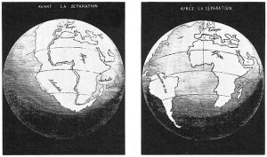

Wegener’s first piece of evidence was that the coastlines of some continents fit together like pieces of a jigsaw puzzle. People noticed the similarities in the coastlines of South America and Africa on the first world maps, and some suggested the continents had been ripped apart. Antonio Snider-Pellegrini did preliminary work on continental separation and matching fossils in 1858.

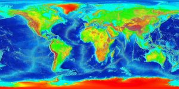

What Wegener did differently was synthesize a large amount of data in one place. He used true edges of the continents, based on the shapes of the continental shelves. This resulted in a better fit than previous efforts that traced the existing coastlines.

Image showing fossils that connect the continents of Gondwana (the southern continents of Pangea).Wegener also compiled evidence by comparing similar rocks, mountains, fossils, and glacial formations across oceans. For example, the fossils of the primitive aquatic reptile *Mesosaurus* were found on the separate coastlines of Africa and South America. Fossils of another reptile, *Lystrosaurus,* were found on Africa, India, and Antarctica. He pointed out these were land-dwelling creatures and could not have swum across an entire ocean.

Opponents of continental drift insisted trans-oceanic land bridges allowed animals and plants to move between continents. The land bridges eventually eroded away, leaving the continents permanently separated. The problem with this hypothesis is the improbability of a land bridge being tall and long enough to stretch across a broad, deep ocean.

More support for continental drift came from the puzzling evidence that glaciers once existed in normally very warm areas in southern Africa, India, Australia, and Arabia. These climate anomalies could not be explained by land bridges. Wegener found similar evidence when he discovered tropical plant fossils in the frozen region of the Arctic Circle. As Wegener collected more data, he realized the explanation that best fit all the climate, rock, and fossil observations involved moving continents.

### **2.1.2 Proposed Mechanism for Continental Drift**

[Click to Animate] Animation of the basic idea of convection: an uneven heat source in a fluid causes rising material next to the heat and sinking material far from the heat.Wegener’s work was considered a fringe science theory for his entire life. One of the biggest flaws in his hypothesis was an inability to provide a mechanism for how the continents moved. Obviously, the continents did not appear to move, and changing the conservative minds of the scientific community would require exceptional evidence that supported a credible mechanism. Other pro-continental drift followers used expansion, contraction, or even the moon’s origin to explain how the continents moved. Wegener used centrifugal forces and precession, but this model was proven wrong. He also speculated about seafloor spreading, with hints of convection, but could not substantiate these proposals. As it turns out, current scientific knowledge reveals convection is one of the major forces in driving plate movements, along with gravity and density.

### **2.1.3 Development of Plate Tectonic Theory**

GPS measurements of plate motions.Wegener died in 1930 on an expedition in Greenland. Poorly respected in his lifetime, Wegener and his ideas about moving continents seemed destined to be lost in history as fringe science. However, in the 1950s, evidence started to trickle in that made continental drift a more viable idea. By the 1960s, scientists had amassed enough evidence to support the missing mechanism—namely, seafloor spreading—for Wegener’s hypothesis of continental drift to be accepted as the theory of plate tectonics. Ongoing GPS and earthquake data analyses continue to support this theory. The next section provides the pieces of evidence that helped transform one man’s wild notion into a scientific theory.

#### Mapping of the Ocean Floors

The complex chemistry around mid-ocean ridges.In 1947 researchers started using an adaptation of SONAR to map a region in the middle of the Atlantic Ocean with poorly-understood topographic and thermal properties. Using this information, Bruce Heezen and Marie Tharp created the first detailed map of the ocean floor to reveal the Mid-Atlantic Ridge, a basaltic mountain range that spanned the length of the Atlantic Ocean, with rock chemistry and dimensions unlike the mountains found on the continents. Initially, scientists thought the ridge was part of a mechanism that explained the expanding Earth or ocean-basin growth hypotheses. In 1959, Harry Hess proposed the hypothesis of seafloor spreading – that the mid-ocean ridges represented tectonic plate factories, where new oceanic plate was issuing from these long volcanic ridges. Scientists later included transform faults perpendicular to the ridges to better account for varying rates of movement between the newly formed plates. When earthquake epicenters were discovered along the ridges, the idea that earthquakes were linked to plate movement took hold.

Seafloor sediment, measured by dredging and drilling, provided another clue. Scientists once believed sediment accumulated on ocean floors over a very long time in a static environment. When some studies showed less sediment than expected, these results were initially used to argue against continental movement. With more time, researchers discovered these thinner sediment layers were located close to mid-ocean ridges, indicating the ridges were younger than the surrounding ocean floor. This finding supported the idea that the sea floor was not fixed in one place.

#### Paleomagnetism

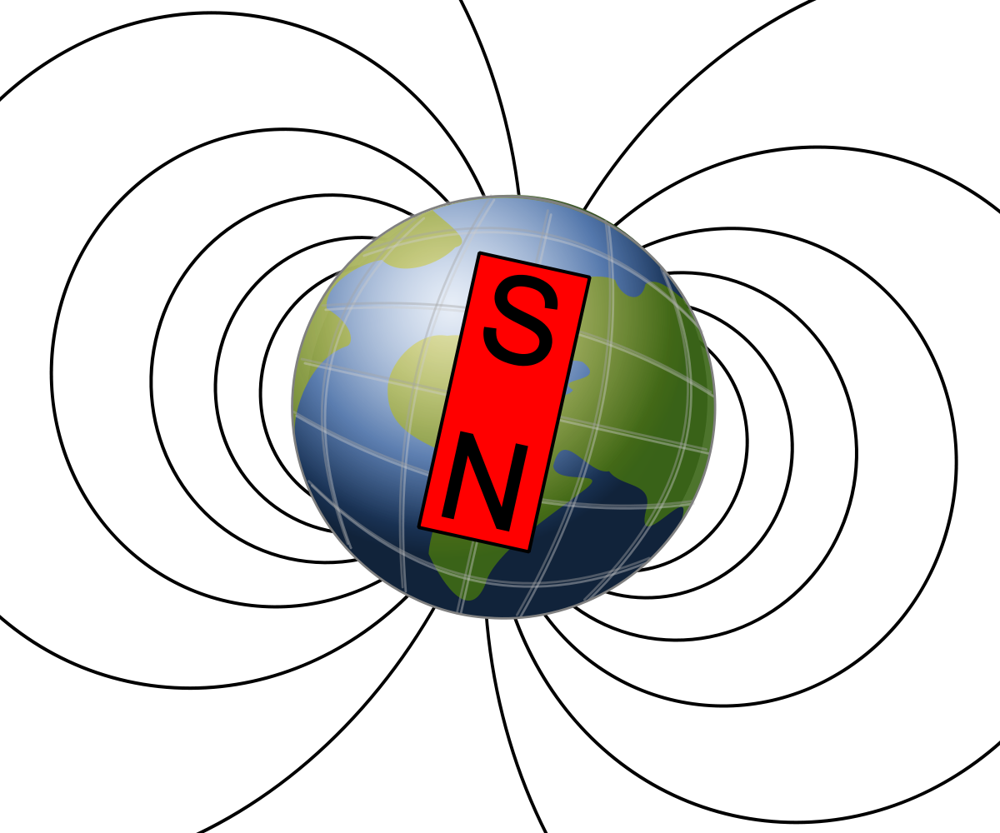

The seafloor was also mapped magnetically. Scientists had long known of strange magnetic anomalies that formed a striped pattern of symmetrical rows on both sides of mid-oceanic ridges. What made these features unusual was the north and south magnetic poles within each stripe were reversed in alternating rows. By 1963, Harry Hess and other scientists used these magnetic reversal patterns to support their model for seafloor spreading (see also Lawrence W. Morley).

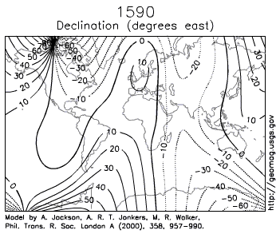

Paleomagnetism is the study of magnetic fields frozen within rocks, basically a fossilized compass. In fact, the first hard evidence to support plate motion came from paleomagnetism.

Igneous rocks containing magnetic minerals like magnetite typically provide the most useful data. In their liquid state as magma or lava, the magnetic poles of the minerals align themselves with the Earth’s magnetic field. When the rock cools and solidifies, this alignment is frozen into place, creating a permanent paleomagnetic record that includes magnetic inclination related to global latitude, and declination related to magnetic north.

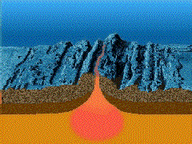

Scientists had noticed for some time the alignment of magnetic north in many rocks was nowhere close to the earth’s current magnetic north. Some explained this away as part of the normal movement of earth’s magnetic north pole. Eventually, scientists realized adding the idea of continental movement explained the data better than pole movement alone.

#### Wadati-Benioff Zones

Around the same time mid-ocean ridges were being investigated, other scientists linked the creation of ocean trenches and island arcs to seismic activity and tectonic plate movement. Several independent research groups recognized earthquake epicenters traced the shapes of oceanic plates sinking into the mantle. These deep earthquake zones congregated in planes that started near the surface around ocean trenches and angled beneath the continents and island arcs. Today these earthquake zones are called Wadati-Benioff zones.

J. Tuzo WilsonBased on the mounting evidence, the theory of plate tectonics continued to take shape. J. Tuzo Wilson was the first scientist to put the entire picture together by proposing the opening and closing of the ocean basins. Before long, scientists proposed other models showing plates moving with respect to each other, with clear boundaries between them. Others started piecing together complicated histories of tectonic plate movement. The plate tectonic revolution had taken hold.

**▶ Did you get it? Click here to find out.**

                            if (window.qmn_quiz_data === undefined) {
                                    window.qmn_quiz_data = new Object();
                            }
                    window.qmn_quiz_data["27"] = {"quiz_id":"27","quiz_name":"Q02-2.1-01","disable_answer":0,"ajax_show_correct":0,"progress_bar":0,"contact_info_location":"0","qpages":{"1":{"id":"1","quizID":"13","pagekey":"AnoergqT","hide_prevbtn":"0"}},"skip_validation_time_expire":0,"timer_limit_val":0,"disable_scroll_next_previous_click":0,"disable_scroll_on_result":0,"disable_first_page":"0","enable_result_after_timer_end":0,"enable_quick_result_mc":"1","end_quiz_if_wrong":0,"form_disable_autofill":0,"disable_mathjax":0,"enable_quick_correct_answer_info":"2","quick_result_correct_answer_text":"Studies of descending earthquake patterns along island arcs demonstrated that earthquakes occurred as plates were subducted at an angle beneath other plates. Today these earthquake zones are called Wadati-Benioff zones.","quick_result_wrong_answer_text":"Incorrect.","quiz_processing_message":"","quiz_limit_choice":"Limit of choice is reached.","not_allow_after_expired_time":0,"scheduled_time_end":false,"error_messages":{"email_error_text":"Not a valid e-mail address!","number_error_text":"This field must be a number!","incorrect_error_text":"The entered text is not correct!","empty_error_text":"Please complete all required fields!","url_error_text":"The entered URL is not valid!","minlength_error_text":"Required atleast %minlength% characters.","maxlength_error_text":"Maximum %maxlength% characters allowed.","recaptcha_error_text":"ReCaptcha is missing"},"first_page":false}
                    

2.1-01 How did scientists first figure out plates could sink into the interior of the planet, since no one can see this happening? 

					It was an inference based on expansion around mid-ocean ridges					

					Lines of progressively-deeper earthquakes near arcs and trenches					

					Measurements via GPS showed ocean basins closing rapidly					

					Isostasy states that as mountains move upwards, land must also sink elsewhere					

					Earthquake waves mapped the liquid interior of Earth and showed movement					

None

 Time's upCancel
                            if (window.qmn_quiz_data === undefined) {
                                    window.qmn_quiz_data = new Object();
                            }
                    window.qmn_quiz_data["28"] = {"quiz_id":"28","quiz_name":"Q02-2.1-02","disable_answer":0,"ajax_show_correct":0,"progress_bar":0,"contact_info_location":"0","qpages":{"1":{"id":"1","quizID":"13","pagekey":"AnoergqT","hide_prevbtn":"0"}},"skip_validation_time_expire":0,"timer_limit_val":0,"disable_scroll_next_previous_click":0,"disable_scroll_on_result":0,"disable_first_page":"0","enable_result_after_timer_end":0,"enable_quick_result_mc":"1","end_quiz_if_wrong":0,"form_disable_autofill":0,"disable_mathjax":0,"enable_quick_correct_answer_info":"2","quick_result_correct_answer_text":"Wegener used matching fossils, matching mountain belts, and changes in climate over time as evidence of continental drift. He did not use earthquake data.","quick_result_wrong_answer_text":"Incorrect.","quiz_processing_message":"","quiz_limit_choice":"Limit of choice is reached.","not_allow_after_expired_time":0,"scheduled_time_end":false,"error_messages":{"email_error_text":"Not a valid e-mail address!","number_error_text":"This field must be a number!","incorrect_error_text":"The entered text is not correct!","empty_error_text":"Please complete all required fields!","url_error_text":"The entered URL is not valid!","minlength_error_text":"Required atleast %minlength% characters.","maxlength_error_text":"Maximum %maxlength% characters allowed.","recaptcha_error_text":"ReCaptcha is missing"},"first_page":false}
                    

2.1-02 Which of the following is NOT evidence Wegener used to construct the idea of Continental Drift? 

					Evidence of drastic climate shifts in the geologic record					

					Earthquake locations lined up with crustal features					

					Matching mountain belts of similar age and rock types					

					Matching fossils across the ocean					

					Matching the edges of the continental shelves					

None

 Time's upCancel
                            if (window.qmn_quiz_data === undefined) {
                                    window.qmn_quiz_data = new Object();
                            }
                    window.qmn_quiz_data["29"] = {"quiz_id":"29","quiz_name":"Q02-2.1-03","disable_answer":0,"ajax_show_correct":0,"progress_bar":0,"contact_info_location":"0","qpages":{"1":{"id":"1","quizID":"13","pagekey":"AnoergqT","hide_prevbtn":"0"}},"skip_validation_time_expire":0,"timer_limit_val":0,"disable_scroll_next_previous_click":0,"disable_scroll_on_result":0,"disable_first_page":"0","enable_result_after_timer_end":0,"enable_quick_result_mc":"1","end_quiz_if_wrong":0,"form_disable_autofill":0,"disable_mathjax":0,"enable_quick_correct_answer_info":"2","quick_result_correct_answer_text":"Matching fossils was a Wegener evidence. Magnetic features and where they point, earthquake lineaments, and newly discovered trenches and mid-ocean ridges helped establish plate tectonics as a valid theory.","quick_result_wrong_answer_text":"Incorrect. Wegener did NOT know about this.","quiz_processing_message":"","quiz_limit_choice":"Limit of choice is reached.","not_allow_after_expired_time":0,"scheduled_time_end":false,"error_messages":{"email_error_text":"Not a valid e-mail address!","number_error_text":"This field must be a number!","incorrect_error_text":"The entered text is not correct!","empty_error_text":"Please complete all required fields!","url_error_text":"The entered URL is not valid!","minlength_error_text":"Required atleast %minlength% characters.","maxlength_error_text":"Maximum %maxlength% characters allowed.","recaptcha_error_text":"ReCaptcha is missing"},"first_page":false}
                    

2.1-03 After Wegener's original continental drift hypothesis, many subsequent studies found evidence that was used to refine Wegener’s hypothesis into the modern Theory of Plate Tectonics? Which of the following is NOT some of that new kinds of evidence? 

					Earthquake locations lined up with certain features					

					Paleomagnetism					

					Deep trenches along volcanic island arcs					

					Matching fossils across the ocean					

					A large mountain range on the sea floor					

None

 Time's upCancel

## 2.2 Layers of the Earth

The layers of the Earth. Physical layers include lithosphere and asthenosphere; chemical layers are crust, mantle, and core.In order to understand the details of plate tectonics, it is essential to first understand the layers of the earth. Firsthand information about what is below the surface is very limited; most of what we know is pieced together from hypothetical models, and analyzing seismic wave data and meteorite materials. In general, the Earth can be divided into layers based on chemical composition and physical characteristics.

### **2.2.1 Chemical Layers**

Certainly, the earth is composed of countless combinations of elements. Regardless of what elements are involved two major factors—temperature and pressure—are responsible for creating three distinct chemical layers.

#### Crust

The outermost chemical layer and the one we currently reside on is the crust. There are two types of crust. The continental crust has a relatively low density and composition similar to granite. The oceanic crust has a relatively high density, especially when cold and old, and its composition is similar to basalt. The surface of the crust is relatively brittle. The deeper parts of the crust are subjected to higher temperatures and pressure, which makes them more ductile. Ductile materials are like soft plastics or putty, they move under force. Brittle materials are like solid glass or pottery, they break under force, especially when it is applied quickly. Earthquakes, generally occur in the upper crust and are caused by the rapid movement of relatively brittle materials.

The global map of the depth of the Moho.The base of the crust is characterized by a large increase in seismic velocity, which measures how fast earthquake waves travel through solid matter. Called the Mohorovičić Discontinuity, or Moho for short, this zone was discovered by Andrija Mohorovičić (pronounced mo-ho-ro-vee-cheech; audio pronunciation) in 1909 after studying earthquake wave paths in his native Croatia. The change in wave direction and speed is caused by dramatic chemical differences between the crust and mantle. Underneath the oceans, the Moho is found roughly 5 km below the ocean floor. Under the continents, it is located about 30-40 km below the surface. Near certain large mountain-building events known as orogenies, the continental Moho depth is doubled.

#### Mantle

The mantle sits below the crust and above the core. It is the largest chemical layer by volume, extending from the base of the crust to a depth of about 2900 km. Most of what we know about the mantle comes from seismic wave analysis, though information is also gathered by studying ophiolites and xenoliths. Ophiolites are pieces of the mantle that have risen through the crust until they are exposed as part of the ocean floor. Xenoliths are carried within magma and brought to the Earth’s surface by volcanic eruptions. Most xenoliths are made of peridotite, an ultramafic class of igneous rock (see chapter 4.2 for an explanation). Because of this, scientists hypothesize most of the mantle is made of peridotite.

#### Core

A polished fragment of the iron-rich Toluca Meteorite, with an octahedral Widmanstätten Pattern.The core of the Earth has both liquid and solid layers and consists mostly of iron, nickel, and possibly some oxygen. Scientists looking at seismic data first discovered this innermost chemical layer in 1906. Through a union of hypothetical modeling, astronomical insight, and hard seismic data, they concluded the core is mostly metallic iron. Scientists studying meteorites, which typically contain more iron than surface rocks, have proposed the earth was formed from meteoric material. They believe the liquid component of the core was created as the iron and nickel sank into the center of the planet, where it was liquefied by intense pressure.

### **2.2.2 Physical Layers**

The Earth can also be broken down into five distinct physical layers based on how each layer responds to stress. While there is some overlap in the chemical and physical designations of layers, specifically the core-mantle boundary, there are significant differences between the two systems.

#### Lithosphere

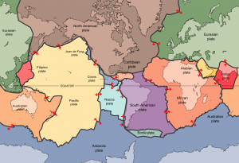

*Lithos* is Greek for stone, and the lithosphere is the outermost physical layer of the Earth. It is grouped into two types: oceanic and continental. The oceanic lithosphere is thin and relatively rigid. It ranges in thickness from nearly zero in new plates found around mid-ocean ridges, to an average of 140 km in most other locations. The Continental lithosphere is generally thicker and considerably more plastic, especially at the deeper levels. Its thickness ranges from 40 to 280 km. The lithosphere is not continuous. It is broken into segments called plates. A plate boundary is where two plates meet and move relative to each other. Plate boundaries are where we see plate tectonics in action—mountain building, triggering earthquakes, and generating volcanic activity.

#### Asthenosphere

The lithosphere-asthenosphere boundary changes with certain tectonic situations.The asthenosphere is the layer below the lithosphere. *Astheno-* means lacking strength, and the most distinctive property of the asthenosphere is movement. Because it is mechanically weak, this layer moves and flows due to convection currents created by heat coming from the earth’s core cause. Unlike the lithosphere which consists of multiple plates, the asthenosphere is relatively unbroken. Scientists have determined this by analyzing seismic waves that pass through the layer. The depth at which the asthenosphere is found is temperature-dependent. It tends to lie closer to the earth’s surface around mid-ocean ridges and much deeper underneath mountains and the centers of lithospheric plates.

#### Mesosphere

General perovskite structure. Perovskite silicates (e. g. Bridgmenite, (Mg, Fe)SiO3) are thought to be the main component of the lower mantle, making it the most common mineral in or on Earth.The mesosphere, sometimes known as the lower mantle, is more rigid and immobile than the asthenosphere. Located at a depth of approximately 410 and 660 km below the earth’s surface, the mesosphere is subjected to very high pressures and temperatures. These extreme conditions create a transition zone in the upper mesosphere where minerals continuously change into various forms or pseudomorphs. Scientists identify this zone by changes in seismic velocity and sometimes physical barriers to movement. Below this transitional zone, the mesosphere is relatively uniform until it reaches the core.

#### Inner and Outer Core

The outer core is the only entirely liquid layer within the Earth. It starts at a depth of 2,890 km and extends to 5,150 km, making it about 2,300 km thick. In 1936, the Danish geophysicist Inge Lehmann analyzed seismic data and was the first to prove a solid inner core existed within a liquid outer core. The solid inner core is about 1,220 km thick, and the outer core is about 2,300 km thick.

It seems like a contradiction that the hottest part of the Earth is solid, as the minerals making up the core should be liquified or vaporized at this temperature. Immense pressure keeps the minerals of the inner core in a solid phase. The inner core grows slowly from the lower outer core solidifying as heat escapes the interior of the Earth and is dispersed to the outer layers.

The earth’s liquid outer core is critically important in maintaining a breathable atmosphere and other environmental conditions favorable for life. Scientists believe the earth’s magnetic field is generated by the circulation of molten iron and nickel within the outer core. If the outer core were to stop circulating or become solid, the loss of the magnetic field would result in Earth getting stripped of life-supporting gases and water. This is what happened, and continues to happen, on Mars.

### **2.2.3 Plate Tectonic Boundaries**

Passive marginAt passive margins, the plates don’t move—the continental lithosphere transitions into oceanic lithosphere and forms plates made of both types. A tectonic plate may be made of both oceanic and continental lithosphere connected by a passive margin. North and South America’s eastern coastlines are examples of passive margins. Active margins are places where the oceanic and continental lithospheric tectonic plates meet and move relative to each other, such as the western coasts of North and South America. This movement is caused by frictional drag created between the plates and differences in plate densities. The majority of mountain-building events, earthquake activity, and active volcanism on the Earth’s surface can be attributed to tectonic plate movement at active margins.

Schematic of plate boundary types.In a simplified model, there are three categories of tectonic plate boundaries. Convergent boundaries are places where plates move toward each other. At divergent boundaries, the plates move apart. At transform boundaries, the plates slide past each other.

**▶ Did you get it? Click here to find out.**

                            if (window.qmn_quiz_data === undefined) {
                                    window.qmn_quiz_data = new Object();
                            }
                    window.qmn_quiz_data["30"] = {"quiz_id":"30","quiz_name":"Q02-2.2-01","disable_answer":0,"ajax_show_correct":0,"progress_bar":0,"contact_info_location":"0","qpages":{"1":{"id":"1","quizID":"13","pagekey":"AnoergqT","hide_prevbtn":"0"}},"skip_validation_time_expire":0,"timer_limit_val":0,"disable_scroll_next_previous_click":0,"disable_scroll_on_result":0,"disable_first_page":"0","enable_result_after_timer_end":0,"enable_quick_result_mc":"1","end_quiz_if_wrong":0,"form_disable_autofill":0,"disable_mathjax":0,"enable_quick_correct_answer_info":"2","quick_result_correct_answer_text":"Only the asthenosphere, which has slow, ductile movement which allows plates to float and move above it. The core is liquid and moves, too, but is too far away to affect plate tectonics.","quick_result_wrong_answer_text":"Incorrect.","quiz_processing_message":"","quiz_limit_choice":"Limit of choice is reached.","not_allow_after_expired_time":0,"scheduled_time_end":false,"error_messages":{"email_error_text":"Not a valid e-mail address!","number_error_text":"This field must be a number!","incorrect_error_text":"The entered text is not correct!","empty_error_text":"Please complete all required fields!","url_error_text":"The entered URL is not valid!","minlength_error_text":"Required atleast %minlength% characters.","maxlength_error_text":"Maximum %maxlength% characters allowed.","recaptcha_error_text":"ReCaptcha is missing"},"first_page":false}
                    

2.2-01 Which layer of the Earth can move internally or flow to allow the plates to move around above it? 

					Inner core					

					Outer core					

					Asthenosphere					

Lithosphere 

					Mantle					

None

 Time's upCancel
                            if (window.qmn_quiz_data === undefined) {
                                    window.qmn_quiz_data = new Object();
                            }
                    window.qmn_quiz_data["31"] = {"quiz_id":"31","quiz_name":"Q02-2.2-02","disable_answer":0,"ajax_show_correct":0,"progress_bar":0,"contact_info_location":"0","qpages":{"1":{"id":"1","quizID":"13","pagekey":"AnoergqT","hide_prevbtn":"0"}},"skip_validation_time_expire":0,"timer_limit_val":0,"disable_scroll_next_previous_click":0,"disable_scroll_on_result":0,"disable_first_page":"0","enable_result_after_timer_end":0,"enable_quick_result_mc":"1","end_quiz_if_wrong":0,"form_disable_autofill":0,"disable_mathjax":0,"enable_quick_correct_answer_info":"2","quick_result_correct_answer_text":"Yes. Ocean plates are thin and brittle and have an overall basaltic composition. Continental plates are thick and ductile, and have an overall granitic composition. Both are solid.","quick_result_wrong_answer_text":"Incorrect.","quiz_processing_message":"","quiz_limit_choice":"Limit of choice is reached.","not_allow_after_expired_time":0,"scheduled_time_end":false,"error_messages":{"email_error_text":"Not a valid e-mail address!","number_error_text":"This field must be a number!","incorrect_error_text":"The entered text is not correct!","empty_error_text":"Please complete all required fields!","url_error_text":"The entered URL is not valid!","minlength_error_text":"Required atleast %minlength% characters.","maxlength_error_text":"Maximum %maxlength% characters allowed.","recaptcha_error_text":"ReCaptcha is missing"},"first_page":false}
                    

2.2-02 What makes continental plates different from oceanic plates? 

					Continental plates have more volcanoes 

					Oceanic plates are thicker					

Continental plates are granitic; oceanic plates are basaltic					

					Oceanic plates are more permanent					

					Oceanic plates are older					

None

 Time's upCancel
                            if (window.qmn_quiz_data === undefined) {
                                    window.qmn_quiz_data = new Object();
                            }
                    window.qmn_quiz_data["32"] = {"quiz_id":"32","quiz_name":"Q02-2.2-03","disable_answer":0,"ajax_show_correct":0,"progress_bar":0,"contact_info_location":"0","qpages":{"1":{"id":"1","quizID":"13","pagekey":"AnoergqT","hide_prevbtn":"0"}},"skip_validation_time_expire":0,"timer_limit_val":0,"disable_scroll_next_previous_click":0,"disable_scroll_on_result":0,"disable_first_page":"0","enable_result_after_timer_end":0,"enable_quick_result_mc":"1","end_quiz_if_wrong":0,"form_disable_autofill":0,"disable_mathjax":0,"enable_quick_correct_answer_info":"2","quick_result_correct_answer_text":"A passive margin is a non-active boundary with no relative plate movement. In contrast, active continental margins are coastal region characterized by mountain-building, earthquakes, volcanoes, or other forms of tectonism associated with moving tectonic plates.","quick_result_wrong_answer_text":"Incorrect.","quiz_processing_message":"","quiz_limit_choice":"Limit of choice is reached.","not_allow_after_expired_time":0,"scheduled_time_end":false,"error_messages":{"email_error_text":"Not a valid e-mail address!","number_error_text":"This field must be a number!","incorrect_error_text":"The entered text is not correct!","empty_error_text":"Please complete all required fields!","url_error_text":"The entered URL is not valid!","minlength_error_text":"Required atleast %minlength% characters.","maxlength_error_text":"Maximum %maxlength% characters allowed.","recaptcha_error_text":"ReCaptcha is missing"},"first_page":false}
                    

2.2-03 What term is used for a boundary between a continent and a ocean basin without relative motion between them? 

Convergent 

					Divergent					

					Passive					

					Transform					

					Active					

None

 Time's upCancel

## 2.3 Convergent Boundaries

Geologic provinces of Earth. Orogenies are labeled light blue.Convergent boundaries, also called destructive boundaries, are places where two or more plates move toward each other. . Convergent boundary movement is divided into two types, subduction, and collision, depending on the density of the involved plates. The continental lithosphere is of lower density and thus more buoyant than the underlying asthenosphere. The oceanic lithosphere is denser than the continental lithosphere, and, when old and cold, may even be denser than the asthenosphere.

When plates of different densities converge, the higher-density plate is pushed beneath the more buoyant plate in a process called subduction. When continental plates converge without subduction occurring, this process is called a collision.

### **2.3.1. Subduction**

[if lt IE 9]><![endif]
https://opengeology.org/textbook/wp-content/uploads/2016/07/Subduction.mp4

*Video showing continental-oceanic subduction, causing volcanism. By Tanya Atwater and John Iwerks.*

Subduction occurs when a dense oceanic plate meets a more buoyant plate, like a continental plate or warmer/younger oceanic plate, and descends into the mantle. The worldwide average rate of oceanic plate subduction is 25 miles per million years, about a half-inch per year. As an oceanic plate descends, it pulls the ocean floor down into a trench. These trenches can be more than twice as deep as the average depth of the adjacent ocean basin, which is usually three to four km. The Mariana Trench, for example, approaches a staggering 11 km.

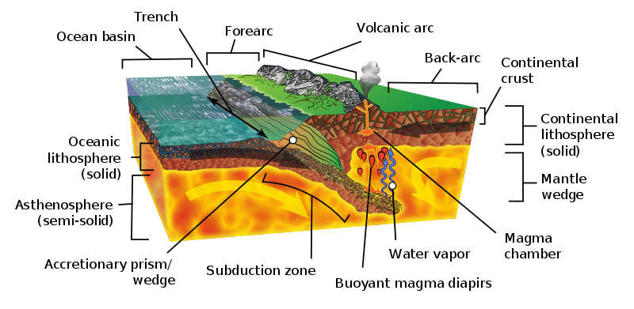

Within the trench, ocean-floor sediments are scraped together and compressed between the subducting and overriding plates. This feature is called the accretionary wedge, mélange, or accretionary prism. Fragments of continental material, including microcontinents, riding atop the subducting plate may become sutured to the accretionary wedge and accumulate into a large area of land called a terrane. Vast portions of California are comprised of accreted terranes.

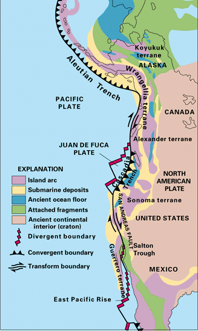

When the subducting oceanic plate, or slab, sinks into the mantle, the immense heat and pressure push volatile materials like water and carbon dioxide into an area below the continental plate and above the descending plate called the mantle wedge. The volatiles are released mostly by hydrated minerals that revert to non-hydrated minerals in these higher temperature and pressure conditions. When mixed with asthenospheric material above the plate, the volatile lower the melting point of the mantle wedge, and through a process called flux melting it becomes liquid magma. The molten magma is more buoyant than the lithospheric plate above it and migrates to the Earth’s surface where it emerges as volcanism. The resulting volcanoes frequently appear as curved mountain chains, volcanic arcs, due to the curvature of the earth. Both oceanic and continental plates can contain volcanic arcs.

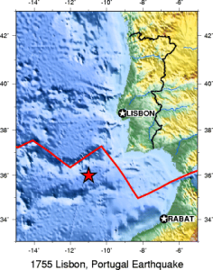

How subduction is initiated is still a matter of scientific debate. It is generally accepted that subduction zones start as passive margins, where oceanic and continental plates come together, and then gravity initiates subduction and converts the passive margin into an active one. One hypothesis is gravity pulls the denser oceanic plate down or the plate can start to flow ductility at a low angle. Scientists seeking to answer this question have collected evidence that suggests a new subduction zone is forming off the coast of Portugal. Some scientists have proposed large earthquakes like the 1755 Lisbon earthquake may even have something to do with this process of creating a subduction zone, although the evidence is not definitive. Another hypothesis proposes subduction happens at transform boundaries involving plates of different densities.

Some plate boundaries look like they should be active, but show no evidence of subduction. The oceanic lithospheric plates on either side of the Atlantic Ocean for example, are denser than the underlying asthenosphere and are not subducting beneath the continental plates. One hypothesis is the bond holding the oceanic and continental plates together is stronger than the downward force created by the difference in plate densities.

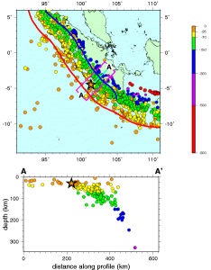

Subduction zones are known for having the largest earthquakes and tsunamis; they are the only places with fault surfaces large enough to create magnitude-9 earthquakes. These subduction-zone earthquakes not only are very large but also very deep. When a subducting slab becomes stuck and cannot descend, a massive amount of energy builds up between the stuck plates. If this energy is not gradually dispersed, it may force the plates to suddenly release along several hundred kilometers of the subduction zone. Because subduction-zone faults are located on the ocean floor, this massive amount of movement can generate giant tsunamis such as those that followed the 2004 Indian Ocean Earthquake and 2011 Tōhoku Earthquake in Japan.

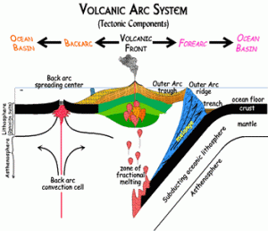

All subduction zones have a forearc basin, a feature of the overriding plate found between the volcanic arc and oceanic trench. The forearc basin experiences a lot of faulting and deformation activity, particularly within the accretionary wedge.

In some subduction zones, tensional forces working on the continental plate create a backarc basin on the interior side of the volcanic arc. Some scientists have proposed a subduction mechanism called oceanic slab rollback that creates extension faults in the overriding plates. In this model, the descending oceanic slab does not slide directly under the overriding plate but instead rolls back, pulling the overlying plate seaward. The continental plate behind the volcanic arc gets stretched like pizza dough until the surface cracks and collapses to form a backarc basin. If the extension activity is extensive and deep enough, a backarc basin can develop into a continental rifting zone. These continental divergent boundaries may be less symmetrical than their mid-ocean ridge counterparts.

In places where numerous young buoyant oceanic plates are converging and subducting at a relatively high velocity, they may force the overlying continental plate to buckle and crack. This is called back-arc faulting. Extensional back-arc faults pull rocks and chunks of plates apart. Compressional back-arc faults, also known as thrust faults, push them together.

The dual spines of the Andes Mountain range include an example of compressional thrust faulting. The western spine is part of a volcanic arc. Thrust faults have deformed the non-volcanic eastern spine,  pushing rocks and pieces of the continental plate on top of each other.

There are two styles of thrust fault deformation: thin-skinned faults that occur in superficial rocks lying on top of the continental plate and thick-skinned faults that reach deeper into the crust. The Sevier Orogeny in the western U.S. is a notable thin-skinned type of deformation created during the Cretaceous Period. The Laramide Orogeny, a thick-skinned type of deformation, occurred near the end of and slightly after the Sevier Orogeny in the same region.

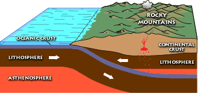

Flat-slab, or shallow, subduction caused the Laramide Orogeny. When the descending slab subducts at a low angle, there is more contact between the slab and the overlying continental plate than in a typical subduction zone. The shallowly-subducting slab pushes against the overriding plate and creates an area of deformation on the overriding plate many kilometers away from the subduction zone.

#### Oceanic-Continental subduction

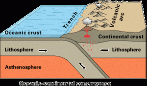

Oceanic-continental subduction occurs when an oceanic plate dives below a continental plate. This convergent boundary has a trench and mantle wedge and frequently, a volcanic arc. Well-known examples of continental volcanic arcs are the Cascade Mountains in the Pacific Northwest and the western Andes Mountains in South America.

#### Oceanic-Oceanic Subduction

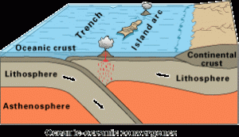

The boundaries of oceanic-oceanic subduction zones show very different activity from those involving oceanic-continental plates. Since both plates are made of oceanic lithosphere, it is usually the older plate that subducts because it is colder and denser. The volcanism on the overlying oceanic plate may remain hidden underwater.. If the volcanoes rise high enough the reach the ocean surface, the chain of volcanism forms an island arc. Examples of these island arcs include the Aleutian Islands in the northern Pacific Ocean, the Lesser Antilles in the Caribbean Sea, and numerous island chains scattered throughout the western Pacific Ocean.

### **2.3.2. Collisions**

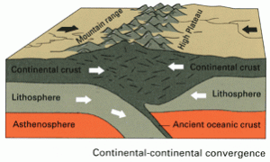

When continental plates converge, during the closing of an ocean basin, for example, subduction is not possible between the equally buoyant plates. Instead of one plate descending beneath another, the two masses of continental lithosphere slam together in a process known as a collision. Without subduction, there is no magma formation and no volcanism. Collision zones are characterized by tall, non-volcanic mountains; a broad zone of frequent, large earthquakes; and very little volcanism.

When oceanic crust connected by a passive margin to continental crust completely subducts beneath a continent, an ocean basin closes, and continental collision begins.  Eventually, as ocean basins close, continents join together to form a massive accumulation of continents called a supercontinent, a process that has taken place in ~500 million-year-old cycles over the earth’s history.

A reconstruction of the supercontinent Pangaea, showing approximate positions of modern continents.The process of collision created Pangea, the supercontinent envisioned by Wegener as the key component of his continental drift hypothesis. Geologists now have evidence that continental plates have been continuously converging into supercontinents and splitting into smaller basin-separated continents throughout Earth’s existence, calling this process the supercontinent cycle, a process that takes place in approximately 500 million years. For example, they estimate Pangea began separating 200 million years ago. Pangea was preceded by earlier supercontinents, one of which was Rodinia, which existed 1.1 billion years ago and started breaking apart 800 million to 600 million years ago.

The tectonics of the Zagros Mountains. Note the Persian Gulf foreland basin.A foreland basin is a feature that develops near mountain belts, as the combined mass of the mountains forms a depression in the lithospheric plate. While foreland basins may occur at subduction zones, they are most commonly found at collision boundaries. The Persian Gulf is possibly the best modern example, created entirely by the weight of the nearby Zagros Mountains.

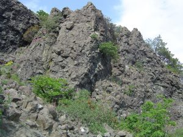

If continental and oceanic lithosphere are fused on the same plate, it can partially subduct but its buoyancy prevents it from fully descending. In very rare cases, part of a continental plate may become trapped beneath a descending oceanic plate in a process called obduction. When a portion of the continental crust is driven down into the subduction zone, due to its buoyancy it returns to the surface relatively quickly.

As pieces of the continental lithosphere break loose and migrate upward through the obduction zone, they bring along bits of the mantle and ocean floor and amend them on top of the continental plate. Rocks composed of this mantle and ocean-floor material are called ophiolites and they provide valuable information about the composition of the mantle.

The area of collision-zone deformation and seismic activity usually covers a broader area because the continental lithosphere is plastic and malleable. Unlike subduction-zone earthquakes, which tend to be located along a narrow swath near the convergent boundary, collision-zone earthquakes may occur hundreds of kilometers from the boundary between the plates.

The Eurasian continent has many examples of collision-zone deformations covering vast areas. The Pyrenees mountains begin in the Iberian Peninsula and cross into France. Also, there are the Alps stretching from Italy to central Europe; the Zagros mountains from Arabia to Iran; and the Himalayan mountains from the Indian subcontinent to central Asia.

https://opengeology.org/textbook/wp-content/uploads/2016/07/IndiaAsiaCollision.mp4

*Animation of India crashing into Asia, by Tanya Atwater.*

**▶ Did you get it? Click here to find out.**

                            if (window.qmn_quiz_data === undefined) {
                                    window.qmn_quiz_data = new Object();
                            }
                    window.qmn_quiz_data["33"] = {"quiz_id":"33","quiz_name":"Q02-2.3-01","disable_answer":0,"ajax_show_correct":0,"progress_bar":0,"contact_info_location":"0","qpages":{"1":{"id":"1","quizID":"13","pagekey":"AnoergqT","hide_prevbtn":"0"}},"skip_validation_time_expire":0,"timer_limit_val":0,"disable_scroll_next_previous_click":0,"disable_scroll_on_result":0,"disable_first_page":"0","enable_result_after_timer_end":0,"enable_quick_result_mc":"1","end_quiz_if_wrong":0,"form_disable_autofill":0,"disable_mathjax":0,"enable_quick_correct_answer_info":"2","quick_result_correct_answer_text":"Continental collisions occur between relatively low density continental plates. They pile on top of each other, doubling the thickness of the crust, because neither is dense enough to subduct.","quick_result_wrong_answer_text":"Incorrect.","quiz_processing_message":"","quiz_limit_choice":"Limit of choice is reached.","not_allow_after_expired_time":0,"scheduled_time_end":false,"error_messages":{"email_error_text":"Not a valid e-mail address!","number_error_text":"This field must be a number!","incorrect_error_text":"The entered text is not correct!","empty_error_text":"Please complete all required fields!","url_error_text":"The entered URL is not valid!","minlength_error_text":"Required atleast %minlength% characters.","maxlength_error_text":"Maximum %maxlength% characters allowed.","recaptcha_error_text":"ReCaptcha is missing"},"first_page":false}
                    

2.3-01 Why do high mountains like the Alps and Himalayas form when continents collide? 

Continental collisions occur very rapidly					

					They are made from less dense portions of the continents					

					The materials of continental plates are similar in density and don’t subduct beneath one another					

					There are not enough magmas to lubricate the collision					

					Gases released by decompression melting create a large bubble beneath the crust					

None

 Time's upCancel
                            if (window.qmn_quiz_data === undefined) {
                                    window.qmn_quiz_data = new Object();
                            }
                    window.qmn_quiz_data["34"] = {"quiz_id":"34","quiz_name":"Q02-2.3-02","disable_answer":0,"ajax_show_correct":0,"progress_bar":0,"contact_info_location":"0","qpages":{"1":{"id":"1","quizID":"13","pagekey":"AnoergqT","hide_prevbtn":"0"}},"skip_validation_time_expire":0,"timer_limit_val":0,"disable_scroll_next_previous_click":0,"disable_scroll_on_result":0,"disable_first_page":"0","enable_result_after_timer_end":0,"enable_quick_result_mc":"1","end_quiz_if_wrong":0,"form_disable_autofill":0,"disable_mathjax":0,"enable_quick_correct_answer_info":"2","quick_result_correct_answer_text":"Arcs, trenches, tsunamis, the largest earthquakes, and Wadati-Beneioff zones are all associated with subduction. Mid-ocean ridges and transform faults are associated with plate divergence.","quick_result_wrong_answer_text":"Incorrect.","quiz_processing_message":"","quiz_limit_choice":"Limit of choice is reached.","not_allow_after_expired_time":0,"scheduled_time_end":false,"error_messages":{"email_error_text":"Not a valid e-mail address!","number_error_text":"This field must be a number!","incorrect_error_text":"The entered text is not correct!","empty_error_text":"Please complete all required fields!","url_error_text":"The entered URL is not valid!","minlength_error_text":"Required atleast %minlength% characters.","maxlength_error_text":"Maximum %maxlength% characters allowed.","recaptcha_error_text":"ReCaptcha is missing"},"first_page":false}
                    

2.3-02 Which are/is associated with diverging tectonic plates? 

					Mid-ocean ridges					

					tsunamis					

					very large earthquakes					

					volcanic arcs					

					Wadati-Benioff zones					

None

 Time's upCancel
                            if (window.qmn_quiz_data === undefined) {
                                    window.qmn_quiz_data = new Object();
                            }
                    window.qmn_quiz_data["35"] = {"quiz_id":"35","quiz_name":"Q02-2.3-03","disable_answer":0,"ajax_show_correct":0,"progress_bar":0,"contact_info_location":"0","qpages":{"1":{"id":"1","quizID":"13","pagekey":"AnoergqT","hide_prevbtn":"0"}},"skip_validation_time_expire":0,"timer_limit_val":0,"disable_scroll_next_previous_click":0,"disable_scroll_on_result":0,"disable_first_page":"0","enable_result_after_timer_end":0,"enable_quick_result_mc":"1","end_quiz_if_wrong":0,"form_disable_autofill":0,"disable_mathjax":0,"enable_quick_correct_answer_info":"2","quick_result_correct_answer_text":"Yes. Oceanic plates are relatively dense and so subduct under continents, and sometimes under other oceanic plates. But continental plates are not as dense and so rarely, if ever, subduct.","quick_result_wrong_answer_text":"Incorrect.","quiz_processing_message":"","quiz_limit_choice":"Limit of choice is reached.","not_allow_after_expired_time":0,"scheduled_time_end":false,"error_messages":{"email_error_text":"Not a valid e-mail address!","number_error_text":"This field must be a number!","incorrect_error_text":"The entered text is not correct!","empty_error_text":"Please complete all required fields!","url_error_text":"The entered URL is not valid!","minlength_error_text":"Required atleast %minlength% characters.","maxlength_error_text":"Maximum %maxlength% characters allowed.","recaptcha_error_text":"ReCaptcha is missing"},"first_page":false}
                    

2.3-03 Why do continents generally NOT subduct? 

					Continents are too strongly attached to ocean plates to subduct					

					Continents are pushed up by mantle convection, preventing subduction 

					Continents are too low in density to subduct					

					Ocean plates move faster and do not allow continents to subduct					

					Continents are too ductile to subduct					

None

 Time's upCancel

## 2.4 Divergent Boundaries

At divergent boundaries, sometimes called constructive boundaries, lithospheric plates move away from each other. There are two types of divergent boundaries, categorized by where they occur: continental rift zones and mid-ocean ridges. Continental rift zones occur in weak spots in the continental lithospheric plate. A mid-ocean ridge usually originates in a continental plate as a rift zone that expands to the point of splitting the plate apart, with seawater filling in the gap. The separate pieces continue to drift apart and become individual continents. This process is known as rift-to-drift.

### **2.4.1. Continental Rifting**

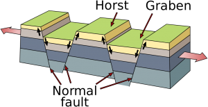

In places where the continental plates are very thick, they reflect so much heat back into the mantle it develops strong convection currents that push super-heated mantle material up against the overlying plate, softening it. Tensional forces created by this convective upwelling begin to pull the weakened plate apart. As it stretches, it becomes thinner and develops deep cracks called extension or normal faults. Eventually, plate sections located between large faults drop into deep depressions known as rift valleys, which often contain keystone-shaped blocks of down-dropped crust known as grabens. The shoulders of these grabens are called horsts. If only one side of a section drops, it is called a half-graben. Depending on the conditions, rifts can grow into very large lakes and even oceans.

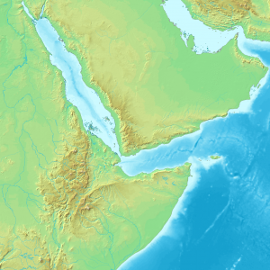

While seemingly occurring at random, rifting is dictated by two factors. Rifting does not occur in continents with older and more stable interiors, known as cratons. When continental rifting does occur, the break-up pattern resembles the seams of a soccer ball, also called a truncated icosahedron. This is the most common surface-fracture pattern to develop on an evenly expanding sphere because it uses the least amount of energy.

Using the soccer ball model, rifting tends to lengthen and expand along a particular seam while fizzling out in the other directions. These seams with little or no tectonic activity are called failed rift arms. A failed rift arm is still a weak spot in the continental plate; even without the presence of active extension faults, it may develop into a called an aulacogen. One example of a failed rift arm is the Mississippi Valley Embayment, a depression through which the upper end of the Mississippi River flows. Occasionally connected rift arms do develop concurrently, creating multiple boundaries of active rifting. In places where the rift arms do not fail, for example, the Afar Triangle, three divergent boundaries can develop near each other forming a triple junction.

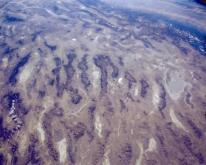

Rifts come in two types: narrow and broad. Narrow rifts are characterized by a high density of highly active divergent boundaries. The East African Rift Zone, where the horn of Africa is pulling away from the mainland, is an excellent example of an active narrow rift. Lake Baikal in Russia is another. Broad rifts also have numerous fault zones, but they are distributed over wide areas of deformation. The Basin and Range region located in the western United States is a type of broad rift. The Wasatch Fault, which also created the Wasatch Mountain Range in the state of Utah, forms the eastern divergent boundary of this broad rift  (Animation 1 and Animation 2).

The narrow East African Rift.Rifts have earthquakes, although not of the magnitude and frequency of other boundaries. They may also exhibit volcanism. Unlike the flux-melted magma found in subduction zones, rift-zone magma is created by decompression melting. As the continental plates are pulled apart, they create a region of low pressure that melts the lithosphere and draws it upwards. When this molten magma reaches the weakened and fault-riddled rift zone, it migrates to the surface by breaking through the plate or escaping via an open fault. Examples of young rift volcanoes dot the Basin and Range region in the United States. Rift-zone activity is responsible for generating some unique volcanism, such as the Ol Doinyo Lengai in Tanzania. This volcano erupts lava consisting largely of carbonatite, a relatively cold, liquid carbonate mineral.

https://opengeology.org/textbook/wp-content/uploads/2016/07/SoAtlantic_CutwithConvect.mp4

South America and Africa rift, forming the Atlantic. Video by Tanya Atwater.

### **2.4.2. Mid-ocean ridges**

Progression from rift to mid-ocean ridge.As rifting and volcanic activity progress, the continental lithosphere becomes more mafic (see Chapter 4) and thinner, with the eventual result transforming the plate under the rifting area into the oceanic lithosphere. This is the process that gives birth to a new ocean, much like the narrow Red Sea emerged with the movement of Arabia away from Africa. As the oceanic lithosphere continues to diverge, a mid-ocean ridge is formed.

Mid-ocean ridges, also known as spreading centers, have several distinctive features. They are the only places on earth that create new oceanic lithosphere. Decompression melting in the rift zone changes asthenosphere material into the new lithosphere, which oozes up through cracks in the oceanic plate. The amount of new lithosphere being created at mid-ocean ridges is highly significant. These undersea rift volcanoes produce more lava than all other types of volcanism combined. Despite this, most mid-oceanic ridge volcanism remains unmapped because the volcanoes are located deep on the ocean floor.

In rare cases, such as a few locations in Iceland, rift zones display the type of volcanism, spreading, and ridge formation found on the ocean floor.

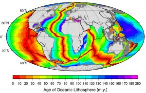

The ridge feature is created by the accumulation of hot lithosphere material, which is lighter than the dense underlying asthenosphere. This chunk of isostatically buoyant lithosphere sits partially submerged and partially exposed on the asthenosphere, like an ice cube floating in a glass of water.

As the ridge continues to spread, the lithosphere material is pulled away from the area of volcanism and becomes colder and denser. As it continues to spread and cool, the lithosphere settles into wide swathes of relatively featureless topography called abyssal plains with lower topography.

This model of ridge formation suggests the sections of lithosphere furthest away from the mid-ocean ridges will be the oldest. Scientists have tested this idea by comparing the age of rocks located in various locations on the ocean floor. Rocks found near ridges are younger than those found far away from any ridges. Sediment accumulation patterns also confirm the idea of sea-floor spreading. Sediment layers tend to be thinner near mid-ocean ridges, indicating it has had less time to build up.

A time progression (with “a” being first and “c” being last) showing a spreading center getting wider while recording changes in the magnetic field of the Earth.As mentioned in the section on paleomagnetism and the development of plate tectonic theory, scientists noticed mid-ocean ridges contained unique magnetic anomalies that show up as symmetrical striping on both sides of the ridge. The Vine-Matthews-Morley hypothesis proposes these alternating reversals are created by the earth’s magnetic field being imprinted into magma after it emerges from the ridge. Very hot magma has no magnetic field. As the oceanic plates get pulled apart, the magma cools below the Curie point, the temperature below which a magnetic field gets locked into magnetic minerals. The alternating magnetic reversals in the rocks reflect the periodic swapping of the earth’s magnetic north and south poles. This paleomagnetic pattern provides a great historical record of ocean-floor movement, and is used to reconstruct past tectonic activity and determine rates of ridge spreading.

*Video of the breakup of Pangea and the formation of the northern Atlantic Ocean. By Tanya Atwater.*

Black smoker hydrothermal vent with a colony of giant (6’+) tube worms.Thanks to their distinctive geology, mid-ocean ridges are home to some of the most unique ecosystems ever discovered. The ridges are often studded with hydrothermal vents, and deep fissures that allow seawater to circulate through the upper portions of the oceanic plate and interact with hot rock. The super-heated seawater rises back up to the surface of the plate, carrying dissolved gasses and minerals, and small particulates.  The resulting emitted hydrothermal water looks like black underwater smoke.

Scientists had known about these geothermal areas on the ocean floor for some time. However, it was not until 1977, when scientists piloting a deep submergence vehicle, the Alvin, discovered a thriving community of organisms clustered around these hydrothermal vents. These unique organisms, which include 10-foot-long tube worms taller than people, live in the complete darkness of the ocean floor deprived of oxygen and sunlight. They use geothermal energy provided by the vents and a process called bacterial chemosynthesis to feed on sulfur compounds. Before this discovery, scientists believed life on earth could not exist without photosynthesis, a process that requires sunlight. Some scientists suggest this type of environment could have been the origin of life on Earth, and perhaps even extraterrestrial life elsewhere in the galaxy, such as on Jupiter’s moon Europa.

**▶ Did you get it? Click here to find out.**

                            if (window.qmn_quiz_data === undefined) {
                                    window.qmn_quiz_data = new Object();
                            }
                    window.qmn_quiz_data["36"] = {"quiz_id":"36","quiz_name":"Q02-2.4-01","disable_answer":0,"ajax_show_correct":0,"progress_bar":0,"contact_info_location":"0","qpages":{"1":{"id":"1","quizID":"13","pagekey":"AnoergqT","hide_prevbtn":"0"}},"skip_validation_time_expire":0,"timer_limit_val":0,"disable_scroll_next_previous_click":0,"disable_scroll_on_result":0,"disable_first_page":"0","enable_result_after_timer_end":0,"enable_quick_result_mc":"1","end_quiz_if_wrong":0,"form_disable_autofill":0,"disable_mathjax":0,"enable_quick_correct_answer_info":"2","quick_result_correct_answer_text":"Yes. In rift zones, the crust pulls apart, and this extension leads to the formation of normal faults. Alternating blocks of crust move up and down. Uplifted fault blocks are called grabens; downdropped blocks are called grabens.","quick_result_wrong_answer_text":"Incorrect.","quiz_processing_message":"","quiz_limit_choice":"Limit of choice is reached.","not_allow_after_expired_time":0,"scheduled_time_end":false,"error_messages":{"email_error_text":"Not a valid e-mail address!","number_error_text":"This field must be a number!","incorrect_error_text":"The entered text is not correct!","empty_error_text":"Please complete all required fields!","url_error_text":"The entered URL is not valid!","minlength_error_text":"Required atleast %minlength% characters.","maxlength_error_text":"Maximum %maxlength% characters allowed.","recaptcha_error_text":"ReCaptcha is missing"},"first_page":false}
                    

2.4-01 Which of these are features associated with rift zones? 

Tsunamis and large earthquakes					

					Grabens bounded by normal faults					

					Deep trenches					

					Very high mountain ranges					

					Volcanic arcs					

None

 Time's upCancel
                            if (window.qmn_quiz_data === undefined) {
                                    window.qmn_quiz_data = new Object();
                            }
                    window.qmn_quiz_data["37"] = {"quiz_id":"37","quiz_name":"Q02-2.4-02","disable_answer":0,"ajax_show_correct":0,"progress_bar":0,"contact_info_location":"0","qpages":{"1":{"id":"1","quizID":"13","pagekey":"AnoergqT","hide_prevbtn":"0"}},"skip_validation_time_expire":0,"timer_limit_val":0,"disable_scroll_next_previous_click":0,"disable_scroll_on_result":0,"disable_first_page":"0","enable_result_after_timer_end":0,"enable_quick_result_mc":"1","end_quiz_if_wrong":0,"form_disable_autofill":0,"disable_mathjax":0,"enable_quick_correct_answer_info":"2","quick_result_correct_answer_text":"At a mid-ocean ridge, newly formed crust is the warmest, youngest, thickest, and least covered in sediment (since sediment accumulates over time). It cools and shrinks, becoming denser as it moves away from a ridge. Consequently, the elevation of the seafloor goes down.","quick_result_wrong_answer_text":"Incorrect.","quiz_processing_message":"","quiz_limit_choice":"Limit of choice is reached.","not_allow_after_expired_time":0,"scheduled_time_end":false,"error_messages":{"email_error_text":"Not a valid e-mail address!","number_error_text":"This field must be a number!","incorrect_error_text":"The entered text is not correct!","empty_error_text":"Please complete all required fields!","url_error_text":"The entered URL is not valid!","minlength_error_text":"Required atleast %minlength% characters.","maxlength_error_text":"Maximum %maxlength% characters allowed.","recaptcha_error_text":"ReCaptcha is missing"},"first_page":false}
                    

2.4-02 What happens as newly formed oceanic crust moves away from a mid-ocean ridge? 

					The crust gets warmer and expands					

					The crust gets colder and denser					

					Sedimentary layers on top of the crust get thinner					

					The crust becomes thicker					

					The seafloor rises to higher elevations					

None

 Time's upCancel
                            if (window.qmn_quiz_data === undefined) {
                                    window.qmn_quiz_data = new Object();
                            }
                    window.qmn_quiz_data["38"] = {"quiz_id":"38","quiz_name":"Q02-2.4-03","disable_answer":0,"ajax_show_correct":0,"progress_bar":0,"contact_info_location":"0","qpages":{"1":{"id":"1","quizID":"13","pagekey":"AnoergqT","hide_prevbtn":"0"}},"skip_validation_time_expire":0,"timer_limit_val":0,"disable_scroll_next_previous_click":0,"disable_scroll_on_result":0,"disable_first_page":"0","enable_result_after_timer_end":0,"enable_quick_result_mc":"1","end_quiz_if_wrong":0,"form_disable_autofill":0,"disable_mathjax":0,"enable_quick_correct_answer_info":"2","quick_result_correct_answer_text":"Correct. And East Africa is famous for a major rift valley that was home to the first humans.","quick_result_wrong_answer_text":"Incorrect.","quiz_processing_message":"","quiz_limit_choice":"Limit of choice is reached.","not_allow_after_expired_time":0,"scheduled_time_end":false,"error_messages":{"email_error_text":"Not a valid e-mail address!","number_error_text":"This field must be a number!","incorrect_error_text":"The entered text is not correct!","empty_error_text":"Please complete all required fields!","url_error_text":"The entered URL is not valid!","minlength_error_text":"Required atleast %minlength% characters.","maxlength_error_text":"Maximum %maxlength% characters allowed.","recaptcha_error_text":"ReCaptcha is missing"},"first_page":false}
                    

2.4-03 Other than midocean ridges, where on Earth is the best example of current (active) rifting? 

					Mariana Trench					

					Japan					

					East Africa					

					Central Australia					

					Andes Mountains					

None

 Time's upCancel
                            if (window.qmn_quiz_data === undefined) {
                                    window.qmn_quiz_data = new Object();
                            }
                    window.qmn_quiz_data["39"] = {"quiz_id":"39","quiz_name":"Q02-2.4-04","disable_answer":0,"ajax_show_correct":0,"progress_bar":0,"contact_info_location":"0","qpages":{"1":{"id":"1","quizID":"13","pagekey":"AnoergqT","hide_prevbtn":"0"}},"skip_validation_time_expire":0,"timer_limit_val":0,"disable_scroll_next_previous_click":0,"disable_scroll_on_result":0,"disable_first_page":"0","enable_result_after_timer_end":0,"enable_quick_result_mc":"1","end_quiz_if_wrong":0,"form_disable_autofill":0,"disable_mathjax":0,"enable_quick_correct_answer_info":"2","quick_result_correct_answer_text":"Extension between plates allows deep materials to rise, and the decrease in pressure promotes melting.","quick_result_wrong_answer_text":"Incorrect.","quiz_processing_message":"","quiz_limit_choice":"Limit of choice is reached.","not_allow_after_expired_time":0,"scheduled_time_end":false,"error_messages":{"email_error_text":"Not a valid e-mail address!","number_error_text":"This field must be a number!","incorrect_error_text":"The entered text is not correct!","empty_error_text":"Please complete all required fields!","url_error_text":"The entered URL is not valid!","minlength_error_text":"Required atleast %minlength% characters.","maxlength_error_text":"Maximum %maxlength% characters allowed.","recaptcha_error_text":"ReCaptcha is missing"},"first_page":false}
                    

2.4-04 How is magma generated at divergent plate boundaries? 

					water is added to lithosphere which lowers melting temperatures					

					thick layers of sediment are piled up					

					pressure decreases leading to decompression melting 

					friction between adjacent plates causes significant heating					

					chemical reactions occur that lead to melting					

None

 Time's upCancel
                            if (window.qmn_quiz_data === undefined) {
                                    window.qmn_quiz_data = new Object();
                            }
                    window.qmn_quiz_data["40"] = {"quiz_id":"40","quiz_name":"Q02-2.4-05","disable_answer":0,"ajax_show_correct":0,"progress_bar":0,"contact_info_location":"0","qpages":{"1":{"id":"1","quizID":"13","pagekey":"AnoergqT","hide_prevbtn":"0"}},"skip_validation_time_expire":0,"timer_limit_val":0,"disable_scroll_next_previous_click":0,"disable_scroll_on_result":0,"disable_first_page":"0","enable_result_after_timer_end":0,"enable_quick_result_mc":"1","end_quiz_if_wrong":0,"form_disable_autofill":0,"disable_mathjax":0,"enable_quick_correct_answer_info":"2","quick_result_correct_answer_text":"Rifting starts as a crack in the crust. Volcanism is common as block faulting occurs and valleys form. With enough rifting and extension, a new ocean basin may form and be flooded by sea water.","quick_result_wrong_answer_text":"Incorrect.","quiz_processing_message":"","quiz_limit_choice":"Limit of choice is reached.","not_allow_after_expired_time":0,"scheduled_time_end":false,"error_messages":{"email_error_text":"Not a valid e-mail address!","number_error_text":"This field must be a number!","incorrect_error_text":"The entered text is not correct!","empty_error_text":"Please complete all required fields!","url_error_text":"The entered URL is not valid!","minlength_error_text":"Required atleast %minlength% characters.","maxlength_error_text":"Maximum %maxlength% characters allowed.","recaptcha_error_text":"ReCaptcha is missing"},"first_page":false}
                    

2.4-05 If a major rift forms on a continent, what feature commonly forms next? 

					It may become a supercontinent					

					It may cause continental collision					

					It may evolve to become a new ocean basin 

					It may evolve to become a subduction zone					

					It likely will become a passive margin 

None

 Time's upCancel

## 2.5 Transform Boundaries

The two types of transform/strike slip faults.A transform boundary, sometimes called a strike-slip or conservative boundary, is where the lithospheric plates slide past each other in the horizontal plane. This movement is described based on the perspective of an observer standing on one of the plates, looking across the boundary at the opposing plate. Dextral, also known as right-lateral, movement describes the opposing plate moving to the right. Sinistral, also known as left lateral, movement describes the opposing plate moving to the left.

Most transform boundaries are found on the ocean floor, around mid-ocean ridges. These boundaries form aseismic fracture zones, filled with earthquake-free transform faults, to accommodate different rates of spreading occurring at the ridge.

Map of the San Andreas fault, showing relative motion.Some transform boundaries produce significant seismic activity, primarily as earthquakes, with very little mountain-building or volcanism. This type of transform boundary may contain a single fault or series of faults, which develop in places where plate tectonic stresses are transferred to the surface. As with other types of active boundaries, if the plates are unable to shear past each other the tectonic forces will continue to build up. If the built-up energy between the plates is suddenly released, the result is an earthquake.

In the eyes of humanity, the most significant transform faults occur within continental plates and have a shearing motion that frequently produces moderate-to-large magnitude earthquakes. Notable examples include the San Andreas Fault in California, the Northern and Eastern Anatolian Faults in Turkey, the Altyn Tagh Fault in central Asia, and the Alpine Fault in New Zealand.

### **2.5.1. Transpression and Transtension**

A transpressional strike-slip fault, causing uplift called a restraining bend.Bends along transform faults may create compressional or extensional forces that cause secondary faulting zones. Transpression occurs where there is a component of compression in addition to the shearing motion. These forces build up around the area of the bend, where the opposing plates are restricted from sliding past each other. As the forces continue to build up, they create mountains in the restraining bend around the fault. The Big Bend area, located in the southern part of the San Andreas Fault includes a large area of transpression where many mountains have been built, moved, and even rotated.

A transtensional strike-slip fault.Transtension zones require a fault that includes a releasing bend, where the plates are being pulled apart by extensional forces. Depressions and sometimes volcanism develop in the releasing bend, along the fault. The Dead Sea found between Israel and Jordan, and the Salton Sea of California are examples of basins formed by transtensional forces.

### **2.5.2. Piercing Points**

Wallace (dry) Creek on the Carrizo Plain, California. Note as the creek flows from the northern mountainous part of the image, it takes a sharp right (as viewed from the flow of water), then a sharp left. This is caused by the San Andreas Fault cutting roughly perpendicular to the creek, and shifting the location of the creek over time. The fault can be seen about halfway down, trending left to right, as a change in the topography.When a geological feature is cut by a fault, it is called a piercing point. Piercing points are very useful for recreating past fault movement, especially along transform boundaries. Transform faults are unique because their horizontal motion keeps a geological feature relatively intact, preserving the record of what happened. Other types of faults—normal and reverse —tend to be more destructive, obscuring or destroying these features. The best type of piercing point includes unique patterns that are used to match the parts of a geological feature separated by fault movement. Detailed studies of piercing points show the San Andreas Fault has experienced over 225 km of movement in the last 20 million years, and this movement occurred at three different fault traces.

*Video of the origin of the San Andreas fault. As the mid-ocean ridge subducts, the relative motion between the remaining plates becomes a transform boundary, forming the fault system. Note that because the motion of the plates is not exactly parallel to the fault, it causes divergent motion in the interior of North America. By Tanya Atwater.*

**▶ Did you get it? Click here to find out.**

                            if (window.qmn_quiz_data === undefined) {
                                    window.qmn_quiz_data = new Object();
                            }
                    window.qmn_quiz_data["41"] = {"quiz_id":"41","quiz_name":"Q02-2.5-01","disable_answer":0,"ajax_show_correct":0,"progress_bar":0,"contact_info_location":"0","qpages":{"1":{"id":"1","quizID":"13","pagekey":"AnoergqT","hide_prevbtn":"0"}},"skip_validation_time_expire":0,"timer_limit_val":0,"disable_scroll_next_previous_click":0,"disable_scroll_on_result":0,"disable_first_page":"0","enable_result_after_timer_end":0,"enable_quick_result_mc":"1","end_quiz_if_wrong":0,"form_disable_autofill":0,"disable_mathjax":0,"enable_quick_correct_answer_info":"2","quick_result_correct_answer_text":"Yes. The San Andreas fault is the most active fault in California and the world&#039;s largest transform fault.","quick_result_wrong_answer_text":"Incorrect.","quiz_processing_message":"","quiz_limit_choice":"Limit of choice is reached.","not_allow_after_expired_time":0,"scheduled_time_end":false,"error_messages":{"email_error_text":"Not a valid e-mail address!","number_error_text":"This field must be a number!","incorrect_error_text":"The entered text is not correct!","empty_error_text":"Please complete all required fields!","url_error_text":"The entered URL is not valid!","minlength_error_text":"Required atleast %minlength% characters.","maxlength_error_text":"Maximum %maxlength% characters allowed.","recaptcha_error_text":"ReCaptcha is missing"},"first_page":false}
                    

2.5-01 What famous transform fault is the boundary between the Pacific Plate and North American Plate? 

					Denali fault					

					Alpine fault 

					Garlock fault					

					San Andreas fault					

					Altyn Tagh fault 

None

 Time's upCancel
                            if (window.qmn_quiz_data === undefined) {
                                    window.qmn_quiz_data = new Object();
                            }
                    window.qmn_quiz_data["42"] = {"quiz_id":"42","quiz_name":"Q02-2.5-02","disable_answer":0,"ajax_show_correct":0,"progress_bar":0,"contact_info_location":"0","qpages":{"1":{"id":"1","quizID":"13","pagekey":"AnoergqT","hide_prevbtn":"0"}},"skip_validation_time_expire":0,"timer_limit_val":0,"disable_scroll_next_previous_click":0,"disable_scroll_on_result":0,"disable_first_page":"0","enable_result_after_timer_end":0,"enable_quick_result_mc":"1","end_quiz_if_wrong":0,"form_disable_autofill":0,"disable_mathjax":0,"enable_quick_correct_answer_info":"2","quick_result_correct_answer_text":"Right. Transform boundaries involve horizontal, or nearly horizontal, shear movement as plates slide past each other.","quick_result_wrong_answer_text":"Incorrect.","quiz_processing_message":"","quiz_limit_choice":"Limit of choice is reached.","not_allow_after_expired_time":0,"scheduled_time_end":false,"error_messages":{"email_error_text":"Not a valid e-mail address!","number_error_text":"This field must be a number!","incorrect_error_text":"The entered text is not correct!","empty_error_text":"Please complete all required fields!","url_error_text":"The entered URL is not valid!","minlength_error_text":"Required atleast %minlength% characters.","maxlength_error_text":"Maximum %maxlength% characters allowed.","recaptcha_error_text":"ReCaptcha is missing"},"first_page":false}
                    

2.5-02 What type of motion occurs at a transform boundary? Plates move ____________. 

					past each other					

					towards each other					

					apart from each other					

					on top of each other					

					underneath each other					

None

 Time's upCancel
                            if (window.qmn_quiz_data === undefined) {
                                    window.qmn_quiz_data = new Object();
                            }
                    window.qmn_quiz_data["43"] = {"quiz_id":"43","quiz_name":"Q02-2.5-03","disable_answer":0,"ajax_show_correct":0,"progress_bar":0,"contact_info_location":"0","qpages":{"1":{"id":"1","quizID":"13","pagekey":"AnoergqT","hide_prevbtn":"0"}},"skip_validation_time_expire":0,"timer_limit_val":0,"disable_scroll_next_previous_click":0,"disable_scroll_on_result":0,"disable_first_page":"0","enable_result_after_timer_end":0,"enable_quick_result_mc":"1","end_quiz_if_wrong":0,"form_disable_autofill":0,"disable_mathjax":0,"enable_quick_correct_answer_info":"2","quick_result_correct_answer_text":"Transform faults are known for a relative lack of mountains and volcanoes. They are not older and less common than other boundaries.","quick_result_wrong_answer_text":"Incorrect.","quiz_processing_message":"","quiz_limit_choice":"Limit of choice is reached.","not_allow_after_expired_time":0,"scheduled_time_end":false,"error_messages":{"email_error_text":"Not a valid e-mail address!","number_error_text":"This field must be a number!","incorrect_error_text":"The entered text is not correct!","empty_error_text":"Please complete all required fields!","url_error_text":"The entered URL is not valid!","minlength_error_text":"Required atleast %minlength% characters.","maxlength_error_text":"Maximum %maxlength% characters allowed.","recaptcha_error_text":"ReCaptcha is missing"},"first_page":false}
                    

2.5-03 What makes transform boundaries different from other boundaries? 

					Transorm boundaries have fewer volcanoes					

					Transform boundaries are associated with major mountain building					

					Transform boundaries have fewer earthquakes					

Transform boundaries are less common					

					Transform boundaries are older					

None

 Time's upCancel
                            if (window.qmn_quiz_data === undefined) {
                                    window.qmn_quiz_data = new Object();
                            }
                    window.qmn_quiz_data["44"] = {"quiz_id":"44","quiz_name":"Q02-2.5-04","disable_answer":0,"ajax_show_correct":0,"progress_bar":0,"contact_info_location":"0","qpages":{"1":{"id":"1","quizID":"13","pagekey":"AnoergqT","hide_prevbtn":"0"}},"skip_validation_time_expire":0,"timer_limit_val":0,"disable_scroll_next_previous_click":0,"disable_scroll_on_result":0,"disable_first_page":"0","enable_result_after_timer_end":0,"enable_quick_result_mc":"1","end_quiz_if_wrong":0,"form_disable_autofill":0,"disable_mathjax":0,"enable_quick_correct_answer_info":"2","quick_result_correct_answer_text":"Transform faults are known for their relative lack of mountains and volcanoes. They are not older and less common than other boundaries.","quick_result_wrong_answer_text":"Incorrect.","quiz_processing_message":"","quiz_limit_choice":"Limit of choice is reached.","not_allow_after_expired_time":0,"scheduled_time_end":false,"error_messages":{"email_error_text":"Not a valid e-mail address!","number_error_text":"This field must be a number!","incorrect_error_text":"The entered text is not correct!","empty_error_text":"Please complete all required fields!","url_error_text":"The entered URL is not valid!","minlength_error_text":"Required atleast %minlength% characters.","maxlength_error_text":"Maximum %maxlength% characters allowed.","recaptcha_error_text":"ReCaptcha is missing"},"first_page":false}
                    

2.5-04 Why are piercing points important to transform boundaries? 

					They track fault movement					

					They help cause erosion 

					They create earthquakes					

					They aprevent volcanoes 

					They turn into mid-ocean ridges					

None

 Time's upCancel
                            if (window.qmn_quiz_data === undefined) {
                                    window.qmn_quiz_data = new Object();
                            }
                    window.qmn_quiz_data["45"] = {"quiz_id":"45","quiz_name":"Q02-2.5-05","disable_answer":0,"ajax_show_correct":0,"progress_bar":0,"contact_info_location":"0","qpages":{"1":{"id":"1","quizID":"13","pagekey":"AnoergqT","hide_prevbtn":"0"}},"skip_validation_time_expire":0,"timer_limit_val":0,"disable_scroll_next_previous_click":0,"disable_scroll_on_result":0,"disable_first_page":"0","enable_result_after_timer_end":0,"enable_quick_result_mc":"1","end_quiz_if_wrong":0,"form_disable_autofill":0,"disable_mathjax":0,"enable_quick_correct_answer_info":"2","quick_result_correct_answer_text":"Transform faults are either dextral (move to the right across the fault) or sinistral (move to the left across the fault).","quick_result_wrong_answer_text":"Incorrect.","quiz_processing_message":"","quiz_limit_choice":"Limit of choice is reached.","not_allow_after_expired_time":0,"scheduled_time_end":false,"error_messages":{"email_error_text":"Not a valid e-mail address!","number_error_text":"This field must be a number!","incorrect_error_text":"The entered text is not correct!","empty_error_text":"Please complete all required fields!","url_error_text":"The entered URL is not valid!","minlength_error_text":"Required atleast %minlength% characters.","maxlength_error_text":"Maximum %maxlength% characters allowed.","recaptcha_error_text":"ReCaptcha is missing"},"first_page":false}
                    

2.5-05 Which are ways that transform faults move? 

					normal and reverse					

					up and down					

					over and under					

					in and out					

					left (sinistral) and right (dextral)					

None

 Time's upCancel

## 2.6 The Wilson Cycle

Diagram of the Wilson Cycle, showing rifting and collision phases.The Wilson Cycle is named for J. Tuzo Wilson who first described it in 1966, and it outlines the ongoing origin and breakup of supercontinents, such as Pangea and Rodinia. Scientists have determined this cycle has been operating for at least three billion years and possibly earlier.

There are a number of hypotheses about how the Wilson Cycle works. One mechanism proposes that rifting happens because continental plates reflect the heat much better than oceanic plates. When continents congregate together, they reflect more of the Earth’s heat back into the mantle, generating more vigorous convection currents that then start the continental rifting process. Some geologists believe mantle plumes are remnants of these periods of increased mantle temperature and convection upwelling, and study them for clues about the origin of continental rifting.

The mechanism behind how supercontinents are created is still largely a mystery. There are three schools of thought about what continues to drive the continents further apart and eventually bring them together. The ridge-push hypothesis suggests after the initial rifting event, plates continue to be pushed apart by mid-ocean spreading centers and their underlying convection currents. Slab-pull proposes the plates are pulled apart by descending slabs in the subduction zones of the oceanic-continental margins. A third idea, gravitational sliding, attributes the movement to gravitational forces pulling the lithospheric plates down from the elevated mid-ocean ridges and across the underlying asthenosphere. Current evidence seems to support slab pull more than ridge push or gravitational sliding.

## 2.7 Hotspots

Diagram showing a non-moving source of magma (mantle plume) and a moving overriding plate.The Wilson Cycle provides a broad overview of tectonic plate movement. To analyze plate movement more precisely, scientists study hotspots. First postulated by J. Tuzo Wilson in 1963, a hotspot is an area in the lithospheric plate where molten magma breaks through and creates a volcanic center, islands in the ocean, and mountains on land. As the plate moves across the hotspot, the volcano center becomes extinct because it is no longer over an active magma source. Instead, the magma emerges through another area in the plate to create a new active volcano. Over time, the combination of the moving plate and a stationary hotspot creates a chain of islands or mountains. The classic definition of hotspots states they do not move, although recent evidence suggests that there may be exceptions.

Map of world hotspots. Larger circles indicate more active hotspots.Hotspots are the only types of volcanism not associated with subduction or rifting zones at plate boundaries; they seem totally disconnected from any plate tectonics processes, such as earthquakes. However, there are relationships between hotspots and plate tectonics. There are several hotspots, current and former, that are believed to have begun at the time of rifting. Also, scientists use the age of volcanic eruptions and the shape of the chain to quantify the rate and direction of plate motion relative to the hotspot.

Scientists are divided over how magma is generated in hotspots. Some suggest that hotspots originate from super-heated material from as deep as the core that reaches the Earth’s crust as a mantle plume. Others argue the molten material that feeds hotspots is sourced from the mantle. Of course, it is difficult to collect data from these deep-Earth features due to the extremely high pressure and temperature.

How hotspots are initiated is another highly debated subject. The prevailing mechanism has hotspots starting in divergent boundaries during supercontinent rifting. Scientists have identified a number of current and past hotspots believed to have begun this way. Subducting slabs have also been named as causing mantle plumes and hot-spot volcanism. Some geologists have suggested another geological process not involving plate tectonics may be involved, such as a large space object crashing into Earth. Regardless of how they are formed, dozens are on the Earth. Some well-known examples include the Tahiti Islands, Afar Triangle, Easter Island, Iceland, Galapagos Islands, and Samoan Islands. The United States is home to two of the largest and best-studied hotspots: Hawaii and Yellowstone.

### **2.7.1 Hawaiian hotspot**

The Hawaii-Emperor seamount and island chain.The active volcanoes in Hawaii represent one of the most active hotspot sites on earth. Scientific evidence indicates the Hawaiian hotspot is at least 80 million years old. Geologists believe it is actually much older; however, any rocks with proof of this have been subducted under the ocean floor. The big island of Hawaii sits atop a large mantle plume that marks the active hotspot. The Kilauea volcano is the main vent for this hotspot and has been actively erupting since 1983.

This enormous volcanic island chain, much of which is underwater, stretches across the Pacific for almost 6,000 km. The seamount chain’s most striking feature is a sharp 60-degree bend located at the midpoint, which marks a significant change in plate movement direction that occurred 50 million years ago. The change in direction has been more often linked to a plate reconfiguration, but also to other things like plume migration.

Diagram of the Hawaiian hotspot and islands that it formed.In an attempt to map the Hawaiian mantle plume as far down as the lower mantle, scientists have used tomography, a type of three-dimensional seismic imaging. This information—along with other evidence gathered from rock ages, vegetation types, and island size—indicates the oldest islands in the chain are located the furthest away from the active hotspot.

#### **2.7.2 Yellowstone hotspot**

The track of the Yellowstone hotspot, which shows the age of different eruptions in millions of years ago.Like the Hawaiian version, the Yellowstone hotspot is formed by magma rising through the lithosphere. What makes it different is this hotspot is located under a thick, continental plate. Hawaii sits on a thin oceanic plate, which is easily breached by magma coming to the surface. At Yellowstone, the thick continental plate presents a much more difficult barrier for magma to penetrate. When it does emerge, the eruptions are generally much more violent. Thankfully they are also less frequent.

Over 15 million years of eruptions by this hotspot have carved a curved path across the western United States. It has been suggested the Yellowstone hotspot is connected to the much older Columbia River flood basalts and even to the 70 million-year-old volcanism found in the Yukon region of Canada.

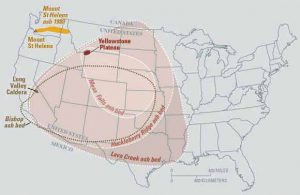

The most recent major eruption of this hotspot created the Yellowstone Caldera and Lava Creek tuff formation approximately 631,000 years ago. The eruption threw 1,000 cubic kilometers of ash and magma into the atmosphere, some of which was found as far away as Mississippi. Should the hotspot erupt again, scientists predict it will be another massive event. This would be a calamity reaching far beyond the western United States. These super volcanic eruptions fill the earth’s atmosphere with so much gas and ash, they block sunlight from reaching the earth. Not only would this drastically alter climates and environments around the globe, but it could also affect worldwide food production.

**▶ Did you get it? Click here to find out.**

                            if (window.qmn_quiz_data === undefined) {
                                    window.qmn_quiz_data = new Object();
                            }
                    window.qmn_quiz_data["46"] = {"quiz_id":"46","quiz_name":"Q02-2.6-01","disable_answer":0,"ajax_show_correct":0,"progress_bar":0,"contact_info_location":"0","qpages":{"1":{"id":"1","quizID":"13","pagekey":"AnoergqT","hide_prevbtn":"0"}},"skip_validation_time_expire":0,"timer_limit_val":0,"disable_scroll_next_previous_click":0,"disable_scroll_on_result":0,"disable_first_page":"0","enable_result_after_timer_end":0,"enable_quick_result_mc":"1","end_quiz_if_wrong":0,"form_disable_autofill":0,"disable_mathjax":0,"enable_quick_correct_answer_info":"2","quick_result_correct_answer_text":"The thicker continental plate under Yellowstone causes less frequent, but more destructive, eruptions.","quick_result_wrong_answer_text":"Incorrect.","quiz_processing_message":"","quiz_limit_choice":"Limit of choice is reached.","not_allow_after_expired_time":0,"scheduled_time_end":false,"error_messages":{"email_error_text":"Not a valid e-mail address!","number_error_text":"This field must be a number!","incorrect_error_text":"The entered text is not correct!","empty_error_text":"Please complete all required fields!","url_error_text":"The entered URL is not valid!","minlength_error_text":"Required atleast %minlength% characters.","maxlength_error_text":"Maximum %maxlength% characters allowed.","recaptcha_error_text":"ReCaptcha is missing"},"first_page":false}
                    

2.6-01 What makes the Hawaiian hot spot different than the Yellowstone hot spot? 

					Different types of tectonic plates					

					The Yellowstone hot spot is colder					

					Different types of mantle below					

					Yellowstone is at higher elevation					

					Hawaii has more places for magma to come up					

None

 Time's upCancel
                            if (window.qmn_quiz_data === undefined) {
                                    window.qmn_quiz_data = new Object();
                            }
                    window.qmn_quiz_data["47"] = {"quiz_id":"47","quiz_name":"Q02-2.6-02","disable_answer":0,"ajax_show_correct":0,"progress_bar":0,"contact_info_location":"0","qpages":{"1":{"id":"1","quizID":"13","pagekey":"AnoergqT","hide_prevbtn":"0"}},"skip_validation_time_expire":0,"timer_limit_val":0,"disable_scroll_next_previous_click":0,"disable_scroll_on_result":0,"disable_first_page":"0","enable_result_after_timer_end":0,"enable_quick_result_mc":"1","end_quiz_if_wrong":0,"form_disable_autofill":0,"disable_mathjax":0,"enable_quick_correct_answer_info":"2","quick_result_correct_answer_text":"After assembly of a supercontinent, it eventually breaks apart via rifting.","quick_result_wrong_answer_text":"Incorrect.","quiz_processing_message":"","quiz_limit_choice":"Limit of choice is reached.","not_allow_after_expired_time":0,"scheduled_time_end":false,"error_messages":{"email_error_text":"Not a valid e-mail address!","number_error_text":"This field must be a number!","incorrect_error_text":"The entered text is not correct!","empty_error_text":"Please complete all required fields!","url_error_text":"The entered URL is not valid!","minlength_error_text":"Required atleast %minlength% characters.","maxlength_error_text":"Maximum %maxlength% characters allowed.","recaptcha_error_text":"ReCaptcha is missing"},"first_page":false}
                    

2.6-02 According to the Wilson Cycle, what feature or process is most likely to occur after collision and formation of a supercontinent? 

					Transform faulting					

					Ocean-continent subduction					

					Rifting					

					Mid-ocean ridge formation					

					Ocean-ocean subduction 

None

 Time's upCancel
                            if (window.qmn_quiz_data === undefined) {
                                    window.qmn_quiz_data = new Object();
                            }
                    window.qmn_quiz_data["48"] = {"quiz_id":"48","quiz_name":"Q02-2.6-03","disable_answer":0,"ajax_show_correct":0,"progress_bar":0,"contact_info_location":"0","qpages":{"1":{"id":"1","quizID":"13","pagekey":"AnoergqT","hide_prevbtn":"0"}},"skip_validation_time_expire":0,"timer_limit_val":0,"disable_scroll_next_previous_click":0,"disable_scroll_on_result":0,"disable_first_page":"0","enable_result_after_timer_end":0,"enable_quick_result_mc":"1","end_quiz_if_wrong":0,"form_disable_autofill":0,"disable_mathjax":0,"enable_quick_correct_answer_info":"2","quick_result_correct_answer_text":"Rifting starts as a crack in the crust. Volcanism is common as block faulting occurs and valleys form. With enough rifting and extension, a new ocean basin may form and be flooded by sea water.","quick_result_wrong_answer_text":"Incorrect.","quiz_processing_message":"","quiz_limit_choice":"Limit of choice is reached.","not_allow_after_expired_time":0,"scheduled_time_end":false,"error_messages":{"email_error_text":"Not a valid e-mail address!","number_error_text":"This field must be a number!","incorrect_error_text":"The entered text is not correct!","empty_error_text":"Please complete all required fields!","url_error_text":"The entered URL is not valid!","minlength_error_text":"Required atleast %minlength% characters.","maxlength_error_text":"Maximum %maxlength% characters allowed.","recaptcha_error_text":"ReCaptcha is missing"},"first_page":false}
                    

2.6-03 If a major rift forms on a continent, what feature commonly forms next? 

					It may become a supercontinent					

					It may cause continental collision					

					It may evolve to become a new ocean basin					

					It may evolve to become a subduction zone					

					It likely will become a passive margin					

None

 Time's upCancel

## Summary

Plate tectonics is a unifying theory; it explains nearly all of the major geologic processes on Earth. Since its early inception in the 1950s and 1960s, geologists have been guided by this revolutionary perception of the world. The theory of plate tectonics states the surface layer of the Earth is broken into a network of solid, relatively brittle plates. Underneath the plates is a much hotter and more ductile layer that contains zones of convective upwelling generated by the interior heat of Earth. These convection currents move the surface plates around—bringing them together, pulling them apart, and shearing them side-by-side. Earthquakes and volcanoes form at the boundaries where the plates interact, with the exception of volcanic hotspots, which are not caused by plate movement.
