These selenite (gypsum) crystals, found in The Cave of the Crystals in Naica, Mexico, has some of the largest minerals ever found. The largest crystal found here is 39 feet (12 meters) and 55 tones.KEY** CONCEPTS**

**At the end of this chapter, students should be able to:**

- Define mineral.
- Describe the basic structure of the atom.
- Derive basic atomic information from the Periodic Table of Elements.
- Describe chemical bonding related to minerals.
- Describe the main ways minerals form.
- Describe the silicon-oxygen tetrahedron and how it forms common silicate minerals.
- List common non-silicate minerals in oxide, sulfide, sulfate, and carbonate groups.
- Identify minerals using physical properties and identification tables.

The term “minerals” as used in nutrition labels and pharmaceutical products is not the same as a mineral in a geological sense. In geology, the classic definition of a **mineral** is: 1) naturally occurring, 2) inorganic, 3) solid at room temperature, 4) regular crystal structure, and 5) defined chemical composition. Some natural substances technically should not be considered minerals, but are included by exception. For example, water and mercury are liquid at room temperature. Both are considered minerals because they were classified before the room-temperature rule was accepted as part of the definition. Calcite is quite often formed by organic processes, but is considered a mineral because it is widely found and geologically important. Because of these discrepancies, the International Mineralogical Association in 1985 amended the definition to: “A mineral is an element or chemical compound that is normally crystalline and that has been formed as a result of geological processes.” This means that the calcite in the shell of a clam is not considered a mineral. But once that clam shell undergoes burial, diagenesis, or other geological processes, then the calcite is considered a mineral. Typically, substances like coal, pearl, opal, or obsidian that do not fit the definition of mineral are called mineraloids.

A **rock** is a substance that contains one or more minerals or mineraloids. As is discussed in later chapters, there are three types of rocks composed of minerals: igneous (rocks crystallizing from molten material), sedimentary (rocks composed of products of mechanical weathering (sand, gravel, etc.) and chemical weathering (things precipitated from solution), and metamorphic (rocks produced by alteration of other rocks by heat and pressure.

## 3.1 Chemistry of Minerals

Rocks are composed of minerals that have a specific chemical composition.  To understand mineral chemistry, it is essential to examine the fundamental unit of all matter, the atom.

### **3.1.1 The Atom**

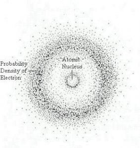

Matter is made of atoms. Atoms consists of subatomic particles—**protons**, **neutrons**, and **electrons**. A simple model of the atom has a central nucleus composed of protons, which have positive charges, and neutrons which have no charge. A cloud of negatively charged electrons surrounds the nucleus, the number of electrons equaling the number of protons thus balancing the positive charge of the protons for a neutral atom. Protons and neutrons each have a mass number of 1. The mass of an electron is less than 1/1000th that of a proton or neutron, meaning most of the atom’s mass is in the nucleus.

### **3.1.2 Periodic Table of the Elements**

Matter is composed of elements which are atoms that have a specific number of protons in the nucleus. This number of protons is called the **Atomic Number** for the element. For example, an oxygen atom has 8 protons and an iron atom has 26 protons. An element cannot be broken down chemically into a simpler form and retains unique chemical and physical properties. Each element behaves in a unique manner in nature. This uniqueness led scientists to develop a periodic table of the elements, a tabular arrangement of all known elements listed in order of their atomic number.

The Periodic Table of the ElementsThe first arrangement of elements into a periodic table was done by Dmitri Mendeleev in 1869 using the elements known at the time. In the periodic table, each element has a chemical symbol, name, atomic number, and atomic mass. The chemical symbol is an abbreviation for the element, often derived from a Latin or Greek name for the substance. The atomic number is the number of protons in the nucleus. The atomic mass is the number of protons and neutrons in the nucleus, each with a mass number of one. Since the mass of electrons is so much less than the protons and neutrons, the atomic mass is effectively the number of protons plus neutrons.

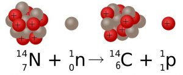

The atomic mass of natural elements represents an average mass of the atoms comprising that substance in nature and is usually not a whole number as seen on the periodic table, meaning that an element exists in nature with atoms having different numbers of neutrons. The differing number of neutrons affects the mass of an element in nature and the atomic mass number represents this average. This gives rise to the concept of isotope**. ****Isotopes **are forms of an element with the same number of protons but different numbers of neutrons. There are usually several isotopes for a particular element. For example, 98.9% of carbon atoms have 6 protons and 6 neutrons. This isotope of carbon is called carbon-12 (12C). A few carbon atoms, carbon-13 (13C), have 6 protons and 7 neutrons. A trace amount of carbon atoms, carbon-14 (14C), has 6 protons and 8 neutrons.

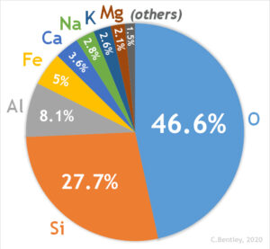

Among the 118 known elements, the heaviest are fleeting human creations known only in high energy particle accelerators, and they decay rapidly. The heaviest naturally occurring element is uranium, atomic number 92. The eight most abundant elements in Earth’s continental crust are shown in Table 1. These elements are found in the most common rock forming minerals.

**Element**
**Symbol**
**Abundance %**

Oxygen
O
47%

Silicon
Si
28%

Aluminum
Al
8%

Iron
Fe
5%

Calcium
Ca
4%

Sodium
Na
3%

Potassium
K
3%

Magnesium
Mg
2%

*Table 1. Eight Most Abundant Elements in the Earth’s Continental Crust % by weight (source: USGS). All other elements are less than 1%.*

### **3.1.3 Chemical Bonding**

A model of a water molecule, showing the bonds between the hydrogen and oxygen.Most substances on Earth are compounds containing multiple elements. Chemical bonding describes how these atoms attach with each other to form compounds, such as sodium and chlorine combining to form NaCl, common table salt. Compounds that are held together by chemical bonds are called molecules. Water is a compound of hydrogen and oxygen in which two hydrogen atoms are covalently bonded with one oxygen making the water molecule. The oxygen we breathe is formed when one oxygen atom covalently bonds with another oxygen atom to make the molecule O2. The subscript 2 in the chemical formula indicates the molecule contains two atoms of oxygen.

Most minerals are also compounds of more than one element. The common mineral calcite has the chemical formula CaCO3 indicating the molecule consists of one calcium, one carbon, and three oxygen atoms. In calcite, one carbon and three oxygen atoms are held together by covalent bonds to form a **molecular ion**, called carbonate, which has a negative charge. Calcium as an **ion** has a positive charge of plus two. The two oppositely charged ions attract each other and combine to form the mineral calcite, CaCO3. The name of the chemical compound is calcium carbonate, where calcium is Ca and carbonate refers to the molecular ion CO3-2.

The mineral olivine has the chemical formula (Mg,Fe)2SiO4, in which one silicon and four oxygen atoms are bonded with two atoms of either magnesium or iron. The comma between iron (Fe) and magnesium (Mg) indicates the two elements can occupy the same location in the crystal structure and substitute for one another.

#### *3.1.3.1 Valence and Charge*

The electrons around the atom’s nucleus are located in shells representing different energy levels. The outermost shell is called the **valence shell**. Electrons in the valence shell are involved in chemical bonding. In 1913, Niels Bohr proposed a simple model of the atom that states atoms are more stable when their outermost shell is full. Atoms of most elements thus tend to gain or lose electrons so the outermost or valence shell is full. In Bohr’s model, the innermost shell can have a maximum of two electrons and the second and third shells can have a maximum of eight electrons. When the innermost shell is the valence shell, as in the case of hydrogen and helium, it obeys the octet rule when it is full with two electrons. For elements in higher rows, the octet rule of eight electrons in the valence shell applies.

The carbon dioxide molecule. Since Oxygen is -2 and Carbon is +4, the two oxygens bond to the carbon to form a neutral molecule.The rows in the periodic table present the elements in order of atomic number and the columns organize elements with similar characteristics, such as the same number of electrons in their valence shells. Columns are often labeled from left to right with Roman numerals I to VIII, and Arabic numerals 1 through 18. The elements in columns I and II have 1 and 2 electrons in their respective valence shells and the elements in columns VI and VII have 6 and 7 electrons in their respective valence shells.

In row 3 and column I, sodium (Na) has 11 protons in the nucleus and 11 electrons in three shells—2 electrons in the inner shell, 8 electrons in the second shell, and 1 electron in the valence shell. To maintain a full outer shell of 8 electrons per the octet rule, sodium readily gives up that 1 electron so there are 10 total electrons. With 11 positively charged protons in the nucleus and 10 negatively charged electrons in two shells, sodium when forming chemical bonds is an ion with an overall net charge of +1.

All elements in column I have a single electron in their valence shell and a valence of 1. These other column I elements also readily give up this single valence electron and thus become ions with a +1 charge. Elements in column II readily give up 2 electrons and end up as ions with a charge of +2. Note that elements in columns I and II which readily give up their valence electrons, often form bonds with elements in columns VI and VII which readily take up these electrons.  Elements in columns 3 through 15 are usually involved in covalent bonding. The last column 18 (VIII) contains the **noble gases**. These elements are chemically inert because the valence shell is already full with 8 electrons, so they do not gain or lose electrons. An example is the noble gas helium which has 2 valence electrons in the first shell. Its valence shell is therefore full. All elements in column VIII possess full valence shells and do not form bonds with other elements.

As seen above, an atom with a net positive or negative charge as a result of gaining or losing electrons is called an **ion**. In general the elements on the left side of the table lose electrons and become positive ions, called cations because they are attracted to the cathode in an electrical device. The elements on the right side tend to gain electrons. These are called anions because they are attracted to the anode in an electrical device. The elements in the center of the periodic table, columns 3 through 15, do not consistently follow the octet rule. These are called transition elements. A common example is iron, which has a +2 or +3 charge depending on the oxidation state of the element. Oxidized Fe+3 carries a +3 charge and reduced Fe+2 is +2. These two different oxidation states of iron often impart dramatic colors to rocks containing their minerals—the oxidized form producing red colors and the reduced form producing green.

#### *3.1.3.2 **Ionic Bonding*

Cubic arrangement of Na and Cl ions in HaliteIonic bonds, also called electron-transfer bonds, are formed by the electrostatic attraction between atoms having opposite charges. Atoms of two opposite charges attract each other electrostatically and form an **ionic bond** in which the positive ion transfers its electron (or electrons) to the negative ion which takes them up. Through this transfer both atoms thus achieve a full valence shell. For example one atom of sodium (Na+1) and one atom of chlorine (Cl-1) form an ionic bond to make the compound sodium chloride (NaCl). This is also known as the mineral halite or common table salt. Another example is calcium (Ca+2) and chlorine (Cl-1) combining to make the compound calcium chloride (CaCl2). The subscript 2 indicates two atoms of chlorine are ionically bonded to one atom of calcium.

#### *3.1.3.3 **Covalent **Bonding*

Methane moleculeIonic bonds are usually formed between a **metal** and a **nonmetal**. Another type, called a covalent or electron-sharing bond, commonly occurs between nonmetals. Covalent bonds share electrons between ions to complete their valence shells. For example, oxygen (atomic number 8) has 8 electrons—2 in the inner shell and 6 in the valence shell. Gases like oxygen often form diatomic molecules by sharing valence electrons. In the case of oxygen, two atoms attach to each other and share 2 electrons to fill their valence shells to become the common oxygen molecule we breathe (O2). Methane (CH4) is another covalently bonded gas. The carbon atom needs 4 electrons and each hydrogen needs 1. Each hydrogen shares its electron with the carbon to form a molecule as shown in the figure.

**▶ Did you get it? Click here to find out.**

                            if (window.qmn_quiz_data === undefined) {
                                    window.qmn_quiz_data = new Object();
                            }
                    window.qmn_quiz_data["60"] = {"quiz_id":"60","quiz_name":"03.1-1","disable_answer":0,"ajax_show_correct":0,"progress_bar":"0","contact_info_location":0,"qpages":{"1":{"id":"1","quizID":"60","pagekey":"D8EdRgQB","hide_prevbtn":"0"}},"skip_validation_time_expire":0,"timer_limit_val":0,"disable_scroll_next_previous_click":0,"disable_scroll_on_result":0,"disable_first_page":"0","enable_result_after_timer_end":0,"enable_quick_result_mc":"1","end_quiz_if_wrong":0,"form_disable_autofill":0,"disable_mathjax":0,"enable_quick_correct_answer_info":"2","quick_result_correct_answer_text":"Correct! Crystalline substances are solids with an orderly repetitive arrangement of atoms with in them.","quick_result_wrong_answer_text":"Oops.","quiz_processing_message":"","quiz_limit_choice":"Limit of choice is reached.","not_allow_after_expired_time":0,"scheduled_time_end":false,"error_messages":{"email_error_text":"Not a valid e-mail address!","number_error_text":"This field must be a number!","incorrect_error_text":"The entered text is not correct!","empty_error_text":"Please complete all required fields!","url_error_text":"The entered URL is not valid!","minlength_error_text":"Required atleast %minlength% characters.","maxlength_error_text":"Maximum %maxlength% characters allowed.","recaptcha_error_text":"ReCaptcha is missing"}}
                    

03.1-1 Minerals have a crystalline structure. What does this mean? 

					That the minerals are generally inorganic and not made from life.					

					That the atoms are arranged in random order but minerals have a definite chemical composition.					

					That all minerals form beautiful, visible crystals in the right conditions.					

					That the atoms are arranged in an orderly, repetitive manner.					

					That the minerals have a definite chemical composition and are made of the same elements.					

None

 Time's upCancel
                            if (window.qmn_quiz_data === undefined) {
                                    window.qmn_quiz_data = new Object();
                            }
                    window.qmn_quiz_data["61"] = {"quiz_id":"61","quiz_name":"03.1-2","disable_answer":0,"ajax_show_correct":0,"progress_bar":"0","contact_info_location":0,"qpages":{"1":{"id":"1","quizID":"61","pagekey":"ChxUi8N6","hide_prevbtn":"0"}},"skip_validation_time_expire":0,"timer_limit_val":0,"disable_scroll_next_previous_click":0,"disable_scroll_on_result":0,"disable_first_page":"0","enable_result_after_timer_end":0,"enable_quick_result_mc":"1","end_quiz_if_wrong":0,"form_disable_autofill":0,"disable_mathjax":0,"enable_quick_correct_answer_info":"2","quick_result_correct_answer_text":"+2 means that the overall number or protons is two more than the number of electrons.","quick_result_wrong_answer_text":"Oops. +2 means that an ion has two more protons than electrons.","quiz_processing_message":"","quiz_limit_choice":"Limit of choice is reached.","not_allow_after_expired_time":0,"scheduled_time_end":false,"error_messages":{"email_error_text":"Not a valid e-mail address!","number_error_text":"This field must be a number!","incorrect_error_text":"The entered text is not correct!","empty_error_text":"Please complete all required fields!","url_error_text":"The entered URL is not valid!","minlength_error_text":"Required atleast %minlength% characters.","maxlength_error_text":"Maximum %maxlength% characters allowed.","recaptcha_error_text":"ReCaptcha is missing"}}
                    

03.1-2 If a magnesium ion is labeled +2, what does that mean? 

					It has two more neutrons than electrons.					

					It has lost two protons.					

					It has gained two electrons.					

					It has lost two electrons.					

					It has two more protons than electrons.					

None

 Time's upCancel
                            if (window.qmn_quiz_data === undefined) {
                                    window.qmn_quiz_data = new Object();
                            }
                    window.qmn_quiz_data["62"] = {"quiz_id":"62","quiz_name":"03.1-3","disable_answer":0,"ajax_show_correct":0,"progress_bar":"0","contact_info_location":0,"qpages":{"1":{"id":"1","quizID":"62","pagekey":"XyWsSUNZ","hide_prevbtn":"0"}},"skip_validation_time_expire":0,"timer_limit_val":0,"disable_scroll_next_previous_click":0,"disable_scroll_on_result":0,"disable_first_page":"0","enable_result_after_timer_end":0,"enable_quick_result_mc":"1","end_quiz_if_wrong":0,"form_disable_autofill":0,"disable_mathjax":0,"enable_quick_correct_answer_info":"2","quick_result_correct_answer_text":"Right. Ionic bonds are created when cations (positive charge) bond to anions (negative charge).","quick_result_wrong_answer_text":"Oops. Incorrect.","quiz_processing_message":"","quiz_limit_choice":"Limit of choice is reached.","not_allow_after_expired_time":0,"scheduled_time_end":false,"error_messages":{"email_error_text":"Not a valid e-mail address!","number_error_text":"This field must be a number!","incorrect_error_text":"The entered text is not correct!","empty_error_text":"Please complete all required fields!","url_error_text":"The entered URL is not valid!","minlength_error_text":"Required atleast %minlength% characters.","maxlength_error_text":"Maximum %maxlength% characters allowed.","recaptcha_error_text":"ReCaptcha is missing"}}
                    

03.1-3 When a positively-charged sodium ion is chemically bonded with a negatively-charged chlorine ion to make sodium chloride (i.e. the mineral halite), this is an example of _____. 

					Van der Walls bonding					

					covalent bonding					

					ionic bonding 

					isotope bonding					

metallic bonding					

None

 Time's upCancel
                            if (window.qmn_quiz_data === undefined) {
                                    window.qmn_quiz_data = new Object();
                            }
                    window.qmn_quiz_data["63"] = {"quiz_id":"63","quiz_name":"03.1-4","disable_answer":0,"ajax_show_correct":0,"progress_bar":"0","contact_info_location":0,"qpages":{"1":{"id":"1","quizID":"63","pagekey":"5kA2poxF","hide_prevbtn":"0"}},"skip_validation_time_expire":0,"timer_limit_val":0,"disable_scroll_next_previous_click":0,"disable_scroll_on_result":0,"disable_first_page":"0","enable_result_after_timer_end":0,"enable_quick_result_mc":"1","end_quiz_if_wrong":0,"form_disable_autofill":0,"disable_mathjax":0,"enable_quick_correct_answer_info":"2","quick_result_correct_answer_text":"Yes. If it has atomic number = 12, it must contain 12 protons. And if it has a neutral charge, the number of protons must equal the number of electrons.","quick_result_wrong_answer_text":"Oops. Incorrect arithmatic.","quiz_processing_message":"","quiz_limit_choice":"Limit of choice is reached.","not_allow_after_expired_time":0,"scheduled_time_end":false,"error_messages":{"email_error_text":"Not a valid e-mail address!","number_error_text":"This field must be a number!","incorrect_error_text":"The entered text is not correct!","empty_error_text":"Please complete all required fields!","url_error_text":"The entered URL is not valid!","minlength_error_text":"Required atleast %minlength% characters.","maxlength_error_text":"Maximum %maxlength% characters allowed.","recaptcha_error_text":"ReCaptcha is missing"}}
                    

03.1-4 Consider the element with atomic number 12 (magnesium). If it has a neutral charge, and an atomic mass of 25, how many protons (p), neutrons (n), and electrons (e) does it have? 

					p=13, n=12, e=12					

					p=12, n=12, e=13					

					p=12, n=13, e=13					

					p=13, n=12, e=13					

					p=12, n=13, e=12					

None

 Time's upCancel
                            if (window.qmn_quiz_data === undefined) {
                                    window.qmn_quiz_data = new Object();
                            }
                    window.qmn_quiz_data["64"] = {"quiz_id":"64","quiz_name":"03.1-5","disable_answer":0,"ajax_show_correct":0,"progress_bar":"0","contact_info_location":0,"qpages":{"2":{"id":"2","quizID":"64","pagekey":"6qgpbQ2z","hide_prevbtn":"0"}},"skip_validation_time_expire":0,"timer_limit_val":0,"disable_scroll_next_previous_click":0,"disable_scroll_on_result":0,"disable_first_page":"0","enable_result_after_timer_end":0,"enable_quick_result_mc":"1","end_quiz_if_wrong":0,"form_disable_autofill":0,"disable_mathjax":0,"enable_quick_correct_answer_info":"2","quick_result_correct_answer_text":"Substances made by still living things (tooth), by humans (lab diamond), or unorganized substances (glass), and non-crystalline matter (coal) are not minerals. A fossil is made by geological processes and is considered made of minerals.","quick_result_wrong_answer_text":"No. Minerals must be natural and not made by living things.","quiz_processing_message":"","quiz_limit_choice":"Limit of choice is reached.","not_allow_after_expired_time":0,"scheduled_time_end":false,"error_messages":{"email_error_text":"Not a valid e-mail address!","number_error_text":"This field must be a number!","incorrect_error_text":"The entered text is not correct!","empty_error_text":"Please complete all required fields!","url_error_text":"The entered URL is not valid!","minlength_error_text":"Required atleast %minlength% characters.","maxlength_error_text":"Maximum %maxlength% characters allowed.","recaptcha_error_text":"ReCaptcha is missing"}}
                    

03.1-5 Which of the following is considered to make up a mineral or minerals? 

volcanic glass					

					a lab-grown diamond					

					your baby teeth					

					a piece of coal					

					a fossilzed tooth					

None

 Time's upCancel

## 3.2 Formation of Minerals

Minerals form when atoms bond together in a crystalline arrangement. Three main ways this occurs in nature are: 1) precipitation directly from an aqueous (water) solution with a temperature change, 2) crystallization from a magma with a temperature change, and 3) biological precipitation by the action of organisms.

### ** 3.2.1 Precipitation from aqueous solution**

Calcium carbonate deposits from hard water on a faucetSolutions consist of ions or molecules, known as solutes, dissolved in a medium or solvent. In nature this solvent is usually water. Many minerals can be dissolved in water, such as halite or table salt, which has the composition sodium chloride, NaCl. The Na+1 and Cl-1 ions separate and disperse into the solution.

**Precipitation** is the reverse process, in which ions in solution come together to form solid minerals. Precipitation is dependent on the concentration of ions in solution and other factors such as temperature and pressure. The point at which a solvent cannot hold any more solute is called saturation. Precipitation can occur when the temperature of the solution falls, when the solute evaporates, or with changing chemical conditions in the solution. An example of precipitation in our homes is when water evaporates and leaves behind a rind of minerals on faucets, shower heads, and drinking glasses.

In nature, changes in environmental conditions may cause the minerals dissolved in water to form bonds and grow into crystals or cement grains of sediment together. In Utah, deposits of tufa formed from mineral-rich springs that emerged into the ice age Lake Bonneville. Now exposed in dry valleys, this porous tufa was a natural insulation used by pioneers to build their homes with a natural protection against summer heat and winter cold. The travertine terraces at Mammoth Hot Springs in Yellowstone Park are another example formed by calcite precipitation at the edges of the shallow spring-fed ponds.

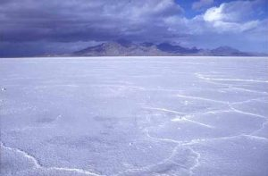

Another example of precipitation occurs in the Great Salt Lake, Utah, where the concentration of sodium chloride and other salts is nearly eight times greater than in the world’s oceans [zotpressInText item=”{DU5CMSHJ}” format=”%num%” brackets=”yes”]. Streams carry salt ions into the lake from the surrounding mountains. With no other outlet, the water in the lake evaporates and the concentration of salt increases until saturation is reached and the minerals precipitate out as sediments. Similar salt deposits include halite and other precipitates, and occur in other lakes like Mono Lake in California and the Dead Sea.

### **3.2.2 Crystallization from Magma**

Lava, magma at the earth’s surfaceHeat is energy that causes atoms in substances to vibrate. Temperature is a measure of the intensity of the vibration. If the vibrations are violent enough, chemical bonds are broken and the crystals melt releasing the ions into the melt. Magma is molten rock with freely moving ions. When magma is emplaced at depth or extruded onto the surface (then called lava), it starts to cool and mineral crystals can form.

### **3.2.3 Precipitation by Organisms**

Ammonite shell made of calcium carbonateMany organisms build bones, shells, and body coverings by extracting ions from water and precipitating minerals biologically. The most common mineral precipitated by organisms is calcite, or calcium carbonate (CaCO3). Calcite is often precipitated by organisms as a polymorph called aragonite. **Polymorphs** are crystals with the same chemical formula but different crystal structures. Marine invertebrates such as corals and clams precipitate aragonite or calcite for their shells and structures. Upon death, their hard parts accumulate on the ocean floor as sediments, and eventually may become the sedimentary rock limestone. Though limestone can form inorganically, the vast majority is formed by this biological process. Another example is marine organisms called radiolaria, which are zooplankton that precipitate silica for their microscopic external shells. When the organisms die, the shells accumulate on the ocean floor and can form the sedimentary rock chert. An example of biologic precipitation from the vertebrate world is bone, which is composed mostly of a type of apatite, a mineral in the phosphate group. The apatite found in bones contains calcium and water in its structure and is called hydroxycarbonate apatite, Ca5(PO4)3(OH).  As mentioned above, such substances are not technically minerals until the organism dies and these hard parts become fossils.

**▶ Did you get it? Click here to find out.**

                            if (window.qmn_quiz_data === undefined) {
                                    window.qmn_quiz_data = new Object();
                            }
                    window.qmn_quiz_data["65"] = {"quiz_id":"65","quiz_name":"03.2-1","disable_answer":0,"ajax_show_correct":0,"progress_bar":"0","contact_info_location":0,"qpages":{"1":{"id":"1","quizID":"64","pagekey":"6qgpbQ2z","hide_prevbtn":"0"}},"skip_validation_time_expire":0,"timer_limit_val":0,"disable_scroll_next_previous_click":0,"disable_scroll_on_result":0,"disable_first_page":"0","enable_result_after_timer_end":0,"enable_quick_result_mc":"1","end_quiz_if_wrong":0,"form_disable_autofill":0,"disable_mathjax":0,"enable_quick_correct_answer_info":"2","quick_result_correct_answer_text":"Yes, heating almost always caused things to dissolve more, no precipitate.","quick_result_wrong_answer_text":"Incorrect. The key word in this question is &quot;normally.&quot; Most of the things listed cause precipitation to occur most of the time.","quiz_processing_message":"","quiz_limit_choice":"Limit of choice is reached.","not_allow_after_expired_time":0,"scheduled_time_end":false,"error_messages":{"email_error_text":"Not a valid e-mail address!","number_error_text":"This field must be a number!","incorrect_error_text":"The entered text is not correct!","empty_error_text":"Please complete all required fields!","url_error_text":"The entered URL is not valid!","minlength_error_text":"Required atleast %minlength% characters.","maxlength_error_text":"Maximum %maxlength% characters allowed.","recaptcha_error_text":"ReCaptcha is missing"}}
                    

03.2-1 Which of the following does NOT cause an increase in mineral precipitation? 

					heating a fluid					

					cooling a fluid					

					evaporating water					

					changing pressure					

					changing oxygen levels					

None

 Time's upCancel
                            if (window.qmn_quiz_data === undefined) {
                                    window.qmn_quiz_data = new Object();
                            }
                    window.qmn_quiz_data["66"] = {"quiz_id":"66","quiz_name":"03.2-2","disable_answer":0,"ajax_show_correct":0,"progress_bar":"0","contact_info_location":0,"qpages":{"1":{"id":"1","quizID":"64","pagekey":"6qgpbQ2z","hide_prevbtn":"0"}},"skip_validation_time_expire":0,"timer_limit_val":0,"disable_scroll_next_previous_click":0,"disable_scroll_on_result":0,"disable_first_page":"0","enable_result_after_timer_end":0,"enable_quick_result_mc":"1","end_quiz_if_wrong":0,"form_disable_autofill":0,"disable_mathjax":0,"enable_quick_correct_answer_info":"2","quick_result_correct_answer_text":"Yes. Commas in formulas say that multiple elements may substitute for each other in unspecfied amounts.","quick_result_wrong_answer_text":"No. Commas in formulas say that multiple elements may substitue for each other in unspecfied amounts.","quiz_processing_message":"","quiz_limit_choice":"Limit of choice is reached.","not_allow_after_expired_time":0,"scheduled_time_end":false,"error_messages":{"email_error_text":"Not a valid e-mail address!","number_error_text":"This field must be a number!","incorrect_error_text":"The entered text is not correct!","empty_error_text":"Please complete all required fields!","url_error_text":"The entered URL is not valid!","minlength_error_text":"Required atleast %minlength% characters.","maxlength_error_text":"Maximum %maxlength% characters allowed.","recaptcha_error_text":"ReCaptcha is missing"}}
                    

03.2-2 The mineral olivine has a formula (Fe,Mg)SiO4. What does the (Fe, Mg) mean? 

					the mineral contains Fe or Mg, but not both.					

					The minerals loses Fe and gains Mg over time.					

					The mineral took Fe and Mg from the magma as it formed.					

					Part of the mineral is rich in Fe, part is rich in Mg.					

					The amounts of Fe and Mg in the mineral are equal.					

None

 Time's upCancel
                            if (window.qmn_quiz_data === undefined) {
                                    window.qmn_quiz_data = new Object();
                            }
                    window.qmn_quiz_data["67"] = {"quiz_id":"67","quiz_name":"03.2-3","disable_answer":0,"ajax_show_correct":0,"progress_bar":"0","contact_info_location":0,"qpages":{"1":{"id":"1","quizID":"64","pagekey":"6qgpbQ2z","hide_prevbtn":"0"}},"skip_validation_time_expire":0,"timer_limit_val":0,"disable_scroll_next_previous_click":0,"disable_scroll_on_result":0,"disable_first_page":"0","enable_result_after_timer_end":0,"enable_quick_result_mc":"1","end_quiz_if_wrong":0,"form_disable_autofill":0,"disable_mathjax":0,"enable_quick_correct_answer_info":"2","quick_result_correct_answer_text":"Right. Substances made by living organisms are not, by definition, minerals. But they often mimic minerals.","quick_result_wrong_answer_text":"No. Minerals must be inorganic.","quiz_processing_message":"","quiz_limit_choice":"Limit of choice is reached.","not_allow_after_expired_time":0,"scheduled_time_end":false,"error_messages":{"email_error_text":"Not a valid e-mail address!","number_error_text":"This field must be a number!","incorrect_error_text":"The entered text is not correct!","empty_error_text":"Please complete all required fields!","url_error_text":"The entered URL is not valid!","minlength_error_text":"Required atleast %minlength% characters.","maxlength_error_text":"Maximum %maxlength% characters allowed.","recaptcha_error_text":"ReCaptcha is missing"}}
                    

03.2-3 What is the most common mineral created by living organisms? 

					dolomite					

					calcite					

					apatite					

quartz 

					None - living organisms cannot make minerals.					

None

 Time's upCancel
                            if (window.qmn_quiz_data === undefined) {
                                    window.qmn_quiz_data = new Object();
                            }
                    window.qmn_quiz_data["68"] = {"quiz_id":"68","quiz_name":"03.2-4","disable_answer":0,"ajax_show_correct":0,"progress_bar":"0","contact_info_location":0,"qpages":{"1":{"id":"1","quizID":"64","pagekey":"6qgpbQ2z","hide_prevbtn":"0"}},"skip_validation_time_expire":0,"timer_limit_val":0,"disable_scroll_next_previous_click":0,"disable_scroll_on_result":0,"disable_first_page":"0","enable_result_after_timer_end":0,"enable_quick_result_mc":"1","end_quiz_if_wrong":0,"form_disable_autofill":0,"disable_mathjax":0,"enable_quick_correct_answer_info":"2","quick_result_correct_answer_text":"Substances made by still living things (tooth), by humans (lab diamond), or unorganized substances (glass), and non-crystalline matter (coal) are not minerals. A fossil is made by geological processes and is considered made of minerals.","quick_result_wrong_answer_text":"No. Minerals must be natural and not made by living things.","quiz_processing_message":"","quiz_limit_choice":"Limit of choice is reached.","not_allow_after_expired_time":0,"scheduled_time_end":false,"error_messages":{"email_error_text":"Not a valid e-mail address!","number_error_text":"This field must be a number!","incorrect_error_text":"The entered text is not correct!","empty_error_text":"Please complete all required fields!","url_error_text":"The entered URL is not valid!","minlength_error_text":"Required atleast %minlength% characters.","maxlength_error_text":"Maximum %maxlength% characters allowed.","recaptcha_error_text":"ReCaptcha is missing"}}
                    

03.2-4 When a mineral precipitates from solution, it ____________. 

					shrinks in size					

					likely will seep into the ground					

					it eventually evaporates					

					forms a crystal					

					it can never become crystalline					

None

 Time's upCancel

## 3.3 Silicate Minerals

Minerals are categorized based on their composition and structure. Silicate minerals are built around a molecular ion called the **silicon-oxygen tetrahedron**. A tetrahedron has a pyramid-like shape with four sides and four corners. Silicate minerals form the largest group of minerals on Earth, comprising the vast majority of the Earth’s mantle and crust. Of the nearly four thousand known minerals on Earth, most are rare. There are only a few that make up most of the rocks likely to be encountered by surface dwelling creatures like us. These are generally called the **rock-forming minerals**.

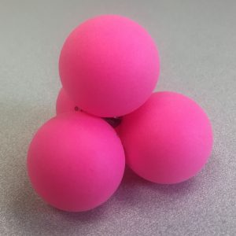

The silicon-oxygen tetrahedron (SiO4) consists of a single silicon atom at the center and four oxygen atoms located at the four corners of the tetrahedron. Each oxygen ion has a -2 charge and the silicon ion has a +4 charge. The silicon ion shares one of its four valence electrons with each of the four oxygen ions in a covalent bond to create a symmetrical geometric four-sided pyramid figure. Only half of the oxygen’s valence electrons are shared, giving the silicon-oxygen tetrahedron an ionic charge of -4. This silicon-oxygen tetrahedron forms bonds with many other combinations of ions to form the large group of silicate minerals.

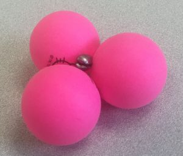

The silicon ion is much smaller than the oxygen ions (see the figures) and fits into a small space in the center of the four large oxygen ions, seen if the top ball is removed (as shown in the figure to the right). Because only one of the valence electrons of the corner oxygens is shared, the silicon-oxygen tetrahedron has chemically active corners available to form bonds with other silica tetrahedra or other positively charged ions such as Al+3, Fe+2,+3, Mg+2, K+1, Na+1, and Ca+2. Depending on many factors, such as the original magma chemistry, silica-oxygen tetrahedra can combine with other tetrahedra in several different configurations. For example, tetrahedra can be isolated, attached in chains, sheets, or three dimensional structures. These combinations and others create the chemical structure in which positively charged ions can be inserted for unique chemical compositions forming silicate mineral groups.

### **3.3.1 The dark ferromagnesian silicates**

Green olivine in basalt**The Olivine Family**

Olivine is the primary mineral component in mantle rock such as peridotite and basalt. It is characteristically green when not weathered. The chemical formula is (Fe,Mg)2SiO4. As previously described, the comma between iron (Fe) and magnesium (Mg) indicates these two elements occur in a solid solution. Not to be confused with a liquid solution, a solid solution occurs when two or more elements have similar properties and can freely substitute for each other in the same location in the crystal structure.

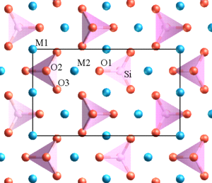

Olivine is referred to as a mineral family because of the ability of iron and magnesium to substitute for each other. Iron and magnesium in the olivine family indicates a solid solution forming a compositional series within the mineral group which can form crystals of all iron as one end member and all mixtures of iron and magnesium in between to all magnesium at the other end member. Different mineral names are applied to compositions between these end members.  In the olivine series of minerals, the iron and magnesium ions in the solid solution are about the same size and charge, so either atom can fit into the same location in the growing crystals. Within the cooling magma, the mineral crystals continue to grow until they solidify into igneous rock. The relative amounts of iron and magnesium in the parent magma determine which minerals in the series form. Other rarer elements with similar properties to iron or magnesium, like manganese (Mn), can substitute into the olivine crystalline structure in small amounts. Such ionic substitutions in mineral crystals give rise to the great variety of minerals and are often responsible for differences in color and other properties within a group or family of minerals. Olivine has a pure iron end-member (called fayalite) and a pure magnesium end-member (called forsterite). Chemically, olivine is mostly silicon, oxygen, iron, and magnesium and therefore is grouped among the dark-colored ferromagnesian (iron=ferro, magnesium=magnesian) or **mafic** minerals, a contraction of their chemical symbols Ma and Fe. Mafic minerals are also referred to as dark-colored ferromagnesian minerals. *Ferro* means iron and *magnesian* refers to magnesium. Ferromagnesian silicates tend to be more dense than non-ferromagnesian silicates. This difference in density ends up being important in controlling the behavior of the igneous rocks that are built from these minerals: whether a tectonic plate subducts or not is largely governed by the density of its rocks, which are in turn controlled by the density of the minerals that comprise them.

The crystal structure of olivine is built from independent silica tetrahedra. Minerals with independent tetrahedral structures are called neosilicates (or orthosilicates). In addition to olivine, other common neosilicate minerals include garnet, topaz, kyanite, and zircon.

Two other similar arrangements of tetrahedra are close in structure to the neosilicates and grade toward the next group of minerals, the pyroxenes. In a variation on independent tetrahedra called sorosilicates, there are minerals that share one oxygen between two tetrahedra, and include minerals like pistachio-green epidote, a gemstone. Another variation are the cyclosilicates, which as the name suggests, consist of tetrahedral rings, and include gemstones such as beryl, emerald, aquamarine, and tourmaline

### **3.3.2 Pyroxene Family**

**Crystals of diopside, a member of the pyroxene family****Single chain**Pyroxene is another family of dark ferromagnesian minerals, typically black or dark green in color. Members of the pyroxene family have a complex chemical composition that includes iron, magnesium, aluminum, and other elements bonded to polymerized silica tetrahedra. **Polymers** are chains, sheets, or three-dimensional structures, and are formed by multiple tetrahedra covalently bonded via their corner oxygen atoms. Pyroxenes are commonly found in mafic igneous rocks such as peridotite, basalt, and gabbro, as well as metamorphic rocks like eclogite and blue schist.

Pyroxenes are built from long, single chains of polymerized silica tetrahedra in which tetrahedra share two corner oxygens. The silica chains are bonded together into the crystal structures by metal cations. A common member of the pyroxene family is augite, itself containing several solid solution series with a complex chemical formula (Ca,Na)(Mg,Fe,Al,Ti)(Si,Al)2O6 that gives rise to a number of individual mineral names.

This single-chain crystalline structure bonds with many elements, which can also freely substitute for each other. The generalized chemical composition for pyroxene is XZ(Al,Si)2O6. X represents the ions Na, Ca, Mg, or Fe, and Z represents Mg, Fe, or Al. These ions have similar ionic sizes, which allows many possible substitutions among them. Although the cations may freely substitute for each other in the crystal, they carry different ionic charges that must be balanced out in the final crystalline structure. For example Na has a charge of +1, but Ca has charge of +2. If a Na+ ion substitutes for a Ca+2 ion, it creates an unequal charge that must be balanced by other ionic substitutions elsewhere in the crystal. Note that ionic size is more important than ionic charge for substitutions to occur in solid solution series in crystals.

### **3.3.3 Amphibole Family**

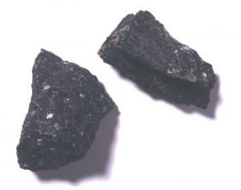

Elongated crystals of hornblende in orthoclaseAmphibole minerals are built from polymerized double silica chains and they are also referred to as inosilicates. Imagine two pyroxene chains that connect together by sharing a third oxygen on each tetrahedra.  Amphiboles are usually found in igneous and metamorphic rocks and typically have a long-bladed **crystal habit**. The most common amphibole, hornblende, is usually black; however, they come in a variety of colors depending on their chemical composition. The metamorphic rock, amphibolite, is primarily composed of amphibole minerals.

Double chain structureAmphiboles are composed of iron, magnesium, aluminum, and other cations bonded with silica tetrahedra. These dark ferromagnesian minerals are commonly found in gabbro, baslt, diorite, and often form the black specks in granite. Their chemical formula is very complex and generally written as (RSi4O11)2, where R represents many different cations. For example, it can also be written more exactly as AX2Z5((Si,Al,Ti)8O22)(OH,F,Cl,O)2. In this formula A may be Ca, Na, K, Pb, or blank; X equals Li, Na, Mg, Fe, Mn, or Ca; and Z is Li, Na, Mg, Fe, Mn, Zn, Co, Ni, Al,  Cr, Mn, V, Ti, or Zr. The substitutions create a wide variety of colors such as green, black, colorless, white, yellow, blue, or brown. Amphibole crystals can also include hydroxide ions (OH–), which occurs from an interaction between the growing minerals and water dissolved in magma.

### **3.3.4 Sheet Silicates**

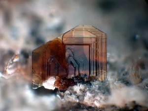

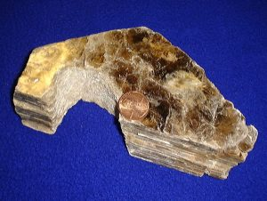

Sheet silicates are built from tetrahedra which share all three of their bottom corner oxygens thus forming sheets of tetrahedra with their top corners available for bonding with other atoms. Micas and clays are common types of sheet silicates, also known as phyllosilicates. Mica minerals are usually found in igneous and metamorphic rocks, while clay minerals are more often found in sedimentary rocks. Two frequently found micas are dark-colored biotite, frequently found in granite, and light-colored muscovite, found in the metamorphic rock called schist.

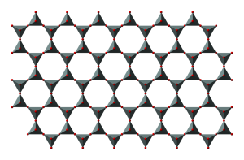

Chemically, sheet silicates usually contain silicon and oxygen in a 2:5 ratio (Si4O10). Micas contain mostly silica, aluminum, and potassium. Biotite mica has more iron and magnesium and is considered a ferromagnesian silicate mineral. Muscovite micas belong to the felsic silicate minerals. Felsic is a contraction formed from feldspar, the dominant mineral in felsic rocks.

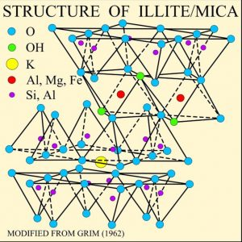

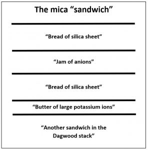

The illustration of the crystalline structure of mica shows the corner O atoms bonded with K, Al, Mg, Fe, and Si atoms, forming polymerized sheets of linked tetrahedra, with an octahedral layer of Fe, Mg, or Al, between them.  The yellow potassium ions form Van der Waals bonds (attraction and repulsion between atoms, molecules, and surfaces) and hold the sheets together. Van der Waals bonds differ from covalent and ionic bonds, and exist here between the sandwiches, holding them together into a stack of sandwiches. The Van der Waals bonds are weak compared to the bonds within the sheets, allowing the sandwiches to be separated along the potassium layers. This gives mica its characteristic property of easily cleaving into sheets.

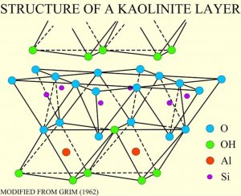

Clays minerals occur in sediments formed by the weathering of rocks and are another family of silicate minerals with a tetrahedral sheet structure. Clay minerals form a complex family, and are an important component of many sedimentary rocks. Other sheet silicates include serpentine and chlorite, found in metamorphic rocks.

Clay minerals are composed of hydrous aluminum silicates. One type of clay, kaolinite, has a structure like an open-faced sandwich, with the bread being a single layer of silicon-oxygen tetrahedra and a layer of aluminum as the spread in an octahedral configuration with the top oxygens of the sheets.

### **3.3.5 Framework Silicates**

Quartz crystalsQuartz and feldspar are the two most abundant minerals in the continental crust. In fact, feldspar itself is the single most abundant mineral in the Earth’s crust. There are two types of feldspar, one containing potassium and abundant in felsic rocks of the continental crust, and the other with sodium and calcium abundant in the mafic rocks of oceanic crust.  Together with quartz, these minerals are classified as framework silicates. They are built with a three-dimensional framework of silica tetrahedra in which all four corner oxygens are shared with adjacent tetrahedra. Within these frameworks in feldspar are holes and spaces into which other ions like aluminum, potassium, sodium, and calcium can fit giving rise to a variety of mineral compositions and mineral names.

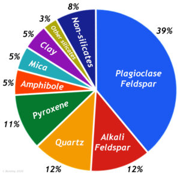

Feldspars are usually found in igneous rocks, such as granite, rhyolite, and basalt as well as metamorphic rocks and detrital sedimentary rocks. Detrital sedimentary rocks are composed of mechanically weathered rock particles, like sand and gravel. Quartz is especially abundant in detrital sedimentary rocks because it is very resistant to disintegration by weathering. While quartz is the most abundant mineral on the Earth’s surface, due to its durability, the feldspar minerals are the most abundant minerals in the Earth’s crust, comprising roughly 50% of the total minerals that make up the crust.

Pink orthoclase crystalsQuartz is composed of pure silica, SiO2, with the tetrahedra arranged in a three dimensional framework. Impurities consisting of atoms within this framework give rise to many varieties of quartz among which are gemstones like amethyst, rose quartz, and citrine.  Feldspars are mostly silicon, oxygen, aluminum, potassium, sodium, and calcium. Orthoclase feldspar (KAlSi3O8), also called potassium feldspar or K-spar, is made of silica, aluminum, and potassium. Quartz and orthoclase feldspar are felsic minerals. Felsic is the compositional term applied to continental igneous minerals and rocks that contain an abundance of silica. Another feldspar is plagioclase with the formula (Ca,Na)AlSi3O8, the solid solution (Ca,Na) indicating a series of minerals, one end of the series with calcium CaAl2Si2O8, called anorthite, and the other end with sodium NaAlSi3O8, called albite. Note how the mineral accommodates the substitution of Ca++ and Na+. Minerals in this solid solution series have different mineral names.

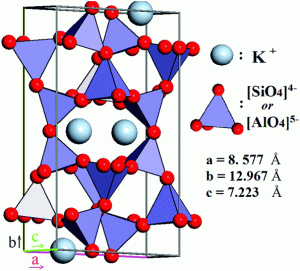

Note that aluminum, which has a similar ionic size to silicon, can substitute for silicon inside the tetrahedra (see figure). Because potassium ions are so much larger than sodium and calcium ions, which are very similar in size, the inability of the crystal structure to accommodate both potassium and sodium/calcium gives rise to the two families of feldspar, orthoclase and plagioclase respectively. Framework silicates are called tectosilicates and include the alkali metal-rich feldspathoids and zeolites.

**▶ Did you get it? Click here to find out.**

                            if (window.qmn_quiz_data === undefined) {
                                    window.qmn_quiz_data = new Object();
                            }
                    window.qmn_quiz_data["69"] = {"quiz_id":"69","quiz_name":"03.3-1","disable_answer":0,"ajax_show_correct":0,"progress_bar":"0","contact_info_location":0,"qpages":{"1":{"id":"1","quizID":"64","pagekey":"6qgpbQ2z","hide_prevbtn":"0"}},"skip_validation_time_expire":0,"timer_limit_val":0,"disable_scroll_next_previous_click":0,"disable_scroll_on_result":0,"disable_first_page":"0","enable_result_after_timer_end":0,"enable_quick_result_mc":"1","end_quiz_if_wrong":0,"form_disable_autofill":0,"disable_mathjax":0,"enable_quick_correct_answer_info":"2","quick_result_correct_answer_text":"Yes, micas are sheet silicates. Layers of silicon tetrahedra are separated by layers of other metals.","quick_result_wrong_answer_text":"Incorrect.","quiz_processing_message":"","quiz_limit_choice":"Limit of choice is reached.","not_allow_after_expired_time":0,"scheduled_time_end":false,"error_messages":{"email_error_text":"Not a valid e-mail address!","number_error_text":"This field must be a number!","incorrect_error_text":"The entered text is not correct!","empty_error_text":"Please complete all required fields!","url_error_text":"The entered URL is not valid!","minlength_error_text":"Required atleast %minlength% characters.","maxlength_error_text":"Maximum %maxlength% characters allowed.","recaptcha_error_text":"ReCaptcha is missing"}}
                    

03.3-1 Why are mica minerals “like a sandwich”? 

					Because layers of weak bonds cause the platy mineral to easily cleave into sheets.					

					Because they have many strong atomic bonds similar to bread.					

					Because there are so many different ways they stack on each other.					

					Because they are found in the structures of wheat.					

					Because they taste and smell really good.					

None

 Time's upCancel
                            if (window.qmn_quiz_data === undefined) {
                                    window.qmn_quiz_data = new Object();
                            }
                    window.qmn_quiz_data["70"] = {"quiz_id":"70","quiz_name":"03.3-2","disable_answer":0,"ajax_show_correct":0,"progress_bar":"0","contact_info_location":0,"qpages":{"1":{"id":"1","quizID":"64","pagekey":"6qgpbQ2z","hide_prevbtn":"0"}},"skip_validation_time_expire":0,"timer_limit_val":0,"disable_scroll_next_previous_click":0,"disable_scroll_on_result":0,"disable_first_page":"0","enable_result_after_timer_end":0,"enable_quick_result_mc":"1","end_quiz_if_wrong":0,"form_disable_autofill":0,"disable_mathjax":0,"enable_quick_correct_answer_info":"2","quick_result_correct_answer_text":"Right. There are no minerals that are triple-chain silicates. Some, however, are single chains or double cahins.","quick_result_wrong_answer_text":"Incorrect. Silica tetrahedra in minerals may be isolate, in single, or double chains, in pairs, or in sheets.","quiz_processing_message":"","quiz_limit_choice":"Limit of choice is reached.","not_allow_after_expired_time":0,"scheduled_time_end":false,"error_messages":{"email_error_text":"Not a valid e-mail address!","number_error_text":"This field must be a number!","incorrect_error_text":"The entered text is not correct!","empty_error_text":"Please complete all required fields!","url_error_text":"The entered URL is not valid!","minlength_error_text":"Required atleast %minlength% characters.","maxlength_error_text":"Maximum %maxlength% characters allowed.","recaptcha_error_text":"ReCaptcha is missing"}}
                    

03.3-2 Which of the following is NOT a way that silicon tetrahedra may be arranged in silicate minerals? 

					isolated tetrahedra					

					double chain tetrahedra					

					triple chain tetrahedra					

					sheets of tetrahedra					

					single chain tetrahedra					

None

 Time's upCancel
                            if (window.qmn_quiz_data === undefined) {
                                    window.qmn_quiz_data = new Object();
                            }
                    window.qmn_quiz_data["71"] = {"quiz_id":"71","quiz_name":"03.3-3","disable_answer":0,"ajax_show_correct":0,"progress_bar":"0","contact_info_location":0,"qpages":{"1":{"id":"1","quizID":"64","pagekey":"6qgpbQ2z","hide_prevbtn":"0"}},"skip_validation_time_expire":0,"timer_limit_val":0,"disable_scroll_next_previous_click":0,"disable_scroll_on_result":0,"disable_first_page":"0","enable_result_after_timer_end":0,"enable_quick_result_mc":"1","end_quiz_if_wrong":0,"form_disable_autofill":0,"disable_mathjax":0,"enable_quick_correct_answer_info":"2","quick_result_correct_answer_text":"Yup. The tetrahedron has oxygen at its 4 corners and a silicon at its center.","quick_result_wrong_answer_text":"Incorrect. Hint: &quot;tetra&quot; means four.","quiz_processing_message":"","quiz_limit_choice":"Limit of choice is reached.","not_allow_after_expired_time":0,"scheduled_time_end":false,"error_messages":{"email_error_text":"Not a valid e-mail address!","number_error_text":"This field must be a number!","incorrect_error_text":"The entered text is not correct!","empty_error_text":"Please complete all required fields!","url_error_text":"The entered URL is not valid!","minlength_error_text":"Required atleast %minlength% characters.","maxlength_error_text":"Maximum %maxlength% characters allowed.","recaptcha_error_text":"ReCaptcha is missing"}}
                    

03.3-3 What atoms are in a silicon tetrahedron, the basic unit of silicate minerals? 

					4 oxygens and 4 silicons					

					1 oxygen and 4 silicons					

					1 oxygen and 1 silicon					

					4 oxygens and 1 silicon					

					2 oxygen and 2 silicon					

None

 Time's upCancel

## 3.4 Non-Silicate Minerals

Hanksite, Na22K(SO4)9(CO3)2Cl, one of the few minerals that is considered a member of two groups: carbonate and sulfateThe crystal structure of non-silicate minerals (see table) does not contain silica-oxygen tetrahedra. Many non-silicate minerals are economically important and provide metallic resources such as copper, lead, and iron. They also include valuable non-metallic products such as salt, construction materials, and fertilizer.

**Mineral  Group**
**Examples**
**Formula**
**Uses**

Native elements
gold, silver, copper
Au, Ag, Cu
Jewelry, coins, industry

Carbonates
calcite, dolomite 
CaCO3, CaMg(CO3)2
Lime, Portland cement

Oxides
hematite, magnetite, bauxite
Fe2O3, Fe3O4, a mixture of aluminum oxides
Ores of iron & aluminum, pigments 

Halides
halite, sylvite
NaCl, KCl
Table salt, fertilizer

Sulfides
galena, chalcopyrite, cinnabar
PbS, CuFeS2, HgS
Ores of lead, copper, mercury

Sulphates
gypsum, epsom salts
CaSo4·2H2O, MgSO4·7H2O
Sheetrock, therapeutic soak

Phosphates
apatite
Ca5(PO4)3(F,Cl,OH) 
Fertilizer, teeth, bones

*Common non-silicate mineral groups.*

### **3.4.1 Carbonates**

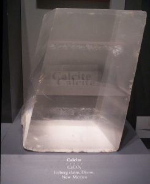

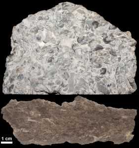

Calcite (CaCO3) and dolomite (CaMg(CO3)2) are the two most frequently occurring carbonate minerals, and usually occur in sedimentary rocks, such as limestone and dolostone rocks, respectively. Some carbonate rocks, such calcite and dolomite, are formed via evaporation and precipitation. However, most carbonate-rich rocks, such as limestone, are created by the lithification of fossilized marine organisms. These organisms, including those we can see and many microscopic organisms, have shells or exoskeletons consisting of calcium carbonate (CaCO3). When these organisms die, their remains accumulate on the floor of the water body in which they live and the soft body parts decompose and dissolve away. The calcium carbonate hard parts become included in the sediments, eventually becoming the sedimentary rock called limestone. While limestone may contain large, easy to see fossils, most limestones contain the remains of microscopic creatures and thus originate from biological processes.

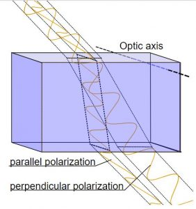

Calcite crystals show an interesting property called **birefringence**, meaning they polarize light into two wave components vibrating at right angles to each other. As the two light waves pass through the crystal, they travel at different velocities and are separated by refraction into two different travel paths. In other words, the crystal produces a double image of objects viewed through it. Because they polarize light, calcite crystals are used in special petrographic microscopes for studying minerals and rocks.

Many non-silicate minerals are referred to as salts. The term **salts** used here refers to compounds made by replacing the hydrogen in natural acids. The most abundant natural acid is carbonic acid that forms by the solution of carbon dioxide in water. Carbonate minerals are salts built around the carbonate ion (CO3-2) where calcium and/or magnesium replace the hydrogen in carbonic acid (H2CO3). Calcite and a closely related polymorph aragonite are secreted by organisms to form shells and physical structures like corals. Many such creatures draw both calcium and carbonate from dissolved bicarbonate ions (HCO3–) in ocean water. As seen in the mineral identification section below, calcite is easily dissolved in acid and thus effervesces in dilute hydrochloric acid (HCl). Small dropper bottles of dilute hydrochloric acid are often carried by geologists in the field as well as used in mineral identification labs.

Other salts include halite (NaCl) in which sodium replaces the hydrogen in hydrochloric acid and gypsum (Ca[SO4] • 2 H2O) in which calcium replaces the hydrogen in sulfuric acid. Note that some water molecules are also included in the gypsum crystal. Salts are often formed by evaporation and are called evaporite minerals.

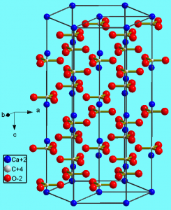

The figure shows the crystal structure of calcite (CaCO3). Like silicon, carbon has four valence electrons. The carbonate unit consists of carbon atoms (tiny white dots) covalently bonded to three oxygen atoms (red), one oxygen sharing two valence electrons with the carbon and the other two sharing one valence electron each with the carbon, thus creating triangular units with a charge of -2. The negatively charged carbonate unit forms an ionic bond with the Ca ion (blue), which as a charge of +2.

### **3.4.2 Oxides, Halides, and Sulfides**

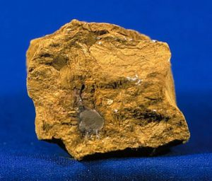

After carbonates, the next most common non-silicate minerals are the oxides, halides, and sulfides.

Oxides consist of metal ions covalently bonded with oxygen. The most familiar oxide is rust, which is a combination of iron oxides (Fe2O3) and hydrated oxides. Hydrated oxides form when iron is exposed to oxygen and water. Iron oxides are important for producing metallic iron. When iron oxide or ore is smelted, it produces carbon dioxide (CO2) and metallic iron.

The red color in rocks is usually due to the presence of iron oxides. For example, the red sandstone cliffs in Zion National Park and throughout Southern Utah consist of white or colorless grains of quartz coated with iron oxide which serve as cementing agents holding the grains together.

Oolitic hematiteOther iron oxides include limonite, magnetite, and hematite. Hematite occurs in many different crystal forms. The massive form shows no external structure. Botryoidal hematite shows large concentric blobs. Specular hematite looks like a mass of shiny metallic crystals. Oolitic hematite looks like a mass of dull red fish eggs. These different forms of hematite are polymorphs and all have the same formula, Fe2O3.

Other common oxide minerals include:

- ice (H2O), an oxide of hydrogen
- bauxite (Al2H2O4), hydrated oxides of aluminum, an ore for producing metallic aluminum
- corundum (Al2O3), which includes ruby and sapphire gemstones.

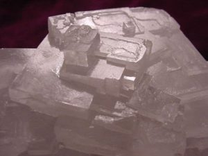

The **halides** consist of halogens in column VII, usually fluorine or chlorine, ionically bonded with sodium or other cations. These include halite or sodium chloride (NaCl), common table salt; sylvite or potassium chloride (KCl); and fluorite or calcium fluoride (CaF2).

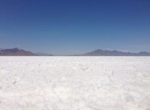

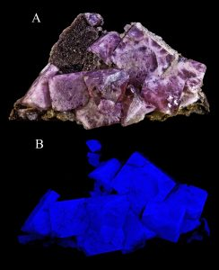

Halide minerals usually form from the evaporation of sea water or other isolated bodies of water. A well-known example of halide mineral deposits created by evaporation is the Bonneville Salt Flats, located west of the Great Salt Lake in Utah (see figure).

Cubic crystals of pyriteMany important metal ores are **sulfides, **in which metals are bonded to sulfur. Significant examples include:  galena (lead sulfide), sphalerite (zinc sulfide), pyrite (iron sulfide, sometimes called “fool’s gold”), and chalcopyrite (iron-copper sulfide). Sulfides are well known for being important ore minerals. For example, galena is the main source of lead, sphalerite is the main source of zinc, and chalcopyrite is the main copper ore mineral mined in porphyry deposits like the Bingham mine (see chapter 16). The largest sources of nickel, antimony, molybdenum, arsenic, and mercury are also sulfides.

### **3.4.3 Sulfates**

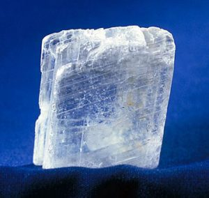

Sulfate minerals contain a metal ion, such as calcium, bonded to a sulfate ion. The sulfate ion is a combination of sulfur and oxygen (SO4–2). The sulfate mineral gypsum (CaSO4ᐧ2H2O) is used in construction materials such as plaster and drywall. Gypsum is often formed from evaporating water and usually contains water molecules in its crystalline structure. The ᐧ2H2O in the formula indicates the water molecules are whole H2O. This is different from minerals like amphibole, which contain a hydroxide ion (OH–) that is derived from water, but is missing a hydrogen ion (H+). The calcium sulfate without water is a different mineral than gypsum called anhydrite (CaSO4).

### **3.4.4 Phosphates**

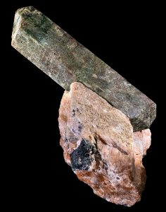

Phosphate minerals have a tetrahedral phosphate unit (PO4-3) combined with various anions and cations. In some cases arsenic or vanadium can substitute for phosphorus. Phosphates are an important ingredient of fertilizers as well as detergents, paint, and other products. The best known phosphate mineral is apatite, Ca5(PO4)3(F,Cl,OH), variations of which are found in teeth and bones. The gemstone turquoise [CuAl6(PO4)4(OH)8·4H2O ] is a copper-rich phosphate mineral that, like gypsum, contains water molecules.

### **3.4.5 Native Element Minerals**

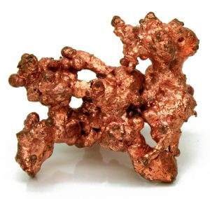

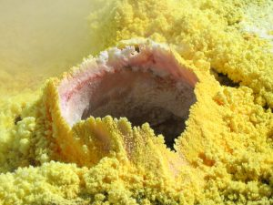

Native element minerals, usually metals, occur in nature in a pure or nearly pure state. Gold is an example of a native element mineral; it is not very reactive and rarely bonds with other elements so it is usually found in an isolated or pure state. The non-metallic and poorly-reactive mineral carbon is often found as a native element, such as graphite and diamonds. Mildly reactive metals like silver, copper, platinum, mercury, and sulfur sometimes occur as native element minerals. Reactive metals such as iron, lead, and aluminum almost always bond to other elements and are rarely found in a native state.

**▶ Did you get it? Click here to find out.**

                            if (window.qmn_quiz_data === undefined) {
                                    window.qmn_quiz_data = new Object();
                            }
                    window.qmn_quiz_data["72"] = {"quiz_id":"72","quiz_name":"03.4-1","disable_answer":0,"ajax_show_correct":0,"progress_bar":"0","contact_info_location":0,"qpages":{"1":{"id":"1","quizID":"64","pagekey":"6qgpbQ2z","hide_prevbtn":"0"}},"skip_validation_time_expire":0,"timer_limit_val":0,"disable_scroll_next_previous_click":0,"disable_scroll_on_result":0,"disable_first_page":"0","enable_result_after_timer_end":0,"enable_quick_result_mc":"1","end_quiz_if_wrong":0,"form_disable_autofill":0,"disable_mathjax":0,"enable_quick_correct_answer_info":"2","quick_result_correct_answer_text":"Right. The most important ore minerals for just about all metals are sulfides.","quick_result_wrong_answer_text":"No. Good ore minerals must contain lots of the metal of value and must be easy to process. Which mineral groups have those properties?","quiz_processing_message":"","quiz_limit_choice":"Limit of choice is reached.","not_allow_after_expired_time":0,"scheduled_time_end":false,"error_messages":{"email_error_text":"Not a valid e-mail address!","number_error_text":"This field must be a number!","incorrect_error_text":"The entered text is not correct!","empty_error_text":"Please complete all required fields!","url_error_text":"The entered URL is not valid!","minlength_error_text":"Required atleast %minlength% characters.","maxlength_error_text":"Maximum %maxlength% characters allowed.","recaptcha_error_text":"ReCaptcha is missing"}}
                    

03.4-1 Which mineral group contains the most important ore minerals of copper, lead, and zinc, among other metals? 

					sulfides					

					oxides					

sulfates 

					metalloids					

native elements					

None

 Time's upCancel
                            if (window.qmn_quiz_data === undefined) {
                                    window.qmn_quiz_data = new Object();
                            }
                    window.qmn_quiz_data["73"] = {"quiz_id":"73","quiz_name":"03.4-2","disable_answer":0,"ajax_show_correct":0,"progress_bar":"0","contact_info_location":0,"qpages":{"1":{"id":"1","quizID":"64","pagekey":"6qgpbQ2z","hide_prevbtn":"0"}},"skip_validation_time_expire":0,"timer_limit_val":0,"disable_scroll_next_previous_click":0,"disable_scroll_on_result":0,"disable_first_page":"0","enable_result_after_timer_end":0,"enable_quick_result_mc":"1","end_quiz_if_wrong":0,"form_disable_autofill":0,"disable_mathjax":0,"enable_quick_correct_answer_info":"2","quick_result_correct_answer_text":"Most metals react with other elements to form compounds. Fe and Al, for example, commonly form magnetite (Fe3O4) and corundum (Al2O3).","quick_result_wrong_answer_text":"No. Hint: Atoms most elements are unhappy by themselves and will combine with atoms of another element.","quiz_processing_message":"","quiz_limit_choice":"Limit of choice is reached.","not_allow_after_expired_time":0,"scheduled_time_end":false,"error_messages":{"email_error_text":"Not a valid e-mail address!","number_error_text":"This field must be a number!","incorrect_error_text":"The entered text is not correct!","empty_error_text":"Please complete all required fields!","url_error_text":"The entered URL is not valid!","minlength_error_text":"Required atleast %minlength% characters.","maxlength_error_text":"Maximum %maxlength% characters allowed.","recaptcha_error_text":"ReCaptcha is missing"}}
                    

03.4-2 Why are only some minerals found as native minerals? For example, iron and aluminum are almost never found as native elements in nature. 

					Native aluminum and iron only form in the core 

					Earth is too cold for most elements to form natives					

					Earth is too hot for aluminum or iron to occur as natives					

					All native elements formed long ago, at the time Earth was first created					

					Most elements react with other elements to form compounds					

None

 Time's upCancel
                            if (window.qmn_quiz_data === undefined) {
                                    window.qmn_quiz_data = new Object();
                            }
                    window.qmn_quiz_data["74"] = {"quiz_id":"74","quiz_name":"03.4-3","disable_answer":0,"ajax_show_correct":0,"progress_bar":"0","contact_info_location":0,"qpages":{"1":{"id":"1","quizID":"64","pagekey":"6qgpbQ2z","hide_prevbtn":"0"}},"skip_validation_time_expire":0,"timer_limit_val":0,"disable_scroll_next_previous_click":0,"disable_scroll_on_result":0,"disable_first_page":"0","enable_result_after_timer_end":0,"enable_quick_result_mc":"1","end_quiz_if_wrong":0,"form_disable_autofill":0,"disable_mathjax":0,"enable_quick_correct_answer_info":"2","quick_result_correct_answer_text":"Right. By far the most common carbonate mineral is calcite. And most calcite is created by marine organisms.","quick_result_wrong_answer_text":"No. The most common carbonate minerals are organic and form in ocean regions.","quiz_processing_message":"","quiz_limit_choice":"Limit of choice is reached.","not_allow_after_expired_time":0,"scheduled_time_end":false,"error_messages":{"email_error_text":"Not a valid e-mail address!","number_error_text":"This field must be a number!","incorrect_error_text":"The entered text is not correct!","empty_error_text":"Please complete all required fields!","url_error_text":"The entered URL is not valid!","minlength_error_text":"Required atleast %minlength% characters.","maxlength_error_text":"Maximum %maxlength% characters allowed.","recaptcha_error_text":"ReCaptcha is missing"}}
                    

03.4-3 What is the most common origin of carbonate minerals in nature? 

					by evaporation					

					made by marine life					

					during cooling of a magma					

					during heating or originally sedimentary rocks					

					by precipitation of minerals from petroleum deposits					

None

 Time's upCancel

## 3.5 Identifying Minerals

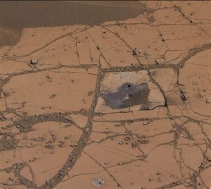

Geologists identify minerals by their physical properties. In the field, where geologists may have limited access to advanced technology and powerful machines, they can still identify minerals by testing several physical properties: luster and color, streak, hardness, crystal habit, cleavage and fracture, and some special properties. Only a few common minerals make up the majority of Earth’s rocks and are usually seen as small grains in rocks. Of the several properties used for identifying minerals, it is good to consider which will be most useful for identifying them in small grains surrounded by other minerals.

### **3.5.1 Luster and Color**

15 mm metallic hexagonal molybdenite crystal from Quebec.The first thing to notice about a mineral is its surface appearance, specifically luster and color. Luster describes how the mineral looks. Metallic luster looks like a shiny metal such as chrome, steel, silver, or gold. Submetallic luster has a duller appearance. Pewter, for example, shows submetallic luster.

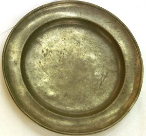

Nonmetallic luster doesn’t look like a metal and may be described as vitreous (glassy), earthy, silky, pearly, and other surface qualities. Nonmetallic minerals may be shiny, although their vitreous shine is different from metallic luster. See the table for descriptions and examples of nonmetallic luster.

Luster
Image
Description

Vitreous/glassy
Quartz crystals
Surface is shiny like glass

Earthy/dull

Kaolin specimen showing dull or earthy luster
Dull, like dried mud or clay

Silky
Specimen showing silky luster
Soft shine like silk fabric

Pearly
Specimen showing pearly luster
Like the inside of a clam shell or mother-of-pearl

Submetallic
Submetallic luster on sphalerite
Has the appearance of dull metal, like pewter. These minerals would usually still be considered metallic. Submetallic appearance can occur in metallic minerals because of weathering.

Azurite is ALWAYS a dark blue color, and has been used for centuries for blue pigment.Surface color may be helpful in identifying minerals, although it can be quite variable within the same mineral family. Mineral colors are affected by the main elements as well as impurities in the crystals. These impurities may be rare elements—like manganese, titanium, chromium, or lithium—even other molecules that are not normally part of the mineral formula. For example, the incorporation of water molecules gives quartz, which is normally clear, a milky color.

Some minerals predominantly show a single color. Malachite and azurite are green and blue, respectively, because of their copper content. Other minerals have a predictable range of colors due to elemental substitutions, usually via a solid solution. Feldspars, the most abundant minerals in the earth’s crust, are complex, have solid solution series, and present several colors including pink, white, green, gray and others. Other minerals also come in several colors, influenced by trace amounts of several elements. The same element may show up as different colors, in different minerals. With notable exceptions, color is usually not a definitive property of minerals. For identifying many minerals. a more reliable indicator is streak, which is the color of the powdered mineral.

### **3.5.2 Streak**

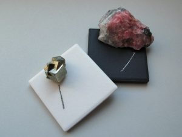

Streak examines the color of a powdered mineral, and can be seen when a mineral sample is scratched or scraped on an unglazed porcelain streak plate. A paper page in a field notebook may also be used for the streak of some minerals. Minerals that are harder than the streak plate will not show streak, but will scratch the porcelain. For these minerals, a streak test can be obtained by powdering the mineral with a hammer and smearing the powder across a streak plate or notebook paper.

While mineral surface colors and appearances may vary, their streak colors can be diagnostically useful. An example of this property is seen in the iron-oxide mineral hematite. Hematite occurs in a variety of forms, colors and lusters, from shiny metallic silver to earthy red-brown, and different physical appearances. A hematite streak is consistently reddish brown, no matter what the original specimen looks like. Iron sulfide or pyrite, is a brassy metallic yellow. Commonly named fool’s gold, pyrite has a characteristic black to greenish-black streak.

### **3.5.3 Hardness**

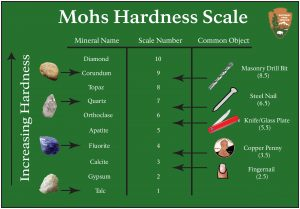

Hardness measures the ability of a mineral to scratch other substances. The Mohs Hardness Scale gives a number showing the relative scratch-resistance of minerals when compared to a standardized set of minerals of increasing hardness. The Mohs scale was developed by German geologist Fredrick Mohs in the early 20th century, although the idea of identifying minerals by hardness goes back thousands of years. Mohs hardness values are determined by the strength of a mineral’s atomic bonds.

The figure shows the minerals associated with specific hardness values, together with some common items readily available for use in field testing and mineral identification. The hardness values run from 1 to 10, with 10 being the hardest; however, the scale is not linear. Diamond defines a hardness of 10 and is actually about four times harder than corundum, which is 9. A steel pocketknife blade, which has a hardness value of 5.5, separates between hard and soft minerals on many mineral identification keys.

### **3.5.4 Crystal Habit**

Minerals can be identified by **crystal habit**, how their crystals grow and appear in rocks. Crystal shapes are determined by the arrangement of the atoms within the crystal structure. For example, a cubic arrangement of atoms gives rise to a cubic-shaped mineral crystal. Crystal habit refers to typically observed shapes and characteristics; however, they can be affected by other minerals crystallizing in the same rock. When minerals are constrained so they do not develop their typical crystal habit, they are called **anhedral**. **Subhedral** crystals are partially formed shapes. For some minerals characteristic crystal habit is to grow crystal faces even when surrounded by other crystals in rock. An example is garnet. Minerals grown freely where the crystals are unconstrained and can take characteristic shapes often form crystal faces. A **euhedral** crystal has a perfectly formed, unconstrained shape. Some minerals crystallize in such tiny crystals, they do not show a specific crystal habit to the naked eye. Other minerals, like pyrite, can have an array of different crystal habits, including cubic, dodecahedral, octahedral, and massive. The table lists typical crystal habits of various minerals.

**Habit**
**Image**
**Examples**

**Bladed**
long and flat crystals
Bladed kyanite
kyanite, amphibole, gypsum

**Botryoidal/mammillary**
blobby, circular crystals
Malachite from the Congo
hematite, malachite, smithsonite

**Coating/laminae/druse**
crystals that are small and coat surfaces
Quartz (var. amethyst) in a geode
quartz, calcite, malachite, azurite

**Cubic**
cube-shaped crystals

Cubic crystals of galena
pyrite, galena, halite

**Dodecahedral**
12-sided polygon shapes
Pyrite crystals with dodecahedral habit
garnet, pyrite

**Dendritic**
branching crystals
Manganese dendrites, scale in mm.
Mn-oxides, copper, gold

**Equant**
crystals that do not have a long direction
Olivine crystal
olivine, garnet, pyroxene

**Fibrous**
thin, very long crystals
Tremolite, a type of amphibole
serpentine, amphibole, zeolite

**Layered, sheets**
stacked, very thin, flat crystals

Sheet crystals of muscovite
mica (biotite, muscovite, etc.)

**Lenticular/platy**
crystals that are plate-like
 Orange wulfenite on calcite
selenite roses, wulfenite, calcite

**Hexagonal**
crystals with six sides

Hexagonal hanksite
quartz, hanksite, corundum

**Massive/granular**
Crystals with no obvious shape, microscopic crystals

Limonite, a hydrated oxide of iron
limonite, pyrite, azurite, bornite

**Octahedral**
4-sided double pyramid crystals
Octahedral fluorite
diamond, fluorite, magnetite, pyrite

**Prismatic/columnar**
very long, cylindrical crystals
Columnar tourmaline
tourmaline, beryl, barite

**Radiating**
crystals that grow from a point and fan out
Pyrophyllite
pyrite “suns”, pyrophyllite

**Rhombohedral**
crystals shaped like slanted cubes

Calcite crystal in shape of rhomb
calcite, dolomite

**Tabular/blocky/stubby**
sharp-sided crystals with no long direction
Crystals of diopside, a member of the pyroxene family
feldspar, pyroxene, calcite

**Tetrahedral**
three-sided, pyramid-shaped crystals
Tetrahedrite
magnetite, spinel, tetrahedrite

Twinned stauroliteGypsum with striationsAnother crystal habit that may be used to identify minerals is striations, which are dark and light parallel lines on a crystal face. Twinning is another, which occurs when the crystal structure replicates in mirror images along certain directions in the crystal.

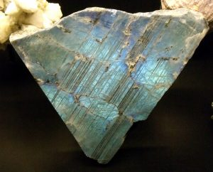

Striations and twinning are related properties in some minerals including plagioclase feldspar. Striations are optical lines on a cleavage surface. Because of twinning in the crystal, striations show up on one of the two cleavage faces of the plagioclase crystal.

### **3.5.5 Cleavage and Fracture**

Minerals often show characteristic patterns of breaking along specific cleavage planes or show characteristic fracture patterns. Cleavage planes are smooth, flat, parallel planes within the crystal. The cleavage planes may show as reflective surfaces on the crystal, as parallel cracks that penetrate into the crystal, or show on the edge or side of the crystal as a series of steps like rice terraces. Cleavage arises in crystals where the atomic bonds between atomic layers are weaker along some directions than others, meaning they will break preferentially along these planes. Because they develop on atomic surfaces in the crystal, cleavage planes are optically smooth and reflect light, although the actual break on the crystal may appear jagged or uneven. In such cleavages, the cleavage surface may appear like rice terraces on a mountainside that all reflect sunlight from a particular sun angle. Some minerals have a strong cleavage, some minerals only have weak cleavage or do not typically demonstrate cleavage.

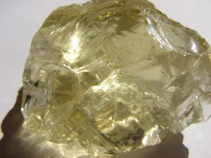

For example, quartz and olivine rarely show cleavage and typically break into conchoidal fracture patterns.

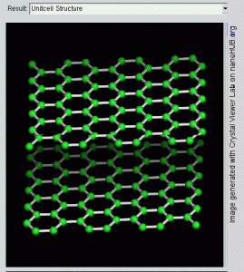

Graphite has its carbon atoms arranged into layers with relatively strong bonds within the layer and very weak bonds between the layers.  Thus graphite cleaves readily between the layers and the layers slide easily over one another giving graphite its lubricating quality.

Mineral fracture surfaces may be rough and uneven or they may be show conchoidal fracture. Uneven fracture patterns are described as irregular, splintery, fibrous. A conchoidal fracture has a smooth, curved surface like a shallow bowl or conch shell, often with curved ridges. Natural volcanic glass, called obsidian, breaks with this characteristic conchoidal pattern

Cubic cleavage of galena; note how the cleavage surfaces show up as different but parallel layers in the crystal.To work with cleavage, it is important to remember that cleavage is a result of bonds separating along planes of atoms in the crystal structure. On some minerals, **cleavage planes** may be confused with crystal faces. This will usually not be an issue for crystals of minerals that grew together within rocks. The act of breaking the rock to expose a fresh face will most likely break the crystals along cleavage planes. Some cleavage planes are parallel with crystal faces but many are not. Cleavage planes are smooth, flat, parallel planes within the crystal. The cleavage planes may show as parallel cracks that penetrate into the crystal (see amphibole below), or show on the edge or side of the crystal as a series of steps like rice terraces. For some minerals characteristic crystal habit is to grow crystal faces even when surrounded by other crystals in rock. An example is garnet. Minerals grown freely where the crystals are unconstrained and can take characteristic shapes often form crystal faces (see quartz below).

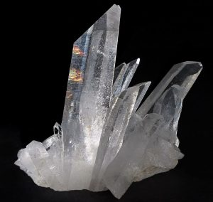

In some minerals, distinguishing cleavage planes from crystal faces may be challenging for the student. Understanding the nature of cleavage and referring to the number of cleavage planes and cleavage angles on identification keys should provide the student with enough information to distinguish cleavages from crystal faces. Cleavage planes may show as multiple parallel cracks or flat surfaces on the crystal. Cleavage planes may be expressed as a series of steps like terraced rice paddies. See the cleavage surfaces on galena above or plagioclase below. Cleavage planes arise from the tendency of mineral crystals to break along specific planes of weakness within the crystal favored by atomic arrangements. The number of cleavage planes, the quality of the cleavage surfaces, and the angles between them are diagnostic for many minerals and cleavage is one of the most useful properties for identifying minerals. Learning to recognize cleavage is an especially important and useful skill in studying minerals.

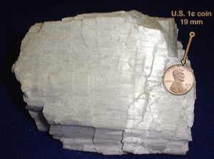

Photomicrograph showing 120/60 degree cleavage within a grain of amphiboleAs an identification property of minerals, cleavage is usually given in terms of the quality of the cleavage (perfect, imperfect, or none), the number of cleavage surfaces, and the angles between the surfaces. The most common number of cleavage plane directions in the common rock-forming minerals are: one perfect cleavage (as in mica), two cleavage planes (as in feldspar, pyroxene, and amphibole), and three cleavage planes (as in halite, calcite, and galena). One perfect cleavage (as in mica) develops on the top and bottom of the mineral specimen with many parallel cracks showing on the sides but no angle of intersection. Two cleavage planes intersect at an angle. Common cleavage angles are 60°, 75°, 90°, and 120°.  Amphibole has two cleavage planes at 60° and 120°. Galena and halite have three cleavage planes at 90° (cubic cleavage). Calcite cleaves readily in three directions producing a cleavage figure called a rhomb that looks like a cube squashed over toward one corner giving rise to the approximately 75° cleavage angles. Pyroxene has an imperfect cleavage with two planes at 90°.

**Cleavages on common rock-forming minerals**

- Quartz—none (conchoidal fracture)
- Olivine—none (conchoidal fracture)
- Mica—1 perfect
- Feldspar—2 perfect at 90°
- Pyroxene—2 imperfect at 90°
- Amphibole—2 perfect at 60°/120°
- Calcite—3 perfect at approximately 75°
- Halite, galena, pyrite—3 perfect at 90°

### **3.5.6 Special Properties **

A demonstration of ulexite’s image projectionSpecial properties are unique and identifiable characteristics used to identify minerals or that allow some minerals to be used for special purposes. Ulexite has a fiber-optic property that can project images through the crystal like a high-definition television screen (see figure). A simple identifying special property is taste, such as the salty flavor of halite or common table salt (NaCl). Sylvite is potassium chloride (KCl) and has a more bitter taste.

Native gold has one of the highest specific gravities.Another property geologists may use to identify minerals is a property related to density called **specific gravity**. Specific gravity measures the weight of a mineral specimen relative to the weight of an equal volume of water. The value is expressed as a ratio between the mineral and water weights. To measure specific gravity, a mineral specimen is first weighed in grams then submerged in a graduated cylinder filled with pure water at room temperature. The rise in water level is noted using the cylinder’s graduated scale. Since the weight of water at room temperature is 1 gram per cubic centimeter, the ratio of the two weight numbers gives the specific gravity. Specific gravity is easy to measure in the laboratory but is less useful for mineral identification in the field than other more easily observed properties, except in a few rare cases such as the very dense galena or native gold. The high density of these minerals gives rise to a qualitative property called “heft.” Experienced geologists can roughly assess specific gravity by heft, a subjective quality of how heavy the specimen feels in one’s hand relative to its size.

A simple test for identifying calcite and dolomite is to drop a bit of dilute hydrochloric acid (10-15% HCl) on the specimen. If the acid drop effervesces or fizzes on the surface of the rock, the specimen is calcite. If it does not, the specimen is scratched to produce a small amount of powder and test with acid again. If the acid drop fizzes slowly on the powdered mineral, the specimen is dolomite. The difference between these two minerals can be seen in the video. Geologists who work with carbonate rocks carry a small dropper bottle of dilute HCl in their field kit. Vinegar, which contains acetic acid, can be used for this test and is used to distinguish non-calcite fossils from limestone. While acidic, vinegar produces less of a fizzing reaction because acetic acid is a weaker acid.

Paperclips attracted to lodestone (magnetite).Some iron-oxide minerals are magnetic and are attracted to magnets. A common name for a naturally magnetic iron oxide is **lodestone**. Others include magnetite (Fe3O4) and ilmenite (FeTiO3). Magnetite is strongly attracted to magnets and can be magnetized. Ilmenite and some types of hematite are weakly magnetic.

Iridescence on plagioclase; also showing striations on the cleavage surfaceSome minerals and mineraloids scatter light via a phenomenon called **iridescence**. This property occurs in labradorite (a variety of plagioclase) and opal. It is also seen in biologically created substances like pearls and seashells. Cut diamonds show iridescence and the jeweler’s diamond cut is designed to maximize this property.

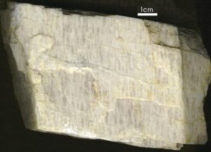

**Striations** on mineral cleavage faces are an optical property that can be used to separate plagioclase feldspar from potassium feldspar (K-spar). A process called twinning creates parallel zones in the crystal that are repeating mirror images. The actual cleavage angle in plagioclase is slightly different than 90o and the alternating mirror images in these twinned zones produce a series of parallel lines on one of plagioclase’s two cleavage faces. Light reflects off these twinned lines at slightly different angles which then appear as light and dark lines called striations on the cleavage surface. Potassium feldspar does not exhibit twinning or striations but may show linear features called **exsolution lamellae**, also known as perthitic lineation or simply perthite. Because sodium and potassium do not fit into the same feldspar crystal structure, the lines are created by small amounts of sodium feldspar (albite) separating from the dominant potassium feldspar (K-spar) within the crystal structure. The two different feldspars crystallize out into roughly parallel zones within the crystal, which are seen as these linear markings.

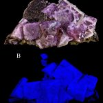

One of the most interesting special mineral properties is **fluorescence**. Certain minerals, or  trace elements within them, give off visible light when exposed to ultraviolet radiation or black light. Many mineral exhibits have a fluorescence room equipped with black lights so this property can be observed. An even rarer optical property is phosphorescence. **Phosphorescent** minerals absorb light and then slowly release it, much like a glow-in-the-dark sticker.

**▶ Did you get it? Click here to find out.**

                            if (window.qmn_quiz_data === undefined) {
                                    window.qmn_quiz_data = new Object();
                            }
                    window.qmn_quiz_data["75"] = {"quiz_id":"75","quiz_name":"03.5-1","disable_answer":0,"ajax_show_correct":0,"progress_bar":"0","contact_info_location":0,"qpages":{"1":{"id":"1","quizID":"64","pagekey":"6qgpbQ2z","hide_prevbtn":"0"}},"skip_validation_time_expire":0,"timer_limit_val":0,"disable_scroll_next_previous_click":0,"disable_scroll_on_result":0,"disable_first_page":"0","enable_result_after_timer_end":0,"enable_quick_result_mc":"1","end_quiz_if_wrong":0,"form_disable_autofill":0,"disable_mathjax":0,"enable_quick_correct_answer_info":"2","quick_result_correct_answer_text":"Yes, it must have hardness between 3.5 (penny) and 5.5 (glass)","quick_result_wrong_answer_text":"Incorrect. How hard is a penny or a glass plate?","quiz_processing_message":"","quiz_limit_choice":"Limit of choice is reached.","not_allow_after_expired_time":0,"scheduled_time_end":false,"error_messages":{"email_error_text":"Not a valid e-mail address!","number_error_text":"This field must be a number!","incorrect_error_text":"The entered text is not correct!","empty_error_text":"Please complete all required fields!","url_error_text":"The entered URL is not valid!","minlength_error_text":"Required atleast %minlength% characters.","maxlength_error_text":"Maximum %maxlength% characters allowed.","recaptcha_error_text":"ReCaptcha is missing"}}
                    

03.5-1 Regarding Mohs Hardness Scale, if a mineral scratches a copper penny but NOT a glass plate, then the hardness is around ____.? 

					1.5					

					2.5					

					3.5					

					4.5					

					5.5					

None

 Time's upCancel
                            if (window.qmn_quiz_data === undefined) {
                                    window.qmn_quiz_data = new Object();
                            }
                    window.qmn_quiz_data["76"] = {"quiz_id":"76","quiz_name":"3.5-2","disable_answer":0,"ajax_show_correct":0,"progress_bar":"0","contact_info_location":0,"qpages":{"1":{"id":"1","quizID":"64","pagekey":"6qgpbQ2z","hide_prevbtn":"0"}},"skip_validation_time_expire":0,"timer_limit_val":0,"disable_scroll_next_previous_click":0,"disable_scroll_on_result":0,"disable_first_page":"0","enable_result_after_timer_end":0,"enable_quick_result_mc":"1","end_quiz_if_wrong":0,"form_disable_autofill":0,"disable_mathjax":0,"enable_quick_correct_answer_info":"2","quick_result_correct_answer_text":"Yes. A mineral&#039;s streak is its color when powdered. Streak is especially useful for distinguishing some brown and black minerals.","quick_result_wrong_answer_text":"Incorrect","quiz_processing_message":"","quiz_limit_choice":"Limit of choice is reached.","not_allow_after_expired_time":0,"scheduled_time_end":false,"error_messages":{"email_error_text":"Not a valid e-mail address!","number_error_text":"This field must be a number!","incorrect_error_text":"The entered text is not correct!","empty_error_text":"Please complete all required fields!","url_error_text":"The entered URL is not valid!","minlength_error_text":"Required atleast %minlength% characters.","maxlength_error_text":"Maximum %maxlength% characters allowed.","recaptcha_error_text":"ReCaptcha is missing"}}
                    

03.5-2 Which mineral identification property involves making powder of a mineral? 

hardness 

					tenacity					

streak 

					color					

					cleavage					

None

 Time's upCancel
                            if (window.qmn_quiz_data === undefined) {
                                    window.qmn_quiz_data = new Object();
                            }
                    window.qmn_quiz_data["77"] = {"quiz_id":"77","quiz_name":"03.5-3","disable_answer":0,"ajax_show_correct":0,"progress_bar":"0","contact_info_location":0,"qpages":{"1":{"id":"1","quizID":"64","pagekey":"6qgpbQ2z","hide_prevbtn":"0"}},"skip_validation_time_expire":0,"timer_limit_val":0,"disable_scroll_next_previous_click":0,"disable_scroll_on_result":0,"disable_first_page":"0","enable_result_after_timer_end":0,"enable_quick_result_mc":"1","end_quiz_if_wrong":0,"form_disable_autofill":0,"disable_mathjax":0,"enable_quick_correct_answer_info":"2","quick_result_correct_answer_text":"Right. Many imporant sulfides have metallic lusters. Some imporant oxides do too.","quick_result_wrong_answer_text":"No. Most ore minerals are sulfides","quiz_processing_message":"","quiz_limit_choice":"Limit of choice is reached.","not_allow_after_expired_time":0,"scheduled_time_end":false,"error_messages":{"email_error_text":"Not a valid e-mail address!","number_error_text":"This field must be a number!","incorrect_error_text":"The entered text is not correct!","empty_error_text":"Please complete all required fields!","url_error_text":"The entered URL is not valid!","minlength_error_text":"Required atleast %minlength% characters.","maxlength_error_text":"Maximum %maxlength% characters allowed.","recaptcha_error_text":"ReCaptcha is missing"}}
                    

03.5-3 Which mineral luster characterizes many important ore minerals? 

					adamantine luster					

					resinous luster 

					magnetic luster					

					reflective luster					

metallic luster 

None

 Time's upCancel
                            if (window.qmn_quiz_data === undefined) {
                                    window.qmn_quiz_data = new Object();
                            }
                    window.qmn_quiz_data["78"] = {"quiz_id":"78","quiz_name":"03.5-4","disable_answer":0,"ajax_show_correct":0,"progress_bar":"0","contact_info_location":0,"qpages":{"1":{"id":"1","quizID":"64","pagekey":"6qgpbQ2z","hide_prevbtn":"0"}},"skip_validation_time_expire":0,"timer_limit_val":0,"disable_scroll_next_previous_click":0,"disable_scroll_on_result":0,"disable_first_page":"0","enable_result_after_timer_end":0,"enable_quick_result_mc":"1","end_quiz_if_wrong":0,"form_disable_autofill":0,"disable_mathjax":0,"enable_quick_correct_answer_info":"2","quick_result_correct_answer_text":"Yes. Cleavage occurs because of planes of weak bonding.","quick_result_wrong_answer_text":"No. Cleavage has to do with bonding, not composition.","quiz_processing_message":"","quiz_limit_choice":"Limit of choice is reached.","not_allow_after_expired_time":0,"scheduled_time_end":false,"error_messages":{"email_error_text":"Not a valid e-mail address!","number_error_text":"This field must be a number!","incorrect_error_text":"The entered text is not correct!","empty_error_text":"Please complete all required fields!","url_error_text":"The entered URL is not valid!","minlength_error_text":"Required atleast %minlength% characters.","maxlength_error_text":"Maximum %maxlength% characters allowed.","recaptcha_error_text":"ReCaptcha is missing"}}
                    

03.5-4 A mineral's cleavage is due to ___________________. 

					covalent bonding in some directions					

					constant stresses applied in the mineral's natural environment					

					impurity elements that concentrate in layers between elements that should be there					

					silicon and oxygen atoms arranged in a linear fashion					

					planes of weak bonding in the atomic arrangement					

None

 Time's upCancel

## **Summary**

Minerals are the building blocks of rocks and essential to understanding geology. Mineral properties are determined by their atomic bonds. Most minerals begin in a fluid, and either crystallize out of cooling magma or precipitate as ions and molecules out of a saturated solution. The silicates are largest group of minerals on Earth, by number of varieties and relative quantity, making up a large portion of the crust and mantle. Based on the silicon-oxygen tetrahedra, the crystal structure of silicates reflects the fact that silicon and oxygen are the top two of Earth’s most abundant elements. Non-silicate minerals are also economically important, and providing many types of construction and manufacturing materials. Minerals are identified by their unique physical properties, including luster, color, streak, hardness, crystal habit, fracture, cleavage, and special properties.
