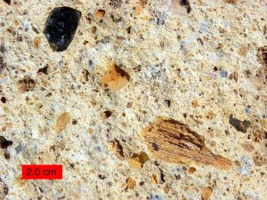
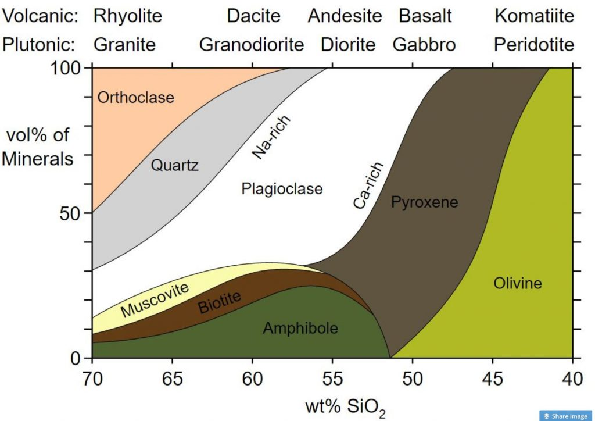
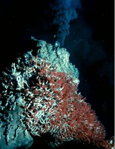

Mount Vesuvius towers over the ruins of Pompeii, a city destroyed by the eruption in 79 CE.

# 4 Igneous Processes and Volcanoes

**KEY CONCEPTS**

**By the end of this chapter, students should be able to:**

- Explain the origin of magma it relates to plate tectonics
- Describe how the Bowen’s Reaction Series relates mineral crystallization and melting temperatures
- Explain how cooling of magma leads to rock compositions and textures, and how these are used to classify igneous rocks
- Analyze the features of common igneous landforms and how they relate to their origin
- Explain partial melting and fractionation, and how they change magma compositions
- Describe how silica content affects magma viscosity and eruptive style of volcanoes
- Describe volcano types, eruptive styles, composition, and their plate tectonic settings
- Describe volcanic hazards

**Igneous rock** is formed when liquid rock freezes into a solid rock. This molten material is called **magma** when it is in the ground and **lava** when it is on the surface. Only the Earth’s outer core is liquid; the Earth’s mantle and crust is naturally solid. However, there are a few minor pockets of magma that form near the surface where geologic processes cause melting. It is this magma that becomes the source for volcanoes and igneous rocks. This chapter will describe the classification of igneous rocks, the unique processes that form magmas, types of volcanoes and volcanic processes, volcanic hazards, and igneous landforms.

Lava flow in HawaiiLava cools quickly on the surface of the earth and forms tiny microscopic crystals. These are known as fine-grained **extrusive**, or volcanic, igneous rocks. Extrusive rocks are often **vesicular**, filled with holes from escaping gas bubbles. **Volcanism** is the process in which lava is erupted. Depending on the properties of the lava that is erupted, the volcanism can be drastically different, from smooth and gentle to dangerous and explosive. This leads to different types of volcanoes and different volcanic hazards.

In contrast, magma that cools slowly below the earth’s surface forms larger crystals which can be seen with the naked eye. These are known as coarse-grained **intrusive**, or plutonic, igneous rocks. This relationship between cooling rates and grain sizes of the solidified minerals in igneous rocks is important for interpreting the rock’s geologic history.

## 4.1 Classification of Igneous Rocks

Igneous rocks are classified based on texture and composition. Texture describes the physical characteristics of the minerals, such as grain size. This relates to the cooling history of the molten magma from which it came. Composition refers to the rock’s specific mineralogy and chemical composition. Cooling history is also related to changes that can occur to the composition of igneous rocks.

### **4.1.1 Texture**

If magma cools slowly, deep within the crust, the resulting rock is called intrusive or plutonic. The slow cooling process allows crystals to grow large, giving intrusive igneous rock a coarse-grained or **phaneritic** texture. The individual crystals in phaneritic texture are readily visible to the unaided eye.

When lava is extruded onto the surface, or intruded into shallow fissures near the surface and cools, the resulting igneous rock is called extrusive or volcanic. Extrusive igneous rocks have a fine-grained or **aphanitic** texture, in which the grains are too small to see with the unaided eye. The fine-grained texture indicates the quickly cooling lava did not have time to grow large crystals. These tiny crystals can be viewed under a petrographic microscope. In some cases, extrusive lava cools so rapidly it does not develop crystals at all. This non-crystalline material is not classified as minerals, but as volcanic glass. This is a common component of volcanic ash and rocks like obsidian.

Some igneous rocks have a mix of coarse-grained minerals surrounded by a matrix of fine-grained material in a texture called **porphyritic**. The large crystals are called **phenocrysts** and the fine-grained matrix is called the **groundmass** or **matrix**. Porphyritic texture indicates the magma body underwent a multi-stage cooling history, cooling slowly while deep under the surface and later rising to a shallower depth or the surface where it cooled more quickly.

Residual molten material expelled from igneous intrusions may form veins or masses containing very large crystals of minerals like feldspar, quartz, beryl, tourmaline, and mica. This texture, which indicates a very slow crystallization, is called **pegmatitic**. A rock that chiefly consists of pegmatitic texture is known as a **pegmatite**. To give an example of how large these crystals can get, transparent cleavage sheets of pegmatitic muscovite mica were used as windows during the Middle Ages.

All magmas contain gases dissolved in solution called **volatiles**. As the magma rises to the surface, the drop in pressure causes the dissolved volatiles to come bubbling out of solution, like the fizz in an opened bottle of soda. The gas bubbles become trapped in the solidifying lava to create a **vesicular** texture, with the holes specifically called vesicles. The type of volcanic rock with common vesicles is called **scoria**.

An extreme version of scoria occurs when volatile-rich lava is very quickly quenched and becomes a meringue-like froth of glass called **pumice**. Some pumice is so full of vesicles that the density of the rock drops low enough that it will float.

Obsidian (volcanic glass). Note conchoidal fracture.Lava that cools extremely quickly may not form crystals at all, even microscopic ones. The resulting rock is called **volcanic glass**. **O****bsidian** is a rock consisting of volcanic glass. Obsidian as a glassy rock shows an excellent example of conchoidal fracture similar to the mineral quartz (see Chapter 3).

When volcanoes erupt explosively, vast amounts of lava, rock, ash, and gases are thrown into the atmosphere. The solid parts, called tephra, settle back to earth and cool into rocks with **pyroclastic** textures. *Pyro,* meaning fire, refers to the igneous source of the tephra and *clastic *refers to the rock fragments. Tephra fragments are named based on size—**ash** (<2 mm), **lapilli** (2-64 mm), and **bombs or blocks** (>64 mm). Pyroclastic texture is usually recognized by the chaotic mix of crystals, angular glass shards, and rock fragments. Rock formed from large deposits of tephra fragments is called **tuff**. If the fragments accumulate while still hot, the heat may deform the crystals and weld the mass together, forming a welded tuff.

### **4.1.2 Composition**

Composition refers to a rock’s chemical and mineral make-up. For igneous rocks, composition is divided into four groups: **felsic**, **intermediate**, **mafic**, and **ultramafic***.* The term *felsic* refers to light-colored silicate minerals, to rocks, and to magmas that are generally enriched in light elments including silicon, oxygen, sodium, and potassium. Felsic rocks always contain a large amount of silica (SiO2). The term *mafic* refers to minerals, rocks, or magmas that are rich in iron and magnesium. Most mafic minerals and rocks have a dark color, and they contain less silica than felsic minerals and rocks. *Intermediate* compositions fall between felsic and mafic, and *ultramafic* compositions are poorer in silica, and generally richer in iron and magnesium, than mafic compositions.

It is important to realize that felsic, intermediate, mafic, and ultramafic rocks do not have sharp boundaries in nature, but rather lie on a continuous spectrum with many transitional compositions and names that refer to specific quantities of minerals. As an example, granite is a commonly-used term, but has a very specific definition which includes exact quantities of minerals like feldspar and quartz. Rocks labeled as ‘granite’ in laymen applicationsm however, can be several other rocks, including  syenite, tonalite, and monzonite.

To avoid unnecesary complications, the following figure presents a simplified version of igneous rock nomenclature focusing on the four main groups, which is adequate for an introductory student. Rhyolite is a felsic volcanic rosk; dacite and andesite are intermediate volcanic rocks, basalt is a mafic volcanic rock, and komatiite is an ultramafic volcanic rock. Granite is a felsic plutonic rock; granodiorite and diorite are intermediate plutonic rocks; gabbro is a mafic plutonic rock, and peridotite is an ultramafic plutonic rock.

**Fel**sic rocks contain a predominance of the light-colored (felsic) minerals, mostly **fel**dspar and **si**lica in the form of quartz. These light-colored minerals contain large amounts of silica as a proportion of their overall chemical formula. Minor amounts of dark-colored (mafic) minerals like amphibole and biotite mica may be present as well. Felsic igneous rocks are rich in silica, containing 65-75% weight percent SiO2, and relatively poor in iron and magnesium.

**Intermediate** rocks having compositions between felsic and mafic, usually contain roughly-equal amounts of light and dark minerals, including light grains of plagioclase feldspar and dark minerals like amphibole.  Silica content is in the 55-60% range.

**Maf**ic rocks contain an abundance of ferromagnesian minerals (with magnesium and iron, chemical symbols **M**g and **F**e) plus plagioclase feldspar. They contain dark minerals like pyroxene and olivine, which are rich in iron and magnesium and relatively poor in silica. Mafic rocks are low in silica, in the 45-50% range.

**Ultramafic** refers to the extremely mafic rocks composed of mostly olivine and some pyroxene. These rocks contain even more magnesium and iron and less silica than mafic rocks. They are rare at Earth’s surface, but make up peridotite, the rock of the upper mantle. Ultramafic rocks are poor in silica, containing 40 wt% or less range.

On the figure above, the top row has both plutonic and volcanic igneous rocks arranged in a continuous spectrum from felsic on the left to intermediate, mafic, and ultramafic toward the right. **Rhyolite** thus refers to the volcanic and felsic igneous rocks, and **granite** thus refer to intrusive and felsic igneous rocks. **Andesite** and **diorite** likewise refer to extrusive and intrusive intermediate rocks (with dacite and granodiorite applying to those rocks with composition between felsic and intermediate). **Basalt** and **gabbro** are the extrusive and intrusive names for mafic igneous rocks, and **peridotite** is ultramafic, with **komatiite** as the fine-grained extrusive equivalent. Komatiite is a rare rock because volcanic material that comes direct from the mantle is not common, although some examples can be found in ancient Archean rocks. Nature rarely has sharp boundaries and the classification and naming of rocks often imposes what appear to be sharp boundary names onto a continuous spectrum.

#### **Aphanitic/Phaneritic Rock Types with images**

**Felsic Composition**

Granite from Cape Cod, Massachusetts.

Rhyolite (source: Michael C. Rygel via Wikimedia Commons)

Granite is a course-crystalline felsic intrusive rock.  The presence of quartz is a good indicator of granite.  Granite commonly has large amounts of salmon pink potassium feldspar and white plagioclase crystals that have visible cleavage planes. Granite is a good approximation for the continental crust, both in density and composition.
Rhyolite is a fine-crystalline felsic extrusive rock.  Rhyolite is commonly pink and will often have glassy quartz phenocrysts.  Because felsic lavas are less mobile, it is less common than granite. Examples of rhyolite include several lava flows in Yellowstone National Park and the altered rhyolite that makes up the Grand Canyon of the Yellowstone.

  **Intermediate Composition**

Diorite
Andesite

 Diorite is a coarse-crystalline intermediate intrusive igneous rock. Diorite is identifiable by it’s Dalmatian-like appearance of black hornblende and biotite and white plagioclase feldspar. It is found in its namesake, the Andes Mountains as well as the Henry and Abajo mountains of Utah.
 Andesite is a fine crystalline intermediate extrusive rock.  It is commonly grey and porphyritic.  It can be found in the Andes Mountains and in some island arcs (see Chapter 2). It is the fine grained compositional equivalent of diorite.

**Mafic Composition**

Gabbro
Vesicular Basalt

Gabbro is a coarse-grained mafic igneous rock, made with mainly mafic minerals like pyroxene and only minor plagioclase. Because mafic lava is more mobile, it is less common than basalt. Gabbro is a major component of the lower oceanic crust.

Basalt is a fine-grained mafic igneous rock. It is commonly vesicular and aphanitic. When porphyritic, it often has either olivine or plagioclase phenocrysts. Basalt is the main rock which is formed at mid-ocean ridges, and is therefore the most common rock on the Earth’s surface, making up the entirety of the ocean floor (except where covered by sediment).

### **4.1.3 Igneous Rock Bodies**

Igneous rocks are common in the geologic record, but surprisingly, it is the intrusive rocks that are more common. Extrusive rocks, because of their small crystals and glass, are less durable. Plus, they are, by definition, exposed to the elements of erosion immediately. Intrusive rocks, forming underground with larger, stronger crystals, are more likely to last. Therefore, most landforms and rock groups that owe their origin to igneous rocks are intrusive bodies. A significant exception to this is active volcanoes, which are discussed in a later section on volcanism. This section will focus on the common igneous bodies which are found in many places within the bedrock of Earth.

When magma intrudes into a weakness like a crack or fissure and solidifies, the resulting cross-cutting feature is called a **dike** (sometimes spelled dyke). Because of this, dikes are often vertical or at an angle relative to the pre-existing rock layers that they intersect. Dikes are therefore discordant intrusions, not following any layering that was present. Dikes are important to geologists, not only for the study of igneous rocks themselves but also for dating rock sequences and interpreting the geologic history of an area. The dike is younger than the rocks it cuts across and, as discussed in the chapter on Geologic Time (Chapter 7), may be used to assign actual numeric ages to sedimentary sequences, which are notoriously difficult to age date.

**Sills** are another type of intrusive structure. A sill is a concordant intrusion that runs parallel to the sedimentary layers in the country rock. They are formed when magma exploits a weakness between these layers, shouldering them apart and squeezing between them. As with dikes, sills are younger than the surrounding layers and may be radioactively dated to study the age of sedimentary strata.

A magma chamber is a large underground reservoir of molten rock. The path of rising magma is called a **diapir**. The processes by which a diapir intrudes into the surrounding native or country rock are not well understood and are the subject of ongoing geological inquiry. For example, it is not known what happens to the pre-existing country rock as the diapir intrudes. One theory is the overriding rock gets shouldered aside, displaced by the increased volume of magma. Another is the native rock is melted and consumed into the rising magma or broken into pieces that settle into the magma, a process known as **stoping**. It has also been proposed that diapirs are not a real phenomenon, but just a series of dikes that blend into each other. The dikes may be intruding over millions of years, but since they may be made of similar material, they would be appearing to be formed at the same time. Regardless, when a diapir cools, it forms an mass of intrusive rock called a **pluton**. Plutons can have irregular shapes, but can often be somewhat round.

Half Dome in Yosemite National Park, California, is a part of the Sierra Nevada batholith which is mostly made of granite.When many plutons merge together in an extensive single feature, it is called a **batholith**. Batholiths are found in the cores of many mountain ranges, including the granite formations of Yosemite National Park in the Sierra Nevada of California. They are typically more than 100 km2 in area, associated with subduction zones, and mostly felsic in composition. A **stock** is a type of pluton with less surface exposure than a batholith, and may represent a narrower neck of material emerging from the top of a batholith. Batholiths and stocks are discordant intrusions that cut across and through surrounding country rock.

**Laccoliths** are blister-like, concordant intrusions of magma that form between sedimentary layers. The Henry Mountains of Utah are a famous topographic landform formed by this process. Laccoliths bulge upwards; a similar downward-bulging intrusion is called a **lopolith**.

*Click on the plus signs the illustration for descriptions of several igneous features.*

**▶ Did you get it? Click here to find out.**

                            if (window.qmn_quiz_data === undefined) {
                                    window.qmn_quiz_data = new Object();
                            }
                    window.qmn_quiz_data["89"] = {"quiz_id":"89","quiz_name":"04.1-1","disable_answer":0,"ajax_show_correct":0,"progress_bar":"0","contact_info_location":0,"qpages":{"1":{"id":"1","quizID":"64","pagekey":"6qgpbQ2z","hide_prevbtn":"0"}},"skip_validation_time_expire":0,"timer_limit_val":0,"disable_scroll_next_previous_click":0,"disable_scroll_on_result":0,"disable_first_page":"0","enable_result_after_timer_end":0,"enable_quick_result_mc":"1","end_quiz_if_wrong":0,"form_disable_autofill":0,"disable_mathjax":0,"enable_quick_correct_answer_info":"2","quick_result_correct_answer_text":"Yes. The most common kind of felisc igneous rock is granite.","quick_result_wrong_answer_text":"No.","quiz_processing_message":"","quiz_limit_choice":"Limit of choice is reached.","not_allow_after_expired_time":0,"scheduled_time_end":false,"error_messages":{"email_error_text":"Not a valid e-mail address!","number_error_text":"This field must be a number!","incorrect_error_text":"The entered text is not correct!","empty_error_text":"Please complete all required fields!","url_error_text":"The entered URL is not valid!","minlength_error_text":"Required atleast %minlength% characters.","maxlength_error_text":"Maximum %maxlength% characters allowed.","recaptcha_error_text":"ReCaptcha is missing"}}
                    

Using the classification table, if an igneous rock has a coarse-grained texture AND has a felsic composition (abundant silica), then the igneous rock is called ______. 

					granite					

					basalt					

					pumice					

rhyolite 

					planes of weak bonding in the atomic arrangement					

None

 Time's upCancel
                            if (window.qmn_quiz_data === undefined) {
                                    window.qmn_quiz_data = new Object();
                            }
                    window.qmn_quiz_data["90"] = {"quiz_id":"90","quiz_name":"04.1-2","disable_answer":0,"ajax_show_correct":0,"progress_bar":"0","contact_info_location":0,"qpages":{"1":{"id":"1","quizID":"64","pagekey":"6qgpbQ2z","hide_prevbtn":"0"}},"skip_validation_time_expire":0,"timer_limit_val":0,"disable_scroll_next_previous_click":0,"disable_scroll_on_result":0,"disable_first_page":"0","enable_result_after_timer_end":0,"enable_quick_result_mc":"1","end_quiz_if_wrong":0,"form_disable_autofill":0,"disable_mathjax":0,"enable_quick_correct_answer_info":"2","quick_result_correct_answer_text":"Yes. Coarse grains mean slow cooling, and that means cooling underground.","quick_result_wrong_answer_text":"No.","quiz_processing_message":"","quiz_limit_choice":"Limit of choice is reached.","not_allow_after_expired_time":0,"scheduled_time_end":false,"error_messages":{"email_error_text":"Not a valid e-mail address!","number_error_text":"This field must be a number!","incorrect_error_text":"The entered text is not correct!","empty_error_text":"Please complete all required fields!","url_error_text":"The entered URL is not valid!","minlength_error_text":"Required atleast %minlength% characters.","maxlength_error_text":"Maximum %maxlength% characters allowed.","recaptcha_error_text":"ReCaptcha is missing"}}
                    

Where do igneous rocks with a coarse-grained (phaneritic) texture form? 

					on Earth's surface after being ejected into the air during an eruption					

					deep underground					

					on Earth's surface after forming from a lava flow					

					anywhere a magma comes in contact with water					

					generally only in pyroclastic flows					

None

 Time's upCancel
                            if (window.qmn_quiz_data === undefined) {
                                    window.qmn_quiz_data = new Object();
                            }
                    window.qmn_quiz_data["92"] = {"quiz_id":"92","quiz_name":"04.1-3","disable_answer":0,"ajax_show_correct":0,"progress_bar":"0","contact_info_location":0,"qpages":{"1":{"id":"1","quizID":"64","pagekey":"6qgpbQ2z","hide_prevbtn":"0"}},"skip_validation_time_expire":0,"timer_limit_val":0,"disable_scroll_next_previous_click":0,"disable_scroll_on_result":0,"disable_first_page":"0","enable_result_after_timer_end":0,"enable_quick_result_mc":"1","end_quiz_if_wrong":0,"form_disable_autofill":0,"disable_mathjax":0,"enable_quick_correct_answer_info":"2","quick_result_correct_answer_text":"Yes. Yes, silica rich rocks are felsic. They are also called silicic, which makes logical sense.","quick_result_wrong_answer_text":"No. Try again.","quiz_processing_message":"","quiz_limit_choice":"Limit of choice is reached.","not_allow_after_expired_time":0,"scheduled_time_end":false,"error_messages":{"email_error_text":"Not a valid e-mail address!","number_error_text":"This field must be a number!","incorrect_error_text":"The entered text is not correct!","empty_error_text":"Please complete all required fields!","url_error_text":"The entered URL is not valid!","minlength_error_text":"Required atleast %minlength% characters.","maxlength_error_text":"Maximum %maxlength% characters allowed.","recaptcha_error_text":"ReCaptcha is missing"}}
                    

Which rock composition has the most amount of silica? 

intermediate 

felsic 

					mafic					

ultramafic 

					ultrafelsic					

None

 Time's upCancel
                            if (window.qmn_quiz_data === undefined) {
                                    window.qmn_quiz_data = new Object();
                            }
                    window.qmn_quiz_data["93"] = {"quiz_id":"93","quiz_name":"04.1-4","disable_answer":0,"ajax_show_correct":0,"progress_bar":"0","contact_info_location":0,"qpages":{"1":{"id":"1","quizID":"64","pagekey":"6qgpbQ2z","hide_prevbtn":"0"}},"skip_validation_time_expire":0,"timer_limit_val":0,"disable_scroll_next_previous_click":0,"disable_scroll_on_result":0,"disable_first_page":"0","enable_result_after_timer_end":0,"enable_quick_result_mc":"1","end_quiz_if_wrong":0,"form_disable_autofill":0,"disable_mathjax":0,"enable_quick_correct_answer_info":"2","quick_result_correct_answer_text":"Yes. Dikes are thin planar intrusions that cut across layering.","quick_result_wrong_answer_text":"No. Try again.","quiz_processing_message":"","quiz_limit_choice":"Limit of choice is reached.","not_allow_after_expired_time":0,"scheduled_time_end":false,"error_messages":{"email_error_text":"Not a valid e-mail address!","number_error_text":"This field must be a number!","incorrect_error_text":"The entered text is not correct!","empty_error_text":"Please complete all required fields!","url_error_text":"The entered URL is not valid!","minlength_error_text":"Required atleast %minlength% characters.","maxlength_error_text":"Maximum %maxlength% characters allowed.","recaptcha_error_text":"ReCaptcha is missing"}}
                    

A basaltic intrusion that cuts across layers of sedimentary rocks is called a _______. 

					batholith					

sill 

pluton 

					laccolith					

					dike					

None

 Time's upCancel

## **4.2 Bowen’s Reaction Series**

Bowen’s Reaction Series. Minerals that crystallize at higher temperatures are at the top (olivine) and minerals that crystallize at lower temperatures are at the bottom (quartz). (Source Colivine, modified from Bowen, 1922)Olivine, the first mineral to crystallize in a melt.**Bowen’s Reaction Series** describes the temperature at which minerals crystallize when cooled, or melt when heated. The low end of the temperature scale where all minerals crystallize into solid rock, is approximately 700°C (1292°F). The upper end of the range where all minerals exist in a molten state, is approximately 1,250°C (2,282°F). These numbers reference minerals that crystallize at standard sea-level pressure, 1 bar. The values will be different for minerals located deep below the Earth’s surface due to the increased pressure, which affects crystallization and melting temperatures (see Chapter 4.4). However, the order and relationships are maintained.

In the figure, the righthand column lists the four groups of igneous rock from top to bottom: ultramafic, mafic, intermediate, and felsic. The down-pointing arrow on the far right shows increasing amounts of silica, sodium, aluminum, and potassium as the mineral composition goes from ultramafic to felsic. The up-pointing arrow shows increasing ferromagnesian components, specifically iron, magnesium, and calcium.   To the far left of the diagram is a temperature scale. Minerals near the top of diagram, such as olivine and anorthite (a type of plagioclase), crystallize at higher temperatures. Minerals near the bottom, such as quartz and muscovite, crystalize at lower temperatures.

The most important aspect of Bowen’s Reaction Series is to notice the relationships between minerals and temperature. Norman L. Bowen (1887-1956) was an early 20th Century geologist who studied igneous rocks. He noticed that in igneous rocks, certain minerals always occur together and these mineral assemblages exclude other minerals. Curious as to why, and with the hypothesis in mind that it had to do with the temperature at which the rocks cooled, he set about conducting experiments on igneous rocks in the early 1900s. He conducted experiments on igneous rock—grinding combinations of rocks into powder, sealing the powders into metal capsules, heating them to various temperatures, and then cooling them.

When he opened the quenched capsules, he found a glass surrounding mineral crystals that he could identify under his petrographic microscope. The results of many of these experiments, conducted at different temperatures over a period of several years, showed that the common igneous minerals crystallize from magma at different temperatures. He also saw that minerals occur together in rocks with others that crystallize within similar temperature ranges, and never crystallize with other minerals. This relationship can explain the main difference between mafic and felsic igneous rocks. Mafic igneous rocks contain more mafic minerals, and therefore, crystallize at higher temperatures than felsic igneous rocks. This is even seen in lava flows, with felsic lavas erupting hundreds of degrees cooler than their mafic counterparts. Bowen’s work laid the foundation for understanding igneous** petrology** (the study of rocks) and resulted in his book, *The Evolution of the Igneous Rocks* in 1928.

**▶ Did you get it? Click here to find out.**

                            if (window.qmn_quiz_data === undefined) {
                                    window.qmn_quiz_data = new Object();
                            }
                    window.qmn_quiz_data["94"] = {"quiz_id":"94","quiz_name":"04.2-1","disable_answer":0,"ajax_show_correct":0,"progress_bar":"0","contact_info_location":0,"qpages":{"1":{"id":"1","quizID":"64","pagekey":"6qgpbQ2z","hide_prevbtn":"0"}},"skip_validation_time_expire":0,"timer_limit_val":0,"disable_scroll_next_previous_click":0,"disable_scroll_on_result":0,"disable_first_page":"0","enable_result_after_timer_end":0,"enable_quick_result_mc":"1","end_quiz_if_wrong":0,"form_disable_autofill":0,"disable_mathjax":0,"enable_quick_correct_answer_info":"2","quick_result_correct_answer_text":"Right. Quartz is lowest in Bowen&#039;s Reaction Series.","quick_result_wrong_answer_text":"No.","quiz_processing_message":"","quiz_limit_choice":"Limit of choice is reached.","not_allow_after_expired_time":0,"scheduled_time_end":false,"error_messages":{"email_error_text":"Not a valid e-mail address!","number_error_text":"This field must be a number!","incorrect_error_text":"The entered text is not correct!","empty_error_text":"Please complete all required fields!","url_error_text":"The entered URL is not valid!","minlength_error_text":"Required atleast %minlength% characters.","maxlength_error_text":"Maximum %maxlength% characters allowed.","recaptcha_error_text":"ReCaptcha is missing"}}
                    

Examine Bowen’s Reaction Series diagram. As a felsic magma cools, which mineral would be the last to crystallize? 

					K-feldspar					

					muscovite					

					biotite					

					quartz					

					olivine					

None

 Time's upCancel
                            if (window.qmn_quiz_data === undefined) {
                                    window.qmn_quiz_data = new Object();
                            }
                    window.qmn_quiz_data["95"] = {"quiz_id":"95","quiz_name":"04.2-2","disable_answer":0,"ajax_show_correct":0,"progress_bar":"0","contact_info_location":0,"qpages":{"1":{"id":"1","quizID":"64","pagekey":"6qgpbQ2z","hide_prevbtn":"0"}},"skip_validation_time_expire":0,"timer_limit_val":0,"disable_scroll_next_previous_click":0,"disable_scroll_on_result":0,"disable_first_page":"0","enable_result_after_timer_end":0,"enable_quick_result_mc":"1","end_quiz_if_wrong":0,"form_disable_autofill":0,"disable_mathjax":0,"enable_quick_correct_answer_info":"2","quick_result_correct_answer_text":"Right. Quartz is lowest in Bowen&#039;s Reaction Series, so it will melt first.","quick_result_wrong_answer_text":"No.","quiz_processing_message":"","quiz_limit_choice":"Limit of choice is reached.","not_allow_after_expired_time":0,"scheduled_time_end":false,"error_messages":{"email_error_text":"Not a valid e-mail address!","number_error_text":"This field must be a number!","incorrect_error_text":"The entered text is not correct!","empty_error_text":"Please complete all required fields!","url_error_text":"The entered URL is not valid!","minlength_error_text":"Required atleast %minlength% characters.","maxlength_error_text":"Maximum %maxlength% characters allowed.","recaptcha_error_text":"ReCaptcha is missing"}}
                    

Examine Bowen’s Reaction Series diagram. If a rock contained amphibole, potassium feldspar (orthoclase), and quartz, as the rock is heated, which mineral would melt first? 

					K-feldspar					

muscovite 

					biotite					

quartz 

					olivine					

None

 Time's upCancel
                            if (window.qmn_quiz_data === undefined) {
                                    window.qmn_quiz_data = new Object();
                            }
                    window.qmn_quiz_data["96"] = {"quiz_id":"96","quiz_name":"04.2-3","disable_answer":0,"ajax_show_correct":0,"progress_bar":"0","contact_info_location":0,"qpages":{"1":{"id":"1","quizID":"64","pagekey":"6qgpbQ2z","hide_prevbtn":"0"}},"skip_validation_time_expire":0,"timer_limit_val":0,"disable_scroll_next_previous_click":0,"disable_scroll_on_result":0,"disable_first_page":"0","enable_result_after_timer_end":0,"enable_quick_result_mc":"1","end_quiz_if_wrong":0,"form_disable_autofill":0,"disable_mathjax":0,"enable_quick_correct_answer_info":"2","quick_result_correct_answer_text":"Right. Olivine is at the top of the series.","quick_result_wrong_answer_text":"No.","quiz_processing_message":"","quiz_limit_choice":"Limit of choice is reached.","not_allow_after_expired_time":0,"scheduled_time_end":false,"error_messages":{"email_error_text":"Not a valid e-mail address!","number_error_text":"This field must be a number!","incorrect_error_text":"The entered text is not correct!","empty_error_text":"Please complete all required fields!","url_error_text":"The entered URL is not valid!","minlength_error_text":"Required atleast %minlength% characters.","maxlength_error_text":"Maximum %maxlength% characters allowed.","recaptcha_error_text":"ReCaptcha is missing"}}
                    

Examine Bowen’s Reaction Series diagram. Which mineral has the highest temperature of crystallization? 

					K-feldspar					

					muscovite					

biotite 

					quartz					

olivine 

None

 Time's upCancel

## 4.3 Magma Generation

Magma and lava contain three components: melt, solids, and volatiles. The melt is made of ions from minerals that have liquefied. The solids are made of crystallized minerals floating in the liquid melt. These may be minerals that have already cooled **Volatiles** are gaseous components—such as water vapor, carbon dioxide, sulfur, and chlorine—dissolved in the magma. The presence and amount of these three components affect the physical behavior of the magma and will be discussed more below.

### 4.3.1 Geothermal Gradient

Below the surface, the temperature of the Earth rises. This heat is caused by residual heat left from the formation of Earth and ongoing radioactive decay. The rate at which temperature increases with depth is called the **geothermal gradient**. The average geothermal gradient in the upper 100 km (62 mi) of the crust is about 25°C per kilometer of depth. So for every kilometer of depth, the temperature increases by about 25°C.

Pressure-temperature diagram showing temperature in degrees Celsius on the x-axis and depth below the surface in kilometers (km) on the y-axis. The red line is the geothermal gradient and the green solidus line represents the temperature and pressure regime at which melting begins. Rocks at pressures and temperatures left of the green line are solid. If pressure/temperature conditions change so that rocks pass to the right of the green line, then they will start to melt. (Source: Woudloper)The depth-temperature graph (see figure) illustrates the relationship between the geothermal gradient (geotherm, red line) and the start of rock melting (solidus, green line). The geothermal gradient changes with depth (which has a direct relationship to pressure) through the crust into upper mantle. The area to the left of the green line includes solid components; to the right is where liquid components start to form. The increasing temperature with depth makes the depth of about 125 kilometers (78 miles) where the natural geothermal gradient is closest to the solidus.

The temperature at 100 km (62 mi) deep is about 1,200°C (2,192°F). At bottom of the crust, 35 km (22 mi) deep, the pressure is about 10,000 bars. A bar is a measure of pressure, with 1 bar being normal atmospheric pressure at sea level. At these pressures and temperatures, the crust and mantle are solid. To a depth of 150 km (93 mi), the geothermal gradient line stays to the left of the solidus line. This relationship continues through the mantle to the core-mantle boundary, at 2,880 km (1,790 mi).

The solidus line slopes to the right because the melting temperature of any substance depends on pressure. The higher pressure created at greater depth increases the temperature needed to melt rock. In another example, at sea level with an atmospheric pressure close to 1 bar, water boils at 100°C. But if the pressure is lowered, as shown on the video below, water boils at a much lower temperature.

There are three principal ways rock behavior crosses to the right of the green solidus line to create molten magma: 1) decompression melting caused by lowering the pressure, 2) flux melting caused by adding volatiles (see more below), and 3) heat-induced melting caused by increasing the temperature. The Bowen’s Reaction Series shows that minerals melt at different temperatures. Since magma is a mixture of different minerals, the solidus boundary is more of a fuzzy zone rather than a well-defined line; some minerals are melted and some remain solid. This type of rock behavior is called **partial melting** and represents real-world magmas, which typically contain solid, liquid, and volatile components.

The figure below uses P-T diagrams to show how melting can occur at three different plate tectonic settings.  The green line is called the **solidus**, the melting point temperature of the rock at that pressure. Setting A is a situation (called “normal”) in the middle of a stable plate in which no magma is generated. In the other three situations, rock at a lettered location with a temperature at the geothermal gradient is moved to a new P-T situation on the diagram. This shift is indicated by the arrow and its temperature relative to the solidus is shown by the red line. Partial melting occurs where the red line temperature of the rock crosses the green solidus on the diagram. Setting B is at a mid-ocean ridge *(decompression melting)* where reduction of pressure carries the rock at its temperature across the solidus. Setting C is a hotspot where decompression melting plus *addition of heat* carries the rock across the solidus, and setting D is a subduction zone where a process called *flux melting* takes place where the solidus (melting point) is actually shifted to below the temperature of the rock.

Graphs A-D below, along with the side view of the Earth’s layers in various tectonic settings (see figure), show how melting occurs in different situations. Graph A illustrates a normal situation, located in the middle of a stable plate, where no melted rock can be found. The remaining three graphs illustrate rock behavior relative to shifts in the geothermal gradient or solidus lines. Partial melting occurs when the geothermal gradient line crosses the solidus line. Graph B illustrates behavior of rock located at a mid-ocean ridge, labeled X in the graph and side view. Reduced pressure shifts the geotherm to the right of the solidus, causing decompression melting. Graph C and label Y illustrate a hotspot situation. Decompression melting, plus an addition of heat, shifts the geotherm across the solidus. Graph D and label Z show a subduction zone, where an addition of volatiles lowers the melting point, shifting the solidus to the left of the geothermal gradient. B, C, and D all show different ways the Earth produces intersections of the geothermal gradient and the solidus, which results in melting each time.

### 4.3.2 Decompression Melting

Progression from rift to mid-ocean ridge, the divergent boundary types. Note the rising material in the center.Magma is created at mid-ocean ridges via **decompression melting**. Strong convection currents cause the solid asthenosphere to slowly flow beneath the lithosphere. The upper part of the lithosphere (crust) is a poor heat conductor, so the temperature remains about the same throughout the underlying mantle material. Where the convection currents cause mantle material to rise, the pressure decreases, which causes the melting point to drop. In this situation, the rock at the temperature of the geothermal gradient is rising toward the surface, thus hotter rock is now shallower, at a lower pressure, and the rock, still at the temperature of the geothermal gradient at its old location, shifts past the its melting point (shown as the red line crossing over the solidus or green line in example B in previous figure) and partial melting starts. As this magma continues to rise, it cools and crystallizes to form new lithospheric crust.

### 4.3.3 Flux Melting

**Flux melting** or **fluid-induced melting** occurs in island arcs and subduction zones when volatile gases are added to mantle material (see figure: graph D, label Z). Flux-melted magma produces many of the volcanoes in the circum-Pacific subduction zones, also known as the Ring of Fire. The subducting slab contains oceanic lithosphere and hydrated minerals. As covered in Chapter 2, these hydrated forms are created when water ions bond with the crystal structure of silicate minerals. As the slab descends into the hot mantle, the increased temperature causes the hydrated minerals to emit water vapor and other volatile gases, which are expelled from the slab like water being squeezed out of a sponge. The volatiles dissolve into the overlying asthenospheric mantle and decrease its melting point. In this situation the applied pressure and temperature have not changed, the mantle’s melting point has been lowered by the addition of volatile substances. The previous figure (graph D) shows the green solidus line shifting to the left of and below the red geothermal gradient line, and melting begins. This is analogous to adding salt to an icy roadway. The salt lowers the freezing temperature of the solid ice so it turns into liquid water.

### 4.3.4 Heat-Induced Melting

Heat-induced melting, transforming solid mantle into liquid magma by simply applying heat, is the least common process for generating magma (see figure: graph C, label Y). Heat-induced melting occurs at a mantle plumes or hotspots. The rock surrounding the plume is exposed to higher temperatures, the geothermal gradient crosses to the right of the green solidus line, and the rock begins to melt. The mantle plume includes rising mantle material, meaning some decompression melting is occurring as well. A small amount of magma is also generated by intense regional metamorphism (see Chapter 6). This magma becomes a hybrid metamorphic-igneous rock called migmatite.

** Did you get it? Click here to find out.**

                            if (window.qmn_quiz_data === undefined) {
                                    window.qmn_quiz_data = new Object();
                            }
                    window.qmn_quiz_data["97"] = {"quiz_id":"97","quiz_name":"04.3-1","disable_answer":0,"ajax_show_correct":0,"progress_bar":"0","contact_info_location":0,"qpages":{"1":{"id":"1","quizID":"64","pagekey":"6qgpbQ2z","hide_prevbtn":"0"}},"skip_validation_time_expire":0,"timer_limit_val":0,"disable_scroll_next_previous_click":0,"disable_scroll_on_result":0,"disable_first_page":"0","enable_result_after_timer_end":0,"enable_quick_result_mc":"1","end_quiz_if_wrong":0,"form_disable_autofill":0,"disable_mathjax":0,"enable_quick_correct_answer_info":"2","quick_result_correct_answer_text":"Yes, a line on a PT digram shows how pressure and temperature vary with depth in Earth.","quick_result_wrong_answer_text":"No.","quiz_processing_message":"","quiz_limit_choice":"Limit of choice is reached.","not_allow_after_expired_time":0,"scheduled_time_end":false,"error_messages":{"email_error_text":"Not a valid e-mail address!","number_error_text":"This field must be a number!","incorrect_error_text":"The entered text is not correct!","empty_error_text":"Please complete all required fields!","url_error_text":"The entered URL is not valid!","minlength_error_text":"Required atleast %minlength% characters.","maxlength_error_text":"Maximum %maxlength% characters allowed.","recaptcha_error_text":"ReCaptcha is missing"}}
                    

What does a P-T diagram for Earth's crust or mantle show? 

					it shows how Celsius and Kelvin are related					

					It shows how pressure relates to depth within Earth					

					it shows how pressure and temperature increase with depth					

					it shows how depth in Earth varies with tectonic environment					

					all answers are correct					

None

 Time's upCancel
                            if (window.qmn_quiz_data === undefined) {
                                    window.qmn_quiz_data = new Object();
                            }
                    window.qmn_quiz_data["98"] = {"quiz_id":"98","quiz_name":"04.3-2","disable_answer":0,"ajax_show_correct":0,"progress_bar":"0","contact_info_location":0,"qpages":{"1":{"id":"1","quizID":"64","pagekey":"6qgpbQ2z","hide_prevbtn":"0"}},"skip_validation_time_expire":0,"timer_limit_val":0,"disable_scroll_next_previous_click":0,"disable_scroll_on_result":0,"disable_first_page":"0","enable_result_after_timer_end":0,"enable_quick_result_mc":"1","end_quiz_if_wrong":0,"form_disable_autofill":0,"disable_mathjax":0,"enable_quick_correct_answer_info":"2","quick_result_correct_answer_text":"Correct. If pressure is reduced (as mantle rises) it may eventually cause melting. shows how pressure and temperature vary with depth in Earth.","quick_result_wrong_answer_text":"No.","quiz_processing_message":"","quiz_limit_choice":"Limit of choice is reached.","not_allow_after_expired_time":0,"scheduled_time_end":false,"error_messages":{"email_error_text":"Not a valid e-mail address!","number_error_text":"This field must be a number!","incorrect_error_text":"The entered text is not correct!","empty_error_text":"Please complete all required fields!","url_error_text":"The entered URL is not valid!","minlength_error_text":"Required atleast %minlength% characters.","maxlength_error_text":"Maximum %maxlength% characters allowed.","recaptcha_error_text":"ReCaptcha is missing"}}
                    

What process leads to melting at divergent plate boundaries? 

					igneous intrusions provide extra heat which melts the rocks around the intrusion					

					rising mantle undergoes decompression and experiences decompression melting					

					addition of water to solid mantle causes the mantle to melt					

					the high pressures at divergent plate boundaries eventually overcome the forces that keep rock solid					

					burial during mountain building leads to squeezing and heating which eventually causes melting					

None

 Time's upCancel
                            if (window.qmn_quiz_data === undefined) {
                                    window.qmn_quiz_data = new Object();
                            }
                    window.qmn_quiz_data["99"] = {"quiz_id":"99","quiz_name":"04.3-3","disable_answer":0,"ajax_show_correct":0,"progress_bar":"0","contact_info_location":0,"qpages":{"1":{"id":"1","quizID":"64","pagekey":"6qgpbQ2z","hide_prevbtn":"0"}},"skip_validation_time_expire":0,"timer_limit_val":0,"disable_scroll_next_previous_click":0,"disable_scroll_on_result":0,"disable_first_page":"0","enable_result_after_timer_end":0,"enable_quick_result_mc":"1","end_quiz_if_wrong":0,"form_disable_autofill":0,"disable_mathjax":0,"enable_quick_correct_answer_info":"2","quick_result_correct_answer_text":"Right. Adding water or other fluids\/gases to a rock lowers its melting temperature.uced (as mantle rises) it may eventually cause melting. shows how pressure and temperature vary with depth in Earth.","quick_result_wrong_answer_text":"No.","quiz_processing_message":"","quiz_limit_choice":"Limit of choice is reached.","not_allow_after_expired_time":0,"scheduled_time_end":false,"error_messages":{"email_error_text":"Not a valid e-mail address!","number_error_text":"This field must be a number!","incorrect_error_text":"The entered text is not correct!","empty_error_text":"Please complete all required fields!","url_error_text":"The entered URL is not valid!","minlength_error_text":"Required atleast %minlength% characters.","maxlength_error_text":"Maximum %maxlength% characters allowed.","recaptcha_error_text":"ReCaptcha is missing"}}
                    

If volatiles such as water vapor and carbon dioxide are added to a rock, what will happen to the melting temperature? 

					the melting temperature will decrease					

					the melting temperature will increase					

					the melting temperature will decrease or increase, or maybe stay the same, depending on the composition of the rock					

					the melting temperature will increase or decrease depending on how much water vapor or carbon dioxide are added					

					the pressure on the rock will decrease, and this will lead to decompression melting					

None

 Time's upCancel

## ******4.4** **Partial Melting and Crystallization**

Even though all magmas originate from similar mantle rocks, and start out as similar magma, other things, like partial melting and crystallization processes like magmatic differentiation, can change the chemistry of the magma. This explains the wide variety of resulting igneous rocks that are found all over Earth.

### 4.4.1 Partial Melting

Because the mantle is composed of many different minerals, it does not melt uniformly. As minerals with lower melting points turn into liquid magma, those with higher melting points remain as solid crystals. This is known as partial melting. As magma slowly rises and cools into solid rock, it undergoes physical and chemical changes in a process called magmatic differentiation.

According to Bowen’s Reaction Series (Section 4.2), each mineral has a unique melting and crystallization temperature. Since most rocks are made of many different minerals, when they start to melt, some minerals begin melting sooner than others. This is known as partial melting, and creates magma with a different composition than the original mantle material.

The most important example occurs as magma is generated from mantle rocks (as discussed in Section 4.3). The chemistry of mantle rock (peridotite) is ultramafic, low in silicates and high in iron and magnesium. When peridotite begins to melt, the silica-rich portions melt first due to their lower melting point. If this continues, the magma becomes increasingly silica-rich, turning ultramafic mantle into mafic magma, and mafic mantle into intermediate magma. The magma rises to the surface because it is more buoyant than the mantle.

Geologic provinces with the Shield (orange) and Platform (pink) comprising the Craton, the stable interior of continents.Partial melting also occurs as existing crustal rocks melt in the presence of heat from magmas. In this process, existing rocks melt, allowing the magma formed to be more felsic and less mafic than the pre-existing rock. Early in the Earth’s history when the continents were forming, silica-rich magmas formed and rose to the surface and solidified into granitic continents. In the figure, the old granitic cores of the continents, called **shields**, are shown in orange.

### 4.4.2 Crystallization and Magmatic Differentiation

Liquid magma is less dense than the surrounding solid rock, so it rises through the mantle and crust. As magma begins to cool and crystallize, a process known as **magmatic differentiation** changes the chemistry of the resultant rock towards a more felsic composition. This happens via two main methods: assimilation and fractionation.

During **assimilation**, pieces of country rock with a different, often more felsic, composition are added to the magma. These solid pieces may melt, which changes the composition of the original magma. At times, the solid fragments may remain intact within the cooling magma and only partially melt. The unmelted country rocks within an igneous rock mass are called **xenoliths**.

Xenoliths are also common in the processes of magma mixing and rejuvenation, two other processes that can contribute to magmatic differentiation. Magma mixing occurs when two different magmas come into contact and mix, though at times, the magmas can remain heterogeneous and create xenoliths, dikes, and other features. Magmatic rejuvenation happens when a cooled and crystallized body of rock is remelted and pieces of the original rock may remain as xenoliths.

Much of the continental lithosphere is felsic (i.e. granitic), and normally more buoyant than the underlying mafic/ultramafic mantle. When mafic magma rises through thick continental crust, it does so slowly, more slowly than when magma rises through oceanic plates. This gives the magma lots of time to react with the surrounding country rock. The mafic magma tends to assimilate felsic rock, becoming more silica-rich as it migrates through the lithosphere and changing into intermediate or felsic magma by the time it reaches the surface. This is why felsic magmas are much more common within continents.

Rising magma diapirs in mantle and crust. Fractional crystallization occurs in the diapirs in the crust. (Source: Woudloper)**Fractionation** or **fractional crystallization** is another process that increase magma silica content, making it more felsic. As the temperature drops within a magma diapir rising through the crust, some minerals will crystallize and settle to the bottom of the magma chamber, leaving the remaining melt depleted of those ions. Olivine is a mafic mineral at the top of the Bowen’s Reaction series with a high melting point and a smaller percentage of silica verses other common igneous minerals. When ultramafic magma cools, the olivine crystallizes first and settles to the bottom of the magma chamber (see figure). This means the remaining melt becomes more silica-rich and felsic. As the mafic magma further cools, the next minerals on Bowen’s Reaction Series (plagioclase and pyroxene) crystallize next, removing even more low-silica components from the magma, making it even more felsic. This crystal fractionation can occur in oceanic lithosphere, but the formation of more differentiated, highly evolved felsic magmas is largely confined to continental regions where the longer time to the surface allows more fractionation to occur.

![Schematic diagram illustrating fractional crystallization. If magma at composition A is ultramafic, as the magma cools it changes composition as different minerals crystallize from the melt and settle to the bottom of the magma chamber. In section 1, olivine crystallizes; section 2: olivine and pyroxene crystallize; section 3: pyroxene and plagioclase crystallize; and section 4: plagioclase crystallizes. The crystals are separated from the melt and the remaining magma (composition B) is more silica-rich. (Source: Woudloper)](images/Image23.png)

** Did you get it? Click here to find out.**

                            if (window.qmn_quiz_data === undefined) {
                                    window.qmn_quiz_data = new Object();
                            }
                    window.qmn_quiz_data["100"] = {"quiz_id":"100","quiz_name":"04.4-1","disable_answer":0,"ajax_show_correct":0,"progress_bar":"0","contact_info_location":0,"qpages":{"1":{"id":"1","quizID":"64","pagekey":"6qgpbQ2z","hide_prevbtn":"0"}},"skip_validation_time_expire":0,"timer_limit_val":0,"disable_scroll_next_previous_click":0,"disable_scroll_on_result":0,"disable_first_page":"0","enable_result_after_timer_end":0,"enable_quick_result_mc":"1","end_quiz_if_wrong":0,"form_disable_autofill":0,"disable_mathjax":0,"enable_quick_correct_answer_info":"2","quick_result_correct_answer_text":"Yes. The word comes From Greek, Xeno = foreign and lith refers to rock.","quick_result_wrong_answer_text":"No.","quiz_processing_message":"","quiz_limit_choice":"Limit of choice is reached.","not_allow_after_expired_time":0,"scheduled_time_end":false,"error_messages":{"email_error_text":"Not a valid e-mail address!","number_error_text":"This field must be a number!","incorrect_error_text":"The entered text is not correct!","empty_error_text":"Please complete all required fields!","url_error_text":"The entered URL is not valid!","minlength_error_text":"Required atleast %minlength% characters.","maxlength_error_text":"Maximum %maxlength% characters allowed.","recaptcha_error_text":"ReCaptcha is missing"}}
                    

Unmelted pieces of country rock within the igneous rock mass are called _______. 

					porphyroblasts					

phenocrysts 

					lithic inclusions 

					fluid inclusions					

					xenoliths					

None

 Time's upCancel
                            if (window.qmn_quiz_data === undefined) {
                                    window.qmn_quiz_data = new Object();
                            }
                    window.qmn_quiz_data["101"] = {"quiz_id":"101","quiz_name":"04.4-2","disable_answer":0,"ajax_show_correct":0,"progress_bar":"0","contact_info_location":0,"qpages":{"1":{"id":"1","quizID":"64","pagekey":"6qgpbQ2z","hide_prevbtn":"0"}},"skip_validation_time_expire":0,"timer_limit_val":0,"disable_scroll_next_previous_click":0,"disable_scroll_on_result":0,"disable_first_page":"0","enable_result_after_timer_end":0,"enable_quick_result_mc":"1","end_quiz_if_wrong":0,"form_disable_autofill":0,"disable_mathjax":0,"enable_quick_correct_answer_info":"2","quick_result_correct_answer_text":"Yes. Country rock may be assimilated into a magma that is passing through.","quick_result_wrong_answer_text":"No.","quiz_processing_message":"","quiz_limit_choice":"Limit of choice is reached.","not_allow_after_expired_time":0,"scheduled_time_end":false,"error_messages":{"email_error_text":"Not a valid e-mail address!","number_error_text":"This field must be a number!","incorrect_error_text":"The entered text is not correct!","empty_error_text":"Please complete all required fields!","url_error_text":"The entered URL is not valid!","minlength_error_text":"Required atleast %minlength% characters.","maxlength_error_text":"Maximum %maxlength% characters allowed.","recaptcha_error_text":"ReCaptcha is missing"}}
                    

The crystallization process in which a rising magma diapir incorporates some of the surrounding country rock so that the chemistry of the magma changes is called _____. 

					fractional crystallization (products)					

					phenocrysts					

					assimilation					

					differentiation					

partial melting 

None

 Time's upCancel
                            if (window.qmn_quiz_data === undefined) {
                                    window.qmn_quiz_data = new Object();
                            }
                    window.qmn_quiz_data["102"] = {"quiz_id":"102","quiz_name":"04.4-3","disable_answer":0,"ajax_show_correct":0,"progress_bar":"0","contact_info_location":0,"qpages":{"1":{"id":"1","quizID":"64","pagekey":"6qgpbQ2z","hide_prevbtn":"0"}},"skip_validation_time_expire":0,"timer_limit_val":0,"disable_scroll_next_previous_click":0,"disable_scroll_on_result":0,"disable_first_page":"0","enable_result_after_timer_end":0,"enable_quick_result_mc":"1","end_quiz_if_wrong":0,"form_disable_autofill":0,"disable_mathjax":0,"enable_quick_correct_answer_info":"2","quick_result_correct_answer_text":"Right. Mafic minerals may crystallize by fractional crystallization. So, the remaining melt will become more felsic.","quick_result_wrong_answer_text":"No.","quiz_processing_message":"","quiz_limit_choice":"Limit of choice is reached.","not_allow_after_expired_time":0,"scheduled_time_end":false,"error_messages":{"email_error_text":"Not a valid e-mail address!","number_error_text":"This field must be a number!","incorrect_error_text":"The entered text is not correct!","empty_error_text":"Please complete all required fields!","url_error_text":"The entered URL is not valid!","minlength_error_text":"Required atleast %minlength% characters.","maxlength_error_text":"Maximum %maxlength% characters allowed.","recaptcha_error_text":"ReCaptcha is missing"}}
                    

As magma travels up from the asthenosphere through the lithosphere into continental crust, how will fractional crystallization/magmatic differentiation change the chemistry of an ultramafic magma? 

					it will become more mafic					

					it will become more felsic 

					it will become more water-rich (or possibly CO2-rich)					

					it will increase in temperature 

					it will increase in pressure					

None

 Time's upCancel

## 4.5 Volcanism

When magma emerges onto the Earth’s surface, the molten rock is called lava. A **volcano** is a type of land formation created when lava solidifies into rock. Volcanoes have been an important part of human society for centuries, though their understanding has greatly increased as our understanding of plate tectonics has made them less mysterious. This section describes volcano location, type, hazards, and monitoring.

### **4.5.1. Distribution and Tectonics**

Most volcanoes are interplate volcanoes. Interplate volcanoes are located at active plate boundaries created by volcanism at mid-ocean ridges, subduction zones, and continental rifts. The prefix “*inter-“* means between. Some volcanoes are intraplate volcanoes. The prefix “*intra-“* means within, and intraplate volcanoes are located within tectonic plates, far removed from plate boundaries. Many intraplate volcanoes are formed by hotspots.

#### Volcanoes at Mid-Ocean Ridges

Map of mid-ocean ridges throughout the world.Most volcanism on Earth occurs on the ocean floor along mid-ocean ridges, a type of divergent plate boundary (see Chapter 2). These interplate volcanoes are also the least observed and famous, since most of them are located under 3,000-4,500 m (10,000-15,000 ft) of ocean and the eruptions are slow, gentle, and oozing. One exception is the interplate volcanoes of Iceland. The diverging and thinning oceanic plates allow hot mantle rock to rise, releasing pressure and causing decompression melting. Ultramafic mantle rock, consisting largely of peridotite, partially melts and generates magma that is basaltic. Because of this, almost all volcanoes on the ocean floor are basaltic. In fact, most oceanic lithosphere is basaltic near the surface, with phaneritic gabbro and ultramafic peridotite underneath.

When basaltic lava erupts underwater it emerges in small explosions and/or forms pillow-shaped structures called pillow basalts. These seafloor eruptions enable entire underwater ecosystems to thrive in the deep ocean around mid-ocean ridges. This ecosystem exists around tall vents emitting black, hot mineral-rich water called deep-sea hydrothermal vents, also known as black smokers.

Distribution of hydrothermal vent fields.Without sunlight to support photosynthesis, these organisms instead utilize a process called **chemosynthesis**. Certain bacteria are able to turn hydrogen sulfide (H2S), a gas that smells like rotten eggs, into life-supporting nutrients and water. Larger organisms may eat these bacteria or absorb nutrients and water produced by bacteria living symbiotically inside their bodies. The three videos show some of the ecosystems found around deep-sea hydrothermal vents.

#### Volcanoes at Subduction Zones

The second most commonly found location for volcanism is adjacent to subduction zones, a type of convergent plate boundary (see Chapter 2). The process of subduction expels water from hydrated minerals in the descending slab, which causes flux melting in the overlying mantle rock. Because subduction volcanism occurs in a volcanic arc, the thickened crust promotes partial melting and magma differentiation. These evolve the mafic magma from the mantle into more silica-rich magma. The Ring of Fire surrounding the Pacific Ocean, for example, is dominated by subduction-generated eruptions of mostly silica-rich lava; the volcanoes and plutons consist largely of intermediate-to-felsic rock such as andesite, rhyolite, pumice, and tuff.

#### Volcanoes at Continental Rifts

Basaltic cinder cones of the Black Rock Desert near Beaver, Utah.Some volcanoes are created at continental rifts, where crustal thinning is caused by diverging lithospheric plates, such as the East African Rift Basin in Africa. Volcanism caused by crustal thinning without continental rifting is found in the Basin and Range Province in North America. In this location, volcanic activity is produced by rising magma that stretches the overlying crust (see figure). Lower crust or upper mantle material rises through the thinned crust, releases pressure, and undergoes decompression-induced partial melting. This magma is less dense than the surrounding rock and continues to rise through the crust to the surface, erupting as basaltic lava. These eruptions usually result in flood basalts, cinder cones, and basaltic lava flows (see video). Relatively young cinder cones of basaltic lava can be found in south-central Utah, in the Black Rock Desert Volcanic Field, which is part of the zone of Basin and Range crustal extension. These Utah cinder cones and lava flows started erupting around 6 million years ago, with the last eruption occurring 720 years ago.

#### Hotspots

Diagram showing a non-moving source of magma (mantle plume) and a moving overriding plate.Hotspots are the main source of intraplate volcanism. **Hotspots** occur when lithospheric plates glide over a hot mantle plume, an ascending column of solid heated rock originating from deep within the mantle. The mantle plume generates melts as material rises, with the magma rising even more. When the ascending magma reaches the lithospheric crust, it spreads out into a mushroom-shaped head that is tens to hundreds of kilometers across.

Since most mantle plumes are located beneath the oceanic lithosphere, the early stages of intraplate volcanism typically take place underwater. Over time, basaltic volcanoes may build up from the sea floor into islands, such as the Hawaiian Islands. Where a hotspot is found under a continental plate, contact with the hot mafic magma may cause the overlying felsic rock to melt and mix with the mafic material below, forming intermediate magma. Or the felsic magma may continue to rise, and cool into a granitic batholith or erupt as a felsic volcano. The Yellowstone caldera is an example of hotspot volcanism that resulted in an explosive eruption.

A zone of actively erupting volcanism connected to a chain of extinct volcanoes indicates intraplate volcanism located over a hotspot. These volcanic chains are created by the overriding oceanic plate slowly moving over a hotspot mantle plume. These chains are seen on the seafloor and continents and include volcanoes that have been inactive for millions of years. The Hawaiian Islands on the Pacific Oceanic plate are the active end of a long volcanic chain that extends from the northwest Pacific Ocean to the Emperor Seamounts, all the way to the to the subduction zone beneath the Kamchatka Peninsula. The overriding North American continental plate moved across a mantle plume hotspot for several million years, creating a chain of volcanic calderas that extends from Southwestern Idaho to the presently active Yellowstone caldera in Wyoming.

Two three-minute videos (below) illustrates hotspot volcanoes.

### **4.5.2 Volcano Features and Types**

There are several different types of volcanoes based on their shape, eruption style, magmatic composition, and other aspects.

The figure shows the main features of a typical stratovolcano: 1) **magma chamber**, 2) upper layers of lithosphere, 3) the **conduit** or narrow pipe through which the lava erupts, 4) the base or edge of the volcano, 5) a **sill** of magma between layers of the volcano, 6) a **diapir** or feeder tube to the sill, 7) layers of **tephra** (ash) from previous eruptions, 8 & 9) layers of lava erupting from the vent and flowing down the sides of the volcano, 10) the **crater** at the top of the volcano, 11) layers of lava and tephra on (12), a parasitic cone. A **parasitic cone** is a small volcano located on the flank of a larger volcano such as Shastina on Mount Shasta. Kilauea sitting on the flank of Mauna Loa is not considered a parasitic cone because it has its own separate magma chamber,  13) the **vents** of the parasite and the main volcano, 14) the rim of the crater, 15) clouds of ash blown into the sky by the eruption; this settles back onto the volcano and surrounding land.

The largest craters are called **calderas**, such as the Crater Lake Caldera in Oregon. Many volcanic features are produced by **viscosity**, a basic property of a lava. Viscosity is the resistance to flowing by a fluid. Low viscosity magma flows easily more like syrup, the basaltic volcanism that occurs in Hawaii on shield volcanoes. High viscosity means a thick and sticky magma, typically felsic or intermediate, that flows slowly, similar to toothpaste.

#### Shield Volcano

Kilauea in Hawai’i.The largest volcanoes are **shield volcanoes**. They are characterized by broad low-angle flanks, small vents at the top, and mafic magma chambers. The name comes from the side view, which resembles a medieval warrior’s shield. They are typically associated with hotspots, mid-ocean ridges, or continental rifts with rising upper mantle material. The low-angle flanks are built up slowly from numerous low-viscosity basaltic lava flows that spread out over long distances. The basaltic lava erupts effusively, meaning the eruptions are small, localized, and predictable.

Typically, shield volcano eruptions are not much of a hazard to human life—although non-explosive eruptions of Kilauea (Hawaii) in 2018 produced uncharacteristically large lavas that damaged roads and structures. Mauna Loa (see USGS page) and Kilauea (see USGS page) in Hawaii are examples of shield volcanoes. Shield volcanoes are also found in Iceland, the Galapagos Islands, Northern California, Oregon, and the East African Rift.

The largest volcanic edifice in the Solar System is Olympus Mons on Mars. This (possibly extinct) shield volcano covers an area the size of the state of Arizona. This may indicate the volcano erupted over a hotspot for millions of years, which means Mars had little, if any, plate tectonic activity.

Basaltic lava forms special landforms based on magma temperature, composition, and content of dissolved gases and water vapor. The two main types of basaltic volcanic rock have Hawaiian names—*pahoehoe* and *aa*. **Pahoehoe** might come from low-viscosity lava that flows easily into ropey strands.

**Aa** (sometimes spelled a’a or ʻaʻā and pronounced “ah-ah”) is more viscous and has a crumbly blocky appearance. The exact details of what forms the two types of flows are still up for debate. Felsic lavas have lower temperatures and more silica, and thus are higher viscosity. These also form aa-style flows.

Low-viscosity, fast-flowing basaltic lava tends to harden on the outside into a tube and continue to flow internally. Once lava flow subsides, the empty outer shell may be left as a lava tube. Lava tubes, with or without collapsed roofs, make famous caves in Hawaii, Northern California, the Columbia River Basalt Plateau of Washington and Oregon, El Malpais National Monument in New Mexico, and Craters of the Moon National Monument in Idaho.

**Fissures** are cracks that commonly originate from shield-style eruptions. Lava emerging from fissures is typically mafic and very fluid. The 2018 Kiluaea eruption included fissures associated with the lava flows. Some fissures are caused by the volcanic seismic activity rather than lava flows. Some fissures are influenced by plate tectonics, such as the common fissures located parallel to the divergent boundary in Iceland.

Cooling lava can contract into columns with semi-hexagonal cross sections called **columnar jointing**. This feature forms the famous Devils Tower in Wyoming, possibly an ancient volcanic vent from which the surrounding layers of lava and ash have been removed by erosion. Another well-known exposed example of columnar jointing is the Giant’s Causeway in Ireland.

#### Stratovolcano

A **stratovolcano**, also called a composite cone volcano, has steep flanks, a symmetrical cone shape, distinct crater, and rises prominently above the surrounding landscape. The term composite refers to the alternating layers of pyroclastic fragments like ash and bombs, and solidified lava flows of varying composition. Examples include Mount Rainier in Washington state and Mount Fuji in Japan.

Stratovolcanoes usually have felsic to intermediate magma chambers, but can even produce mafic lavas. Stratovolcanoes have viscous lava flows and domes, punctuated by explosive eruptions. This produces volcanoes with steep flanks.

#### Lava Domes

**Lava domes** are accumulations of silica-rich volcanic rock, such as rhyolite and obsidian. Too viscous to flow easily, the felsic lava tends to pile up near the vent in blocky masses. Lava domes often form in a vent within the collapsed crater of a stratovolcano, and grow by internal expansion. As the dome expands, the outer surface cools, hardens, and shatters, and spills loose fragments down the sides. Mount Saint Helens has a good example of a lava dome inside of a collapsed stratovolcano crater. Examples of stand-alone lava domes are Chaiten in Chile and Mammoth Mountain in California.

#### Caldera

**Calderas** are steep-walled, basin-shaped depressions formed by the collapse of a volcanic edifice into an empty magma chamber. Calderas are generally very large, with diameters of up to 25 km (15.5 mi). The term caldera specifically refers to a volcanic vent; however, it is frequently used to describe a volcano type. Caldera volcanoes are typically formed by eruptions of high-viscosity felsic lava having high volatiles content.

Crater Lake, Yellowstone, and the Long Valley Caldera are good examples of this type of volcanism. The caldera at Crater Lake National Park in Oregon was created about 6,800 years ago when Mount Mazama, a composite volcano, erupted in a huge explosive blast. The volcano ejected large amounts of volcanic ash and rapidly drained the magma chamber, causing the top to collapse into a large depression that later filled with water. Wizard Island in the middle of the lake is a later resurgent lava dome that formed within the caldera basin.

The Yellowstone volcanic system erupted three times in the recent geologic past—2.1, 1.3, and 0.64 million years ago—leaving behind three caldera basins. Each eruption created large rhyolite lava flows as well as pyroclastic flows that solidified into tuff formations. These extra-large eruptions rapidly emptied the magma chamber, causing the roof to collapse and form a caldera. The youngest of the three calderas contains most of Yellowstone National Park, as well as two resurgent lava domes. The calderas are difficult to see today due to the amount of time since their eruptions and subsequent erosion and glaciation.

Yellowstone volcanism started about 17-million years ago as a hotspot under the North American lithospheric plate near the Oregon/Nevada border. As the plate moved to the southwest over the stationary hotspot, it left behind a track of past volcanic activities. Idaho’s Snake River Plain was created from volcanism that produced a series of calderas and lava flows. The plate eventually arrived at its current location in northwestern Wyoming, where hotspot volcanism formed the Yellowstone calderas.

The Long Valley Caldera near Mammoth, California, is the result of a large volcanic eruption that occurred 760,000 years ago. The explosive eruption dumped enormous amounts of ash across the United States, in a manner similar to the Yellowstone eruptions. The Bishop Tuff deposit near Bishop, California, is made of ash from this eruption. The current caldera basin is 17 km by 32 km (10 mi by 20 mi), large enough to contain the town of Mammoth Lakes, major ski resort, airport, major highway, resurgent dome, and several hot springs.

#### Cinder Cone

**Cinder cones** are small volcanoes with steep sides, and made of pyroclastic fragments that have been ejected from a pronounced central vent. The small fragments are called **cinders** and the largest are **volcanic bombs**. The eruptions are usually short-lived events, typically consisting of mafic lavas with a high content of volatiles. Hot lava is ejected into the air, cooling and solidifying into fragments that accumulate on the flank of the volcano. Cinder cones are found throughout western North America.

A recent and striking example of a cinder cone is the eruption near the village of Parícutin, Mexico that started in 1943. The cinder cone started explosively shooting cinders out of the vent in the middle of a farmer’s field. The volcanism quickly built up the cone to a height of over 90 m (300 ft) within a week, and 365 m (1,200 ft) within the first 8 months. After the initial explosive eruption of gases and cinders, basaltic lava poured out from the base of the cone. This is a common order of events for cinder cones: violent eruption, cone and crater formation, low-viscosity lava flow from the base. The cinder cone is not strong enough to support a column of lava rising to the top of the crater, so the lava breaks through and emerges near the bottom of the volcano. During nine years of eruption activity, the ashfall covered about 260 km2 (100 mi2) and destroyed the nearby town of San Juan.

#### Flood Basalts

A rare volcanic eruption type, unobserved in modern times, is the **flood basalt**. Flood basalts are some of the largest and lowest viscosity types of eruptions known. They are not known from any eruption in human history, so the exact mechanisms of eruption are still mysterious. Some famous examples include the Columbia River Flood Basalts in Washington, Oregon, and Idaho, the Deccan Traps, which cover about 1/3 of the country of India, and the Siberian Traps, which may have been involved in the Earth’s largest mass extinction (see chapter 8).

#### Carbonatites

Arguably the most unusual volcanic activity are **carbonatite** eruptions. Only one actively erupting carbonatite volcano exists on Earth today, Ol Doinyo Lengai, in the East African Rift Zone of Tanzania. While all other volcanism on Earth originates from silicate-based magma, carbonatites are a product of carbonate-based magma and produce volcanic rocks containing greater than 50% carbonate minerals. Carbonatite lavas are very low viscosity and relatively cold for lava. The erupting lava is black, and solidifies to brown/grey rock that eventually turns white. These rocks are occasionally found in the geologic record and require special study to distinguish them from metamorphic marbles (see Chapter 6). They are mostly associated with continental rifting.

*Igneous rock types and related volcano types. Mid-ocean ridges and shield volcanoes represent more mafic compositions, and strato (composite) volcanoes generally represent a more intermediate or felsic composition and a convergent plate tectonic boundary. Note that there are exceptions to this generalized layout of volcano types and igneous rock composition.*

### **4.5.3 Volcanic Hazards and Monitoring**

While the most obvious volcanic hazard is lava, the dangers posed by volcanoes go far beyond lava flows. For example, on May 18, 1980, Mount Saint Helens (Washington, United States) erupted with an explosion and landslide that removed the upper 400 m (1,300 ft) of the mountain. The initial explosion was immediately followed by a lateral blast, which produced a pyroclastic flow that covered nearly 600 km2 (230 mi2) of forest with hot ash and debris. The pyroclastic flow moved at speeds of 80-130 kph (50-80 mph), flattening trees and ejecting clouds of ash into the air. The USGS video provides an account of this explosive eruption that killed 57 people.

In 79 AD, Mount Vesuvius, located near Naples, Italy, violently erupted sending a pyroclastic flow over the Roman countryside, including the cities of Herculaneum and Pompeii. The buried towns were discovered in an archeological expedition in the 18th century. Pompeii famously contains the remains (casts) of people suffocated by ash and covered by 10 feet (3 m) of ash, pumice lapilli, and collapsed roofs.

Mount St. Helens, the day before the May 18th, 1980 eruption.

Picture 4 months after the major eruption of Mount St. Helens.

#### Pyroclastic flows

The most dangerous volcanic hazard are **pyroclastic flows** (video). These flows are a mix of lava blocks, pumice, ash, and hot gases between 200°C-700°C (400°F-1,300°F). The turbulent cloud of ash and gas races down the steep flanks at high speeds up to 193 kph (120 mph) into the valleys around composite volcanoes. Most explosive, silica-rich, high viscosity magma volcanoes such as composite cones usually have pyroclastic flows. The rock tuff and welded tuff is often formed from these pyroclastic flows.

There are numerous examples of deadly pyroclastic flows. In 2014, the Mount Ontake pyroclastic flow in Japan killed 47 people. The flow was caused by magma heating groundwater into steam, which then rapidly ejected with ash and volcanic bombs. Some were killed by inhalation of toxic gases and hot ash, while others were struck by volcanic bombs. Two short videos below document eye-witness video of pyroclastic flows. In the early 1990s, Mount Unzen erupted several times with pyroclastic flows. The pyroclastic flow shown in this famous short video killed 41 people. In 1902, on the Caribbean Island Martinique, Mount Pelee erupted with a violent pyroclastic flow that destroyed the entire town of St. Pierre and killing 28,000 people in moments.

#### Landslides and Landslide-Generated Tsunamis

The steep and unstable flanks of a volcano can lead to slope failure and dangerous landslides. These landslides can be triggered by magma movement, explosive eruptions, large earthquakes, and/or heavy rainfall. During the 1980 Mount St. Helens eruption, the entire north flank of the volcano collapsed and released a huge landslide that moved at speeds of 160-290 kph (100-180 mph).

If enough landslide material reaches the ocean, it may cause a tsunami. In 1792, a landslide caused by the Mount Unzen eruption reached the Ariaka Sea, generating a tsunami that killed 15,000 people (see USGS page). When Mount Krakatau in Indonesia erupted in 1883, it generated ocean waves that towered 40 m (131 ft) above sea level. The tsunami killed 36,000 people and destroyed 165 villages.

#### Tephra

A man sweeps ash from an eruption of Kelud, Indonesia.Volcanoes, especially composite volcanoes, eject large amounts of **tephra **(ejected rock materials), most notably **ash **(tephra fragments less than 0.08 inches [2 mm]). Larger tephra is heavier and falls closer to the vent. Larger blocks and bombs pose hazards to those close to the eruption such as at the 2014 Mount Ontake disaster in Japan discussed earlier.

Hot ash poses an immediate danger to people, animals, plants, machines, roads, and buildings located close to the eruption. Ash is fine grained (< 2mm) and can travel airborne long distances away from the eruption site. Heavy accumulations of ash can cause buildings to collapse. In people, it may cause respiratory issues like silicosis. Ash is destructive to aircraft and automobile engines, which can disrupt transportation and shipping services. In 2010, the Eyjafjallajökull volcano in Iceland emitted a large ash cloud into the upper atmosphere, causing the largest air-travel disruption in northern Europe since World War II. No one was injured, but the service disruption was estimated to have cost the world economy billions of dollars.

#### Volcanic Gases

As magma rises to the surface the confining pressure decreases, and allows dissolved gases to escape into the atmosphere. Even volcanoes that are not actively erupting may emit hazardous gases, such as carbon dioxide (CO2), sulfur dioxide (SO2), hydrogen sulfide (H2S), and hydrogen halides (HF, HCl, or HBr).

Carbon dioxide tends to sink and accumulate in depressions and basins. In volcanic areas known to emit carbon dioxide, low-lying areas may trap hazardous concentrations of this colorless and odorless gas. The Mammoth Mountain Ski Resort in California, is located within the Long Valley Caldera, is one such area of carbon dioxide-producing volcanism. In 2006, three ski patrol members died of suffocation caused by carbon dioxide after falling into a snow depression near a fumarole (info).

In rare cases, volcanism may create a sudden emission of gases without warning. Limnic eruptions (*limne* is Greek for lake), occur in crater lakes associated with active volcanism. The water in these lakes is supercharged with high concentrations of dissolved gases. If the water is physically jolted by a landslide or earthquake, it may trigger an immediate and massive release of gases out of solution. An analogous example would be what happens to vigorously shaken bottle of carbonated soda when the cap is opened. An infamous limnic eruption occurred in 1986 at Lake Nyos, Cameroon. Almost 2,000 people were killed by a massive release of carbon dioxide.

#### Lahars

**Lahar** is an Indonesian word and is used to describe a volcanic mudflow that forms from rapidly melting snow or glaciers. Lahars are slurries resembling wet concrete, and consist of water, ash, rock fragments, and other debris. These mudflows flow down the flanks of volcanoes or mountains covered with freshly-erupted ash and on steep slopes can reach speeds of up to 80 kph (50 mph).

Several major cities, including Tacoma, are located on prehistoric lahar flows that extend for many kilometers across the flood plains surrounding Mount Rainier in Washington (see map). Mount Baker in Washington has a similar hazard for lahar flows. A tragic scenario played out recently, in 1985, when a lahar from the Nevado del Ruiz volcano in Colombia buried the town of Armero and killed an estimated 23,000 people.

#### Monitoring

Geologists use various instruments to detect changes or indications that an eruption is imminent. The three videos show different types of volcanic monitoring used to predict eruptions 1) earthquake activity; 2) increases in gas emission; and 3) changes in land surface orientation and elevation.

One video shows how monitoring earthquake frequency, especially special vibrational earthquakes called harmonic tremors, can detect magma movement and possible eruption. Another video shows how gas monitoring may be used to predict an eruption. A rapid increase of gas emission may indicate magma that is actively rising to surface and releasing dissolved gases out of solution, and that an eruption is imminent. The last video shows how a GPS unit and tiltmeter can detect land surface changes, indicating the magma is moving underneath it.

** Did you get it? Click here to find out.**

                            if (window.qmn_quiz_data === undefined) {
                                    window.qmn_quiz_data = new Object();
                            }
                    window.qmn_quiz_data["103"] = {"quiz_id":"103","quiz_name":"04.5-1","disable_answer":0,"ajax_show_correct":0,"progress_bar":"0","contact_info_location":0,"qpages":{"1":{"id":"1","quizID":"64","pagekey":"6qgpbQ2z","hide_prevbtn":"0"}},"skip_validation_time_expire":0,"timer_limit_val":0,"disable_scroll_next_previous_click":0,"disable_scroll_on_result":0,"disable_first_page":"0","enable_result_after_timer_end":0,"enable_quick_result_mc":"1","end_quiz_if_wrong":0,"form_disable_autofill":0,"disable_mathjax":0,"enable_quick_correct_answer_info":"2","quick_result_correct_answer_text":"Right. Black smokers are found at mid-ocean ridges.","quick_result_wrong_answer_text":"No. Try again.","quiz_processing_message":"","quiz_limit_choice":"Limit of choice is reached.","not_allow_after_expired_time":0,"scheduled_time_end":false,"error_messages":{"email_error_text":"Not a valid e-mail address!","number_error_text":"This field must be a number!","incorrect_error_text":"The entered text is not correct!","empty_error_text":"Please complete all required fields!","url_error_text":"The entered URL is not valid!","minlength_error_text":"Required atleast %minlength% characters.","maxlength_error_text":"Maximum %maxlength% characters allowed.","recaptcha_error_text":"ReCaptcha is missing"}}
                    

Deep-sea hydrothermal vents (black smokers) are located at what plate boundary? 

					divergent boundaries of the East African Rift					

					convergent boundaries with subduction zones					

					divergent boundaries at mid-ocean ridges					

convergent boundaries involving two ocean plates					

transform plate boundaries					

None

 Time's upCancel
                            if (window.qmn_quiz_data === undefined) {
                                    window.qmn_quiz_data = new Object();
                            }
                    window.qmn_quiz_data["104"] = {"quiz_id":"104","quiz_name":"04.5-2","disable_answer":0,"ajax_show_correct":0,"progress_bar":"0","contact_info_location":0,"qpages":{"1":{"id":"1","quizID":"64","pagekey":"6qgpbQ2z","hide_prevbtn":"0"}},"skip_validation_time_expire":0,"timer_limit_val":0,"disable_scroll_next_previous_click":0,"disable_scroll_on_result":0,"disable_first_page":"0","enable_result_after_timer_end":0,"enable_quick_result_mc":"1","end_quiz_if_wrong":0,"form_disable_autofill":0,"disable_mathjax":0,"enable_quick_correct_answer_info":"2","quick_result_correct_answer_text":"Yes. Most explosive eruptions are associated with subduction zones.","quick_result_wrong_answer_text":"Incorrect. Try again.","quiz_processing_message":"","quiz_limit_choice":"Limit of choice is reached.","not_allow_after_expired_time":0,"scheduled_time_end":false,"error_messages":{"email_error_text":"Not a valid e-mail address!","number_error_text":"This field must be a number!","incorrect_error_text":"The entered text is not correct!","empty_error_text":"Please complete all required fields!","url_error_text":"The entered URL is not valid!","minlength_error_text":"Required atleast %minlength% characters.","maxlength_error_text":"Maximum %maxlength% characters allowed.","recaptcha_error_text":"ReCaptcha is missing"}}
                    

Explosive silica-rich volcanoes will be located mostly at ______. 

					convergent boundaries with subduction zones					

divergent boundaries with rifts, like the East African Rift					

					divergent boundaries at mid-ocean ridges					

					convergent boundaries involving two ocean plates 

					transform plate boundaries					

None

 Time's upCancel
                            if (window.qmn_quiz_data === undefined) {
                                    window.qmn_quiz_data = new Object();
                            }
                    window.qmn_quiz_data["105"] = {"quiz_id":"105","quiz_name":"04.5-3","disable_answer":0,"ajax_show_correct":0,"progress_bar":"0","contact_info_location":0,"qpages":{"1":{"id":"1","quizID":"64","pagekey":"6qgpbQ2z","hide_prevbtn":"0"}},"skip_validation_time_expire":0,"timer_limit_val":0,"disable_scroll_next_previous_click":0,"disable_scroll_on_result":0,"disable_first_page":"0","enable_result_after_timer_end":0,"enable_quick_result_mc":"1","end_quiz_if_wrong":0,"form_disable_autofill":0,"disable_mathjax":0,"enable_quick_correct_answer_info":"2","quick_result_correct_answer_text":"Yes. Stratovolcanos, also sometimes called composite volcanos, have classic volcano shapes with steep sides.","quick_result_wrong_answer_text":"Incorrect. Try again.","quiz_processing_message":"","quiz_limit_choice":"Limit of choice is reached.","not_allow_after_expired_time":0,"scheduled_time_end":false,"error_messages":{"email_error_text":"Not a valid e-mail address!","number_error_text":"This field must be a number!","incorrect_error_text":"The entered text is not correct!","empty_error_text":"Please complete all required fields!","url_error_text":"The entered URL is not valid!","minlength_error_text":"Required atleast %minlength% characters.","maxlength_error_text":"Maximum %maxlength% characters allowed.","recaptcha_error_text":"ReCaptcha is missing"}}
                    

A _______ volcano has steep flanks, symmetrical cone shapes, distinct craters, and a silica-rich magma that results in an explosive eruption style. 

					caldera					

					flood basalt					

cinder cone 

					topographic					

stratovolcano 

None

 Time's upCancel
                            if (window.qmn_quiz_data === undefined) {
                                    window.qmn_quiz_data = new Object();
                            }
                    window.qmn_quiz_data["106"] = {"quiz_id":"106","quiz_name":"04.5-4","disable_answer":0,"ajax_show_correct":0,"progress_bar":"0","contact_info_location":0,"qpages":{"1":{"id":"1","quizID":"64","pagekey":"6qgpbQ2z","hide_prevbtn":"0"}},"skip_validation_time_expire":0,"timer_limit_val":0,"disable_scroll_next_previous_click":0,"disable_scroll_on_result":0,"disable_first_page":"0","enable_result_after_timer_end":0,"enable_quick_result_mc":"1","end_quiz_if_wrong":0,"form_disable_autofill":0,"disable_mathjax":0,"enable_quick_correct_answer_info":"2","quick_result_correct_answer_text":"Yes. Shield volcanos generally involve non-explosive lava flows.","quick_result_wrong_answer_text":"Oops. Try again.","quiz_processing_message":"","quiz_limit_choice":"Limit of choice is reached.","not_allow_after_expired_time":0,"scheduled_time_end":false,"error_messages":{"email_error_text":"Not a valid e-mail address!","number_error_text":"This field must be a number!","incorrect_error_text":"The entered text is not correct!","empty_error_text":"Please complete all required fields!","url_error_text":"The entered URL is not valid!","minlength_error_text":"Required atleast %minlength% characters.","maxlength_error_text":"Maximum %maxlength% characters allowed.","recaptcha_error_text":"ReCaptcha is missing"}}
                    

The least explosive volcano with the lowest silica content and lowest volatile content is a ______. 

					caldera					

					flood basalt					

					cinder cone					

					shield					

					stratovolcano					

None

 Time's upCancel

## Summary

Igneous rock is divided into two major groups: intrusive rock that solidifies from underground magma, and extrusive rock formed from lava that erupts and cools on the surface. Magma is generated from mantle material at several plate tectonics situations by three types of melting: decompression melting, flux melting, or heat-induced melting. Magma composition is determined by differences in the melting temperatures of the mineral components (Bowen’s Reaction Series). The processes affecting magma composition include partial melting, magmatic differentiation, assimilation, and collision. Volcanoes come in a wide variety of shapes and sizes, and are classified by a multiple factors, including magma composition, and plate tectonic activity. Because volcanism presents serious hazards to human civilization, geologists carefully monitor volcanic activity to mitigate or avoid the dangers it presents.
