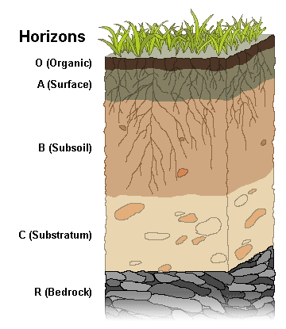
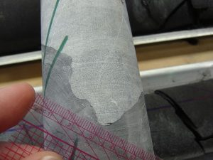
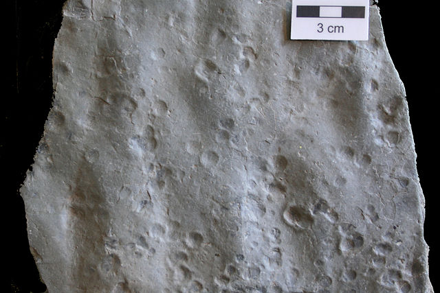
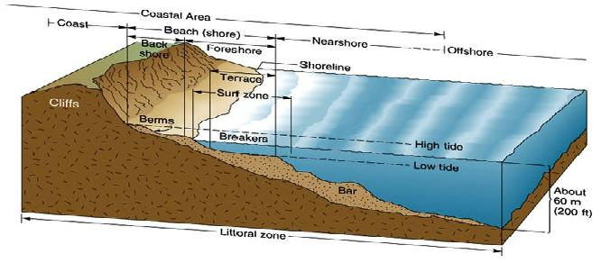
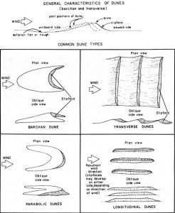

Light illuminates the sedimentary rocks of Notch Peak, in the House Range of western Utah.The House Range contains early Paleozoic marine rocks, highlighted by the Wheeler Formation, home to some of the best Cambrian fossils in Utah. Notch Peak contains one of the largest pure-vertical drops in North America at over 2000 feet.

# 5 Weathering, Erosion, and Sedimentary Rocks

**KEY CONCEPTS**

**By the end of this chapter, students will be able to:**

- Describe how water is an integral part of all sedimentary rock formation
- Explain how chemical and mechanical weathering turn bedrock into sediment
- Differentiate the two main categories of sedimentary rocks : clastic rock formed from pieces of weathered bedrock; and chemical rock that precipitates out of solution by organic or inorganic means
- Explain the importance of sedimentary structures and analysis of depositional environments, and how they provide insight into the Earth’s history

Sedimentary rock and the processes that create it, which include weathering, erosion, and lithification, are an integral part of understanding Earth Science. This is because the majority of the Earth’s surface is made up of sedimentary rocks and their common predecessor, sediments. Even though sedimentary rocks can form in drastically different ways, their origin and creation have one thing in common, water.

## 5.1 The Unique Properties of Water

Water plays a role in the formation of most sedimentary rock. It is one of the main agents involved in creating the minerals in chemical sedimentary rock. It also is a weathering and erosion agent, producing the grains that become detrital sedimentary rock. Several special properties make water an especially unique substance, and integral to the production of sediments and sedimentary rock.

The water molecule consists of two hydrogen atoms covalently bonded to one oxygen atom arranged in a specific and important geometry. The two hydrogen atoms are separated by an angle of about 105 degrees, and both are located to one side of the oxygen atom. This atomic arrangement, with the positively charged hydrogens on one side and negatively charged oxygen on the other side, gives the water molecule a property called **polarity**. Resembling a battery or a magnet, the molecule’s positive-negative architecture leads to a whole suite of unique properties.

Polarity allows water molecules to stick to other substances. This is called **adhesion**. Water is also attracted to itself, a property called **cohesion**, which leads to water’s most common form in the air, a droplet. Cohesion is responsible for creating surface tension, which various insects use to walk on water by distributing their weight across the surface.

The fact that water is attracted to itself leads to another important property, one that is extremely rare in the natural world—the liquid form is denser than the solid form. The polarity of water creates a special type of weak bonding called **hydrogen bonds**. Hydrogen bonds allow the molecules in liquid water to sit close together. Water is densest at 4°C and is less dense above and below that temperature.  As water solidifies into ice, the molecules must move apart in order to fit into the crystal lattice, causing water to expand and become less dense as it freezes. Because of this, ice floats and water at 4oC sinks, which keeps the oceans liquid and prevents them from freezing solid from the bottom up. This unique property of water keeps Earth, the water planet, habitable.

Even more critical for supporting life, water remains liquid over a very large range of temperatures, which is also a result of cohesion. Hydrogen bonding allows liquid water can absorb high amounts of energy before turning into vapor or gas. The wide range across which water remains a liquid, 0°C-100°C (32°F-212°F), is rarely exhibited in other substances. Without this high boiling point, liquid water as we know it would be constricted to narrow temperature zones on Earth, instead water is found from pole to pole. Further, water is the only substance that exists in all three phases, solid, liquid, and gas in Earth’s surface environments.

Water is a **universal solvent**, meaning it dissolves more substances than any other commonly found, naturally occurring liquid. The water molecules use polarity and hydrogen bonds to pry ions away from the crystal lattice. Water is such a powerful solvent, it can dissolve even the strongest rocks and minerals given enough time.

**▶ Did you get it? Click here to find out.**

                            if (window.qmn_quiz_data === undefined) {
                                    window.qmn_quiz_data = new Object();
                            }
                    window.qmn_quiz_data["112"] = {"quiz_id":"112","quiz_name":"05.1-1","disable_answer":0,"ajax_show_correct":0,"progress_bar":"0","contact_info_location":0,"qpages":{"1":{"id":"1","quizID":"64","pagekey":"6qgpbQ2z","hide_prevbtn":"0"}},"skip_validation_time_expire":0,"timer_limit_val":0,"disable_scroll_next_previous_click":0,"disable_scroll_on_result":0,"disable_first_page":"0","enable_result_after_timer_end":0,"enable_quick_result_mc":"1","end_quiz_if_wrong":0,"form_disable_autofill":0,"disable_mathjax":0,"enable_quick_correct_answer_info":"2","quick_result_correct_answer_text":"Correct. You got it.","quick_result_wrong_answer_text":"Oops.","quiz_processing_message":"","quiz_limit_choice":"Limit of choice is reached.","not_allow_after_expired_time":0,"scheduled_time_end":false,"error_messages":{"email_error_text":"Not a valid e-mail address!","number_error_text":"This field must be a number!","incorrect_error_text":"The entered text is not correct!","empty_error_text":"Please complete all required fields!","url_error_text":"The entered URL is not valid!","minlength_error_text":"Required atleast %minlength% characters.","maxlength_error_text":"Maximum %maxlength% characters allowed.","recaptcha_error_text":"ReCaptcha is missing"}}
                    

Which properties of water are NOT due to water being polar? 

					adhesion					

cohesion 

					high boiling point					

					less dense when solid					

					transparency					

					universal solvent					

None

 Time's upCancel
                            if (window.qmn_quiz_data === undefined) {
                                    window.qmn_quiz_data = new Object();
                            }
                    window.qmn_quiz_data["113"] = {"quiz_id":"113","quiz_name":"05.1.2","disable_answer":0,"ajax_show_correct":0,"progress_bar":"0","contact_info_location":0,"qpages":{"1":{"id":"1","quizID":"64","pagekey":"6qgpbQ2z","hide_prevbtn":"0"}},"skip_validation_time_expire":0,"timer_limit_val":0,"disable_scroll_next_previous_click":0,"disable_scroll_on_result":0,"disable_first_page":"0","enable_result_after_timer_end":0,"enable_quick_result_mc":"1","end_quiz_if_wrong":0,"form_disable_autofill":0,"disable_mathjax":0,"enable_quick_correct_answer_info":"2","quick_result_correct_answer_text":"Yes. Polar molecules are dipoles with both a + and - charge at different ends.","quick_result_wrong_answer_text":"Incorrect","quiz_processing_message":"","quiz_limit_choice":"Limit of choice is reached.","not_allow_after_expired_time":0,"scheduled_time_end":false,"error_messages":{"email_error_text":"Not a valid e-mail address!","number_error_text":"This field must be a number!","incorrect_error_text":"The entered text is not correct!","empty_error_text":"Please complete all required fields!","url_error_text":"The entered URL is not valid!","minlength_error_text":"Required atleast %minlength% characters.","maxlength_error_text":"Maximum %maxlength% characters allowed.","recaptcha_error_text":"ReCaptcha is missing"}}
                    

What does “polar” mean, with respect to a water molecule? 

					the molecule is most likely found at the South Pole or North Pole					

					the molecule only exists in very cold environments					

					the molecule has both a positively- and a negatively-charged end					

					the molecule is linear					

					the molecule is purer than normal water					

None

 Time's upCancel
                            if (window.qmn_quiz_data === undefined) {
                                    window.qmn_quiz_data = new Object();
                            }
                    window.qmn_quiz_data["114"] = {"quiz_id":"114","quiz_name":"05.1-3","disable_answer":0,"ajax_show_correct":0,"progress_bar":"0","contact_info_location":0,"qpages":{"1":{"id":"1","quizID":"64","pagekey":"6qgpbQ2z","hide_prevbtn":"0"}},"skip_validation_time_expire":0,"timer_limit_val":0,"disable_scroll_next_previous_click":0,"disable_scroll_on_result":0,"disable_first_page":"0","enable_result_after_timer_end":0,"enable_quick_result_mc":"1","end_quiz_if_wrong":0,"form_disable_autofill":0,"disable_mathjax":0,"enable_quick_correct_answer_info":"2","quick_result_correct_answer_text":"Yes. Cohesion means it sticks to itself.","quick_result_wrong_answer_text":"Incorrect.","quiz_processing_message":"","quiz_limit_choice":"Limit of choice is reached.","not_allow_after_expired_time":0,"scheduled_time_end":false,"error_messages":{"email_error_text":"Not a valid e-mail address!","number_error_text":"This field must be a number!","incorrect_error_text":"The entered text is not correct!","empty_error_text":"Please complete all required fields!","url_error_text":"The entered URL is not valid!","minlength_error_text":"Required atleast %minlength% characters.","maxlength_error_text":"Maximum %maxlength% characters allowed.","recaptcha_error_text":"ReCaptcha is missing"}}
                    

What property of water causes it to make droplets as it rains? 

					density					

					polarity					

hydrogen bonds 

					adhesion					

					cohesion					

None

 Time's upCancel

## 5.2 Weathering and Erosion

**Bedrock** refers to the solid rock that makes up the Earth’s outer crust. Weathering is a process that turns bedrock into smaller particles, called **sediment**. Mechanical weathering includes pressure expansion, frost wedging, root wedging, and salt expansion. Chemical **weathering** includes carbonic acid and hydrolysis, dissolution, and oxidation.

Erosion is a mechanical process, usually driven by water, wind, gravity, or ice, which transports sediment (and soil) from the place of weathering. Liquid water is the main agent of erosion. Gravity and mass wasting processes (see Chapter 10, Mass Wasting) move rocks and sediment to new locations. Gravity and ice, in the form of glaciers (see Chapter 14, Glaciers), move large rock fragments as well as fine sediment.

Erosion resistance is important in the creation of distinctive geological features. This is well-demonstrated in the cliffs of the Grand Canyon. The cliffs are made of rock left standing after less resistant materials have weathered and eroded away. Rocks with different levels of erosion resistance also create the unique-looking features called hoodoos in Bryce Canyon National Park and Goblin Valley State Park in Utah.

### **5.2.1 Mechanical Weathering**

**Mechanical weathering** physically breaks bedrock into smaller pieces.  The usual agents of mechanical weathering are pressure, temperature, freezing/thawing cycle of water, plant or animal activity, and salt evaporation.

#### Pressure Expansion

Bedrock buried deep within the Earth is under high pressure and temperature. When uplift and erosion brings bedrock to the surface, its temperature drops slowly, while its pressure drops immediately. The sudden pressure drop causes the rock to rapidly expand and crack; this is called pressure expansion. Sheeting or **exfoliation** is when the rock surface spalls off in layers. **Spheroidal weathering** is a type of exfoliation that produces rounded features and is caused when chemical weathering moves along joints in the bedrock.

#### Frost Wedging

**Frost wedging**, also called ice wedging, uses the power of expanding ice to break apart rocks. Water works its way into various cracks, voids, and crevices. As the water freezes, it expands with great force, exploiting any weaknesses. When ice melts, the liquid water moves further into the widened spaces. Repeated cycles of freezing and melting eventually pry the rocks apart. The cycles can occur daily when fluctuations of temperature between day and night go from freezing to melting.

#### Root Wedging

Like frost wedging, **root wedging** happens when plant roots work themselves into cracks, prying the bedrock apart as they grow. Occasionally these roots may become fossilized. **Rhizolith** is the term for these roots preserved in the rock record. Tunneling organisms such as earthworms, termites, and ants are biological agents that induce weathering similar to root wedging.

#### Salt Expansion

Salt expansion, which works similarly to frost wedging, occurs in areas of high evaporation or near-marine environments. Evaporation causes salts to precipitate out of solution and grow and expand into cracks in rock. Salt expansion is one of the causes of **tafoni**, a series of holes in a rock. Tafonis, cracks, and holes are weak points that become susceptible to increased weathering. Another phenomena that occurs when salt water evaporates can leave behind a square imprint preserved in a soft sediment, called a **h****opper crystal**.

### **5.2.2 Chemical Weathering**

![Each of these three groups of cubes has an equal volume. However, their surface areas are vastly different. On the left, the single cube has a length, width, and height of 4 units, giving it a surface area of 6(4×4)=96 and a volume of 4^3=64. The middle eight cubes have a length, width, and height of 2, meaning a surface area of 8(6(2×2))=8×24=192. They also have a volume of 8(2^3)=8×8=64. The 64 cubes on the right have a length, width, and height of 1, leading to a surface area of 64(6(1×1))=64×6=384. The volume remains unchanged, because 64(1^3)=64×1=64. The surface area to volume ratio (SA:V), which is related to the amount of material available for reactions, changes for each as well. On the left, it is 96/64=0.75 or 3:2. The center has a SA/V of 192/64=1.5, or 3:1. On the right, the SA:V is 384/64=6, or 6:1.](images/Image7.png)

**Chemical weathering** is the dominate weathering process in warm, humid environments. It happens when water, oxygen, and other reactants chemically degrade the mineral components of bedrock and turn them into water-soluble ions which can then be transported by water. Higher temperatures accelerate chemical weathering rates.

Chemical and mechanical weathering work hand-in-hand via a fundamental concept called surface-area-to-volume ratio. Chemical weathering only occurs on rock surfaces because water and reactants cannot penetrate solid rock. Mechanical weathering penetrates bedrock, breaking large rocks into smaller pieces and creating new rock surfaces. This exposes more surface area to chemical weathering, enhancing its effects. In other words, higher surface-area-to-volume ratios produce higher rates of overall weathering.

#### Carbonic Acid and Hydrolysis

**Carbonic acid** (H2CO3) forms when carbon dioxide, the fifth-most abundant gas in the atmosphere, dissolves in water. This happens naturally in clouds, which is why precipitation is normally slightly acidic. Carbonic acid is an important agent in two chemical weathering reactions, hydrolysis and dissolution.

Hydrolysis occurs via two types of reactions. In one reaction, water molecules ionize into positively charged H+1 and OH−1 ions and replace mineral cations in the crystal lattice. In another type of hydrolysis, carbonic acid molecules react directly with minerals, especially those containing silicon and aluminum (i.e. Feldspars), to form molecules of clay minerals.

Hydrolysis is the main process that breaks down silicate rock and creates clay minerals. The following is a hydrolysis reaction that occurs when silica-rich feldspar encounters carbonic acid to produce water-soluble clay and other ions:

**feldspar** + **carbonic acid** (in water) → clay + metal cations (Fe++, Mg++, Ca++, Na+, etc.) + bicarbonate anions (HCO3-1) + silica (SiO2)

Clay minerals are platy silicates or phyllosilicates (see Chapter 3, Minerals) similar to micas, and are the main components of very fine-grained sediment. The dissolved substances may later precipitate into **chemical sedimentary rocks** like evaporite and limestone, as well as amorphous silica or chert nodules.

#### Dissolution

**Dissolution** is a hydrolysis reaction that dissolves minerals in bedrock and leaves the ions in solution, usually in water. Some evaporites and carbonates, like salt and calcite, are more prone to this reaction; however, all minerals can be dissolved. Non-acidic water, having a neutral pH of 7, will dissolve any mineral, although it may happen very slowly. Water with higher levels of acid, naturally or man-made, dissolves rocks at a higher rate. Liquid water is normally slightly acidic due to the presence of carbonic acid and free H+ ions. Natural rainwater can be highly acidic, with pH levels as low as 2. Dissolution can be enhanced by a biological agent, such as when organisms like lichen and bacteria release organic acids onto the rocks they are attached to. Regions with high humidity (airborne moisture) and precipitation experience more dissolution due to greater contact time between rocks and water.

The **Goldich Dissolution Series** shows chemical weathering rates are associated to crystallization rankings in the Bowen’s Reaction Series (see Chapter 4, Igneous Rock and Volcanic Processes). Minerals at the top of the Bowen series crystallize under high temperatures and pressures, and chemically weather at a faster rate than minerals ranked at the bottom. Quartz, a felsic mineral that crystallizes at 700°C, is very resistant to chemical weathering. High crystallization-point mafic minerals, such as olivine and pyroxene (1,250°C), weather relatively rapidly and more completely. Olivine and pyroxene are rarely found as end products of weathering because they tend to break down into elemental ions.

Dissolution is also noteworthy for the special geological features it creates. In places with abundant carbonate bedrock, dissolution weathering can produce a **karst topography** characterized by sinkholes or caves (see Chapter 10, Mass Wasting).

Timpanogos Cave National Monument in Northern Utah is a well-known dissolution feature. The figure shows a cave formation created from dissolution followed by precipitation—groundwater saturated with calcite seeped into the cavern, where evaporation caused the dissolved minerals to precipitate out.

#### Oxidation

**Oxidation**, the chemical reaction that causes rust in metallic iron, occurs geologically when iron atoms in a mineral bond with oxygen. Any minerals containing iron can be oxidized. The resultant iron oxides may permeate a rock if it is rich in iron minerals. Oxides may also form a coating that covers rocks and grains of sediment, or lines rock cavities and fractures. If the oxides are more susceptible to weathering than the original bedrock, they may create void spaces inside the rock mass or hollows on exposed surfaces.

Three commonly found minerals are produced by iron-oxidation reactions:  red or grey **hematite**, brown **goethite** (pronounced “GUR-tite”), and yellow **limonite**. These iron oxides coat and bind mineral grains together into sedimentary rocks in a process called cementation, and often give these rocks a dominant color. They color the rock layers of the Colorado Plateau, as well as Zion, Arches, and Grand Canyon National Parks. These oxides can permeate a rock that is rich in iron-bearing minerals or can be a coating that forms in cavities or fractures. When the minerals replacing existing minerals in bedrock are resistant to weathering, iron concretions may occur in the rock.  When bedrock is replaced by weaker oxides, this process commonly results in void spaces and weakness throughout the rock mass and often leaves hollows on exposed rock surfaces.

### **5.2.3 Erosion**

**Erosion** is a mechanical process, usually driven by water, gravity, (see Chapter 10), wind, or ice (see Chapter 14) that removes sediment from the place of weathering. Liquid water is the main agent of erosion.

Erosion **resistance** is important in the creation of distinctive geological features. This is well demonstrated in the cliffs of the Grand Canyon. The cliffs are made of rock left standing after less resistant materials have weathered and eroded away. Rocks with different levels erosion resistant also create the unique-looking features called hoodoos in Bryce Canyon National Park and Goblin Valley State Park in Utah.

### **5.2.4. Soil**

**Soil** is a combination of air, water, minerals, and organic matter that forms at the transition between biosphere and geosphere. Soil is made when weathering breaks down bedrock and turns it into sediment.  If erosion does not remove the sediment significantly, organisms can access the mineral content of the sediments.  These organisms turn minerals, water, and atmospheric gases into organic substances that contribute to the soil.

Soil is an important reservoir for organic components necessary for plants, animals, and microorganisms to live. The organic component of soil, called **humus**, is a rich source of bioavailable nitrogen. Nitrogen is the most common element in the atmosphere, but it exists in a form most life forms are unable to use. Special bacteria found only in soil provide most nitrogen compounds that are usable, bioavailable, by life forms.

These nitrogen-fixing bacteria absorb nitrogen from the atmosphere and convert it into nitrogen compounds. These compounds are absorbed by plants and used to make DNA, amino acids, and enzymes. Animals obtain bioavailable nitrogen by eating plants, and this is the source of most of the nitrogen used by life. That nitrogen is an essential component of proteins and DNA. Soils range from poor to rich, depending on the amount of humus they contain. Soil productivity is determined by water and nutrient content. Freshly created volcanic soils, called andisols, and clay-rich soils that hold nutrients and water are examples of productive soils.

The nature of the soil, meaning its characteristics, is determined primarily by five components: 1) the mineralogy of the parent material; 2) topography, 3) weathering, 4) climate, and 5) the organisms that inhabit the soil. For example, soil tends to erode more rapidly on steep slopes so soil layers in these areas may be thinner than in flood plains, where it tends to accumulate. The quantity and chemistry of organic matter of soil affects how much and what varieties of life it can sustain. Temperature and precipitation, two major weathering agents, are dependent on climate. Fungi and bacteria contribute organic matter and the ability of soil to sustain life, interacting with plant roots to exchange nitrogen and other nutrients.

In well-formed soils, there is a discernable arrangement of distinct layers called **soil horizons**. These soil horizons can be seen in road cuts that expose the layers at the edge of the cut. Soil horizons make up the soil profile. Each soil horizon reflects climate, topography, and other soil-development factors, as well as its organic material and mineral sediment composition. The horizons are assigned names and letters. Differences in naming schemes depend on the area, soil type or research topic. The figure shows a simplified soil profile that uses commonly designated names and letters.

**O Horizon**: The top horizon is a thin layer of predominantly organic material, such as leaves, twigs, and other plant parts that are actively decaying into humus.

**A Horizon**: The next layer, called **topsoil**, consists of humus mixed with mineral sediment. As precipitation soaks down through this layer, it leaches out soluble chemicals. In wet climates with heavy precipitation this leaching out produces a separate layer called horizon E, the leaching or eluviation zone.

**B Horizon**: Also called **subsoil**, this layer consists of sediment mixed with humus removed from the upper layers. The subsoil is where mineral sediment is chemically weathered. The amount of organic material and degree of weathering decrease with depth. The upper subsoil zone, called **regolith**, is a porous mixture of humus and highly weathered sediment. In the lower zone, **saprolite**, scant organic material is mixed with largely unaltered parent rock.

**C Horizon**: This is substratum and is a zone of mechanical weathering. Here, bedrock fragments are physically broken but not chemically altered. This layer contains no organic material.

**R Horizon**: The final layer consists of unweathered, parent **bedrock** and fragments.

The United States governing body for agriculture, the USDA, uses a taxonomic classification to identify soil types, called soil orders. Xoxisols or laterite soils are nutrient-poor soils found in tropical regions. While poorly suited for growing crops, xosisols are home to most of the world’s mineable aluminum ore (bauxite). Ardisol forms in dry climates and can develop layers of hardened calcite, called caliche. Andisols originate from volcanic ash deposits. Alfisols contain silicate clay minerals. These two soil orders are productive for farming due to their high content of mineral nutrients. In general, color can be an important factor in understanding soil conditions. Black soils tend to be anoxic, red oxygen-rich, and green oxygen-poor (i.e. reduced). This is true for many sedimentary rocks as well.

Not only is soil essential to terrestrial life in nature, but also human civilization via agriculture. Careless or uninformed human activity can seriously damage soil’s life-supporting properties. A prime example is the famous Dust Bowl disaster of the 1930s, which affected the midwestern United States. The damage occurred because of large-scale attempts develop prairieland in southern Kansas, Colorado, western Texas, and Oklahoma into farmland. Poor understanding of the region’s geology, ecology, and climate led to farming practices that ruined the soil profile.

The prairie soils and native plants are well adapted to a relatively dry climate. With government encouragement, settlers moved in to homestead the region. They plowed vast areas of prairie into long, straight rows and planted grain. The plowing broke up the stable soil profile and destroyed the natural grasses and plants, which had long roots that anchored the soil layers. The grains they planted had shallower root systems and were plowed up every year, which made the soil prone to erosion. The plowed furrows were aligned in straight rows running downhill, which favored erosion and loss of topsoil.

The local climate does not produce sufficient precipitation to support non-native grain crops, so the farmers drilled wells and over-pumped water from the underground aquifers. The grain crops failed due to lack of water, leaving bare soil that was stripped from the ground by the prairie winds. Particles of midwestern prairie soil were deposited along the east coast and as far away as Europe. Huge dust storms called black blizzards made life unbearable, and the once-hopeful homesteaders left in droves. The setting for John Steinbeck’s famous novel and John Ford’s film, *The Grapes of Wrath,* is Oklahoma during this time. The lingering question is whether we have learned the lessons of the dust bowl, to avoid creating it again.

**▶ Did you get it? Click here to find out.**

                            if (window.qmn_quiz_data === undefined) {
                                    window.qmn_quiz_data = new Object();
                            }
                    window.qmn_quiz_data["115"] = {"quiz_id":"115","quiz_name":"05.2-1","disable_answer":0,"ajax_show_correct":0,"progress_bar":"0","contact_info_location":0,"qpages":{"1":{"id":"1","quizID":"64","pagekey":"6qgpbQ2z","hide_prevbtn":"0"}},"skip_validation_time_expire":0,"timer_limit_val":0,"disable_scroll_next_previous_click":0,"disable_scroll_on_result":0,"disable_first_page":"0","enable_result_after_timer_end":0,"enable_quick_result_mc":"1","end_quiz_if_wrong":0,"form_disable_autofill":0,"disable_mathjax":0,"enable_quick_correct_answer_info":"2","quick_result_correct_answer_text":"Correct.","quick_result_wrong_answer_text":"Incorrect.","quiz_processing_message":"","quiz_limit_choice":"Limit of choice is reached.","not_allow_after_expired_time":0,"scheduled_time_end":false,"error_messages":{"email_error_text":"Not a valid e-mail address!","number_error_text":"This field must be a number!","incorrect_error_text":"The entered text is not correct!","empty_error_text":"Please complete all required fields!","url_error_text":"The entered URL is not valid!","minlength_error_text":"Required atleast %minlength% characters.","maxlength_error_text":"Maximum %maxlength% characters allowed.","recaptcha_error_text":"ReCaptcha is missing"}}
                    

Which of the following is NOT a kind of chemical weathering? 

					ice wedging					

dissolution 

					hydrolysis					

					oxidation					

					reaction with carbonic acid					

None

 Time's upCancel
                            if (window.qmn_quiz_data === undefined) {
                                    window.qmn_quiz_data = new Object();
                            }
                    window.qmn_quiz_data["116"] = {"quiz_id":"116","quiz_name":"05.2-2","disable_answer":0,"ajax_show_correct":0,"progress_bar":"0","contact_info_location":0,"qpages":{"1":{"id":"1","quizID":"64","pagekey":"6qgpbQ2z","hide_prevbtn":"0"}},"skip_validation_time_expire":0,"timer_limit_val":0,"disable_scroll_next_previous_click":0,"disable_scroll_on_result":0,"disable_first_page":"0","enable_result_after_timer_end":0,"enable_quick_result_mc":"1","end_quiz_if_wrong":0,"form_disable_autofill":0,"disable_mathjax":0,"enable_quick_correct_answer_info":"2","quick_result_correct_answer_text":"Yes. Mechanical and chemical weathering often work together. One enhances the other.","quick_result_wrong_answer_text":"Incorrect. Rats.","quiz_processing_message":"","quiz_limit_choice":"Limit of choice is reached.","not_allow_after_expired_time":0,"scheduled_time_end":false,"error_messages":{"email_error_text":"Not a valid e-mail address!","number_error_text":"This field must be a number!","incorrect_error_text":"The entered text is not correct!","empty_error_text":"Please complete all required fields!","url_error_text":"The entered URL is not valid!","minlength_error_text":"Required atleast %minlength% characters.","maxlength_error_text":"Maximum %maxlength% characters allowed.","recaptcha_error_text":"ReCaptcha is missing"}}
                    

How do chemical and mechanical weathering work together to create sediment? 

chemical weathering adds speed to mechanical weathering					

mechanical weathering causes chemical weathering to slow down					

					mechanical weathering creates surfaces where chemical weathering may occur					

chemical weathering is the end-product of mechanical weathering in very porous materials					

					chemical weathering creates surfaces where mechanical weathering may occur					

None

 Time's upCancel
                            if (window.qmn_quiz_data === undefined) {
                                    window.qmn_quiz_data = new Object();
                            }
                    window.qmn_quiz_data["117"] = {"quiz_id":"117","quiz_name":"05.2-3","disable_answer":0,"ajax_show_correct":0,"progress_bar":"0","contact_info_location":0,"qpages":{"1":{"id":"1","quizID":"64","pagekey":"6qgpbQ2z","hide_prevbtn":"0"}},"skip_validation_time_expire":0,"timer_limit_val":0,"disable_scroll_next_previous_click":0,"disable_scroll_on_result":0,"disable_first_page":"0","enable_result_after_timer_end":0,"enable_quick_result_mc":"1","end_quiz_if_wrong":0,"form_disable_autofill":0,"disable_mathjax":0,"enable_quick_correct_answer_info":"2","quick_result_correct_answer_text":"Yes.","quick_result_wrong_answer_text":"Incorrect. Try again. There are four correct answers.","quiz_processing_message":"","quiz_limit_choice":"Limit of choice is reached.","not_allow_after_expired_time":0,"scheduled_time_end":false,"error_messages":{"email_error_text":"Not a valid e-mail address!","number_error_text":"This field must be a number!","incorrect_error_text":"The entered text is not correct!","empty_error_text":"Please complete all required fields!","url_error_text":"The entered URL is not valid!","minlength_error_text":"Required atleast %minlength% characters.","maxlength_error_text":"Maximum %maxlength% characters allowed.","recaptcha_error_text":"ReCaptcha is missing"}}
                    

What is NOT a component of healthy soil? 

					weathered rock					

					water					

					eroded rock					

					organic material (humus)					

					air					

None

 Time's upCancel
                            if (window.qmn_quiz_data === undefined) {
                                    window.qmn_quiz_data = new Object();
                            }
                    window.qmn_quiz_data["118"] = {"quiz_id":"118","quiz_name":"05.2.4","disable_answer":0,"ajax_show_correct":0,"progress_bar":"0","contact_info_location":0,"qpages":{"1":{"id":"1","quizID":"64","pagekey":"6qgpbQ2z","hide_prevbtn":"0"}},"skip_validation_time_expire":0,"timer_limit_val":0,"disable_scroll_next_previous_click":0,"disable_scroll_on_result":0,"disable_first_page":"0","enable_result_after_timer_end":0,"enable_quick_result_mc":"1","end_quiz_if_wrong":0,"form_disable_autofill":0,"disable_mathjax":0,"enable_quick_correct_answer_info":"2","quick_result_correct_answer_text":"Yes. Weathering breaks something down into new materials or smaller pieces. Erosion moves the material to a new place.","quick_result_wrong_answer_text":"Incorrect. Try again.","quiz_processing_message":"","quiz_limit_choice":"Limit of choice is reached.","not_allow_after_expired_time":0,"scheduled_time_end":false,"error_messages":{"email_error_text":"Not a valid e-mail address!","number_error_text":"This field must be a number!","incorrect_error_text":"The entered text is not correct!","empty_error_text":"Please complete all required fields!","url_error_text":"The entered URL is not valid!","minlength_error_text":"Required atleast %minlength% characters.","maxlength_error_text":"Maximum %maxlength% characters allowed.","recaptcha_error_text":"ReCaptcha is missing"}}
                    

What is the difference between weathering and erosion? 

Weathering describes how weather (such as rain and temperature) affects the rocks, while erosion is the physical deposition of sediment into a river.					

					Weathering describes the physical removal of sediments from one place to another, while erosion is the chemical breakdown that forms those sediments.					

					Weathering is when oxygen attacks the rock, while erosion is when water freezes in the cracks causing the rocks to break apart into smaller pieces.					

Weathering describes the physical removal of sediments from one place to another, while erosion is the physical breakdown that forms those sediments.					

					Weathering describes how rocks breakdown into smaller pieces, while erosion is the physical removal of those pieces to another location.					

None

 Time's upCancel

## 5.3 Sedimentary rocks

Sedimentary rock is classified into two main categories: clastic and chemical. **Clastic** or** detrital** sedimentary rocks are made from pieces of bedrock, sediment, derived primarily by mechanical weathering. Clastic rocks may also include chemically weathered sediment. Clastic rocks are classified by **grain shape**, **grain size**, and **sorting**. **Chemical** sedimentary rocks are precipitated from water saturated with dissolved minerals. Chemical rocks are classified mainly by composition of minerals in the rock.

### **5.3.1 Lithification and Diagenesis**

**Lithification** turns loose sediment grains, created by weathering and transported by erosion, into clastic sedimentary rock via three interconnected steps. **Deposition** happens when friction and gravity overcome the forces driving sediment transport, allowing sediment to accumulate. **Compaction** occurs when material continues to accumulate on top of the sediment layer, squeezing the grains together and driving out water. The mechanical compaction is aided by weak attractive forces between the smaller grains of sediment. Groundwater typically carries cementing agents into the sediment. These minerals, such as calcite, amorphous silica, or oxides, may have a different composition than the sediment grains. **Cementation** is the process of cementing minerals coating the sediment grains and gluing them together into a fused rock.

**Diagenesis** is an accompanying process to lithification and is a low-temperature form of rock metamorphism (see Chapter 6, Metamorphic Rock). During diagenesis, sediments are chemically altered by heat and pressure. A classic example is aragonite (CaCO3), a form of calcium carbonate that makes up most organic shells. When lithified aragonite undergoes diagenesis, the aragonite reverts to calcite (CaCO3), which has the same chemical formula but a different crystalline structure. In sedimentary rock containing calcite and magnesium (Mg), diagenesis may transform the calcite into dolomite (CaMg(CO3)2). Diagenesis may also reduce the pore space, or open volume, between sedimentary rock grains. The processes of cementation, compaction, and ultimately lithification occur within the realm of diagenesis, which includes the processes that turn organic material into fossils.

### **5.3.2 Detrital Sedimentary Rocks (Clastic)**

**Detrital** or **clastic** sedimentary rocks consist of preexisting sediment pieces that comes from weathered bedrock. Most of this is mechanically weathered sediment, although some clasts may be pieces of chemical rocks. This creates some overlap between the two categories, since clastic sedimentary rocks may include chemical sediments. Detrital or clastic rocks are classified and named based on their grain size.

#### Grain Size

Detrital rock is classified according to sediment **grain size**, which is graded from large to small on the Wentworth scale (see figure). Grain size is the average diameter of sediment fragments in sediment or rock. Grain sizes are delineated using a log base 2 scale. For example, the grain sizes in the pebble class are 2.52, 1.26, 0.63, 0.32, 0.16, and 0.08 inches, which correlate respectively to very coarse, coarse, medium, fine, and very fine granules. Large fragments, or clasts, include all grain sizes larger than 2 mm (5/64 in). These include, boulders, cobbles, granules, and gravel. Sand has a grain size between 2 mm and 0.0625 mm, about the lower limit of the naked eye’s resolution. Sediment grains smaller than sand are called silt. Silt is unique; the grains can be felt with a finger or as grit between your teeth, but are too small to see with the naked eye.

#### Sorting and Rounding

**Sorting** describes the range of grain sizes within sediment or sedimentary rock. Geologists use the term “**well sorted**” to describe a narrow range of grain sizes, and “poorly sorted” for a wide range of grain sizes (see figure). It is important to note that soil engineers use similar terms with opposite definitions; well graded sediment consists of a variety of grain sizes, and poorly graded sediment has roughly the same grain sizes.

When reading the story told by rocks, geologists use sorting to interpret erosion or transport processes, as well as deposition energy. For example, wind-blown sands are typically extremely well sorted, while glacial deposits are typically poorly sorted. These characteristics help identify the type of erosion process that occurred. Coarse-grained sediment and poorly sorted rocks are usually found nearer to the source of sediment, while fine sediments are carried farther away. In a rapidly flowing mountain stream you would expect to see boulders and pebbles. In a lake fed by the stream, there should be sand and silt deposits. If you also find large boulders in the lake, this may indicate the involvement of another sediment transport process, such as rockfall caused by ice- or root-wedging.

**Rounding** is created when angular corners of rock fragments are removed from a piece of sediment due to abrasion during transport. Well-rounded sediment grains are defined as being free of all sharp edges. Very angular sediment retains the sharp corners. Most clast fragments start with some sharp edges due to the bedrock’s crystalline structure, and those points are worn down during transport. More rounded grains imply a longer erosion time or transport distance, or more energetic erosional process. Mineral hardness is also a factor in rounding.

#### Composition and provenance

**Composition** describes the mineral components found in sediment or sedimentary rock and may be influenced by local geology, like source rock and hydrology. Other than clay, most sediment components are easily determined by visual inspection (see Chapter 3, Minerals). The most commonly found sediment mineral is quartz because of its low chemical reactivity and high hardness, making it resistant to weathering, and its ubiquitous occurrence in continental bedrock. Other commonly found sediment grains include feldspar and lithic fragments. Lithic fragments are pieces of fine-grained bedrock, and include mud chips, volcanic clasts, or pieces of slate.

Weathering of volcanic rock produces Hawaii’s famous black (basalt) and green (olivine) sand beaches, which are rare elsewhere on Earth. This is because the local rock is composed almost entirely of basalt and provides an abundant source of dark colored clasts loaded with mafic minerals. According to the Goldich Dissolution Series, clasts high in mafic minerals are more easily destroyed compared to clasts composed of felsic minerals like quartz.

Geologists use **provenance** to discern the original source of sediment or sedimentary rock. Provenance is determined by analyzing mineral composition and types of fossils present, as well as textural features like sorting and rounding. Provenance is important for describing tectonic history, visualizing paleogeographic formations, unraveling an area’s geologic history, or reconstructing past supercontinents.

In quartz sandstone, sometimes called quartz arenite (SiO2), provenance may be determined using a rare, durable clast mineral called zircon (ZrSiO4). Zircon, or zirconium silicate, contains traces of uranium, which can be used for age-dating the source bedrock that contributed sediment to the lithified sandstone rock (see Chapter 7, Geologic Time).

#### Classification of Clastic Rocks

Clastic rocks are classified according to the grain size of their sediment. Coarse-grained rocks contain clasts with a predominant grain size larger than sand. Typically, smaller sediment grains, collectively called groundmass or matrix, fill in much of the volume between the larger clasts, and hold the clasts together. **Conglomerates** are rocks containing coarse rounded clasts, and **breccias** contain angular clasts (see figure). Both conglomerates and breccias are usually poorly sorted.

Medium-grained rocks composed mainly of sand are called **sandstone**, or sometimes **arenite** if well sorted. Sediment grains in sandstone can having a wide variety of mineral compositions, roundness, and sorting. Some sandstone names indicate the rock’s mineral composition. Quartz sandstone contains predominantly quartz sediment grains. **Arkose** is sandstone with significant amounts of feldspar, usually greater than 25%. Sandstone that contains feldspar, which weathers more quickly than quartz, is useful for analyzing the local geologic history. **Greywack**e is a term with conflicting definitions. Greywacke may refer to sandstone with a muddy matrix, or sandstone with many lithic fragments (small rock pieces).

Fine-grained rocks include mudstone, shale, siltstone, and claystone. **Mudstone** is a general term for rocks made of sediment grains smaller than sand (less than 2 mm). Rocks that are **fissile**, meaning they separate into thin sheets, are called shale. Rocks exclusively composed of silt or clay sediment, are called **siltstone** or **claystone**, respectively. These last two rock types are rarer than mudstone or shale.

Rock types found as a mixture between the main classifications, may be named using the less-common component as a descriptor. For example, a rock containing some silt but mostly rounded sand and gravel is called silty conglomerate. Sand-rich rock containing minor amounts of clay is called clayey sandstone.

### **5.3.3. Chemical, Biochemical, and Organic**

Chemical sedimentary rocks are formed by processes that do not directly involve mechanical weathering and erosion. Instead, chemical weathering creates the dissolved materials in water that ultimately may form these rocks. Biochemical and organic sediments are clastic in the sense that they are made from pieces of organic material that is deposited, buried, and lithified; however, they are usually classified as being chemically produced.

Inorganic chemical sedimentary rocks are made of minerals precipitated from ions dissolved in solution, and created without the aid of living organisms. Inorganic chemical sedimentary rocks form in environments where ion concentration, dissolved gasses, temperatures, or pressures are changing, which causes minerals to crystallize.

Biochemical sedimentary rocks are quite simiilar to inorganic sedimentary rocks but are created by living organisms. Most commonly, these kinds of rocks are made of shells and other hard parts of aqueous animals. The organisms extract chemical components from water and use them to create solid mineral material. Common components include aragonite, a mineral similar to and commonly replaced by calcite, and chert (a microcrystalline material similar to quartz).

Organic sedimentary rocks come from organic material that has been deposited and lithified, usually underwater. The source materials are plant and animal remains that are transformed through burial and heat, and end up as coal, some types of limestone, oil shale, or other organic rocks.

#### Inorganic chemical

Inorganic chemical sedimentary rocks are formed when minerals precipitate out of an aqueous solution, usually due to water evaporation. The precipitate minerals typically form various salts known as **evaporites**. For example, the Bonneville Salt Flats in Utah flood with winter rains and dry out every summer, leaving behind salts such as **gypsum** and **halite**. The deposition order of evaporites deposit is opposite to their solubility order, i.e. as water evaporates and increases the mineral concentration in solution, less soluble minerals precipitate out sooner than the highly soluble minerals. The deposition order and saturation percentages are depicted in the table, bearing in mind the process in nature may vary from laboratory derived values.

**Mineral sequence**
**Percent Seawater remaining after evaporation **

Calcite
50

Gypsum/anhydrite
20

Halite
10

Various potassium and magnesium salts
5

*Table after.*

Calcium carbonate-saturated water precipitates porous masses of calcite called **tufa**. Tufa can form near degassing water and in saline lakes. Waterfalls downstream of springs often precipitate tufa as the turbulent water enhances degassing of carbon dioxide, which makes calcite less soluble and causes it to precipitate. Saline lakes concentrate calcium carbonate from a combination of wave action causing degassing, springs in the lakebed, and evaporation. In salty Mono Lake in California, tufa towers were exposed after water was diverted and lowered the lake levels.

Cave deposits like stalactites and stalagmites are another form of chemical precipitation of calcite, in a form called **travertine**. Calcite slowly precipitates from water to form the travertine, which often shows banding. This process is similar to the mineral growth on faucets in your home sink or shower that comes from hard (mineral rich) water. Travertine also forms at hot springs such as Mammoth Hot Spring in Yellowstone National Park.

**Banded iron formation** deposits commonly formed early in Earth’s history, but this type of chemical sedimentary rock is no longer being created. Oxygenation of the atmosphere and oceans caused free iron ions, which are water-soluble, to become oxidized and precipitate out of solution. The iron oxide was deposited, usually in bands alternating with layers of chert.

**Chert**, another commonly found chemical sedimentary rock, is usually produced from silica (SiO2) precipitated from groundwater. Silica is highly insoluble on the surface of Earth, which is why quartz is so resistant to chemical weathering. Water deep underground is subjected to higher pressures and temperatures, which helps dissolve silica into an aqueous solution. As the groundwater rises toward or emerges at the surface the silica precipitates out, often as a cementing agent or into nodules. For example, the bases of the geysers in Yellowstone National Park are surrounded by silica deposits called geyserite or sinter. The silica is dissolved in water that is thermally heated by a relatively deep magma source. Chert can also form biochemically and is discussed in the Biochemical subsection. Chert has many synonyms, some of which may have gem value such as jasper, flint, onyx, and agate, due to subtle differences in colors, striping, etc., but chert is the more general term used by geologists for the entire group.

**Oolites** are among the few limestone forms created by an inorganic chemical process, similar to what happens in evaporite deposition. When water is oversaturated with calcite, the mineral precipitates out around a nucleus, a sand grain or shell fragment, and forms little spheres called ooids (see figure). As evaporation continues, the ooids continue building concentric layers of calcite as they roll around in gentle currents.

#### Biochemical

**Biochemical** sedimentary rocks are not that different from chemical sedimentary rocks; they are also formed from ions dissolved in solution. However, biochemical sedimentary rocks rely on biological processes to extract the dissolved materials out of the water. Most macroscopic marine organisms use dissolved minerals, primarily aragonite (calcium carbonate), to build hard parts such as shells. When organisms die the hard parts settle as sediment, which become buried, compacted and cemented into rock.

This biochemical extraction and secretion is the main process for forming **limestone**, the most commonly occurring, non-clastic sedimentary rock. Limestone is mostly made of calcite (CaCO3) and sometimes includes dolomite (CaMg(CO3)2), a close relative. Solid calcite reacts with hydrochloric acid by **effervescing** or fizzing. Dolomite only reacts to hydrochloric acid when ground into a powder, which can be done by scratching the rock surface (see Chapter 3, Minerals).

Limestone occurs in many forms, most of which originate from biological processes. Entire coral reefs and their ecosystems can be preserved in exquisite detail in limestone rock (see figure). **Fossiliferous limestone** contains many visible fossils. A type of limestone called **coquina** originates from beach sands made predominantly of shells that were then lithified. Coquina is composed of loosely-cemented shells and shell fragments. You can find beaches like this in modern tropical environments, such as the Bahamas.  **Chalk** contains high concentrations of shells from a microorganism called a coccolithophore. **Micrite**, also known as microscopic calcite mud, is a very fine-grained limestone containing microfossils that can only be seen using a microscope.

Biogenetic chert forms on the deep ocean floor, created from biochemical sediment made of microscopic organic shells. This sediment, called ooze, may be calcareous (calcium carbonate based) or siliceous (silica-based) depending on the type of shells deposited. For example, the shells of radiolarians (zooplankton) and diatoms (phytoplankton) are made of silica, so they produce siliceous ooze.

#### Organic

Under the right conditions, intact pieces of organic material or material derived from organic sources, is preserved in the geologic record. Although not derived from sediment, this lithified organic material is associated with sedimentary strata and created by similar processes—burial, compaction, and diagenesis. C Deposits of these fuels develop in areas where organic material collects in large quantities. Lush swamplands can create conditions conducive to coal formation. Shallow-water, organic material-rich marine sediment can become highly productive petroleum and natural gas deposits. See Chapter 16, Energy and Mineral Resources, for a more in-depth look at these fossil-derived energy sources.

#### Classification of Chemical Sedimentary Rocks

In contrast to detrital sediment, chemical, biochemical, and organic sedimentary rocks are classified based on mineral composition. Most of these are monomineralic, composed of a single mineral, so the rock name is usually associated with the identifying mineral. Chemical sedimentary rocks consisting of halite are called rock salt. Rocks made of Limestone (calcite) is an exception, having elaborate subclassifications and even two competing classification methods: Folk Classification and Dunham Classification. The Folk Classification deals with rock grains and usually requires a specialized, petrographic microscope. The Dunham Classification is based on rock texture, which is visible to the naked eye or using a hand lens and is easier for field applications. Most carbonate geologists use the Dunham system.

Sedimentary rock identification chart

**▶ Did you get it? Click here to find out.**

                            if (window.qmn_quiz_data === undefined) {
                                    window.qmn_quiz_data = new Object();
                            }
                    window.qmn_quiz_data["119"] = {"quiz_id":"119","quiz_name":"05.3-1","disable_answer":0,"ajax_show_correct":0,"progress_bar":"0","contact_info_location":0,"qpages":{"1":{"id":"1","quizID":"64","pagekey":"6qgpbQ2z","hide_prevbtn":"0"}},"skip_validation_time_expire":0,"timer_limit_val":0,"disable_scroll_next_previous_click":0,"disable_scroll_on_result":0,"disable_first_page":"0","enable_result_after_timer_end":0,"enable_quick_result_mc":"1","end_quiz_if_wrong":0,"form_disable_autofill":0,"disable_mathjax":0,"enable_quick_correct_answer_info":"2","quick_result_correct_answer_text":"Yes. The smallest grains are referred to as being clay-sized. Silt, sand, and gravel are larger sizes.","quick_result_wrong_answer_text":"Incorrect. Try again.","quiz_processing_message":"","quiz_limit_choice":"Limit of choice is reached.","not_allow_after_expired_time":0,"scheduled_time_end":false,"error_messages":{"email_error_text":"Not a valid e-mail address!","number_error_text":"This field must be a number!","incorrect_error_text":"The entered text is not correct!","empty_error_text":"Please complete all required fields!","url_error_text":"The entered URL is not valid!","minlength_error_text":"Required atleast %minlength% characters.","maxlength_error_text":"Maximum %maxlength% characters allowed.","recaptcha_error_text":"ReCaptcha is missing"}}
                    

Detrital sedimentary rocks are defined and named based mainly on their _______________, while chemical sedimentary rocks are defined mainly on their ____________. 

					composition; grain size					

					roundness; hardness					

					grain size; roundness					

grain size; composition					

composition; roundness					

None

 Time's upCancel
                            if (window.qmn_quiz_data === undefined) {
                                    window.qmn_quiz_data = new Object();
                            }
                    window.qmn_quiz_data["120"] = {"quiz_id":"120","quiz_name":"05.3-2","disable_answer":0,"ajax_show_correct":0,"progress_bar":"0","contact_info_location":0,"qpages":{"1":{"id":"1","quizID":"64","pagekey":"6qgpbQ2z","hide_prevbtn":"0"}},"skip_validation_time_expire":0,"timer_limit_val":0,"disable_scroll_next_previous_click":0,"disable_scroll_on_result":0,"disable_first_page":"0","enable_result_after_timer_end":0,"enable_quick_result_mc":"1","end_quiz_if_wrong":0,"form_disable_autofill":0,"disable_mathjax":0,"enable_quick_correct_answer_info":"2","quick_result_correct_answer_text":"Yes. And shale is the most common kind of sedimentary rock.","quick_result_wrong_answer_text":"Incorrect. Sigh.","quiz_processing_message":"","quiz_limit_choice":"Limit of choice is reached.","not_allow_after_expired_time":0,"scheduled_time_end":false,"error_messages":{"email_error_text":"Not a valid e-mail address!","number_error_text":"This field must be a number!","incorrect_error_text":"The entered text is not correct!","empty_error_text":"Please complete all required fields!","url_error_text":"The entered URL is not valid!","minlength_error_text":"Required atleast %minlength% characters.","maxlength_error_text":"Maximum %maxlength% characters allowed.","recaptcha_error_text":"ReCaptcha is missing"}}
                    

Which sedimentary rock is made of silt and/or clay and splits easily into layers? 

					micrite					

					limestone					

shale 

					sandstone					

mudstone 

None

 Time's upCancel
                            if (window.qmn_quiz_data === undefined) {
                                    window.qmn_quiz_data = new Object();
                            }
                    window.qmn_quiz_data["121"] = {"quiz_id":"121","quiz_name":"05.3-3","disable_answer":0,"ajax_show_correct":0,"progress_bar":"0","contact_info_location":0,"qpages":{"1":{"id":"1","quizID":"64","pagekey":"6qgpbQ2z","hide_prevbtn":"0"}},"skip_validation_time_expire":0,"timer_limit_val":0,"disable_scroll_next_previous_click":0,"disable_scroll_on_result":0,"disable_first_page":"0","enable_result_after_timer_end":0,"enable_quick_result_mc":"1","end_quiz_if_wrong":0,"form_disable_autofill":0,"disable_mathjax":0,"enable_quick_correct_answer_info":"2","quick_result_correct_answer_text":"Yes. More transportation means more rounding.","quick_result_wrong_answer_text":"Try again.","quiz_processing_message":"","quiz_limit_choice":"Limit of choice is reached.","not_allow_after_expired_time":0,"scheduled_time_end":false,"error_messages":{"email_error_text":"Not a valid e-mail address!","number_error_text":"This field must be a number!","incorrect_error_text":"The entered text is not correct!","empty_error_text":"Please complete all required fields!","url_error_text":"The entered URL is not valid!","minlength_error_text":"Required atleast %minlength% characters.","maxlength_error_text":"Maximum %maxlength% characters allowed.","recaptcha_error_text":"ReCaptcha is missing"}}
                    

What is the most likely reason that a sediment may have highly rounded grains? 

					being deposited in an environment that lacks water					

					being transported a long distance					

					original bedrock that is stronger					

					higher temperatures in the environment					

					shorter time since weathering					

None

 Time's upCancel
                            if (window.qmn_quiz_data === undefined) {
                                    window.qmn_quiz_data = new Object();
                            }
                    window.qmn_quiz_data["122"] = {"quiz_id":"122","quiz_name":"05.3-4","disable_answer":0,"ajax_show_correct":0,"progress_bar":"0","contact_info_location":0,"qpages":{"1":{"id":"1","quizID":"64","pagekey":"6qgpbQ2z","hide_prevbtn":"0"}},"skip_validation_time_expire":0,"timer_limit_val":0,"disable_scroll_next_previous_click":0,"disable_scroll_on_result":0,"disable_first_page":"0","enable_result_after_timer_end":0,"enable_quick_result_mc":"1","end_quiz_if_wrong":0,"form_disable_autofill":0,"disable_mathjax":0,"enable_quick_correct_answer_info":"2","quick_result_correct_answer_text":"Yes. A &quot;biochemical rock&quot; is a sedimentary rock formed primarily from the accumulated remains of once-living organisms. Banded iron formation does NOT have an organic origin.","quick_result_wrong_answer_text":"Try again.","quiz_processing_message":"","quiz_limit_choice":"Limit of choice is reached.","not_allow_after_expired_time":0,"scheduled_time_end":false,"error_messages":{"email_error_text":"Not a valid e-mail address!","number_error_text":"This field must be a number!","incorrect_error_text":"The entered text is not correct!","empty_error_text":"Please complete all required fields!","url_error_text":"The entered URL is not valid!","minlength_error_text":"Required atleast %minlength% characters.","maxlength_error_text":"Maximum %maxlength% characters allowed.","recaptcha_error_text":"ReCaptcha is missing"}}
                    

Which of the following id NOT a kind of biochemical sedimentary rock? 

					coquina					

					chalk					

					fossiliferous limestone 

					banded iron formation 

					micrite					

None

 Time's upCancel

## 5.4 Sedimentary Structures

Sedimentary structures are visible textures or arrangements of sediments within a rock. Geologists use these structures to interpret the processes that made the rock and the environment in which it formed. They use uniformitarianism to usually compare sedimentary structures formed in modern environments to lithified counterparts in ancient rocks. Below is a summary discussion of common sedimentary structures that are useful for interpretations in the rock record.

### **5.4.1. Bedding Planes**

The most basic sedimentary structure is **bedding planes**, the planes that separate the layers or strata in sedimentary and some volcanic rocks. Visible in exposed outcroppings, each bedding plane indicates a change in sediment deposition conditions. This change may be subtle. For example, if a section of underlying sediment firms up, this may be enough to create a form a layer that is dissimilar from the overlying sediment. Each layer is called a bed, or stratum, the most basic unit of **stratigraphy**, the study of sedimentary layering.

As would be expected, bed thickness can indicate sediment deposition quantity and timing. Technically, a bed is a bedding plane thicker than 1 cm (0.4 in) and the smallest mappable unit. A layer thinner than 1 cm (0.4 in) is called a **lamina**. **Varves** are bedding planes created when laminae and beds are deposited in repetitive cycles, typically daily or seasonally. Varves are valuable geologic records of climatic histories, especially those found in lakes and glacial deposits.

### **5.4.2. Graded Bedding**

**Graded bedding** refers to a sequence of increasingly coarse- or fine-grained sediment layers. Graded bedding often develops when sediment deposition occurs in an environment of decreasing energy. A **Bouma sequence** is graded bedding observed in clastic rock called turbidite. Bouma sequence beds are formed by offshore sediment gravity flows, which are underwater flows of sediment. These subsea density flows begin when sediment is stirred up by an energetic process and becomes a dense slurry of mixed grains. The sediment flow courses downward through submarine channels and canyons due to gravity acting on the density difference between the denser slurry and less dense surrounding seawater. As the flow reaches deeper ocean basins it slows down, loses energy, and deposits sediment in a Bouma sequence of coarse grains first, followed by increasingly finer grains (see figure).

### 5.4.3. Flow Regime and Bedforms

In fluid systems, such as moving water or wind, sand is the most easily transported and deposited sediment grain. Smaller particles like silt and clay are less movable by fluid systems because the tiny grains are chemically attracted to each other and stick to the underlying sediment. Under higher flow rates, the fine silt and clay sediment tends to stay in place and the larger sand grains get picked up and moved.

**Bedforms** are sedimentary structures created by fluid systems working on sandy sediment. Grain size, flow velocity, and **flow regime** or pattern interact to produce bedforms having unique, identifiable physical characteristics. Flow regimes are divided into upper and lower regimes, which are further divided into uppermost, upper, lower, and lowermost parts. The table below shows bedforms and their associated flow regimes. For example, the dunes bedform is created in the upper part of the lower flow regime.

**Flow Regime (part)**
**Bedform**
**Description**

Lower (lowest)
Plane bed
Lower plane bed, flat laminations

Lower (lower)
Ripples
Small (with respect to flow) inclined layers dipping downflow

Lower (upper)
Dunes
Larger inclined cross beds, ±ripples, dipping downflow

Upper (lower)
Plane bed
Flat layers, can include lined-up grains (parting lineations)

Upper (upper)
Antidunes
Hard to preserve reverse dunes dipping shallowly upflow

Upper (uppermost)
Chutes/pools *(rare)*
Erosional, not really a bedform; rarely found preserved

#### Plane Beds

**Plane beds** created in the lower flow regime are like bedding planes, on a smaller scale. The flat, parallel layers form as sandy sediment piles and move on top of layers below. Even non-flowing fluid systems, such as lakes, can produce sediment plane beds. Plane beds in the upper flow regime are created by fast-flowing fluids. They may look identical to lower-flow-regime beds; however, they typically show **parting lineations**, slight alignments of grains in rows and swaths, caused by high sediment transport rates that only occur in upper flow regimes.

#### Ripples

**Ripples** are known by several names: ripple marks, ripple cross beds, or ripple cross laminations. The ridges or undulations in the bed are created as sediment grains pile up on top of the plane bed. With the exception of dunes, the scale of these beds is typically measured in centimeters. Occasionally, large flows like glacial lake outbursts, can produce ripples as tall as 20 m (66 ft).

First scientifically described by Hertha Ayrton, ripple shapes are determined by flow type and can be straight-crested, sinuous, or complex. Asymmetrical ripples form in a unidirectional flow. Symmetrical ripples are the result of an oscillating back-and-forth flow typical of intertidal swash zones. Climbing ripples are created from high sedimentation rates and appear as overlapping layers of ripple shapes (see figure).

#### Dunes

**Dunes** are very large and prominent versions of ripples, and typical examples of large cross bedding. Cross bedding happens when ripples or dunes pile atop one another, interrupting, and/or cutting into the underlying layers. Desert sand dunes are probably the first image conjured up by this category of bedform.

British geologist Agnold (1941) considered only Barchan and linear Seif dunes as the only true dune forms.  Other workers have recognized transverse and star dunes as well as parabolic and linear dunes anchored by plants that are common in coastal areas as other types of dunes.

Dunes are the most common sedimentary structure found within channelized flows of air or water. The biggest difference between river dunes and air-formed (desert) dunes is the depth of fluid system. Since the atmosphere’s depth is immense when compared to a river channel, desert dunes are much taller than those found in rivers. Some famous air-formed dune landscapes include the Sahara Desert, Death Valley, and the Gobi Desert.

As airflow moves sediment along, the grains accumulate on the dune’s windward surface (facing the wind). The angle of the windward side is typically shallower than the leeward (downwind) side, which has grains falling down over it. This difference in slopes can be seen in a bed cross-section and indicates the direction of the flow in the past. There are typically two styles of dune beds: the more common trough cross beds with curved windward surfaces, and rarer planar cross beds with flat windward surfaces.

In tidal locations with strong in-and-out flows, dunes can develop in opposite directions. This produces a feature called herringbone cross bedding.

Another dune formation variant occurs when very strong, hurricane-strength, winds agitate parts of the usually undisturbed seafloor. These beds are called **hummocky cross stratification** and have a 3D architecture of hills and valleys, with inclined and declined layering that matches the dune shapes.

#### Antidunes

**Antidunes** are so named because they share similar characteristics with dunes, but are formed by a different, opposing process. While dunes form in lower flow regimes, antidunes come from fast-flowing upper flow regimes. In certain conditions of high flow rates, sediment accumulates upstream of a subtle dip instead of traveling downstream (see figure). Antidunes form in phase with the flow; in rivers they are marked by rapids in the current. Antidunes are rarely preserved in the rock record because the high flow rates needed to produce the beds also accelerate erosion.

### **5.4.4. Bioturbation**

**Bioturbation** is the result of organisms burrowing through soft sediment, which disrupts the bedding layers. These tunnels are backfilled and eventually preserved when the sediment becomes rock. Bioturbation happens most commonly in shallow, marine environments, and can be used to indicate water depth.

### **5.4.5. Mudcracks**

**Mudcracks** occur in clay-rich sediment that is submerged underwater and later dries out. Water fills voids in the clay’s crystalline structure, causing the sediment grains to swell. When this waterlogged sediment begins to dry out, the clay grains shrink. The sediment layer forms deep polygonal cracks with tapered openings toward the surface, which can be seen in profile. The cracks fill with new sediment and become visible veins running through the lithified rock. These dried-out clay beds are a major source of **mud chips**, small fragments of mud or shale, which commonly become inclusions in sandstone and conglomerate. What makes this sedimentary structure so important to geologists, is they only form in certain depositional environments—such as tidal flats that form underwater and are later exposed to air. Syneresis cracks are similar in appearance to mudcracks but much rarer; they are formed when subaqueous (underwater) clay sediment shrinks.

### **5.4.6. Sole Marks **

**Sole marks** are small features typically found in river deposits. They form at the base of a bed, the sole, and on top of the underlying bed. They can indicate several things about the deposition conditions, such as flow direction or stratigraphic up-direction (see Geopetal Structures section). **Flute casts** or scour marks are grooves carved out by the forces of fluid flow and sediment loads. The upstream part of the flow creates steep grooves and downstream the grooves are shallower. The grooves subsequently become filled by overlying sediment, creating a cast of the original hollow.

Formed similarly to flute casts but with a more regular and aligned shape, **groove casts** are produced by larger clasts or debris carried along in the water that scrape across the sediment layer. Tool marks come from objects like sticks carried in the fluid downstream or embossed into the sediment layer, leaving a depression that later fills with new sediment.

**Load casts**, an example of **soft-sediment deformation**, are small indentations made by an overlying layer of coarse sediment grains or clasts intruding into a softer, finer-grained sediment layer.

### **5.4.7. Raindrop Impressions**

Like their name implies, **raindrop impressions** are small pits or bumps found in soft sediment. While they are generally believed to be created by rainfall, they may be caused by other agents such as escaping gas bubbles.

### **5.4.8. Imbrication**

**Imbrication** is a stack of large and usually flat clasts—cobbles, gravels, mud chips, etc.—that are aligned in the direction of fluid flow. The clasts may be stacked in rows, with their edges dipping down and flat surfaces aligned to face the flow (see figure). Or their flat surfaces may be parallel to the layer and long axes aligned with flow. Imbrications are useful for analyzing **paleocurrents**, or currents found in the geologic past, especially in alluvial deposits.

### **5.4.9. Geopetal Structures**

**Geopetal structures**, also called up-direction indicators, are used to identify which way was up when the sedimentary rock layers were originally formed. This is especially important in places where the rock layers have been deformed, tilted, or overturned. Well preserved mudcracks, sole marks, and raindrop impressions can be used to determine up direction. Other useful geopetal structures include:

- Vugs: Small voids in the rock that usually become filled during diagenesis. If the void is partially filled or filled in stages, it serves as a permanent record of a level bubble, frozen in time.
- Cross bedding – In places where ripples or dunes pile on top of one another, where one cross bed interrupts and/or cuts another below, this shows a cross-cutting relationship that indicates up direction.
- Ripples, dunes: Sometimes the ripples are preserved well enough to differentiate between the crests (top) and troughs (bottom).
- Fossils: Body fossils in life position, meaning the body parts are not scattered or broken, and trace fossils like footprints (see figure) can provide an up direction. Intact fossilized coral reefs are excellent up indicators because of their large size and easily distinguishable top and bottom. Index fossils, such as ammonites, can be used to age date strata and determine up direction based on relative rock ages.
- Vesicles – Lava flows eliminate gas upwards. An increase of vesicles toward the top of the flow indicates up.

**▶ Did you get it? Click here to find out.**

                            if (window.qmn_quiz_data === undefined) {
                                    window.qmn_quiz_data = new Object();
                            }
                    window.qmn_quiz_data["123"] = {"quiz_id":"123","quiz_name":"05.4.1","disable_answer":0,"ajax_show_correct":0,"progress_bar":"0","contact_info_location":0,"qpages":{"1":{"id":"1","quizID":"64","pagekey":"6qgpbQ2z","hide_prevbtn":"0"}},"skip_validation_time_expire":0,"timer_limit_val":0,"disable_scroll_next_previous_click":0,"disable_scroll_on_result":0,"disable_first_page":"0","enable_result_after_timer_end":0,"enable_quick_result_mc":"1","end_quiz_if_wrong":0,"form_disable_autofill":0,"disable_mathjax":0,"enable_quick_correct_answer_info":"1","quick_result_correct_answer_text":"Correct.","quick_result_wrong_answer_text":"Try again.","quiz_processing_message":"","quiz_limit_choice":"Limit of choice is reached.","not_allow_after_expired_time":0,"scheduled_time_end":false,"error_messages":{"email_error_text":"Not a valid e-mail address!","number_error_text":"This field must be a number!","incorrect_error_text":"The entered text is not correct!","empty_error_text":"Please complete all required fields!","url_error_text":"The entered URL is not valid!","minlength_error_text":"Required atleast %minlength% characters.","maxlength_error_text":"Maximum %maxlength% characters allowed.","recaptcha_error_text":"ReCaptcha is missing"}}
                    

Which of these indicate changing water conditions, from wet to dry? 

mudcracks 

geopetal structures 

					raindrop impressions					

					sole marks					

					ripples					

					soul patches					

None

 Time's upCancel
                            if (window.qmn_quiz_data === undefined) {
                                    window.qmn_quiz_data = new Object();
                            }
                    window.qmn_quiz_data["124"] = {"quiz_id":"124","quiz_name":"05.4.2","disable_answer":0,"ajax_show_correct":0,"progress_bar":"0","contact_info_location":0,"qpages":{"1":{"id":"1","quizID":"64","pagekey":"6qgpbQ2z","hide_prevbtn":"0"}},"skip_validation_time_expire":0,"timer_limit_val":0,"disable_scroll_next_previous_click":0,"disable_scroll_on_result":0,"disable_first_page":"0","enable_result_after_timer_end":0,"enable_quick_result_mc":"1","end_quiz_if_wrong":0,"form_disable_autofill":0,"disable_mathjax":0,"enable_quick_correct_answer_info":"0","quick_result_correct_answer_text":"Correct.","quick_result_wrong_answer_text":"Try again.","quiz_processing_message":"","quiz_limit_choice":"Limit of choice is reached.","not_allow_after_expired_time":0,"scheduled_time_end":false,"error_messages":{"email_error_text":"Not a valid e-mail address!","number_error_text":"This field must be a number!","incorrect_error_text":"The entered text is not correct!","empty_error_text":"Please complete all required fields!","url_error_text":"The entered URL is not valid!","minlength_error_text":"Required atleast %minlength% characters.","maxlength_error_text":"Maximum %maxlength% characters allowed.","recaptcha_error_text":"ReCaptcha is missing"}}
                    

Which of these forms from the slowest speed of flow? 

					ripples					

					upper plane bed 

dunes 

					antidunes					

					chutes and pools					

None

 Time's upCancel
                            if (window.qmn_quiz_data === undefined) {
                                    window.qmn_quiz_data = new Object();
                            }
                    window.qmn_quiz_data["125"] = {"quiz_id":"125","quiz_name":"05.4-3","disable_answer":0,"ajax_show_correct":0,"progress_bar":"0","contact_info_location":0,"qpages":{"1":{"id":"1","quizID":"64","pagekey":"6qgpbQ2z","hide_prevbtn":"0"}},"skip_validation_time_expire":0,"timer_limit_val":0,"disable_scroll_next_previous_click":0,"disable_scroll_on_result":0,"disable_first_page":"0","enable_result_after_timer_end":0,"enable_quick_result_mc":"1","end_quiz_if_wrong":0,"form_disable_autofill":0,"disable_mathjax":0,"enable_quick_correct_answer_info":"2","quick_result_correct_answer_text":"Correct.","quick_result_wrong_answer_text":"Try again.","quiz_processing_message":"","quiz_limit_choice":"Limit of choice is reached.","not_allow_after_expired_time":0,"scheduled_time_end":false,"error_messages":{"email_error_text":"Not a valid e-mail address!","number_error_text":"This field must be a number!","incorrect_error_text":"The entered text is not correct!","empty_error_text":"Please complete all required fields!","url_error_text":"The entered URL is not valid!","minlength_error_text":"Required atleast %minlength% characters.","maxlength_error_text":"Maximum %maxlength% characters allowed.","recaptcha_error_text":"ReCaptcha is missing"}}
                    

Which of these CANNOT tell us about a paleocurrent (the direction water has flowed in the past)? 

					flute cast 

ripple marks 

Bouma sequence 

					imbrication					

					parting lineation 

None

 Time's upCancel

## 5.5 Depositional Environments

The ultimate goal of many stratigraphy studies is to understand the original **depositional environment**. Knowing where and how a particular sedimentary rock was formed can help geologists paint a picture of past environments—such as a mountain glacier, gentle floodplain, dry desert, or deep-sea ocean floor. The study of depositional environments is a complex endeavor; the table shows a simplified version of what to look for in the rock record.

**Location**
**Sediment**
**Common Rock Types**
**Typical Fossils**
**Sedimentary Structures**

Abyssal
very fine muds and oozes, diatomaceous Earth
chert
diatoms
few

Submarine fan
graded Bouma sequences, alternating sand/mud
clastic rocks
rare
channels, fan shape

Continental slope
mud, possible sand, countourites
shale, siltstone, limestone
rare
swaths

Lower shoreface
laminated sand
sandstone
bioturbation
hummocky cross beds

Upper shoreface
planar sand
sandstone
bioturbation
plane beds, cross beds

Littoral (beach)
very well sorted sand
sandstone
bioturbation
few

Tidal Flat
mud and sand with channels
shale, mudstone,siltstone
bioturbation
mudcracks, symmetric ripples

Reef
lime mud with coral
limestone
many, commonly coral
few

Lagoon
laminated mud
shale
many, bioturbation
laminations

Delta
channelized sand with mud, ±swamp
clastic rocks
many to few
cross beds

Fluvial (river)
sand and mud, can have larger sediments
sandstone, conglomerate
bone beds (rare)
cross beds, channels, asymmetric ripples

Alluvial
mud to boulders, poorly sorted
clastic rocks
rare
channels, mud cracks

Lacustrine (lake)
fine-grained laminations
shale
invertebrates, rare (deep) bone beds
laminations

Paludal (swamp)
plant material
coal
plant debris
rare

Aeolian (dunes)
very well sorted sand and silt
sandstone
rare
cross beds (large)

Glacial
mud to boulders, poorly sorted
conglomerate (tillite)

striations, drop stones

### **5.5.1. Marine**

Marine depositional environments are completely and constantly submerged in seawater. Their depositional characteristics are largely dependent on the depth of water with two notable exceptions, submarine fans and turbidites.

#### Abyssal

**Abyssal sedimentary rocks** form on the **abyssal plain**. The plain encompasses relatively flat ocean floor with some minor topographical features, called abyssal hills. These small seafloor mounts range 100 m to 20 km in diameter, and are possibly created by extension. Most abyssal plains do not experience significant fluid movement, so sedimentary rock formed there are very fine grained.

There are three categories of abyssal sediment. Calcareous oozes consist of calcite-rich plankton shells that have fallen to the ocean floor. An example of this type of sediment is chalk. Siliceous oozes are also made of plankton debris, but these organisms build their shells using silica or hydrated silica. In some cases such as with diatomaceous earth, sediment is deposited below the **calcite compensation depth**, a depth where calcite solubility increases. Any calcite-based shells are dissolved, leaving only silica-based shells. Chert is another common rock formed from these types of sediment. These two types of abyssal sediment are also classified as biochemical in origin. (see BIOCHEMICAL section).

The third sediment type is pelagic clay. Very fine-grained clay particles, typically brown or red, descend through the water column very slowly. Pelagic clay deposition occurs in areas of remote open ocean, where there is little plankton accumulation.

Two notable exceptions to the fine-grained nature of abyssal sediment are **submarine fan** and **turbidite** deposits. Submarine fans occur offshore at the base of large river systems. They are initiated during times of low sea level, as strong river currents carve submarine canyons into the continental shelf. When sea levels rise, sediment accumulates on the shelf typically forming large, fan-shaped floodplains called deltas. Periodically, the sediment is disturbed creating dense slurries that flush down the underwater canyons in large gravity-induced events called turbidites. The submarine fan is formed by a network of turbidites that deposit their sediment loads as the slope decreases, much like what happens above-water at alluvial fans and deltas. This sudden flushing transports coarser sediment to the ocean floor where they are otherwise uncommon. Turbidites are also the typical origin of graded Bouma sequences. (see Chapter 5, Weathering, Erosion, and Sedimentary Rock).

#### Continental Slope

**Continental slope** deposits are not common in the rock record. The most notable type of continental slope deposits are contourites. Contourites form on the slope between the continental shelf and deep ocean floor. Deep-water ocean currents deposit sediment into smooth drifts of various architectures, sometimes interwoven with turbidites.

#### Lower shoreface

The **lower shoreface** lies below the normal depth of wave agitation, so the sediment is not subject to daily winnowing and deposition. These sediment layers are typically finely laminated, and may contain hummocky cross-stratification. Lower shoreface beds are affected by larger waves, such those as generated by hurricanes and other large storms.

#### Upper shoreface

The **upper shoreface** contains sediments within the zone of normal wave action, but still submerged below the beach environment. These sediments usually consist of very well sorted, fine sand. The main sedimentary structure is planar bedding consistent with the lower part of the upper flow regime, but it can also contain cross bedding created by longshore currents.

### **5.5.2. Transitional coastline environments**

Transitional environments, more often called shoreline or **coastline environments**, are zones of complex interactions caused by ocean water hitting land. The sediment preservation potential is very high in these environments because deposition often occurs on the **continental shelf** and underwater. Shoreline environments are an important source of hydrocarbon deposits (petroleum, natural gas).

The study of shoreline depositional environments is called **sequence stratigraphy**. Sequence stratigraphy examines depositional changes and 3D architectures associated with rising and falling sea levels, which is the main force at work in shoreline deposits. These sea-level fluctuations come from the daily tides, as well as climate changes and plate tectonics. A steady rise in sea level relative to the shoreline is called **transgression**. **Regression** is the opposite, a relative drop in sea level. Some common components of shoreline environments are littoral zones, tidal flats, reefs, lagoons, and deltas. For a more in-depth look at these environments, see Chapter 12, Coastlines.

#### Littoral

The **littoral** zone, better known as the beach, consists of highly weathered, homogeneous, well-sorted sand grains made mostly of quartz. There are black sand and other types of sand beaches, but they tend to be unique exceptions rather than the rule. Because beach sands, past or present, are so highly evolved, the amount grain weathering can be discerned using the minerals zircon, tourmaline, and rutile. This tool is called the ZTR (zircon, tourmaline, rutile) index. The ZTR index is higher in more weathered beaches, because these relatively rare and weather-resistant minerals become concentrated in older beaches. In some beaches, the ZTR index is so high the sand can be harvested as an economically viable source of these minerals. The beach environment has no sedimentary structures, due to the constant bombardment of wave energy delivered by surf action. Beach sediment is moved around via multiple processes. Some beaches with high sediment supplies develop dunes nearby.

#### Tidal Flats

Tidal flats, or mud flats, are sedimentary environments that are regularly flooded and drained by ocean tides. Tidal flats have large areas of fine-grained sediment but may also contain coarser sands. Tidal flat deposits typically contain gradational sediments and may include multi-directional ripple marks. Mudcracks are also commonly seen due to the sediment being regularly exposed to air during low tides; the combination of mudcracks and ripple marks is distinctive to tidal flats.

Tidal water carries in sediment, sometimes focusing the flow through a narrow opening called a tidal inlet. Tidal channels, creek channels influenced by tides, can also focus tidally-induced flow. Areas of higher flow like inlets and tidal channels feature coarser grain sizes and larger ripples, which in some cases can develop into dunes.

#### Reefs

Reefs, which most people would immediately associate with tropical coral reefs found in the oceans, are not only made by living things. Natural buildups of sand or rock can also create reefs, similar to barrier islands. Geologically speaking, a **reef** is any topographically-elevated feature on the continental shelf, located oceanward of and separate from the beach. The term reef can also be applied to terrestrial (atop the continental crust) features. Capitol Reef National Park in Utah contains a topographic barrier, a reef, called the Waterpocket Fold.

Most reefs, now and in the geologic past, originate from the biological processes of living organisms. The growth habits of coral reefs provide geologists important information about the past. The hard structures in coral reefs are built by soft-bodied marine organisms, which continually add new material and enlarge the reef over time. Under certain conditions, when the land beneath a reef is subsiding, the coral reef may grow around and through existing sediment, holding the sediment in place, and thus preserving the record of environmental and geological condition around it.

Sediment found in coral reefs is typically fine-grained, mostly carbonate, and tends to deposit between the intact coral skeletons. Water with high levels of silt or clay particles can inhibit the reef growth because coral organisms require sunlight to thrive; they host symbiotic algae called zooxanthellae that provide the coral with nourishment via photosynthesis. Inorganic reef structures have much more variable compositions. Reefs have a big impact on sediment deposition in lagoon environments since they are natural storm breaks, wave and storm buffers, which allows fine grains to settle and accumulate.

Reefs are found around shorelines and islands; coral reefs are particularly common in tropical locations. Reefs are also found around features known as **seamounts**, which is the base of an ocean island left standing underwater after the upper part is eroded away by waves. Examples include the Emperor Seamounts, formed millions of years ago over the Hawaiian Hotspot. Reefs live and grow along the upper edge of these flat-topped seamounts. If the reef builds up above sea level and completely encircles the top of the seamount, it is called a coral-ringed atoll. If the reef is submerged, due to erosion, subsidence, or sea level rise, the seamount-reef structure is called a guyot.

#### Lagoon

**Lagoons** are small bodies of seawater located inland from the shore or isolated by another geographic feature, such as a reef or barrier island. Because they are protected from the action of tides, currents, and waves, lagoon environments typically have very fine grained sediments. Lagoons, as well as estuaries, are ecosystems with high biological productivity. Rocks from these environments often includes bioturbation marks or coal deposits. Around lagoons where evaporation exceeds water inflow, salt flats, also known as sabkhas, and sand dune fields may develop at or above the high tide line.

#### Deltas

**Deltas** form where rivers enter lakes or oceans and are of three basic shapes: river-dominated deltas, wave-dominated deltas, and tide-dominated deltas. The name delta comes from the Greek letter Δ (delta, uppercase), which resembles the triangular shape of the Nile River delta. The velocity of water flow is dependent on riverbed slope or gradient, which becomes shallower as the river descends from the mountains. At the point where a river enters an ocean or lake, its slope angle drops to zero degrees (0°). The flow velocity quickly drops as well, and sediment is deposited, from coarse clasts, to fine sand, and mud to form the delta. As one part of the delta becomes overwhelmed by sediment, the slow-moving flow gets diverted back and forth, over and over, and forms a spread out network of smaller distributary channels.

Deltas are organized by the dominant process that controls their shape: tide-dominated, wave-dominated, or river-dominated. Wave-dominated deltas generally have smooth coastlines and beach-ridges on the land that represent previous shorelines. The Nile River delta is a wave-dominated type. (see figure).

The Mississippi River delta is a river-dominated delta. shaped by levees along the river and its distributaries that confine the flow forming a shape called a birdfoot delta. Other times the tides or the waves can be a bigger factor, and can reshape the delta in various ways.

A tide-dominated delta is dominated by tidal currents. During flood stages when rivers have lots of water available, it develops distributaries that are separated by sand bars and sand ridges. The tidal delta of the Ganges River is the largest delta in the world.

### **5.5.3. Terrestrial**

**Terrestrial depositional environments** are diverse. Water is a major factor in these environments, in liquid or frozen states, or even when it is lacking (arid conditions).

#### Fluvial

**Fluvial** (river) systems are formed by water flowing in channels over the land. They generally come in two main varieties: meandering or braided. In meandering streams, the flow carries sediment grains via a single channel that wanders back and forth across the floodplain. The floodplain sediment away from the channel is mostly fine grained material that only gets deposited during floods.

Braided fluvial systems generally contain coarser sediment grains, and form a complicated series of intertwined channels that flow around gravel and sand bars (see Chapter 11, Water).

#### Alluvial

A distinctive characteristic of **alluvial** systems is the intermittent flow of water. Alluvial deposits are common in arid places with little soil development. Lithified alluvial beds are the primary basin-filling rock found throughout the Basin and Range region of the western United States. The most distinctive alluvial sedimentary deposit is the alluvial fan, a large cone of sediment formed by streams flowing out of dry mountain valleys into a wider and more open dry area. Alluvial sediments are typically poorly sorted and coarse grained, and often found near playa lakes or aeolian deposits (see Chapter 13, Deserts).

#### Lacustrine

Lake systems and deposits, called **lacustrine**, form via processes somewhat similar to marine deposits, but on a much smaller scale. Lacustrine deposits are found in lakes in a wide variety of locations. Lake Baikal in southeast Siberia (Russia) is in a tectonic basin. Crater Lake (Oregon) sits in a volcanic caldera. The Great Lakes (northern United States) came from glacially carved and deposited sediment. Ancient Lake Bonneville (Utah) formed in a  pluvial setting that during a climate that was relatively wetter and cooler than that of modern Utah. Oxbow lakes, named for their curved shape, originated in fluvial floodplains. Lacustrine sediment tends to be very fine grained and thinly laminated, with only minor contributions from wind-blown, current, and tidal deposits. When lakes dry out or evaporation outpaces precipitation, playas form. **Playa** deposits resemble those of normal lake deposits but contain more evaporite minerals. Certain tidal flats can have playa-type deposits as well.

#### Paludal

**Paludal** systems include bogs, marshes, swamps, or other wetlands, and usually contain lots of organic matter. Paludal systems typically develop in coastal environments, but are common occur in humid, low-lying, low-latitude, warm zones with large volumes of flowing water. A characteristic paludal deposit is a peat bog, a deposit rich in organic matter that can be converted into coal when lithified. Paludal environments may be associated with tidal, deltaic, lacustrine, and/or fluvial deposition.

#### Aeolian

**Aeolian**, sometimes spelled eolian or œolian, are deposits of windblown sediments. Since wind has a much lower carrying capacity than water, aeolian deposits typically consists of clast sizes from fine dust to sand. Fine silt and clay can cross very long distances, even entire oceans suspended in air.

With sufficient sediment influx, aeolian systems can potentially form large dunes in dry or wet conditions.  The figure shows dune features and various types. British geologist Ralph A. Bagnold (1896-1990) considered only Barchan and linear Seif dunes as the only true dune forms. Other scientists recognize transverse, star, parabolic, and linear dune types. Parabolic and linear dunes grow from sand anchored by plants and are common in coastal areas.

Compacted layers of wind-blown sediment is known as **loess**. Loess commonly starts as finely ground up rock flour created by glaciers. Such deposits cover thousands of square miles in the Midwestern United States. Loess may also form in desert regions (see Chapter 13). Silt for the Loess Plateau in China came from the Gobi Desert in China and Mongolia.

#### Glacial

**Glacial** sedimentation is very diverse, and generally consists of the most poorly-sorted sediment deposits found in nature. The main clast type is called diamictite, which literally means two sizes, referring to the unsorted mix of large and small rock fragments found in glacial deposits. Many glacial tills, glacially derived diamictites, include very finely-pulverized rock flour along with giant erratic boulders. The surfaces of larger clasts typically have striations from the rubbing, scraping, and polishing of surfaces by abrasion during the movement of glacial ice. Glacial systems are so large and produce so much sediment, they frequently create multiple, individualized depositional environments, such as fluvial, deltaic, lacustrine, pluvial, alluvial, and/or aeolian (see Chapter 14, Glaciers).

### 5.5.4. Facies

In addition to mineral composition and lithification process, geologists also classify sedimentary rock by its depositional characteristics, collectively called facies or lithofacies. Sedimentary facies consist of physical, chemical, and/or biological properties, including relative changes in these properties in adjacent beds of the same layer or geological age. Geologists analyze sedimentary rock facies to interpret the original deposition environment, as well as disruptive geological events that may have occurred after the rock layers were established.

It boggles the imagination to think of all the sedimentary deposition environments working next to each other, at the same time, in any particular region on Earth. The resulting sediment beds develop characteristics reflecting contemporaneous conditions at the time of deposition, which later may become preserved into the rock record. For example in the Grand Canyon, rock strata of the same geologic age includes many different depositional environments: beach sand, tidal flat silt, offshore mud, and farther offshore limestone. In other words, each sedimentary or stratigraphic facies presents recognizable characteristics that reflect specific, and different, depositional environments that were present at the same time.

Facies may also reflect depositional changes in the same location over time. During periods of rising sea level, called marine transgression, the shoreline moves inland as seawater covers what was originally dry land and creates new offshore depositional environments. When these sediment beds turn into sedimentary rock, the vertical stratigraphy sequence reveals beach lithofacies buried by offshore lithofacies.

Biological facies are remnants (coal, diatomaceous earth) or evidence (fossils) of living organisms. Index fossils, fossilized life forms specific to a particular environment and/or geologic time period, are an example of biological facies. The horizontal assemblage and vertical distribution of fossils are particularly useful for studying species evolution because transgression, deposition, burial, and compaction processes happen over a considerable geologic time range.

Fossil assemblages that show evolutionary changes greatly enhance our interpretation of Earth’s ancient history by illustrating the correlation between stratigraphic sequence and geologic time scale. During the Middle Cambrian period (see Chapter 7, Geologic Time), regions around the Grand Canyon experienced marine transgression in a southeasterly direction (relative to current maps). This shift of the shoreline is reflected in the Tapeats Sandstone beach facies, Bright Angle Shale near-offshore mud facies, and Muav Limestone far-offshore facies. Marine organisms had plenty of time to evolve and adapt to their slowly changing environment; these changes are reflected in the biological facies, which show older life forms in the western regions of the canyon and younger life forms in the east.

**▶ Did you get it? Click here to find out.**

                            if (window.qmn_quiz_data === undefined) {
                                    window.qmn_quiz_data = new Object();
                            }
                    window.qmn_quiz_data["126"] = {"quiz_id":"126","quiz_name":"05.5-1","disable_answer":0,"ajax_show_correct":0,"progress_bar":"0","contact_info_location":0,"qpages":{"1":{"id":"1","quizID":"64","pagekey":"6qgpbQ2z","hide_prevbtn":"0"}},"skip_validation_time_expire":0,"timer_limit_val":0,"disable_scroll_next_previous_click":0,"disable_scroll_on_result":0,"disable_first_page":"0","enable_result_after_timer_end":0,"enable_quick_result_mc":"1","end_quiz_if_wrong":0,"form_disable_autofill":0,"disable_mathjax":0,"enable_quick_correct_answer_info":"2","quick_result_correct_answer_text":"Correct.","quick_result_wrong_answer_text":"Incorrect.","quiz_processing_message":"","quiz_limit_choice":"Limit of choice is reached.","not_allow_after_expired_time":0,"scheduled_time_end":false,"error_messages":{"email_error_text":"Not a valid e-mail address!","number_error_text":"This field must be a number!","incorrect_error_text":"The entered text is not correct!","empty_error_text":"Please complete all required fields!","url_error_text":"The entered URL is not valid!","minlength_error_text":"Required atleast %minlength% characters.","maxlength_error_text":"Maximum %maxlength% characters allowed.","recaptcha_error_text":"ReCaptcha is missing"}}
                    

A bed with a mix of sandstone and conglomerate sedimentary rocks with ripple marks, cross beds, and/or fresh-water microfossils likely formed in which depositional environment? 

					lower shoreface					

					alluvial					

					lagoonal					

					upper shoreface 

fluvial 

None

 Time's upCancel
                            if (window.qmn_quiz_data === undefined) {
                                    window.qmn_quiz_data = new Object();
                            }
                    window.qmn_quiz_data["127"] = {"quiz_id":"127","quiz_name":"05.5-2","disable_answer":0,"ajax_show_correct":0,"progress_bar":"0","contact_info_location":0,"qpages":{"1":{"id":"1","quizID":"64","pagekey":"6qgpbQ2z","hide_prevbtn":"0"}},"skip_validation_time_expire":0,"timer_limit_val":0,"disable_scroll_next_previous_click":0,"disable_scroll_on_result":0,"disable_first_page":"0","enable_result_after_timer_end":0,"enable_quick_result_mc":"1","end_quiz_if_wrong":0,"form_disable_autofill":0,"disable_mathjax":0,"enable_quick_correct_answer_info":"2","quick_result_correct_answer_text":"Correct.","quick_result_wrong_answer_text":"Incorrect.","quiz_processing_message":"","quiz_limit_choice":"Limit of choice is reached.","not_allow_after_expired_time":0,"scheduled_time_end":false,"error_messages":{"email_error_text":"Not a valid e-mail address!","number_error_text":"This field must be a number!","incorrect_error_text":"The entered text is not correct!","empty_error_text":"Please complete all required fields!","url_error_text":"The entered URL is not valid!","minlength_error_text":"Required atleast %minlength% characters.","maxlength_error_text":"Maximum %maxlength% characters allowed.","recaptcha_error_text":"ReCaptcha is missing"}}
                    

Which of the following depositional environments has the least water? 

lacustrine 

aeolian 

littoral 

shoreface 

					alluvial					

None

 Time's upCancel
                            if (window.qmn_quiz_data === undefined) {
                                    window.qmn_quiz_data = new Object();
                            }
                    window.qmn_quiz_data["128"] = {"quiz_id":"128","quiz_name":"05.5-3","disable_answer":0,"ajax_show_correct":0,"progress_bar":"0","contact_info_location":0,"qpages":{"1":{"id":"1","quizID":"64","pagekey":"6qgpbQ2z","hide_prevbtn":"0"}},"skip_validation_time_expire":0,"timer_limit_val":0,"disable_scroll_next_previous_click":0,"disable_scroll_on_result":0,"disable_first_page":"0","enable_result_after_timer_end":0,"enable_quick_result_mc":"1","end_quiz_if_wrong":0,"form_disable_autofill":0,"disable_mathjax":0,"enable_quick_correct_answer_info":"1","quick_result_correct_answer_text":"Yes. Paludal means marshy.","quick_result_wrong_answer_text":"Incorrect.","quiz_processing_message":"","quiz_limit_choice":"Limit of choice is reached.","not_allow_after_expired_time":0,"scheduled_time_end":false,"error_messages":{"email_error_text":"Not a valid e-mail address!","number_error_text":"This field must be a number!","incorrect_error_text":"The entered text is not correct!","empty_error_text":"Please complete all required fields!","url_error_text":"The entered URL is not valid!","minlength_error_text":"Required atleast %minlength% characters.","maxlength_error_text":"Maximum %maxlength% characters allowed.","recaptcha_error_text":"ReCaptcha is missing"}}
                    

Which of the following depositional environments is most likely to be at the lowest elevation? 

					aeolian					

					paludal					

alluvial 

					fluvial					

glacial 

None

 Time's upCancel
                            if (window.qmn_quiz_data === undefined) {
                                    window.qmn_quiz_data = new Object();
                            }
                    window.qmn_quiz_data["129"] = {"quiz_id":"129","quiz_name":"05.5-4","disable_answer":0,"ajax_show_correct":0,"progress_bar":"0","contact_info_location":0,"qpages":{"1":{"id":"1","quizID":"64","pagekey":"6qgpbQ2z","hide_prevbtn":"0"}},"skip_validation_time_expire":0,"timer_limit_val":0,"disable_scroll_next_previous_click":0,"disable_scroll_on_result":0,"disable_first_page":"0","enable_result_after_timer_end":0,"enable_quick_result_mc":"1","end_quiz_if_wrong":0,"form_disable_autofill":0,"disable_mathjax":0,"enable_quick_correct_answer_info":"2","quick_result_correct_answer_text":"Correct. Deep-water marine!","quick_result_wrong_answer_text":"Incorrect.","quiz_processing_message":"","quiz_limit_choice":"Limit of choice is reached.","not_allow_after_expired_time":0,"scheduled_time_end":false,"error_messages":{"email_error_text":"Not a valid e-mail address!","number_error_text":"This field must be a number!","incorrect_error_text":"The entered text is not correct!","empty_error_text":"Please complete all required fields!","url_error_text":"The entered URL is not valid!","minlength_error_text":"Required atleast %minlength% characters.","maxlength_error_text":"Maximum %maxlength% characters allowed.","recaptcha_error_text":"ReCaptcha is missing"}}
                    

Which of the following depositional environments is most likely to form fine-grained mud? 

					abyssal					

					lacustrine					

					fluvial					

					aeolian					

					glacial					

					lagoonal					

submarine fan 

None

 Time's upCancel

## Summary

Sedimentary rocks are grouped into two main categories: clastic (detrital) and chemical. Clastic (detrital) rocks are made of mineral clasts or sediment that lithifies into solid material. Sediment is produced by the mechanical or chemical weathering of bedrock and transported away from the source via erosion. Sediment that is deposited, buried, compacted, and sometimes cemented becomes clastic rock. Clastic rocks are classified by grain size; for example sandstone is made of sand-sized particles. Chemical sedimentary rocks comes from minerals precipitated out an aqueous solution and is classified according to mineral composition. The chemical sedimentary rock limestone is made of calcium carbonate. Sedimentary structures have textures and shapes that give insight on depositional histories. Depositional environments depend mainly on fluid transport systems and encompass a wide variety of underwater and above ground conditions. Geologists analyze depositional conditions, sedimentary structures, and rock records to interpret the paleogeographic history of a region.
