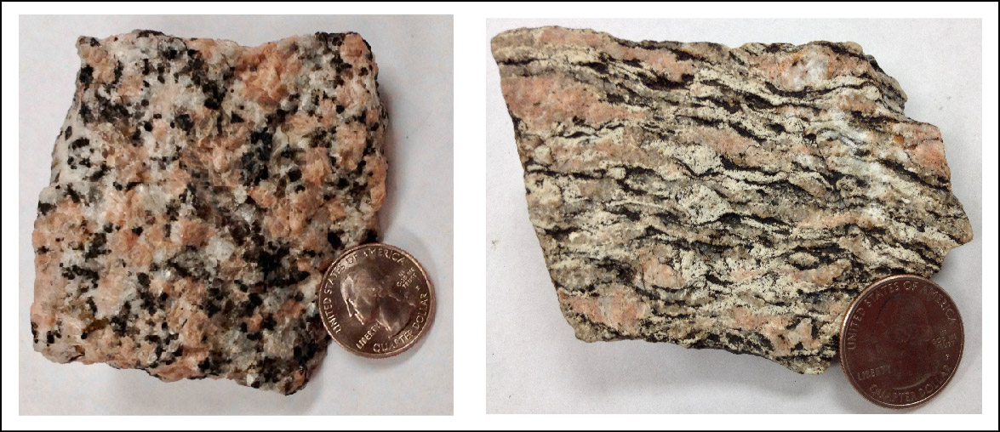
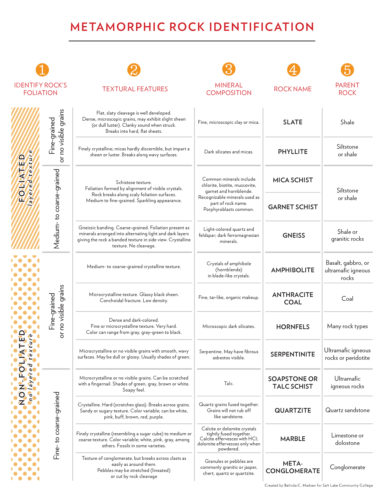
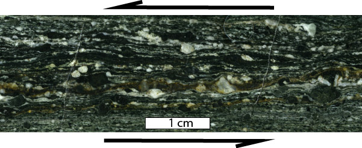

Painted Wall of Black Canyon of the Gunnison National Park, Colorado, made of 1.7 billion-year old gneiss intruded by younger pegmatites.

# 6 Metamorphic Rocks

*Contributing Author: Dr. Peter Davis, Pacific Lutheran University*

**KEY CONCEPTS**

- Describe the temperature and pressure conditions of the metamorphic environment
- Identify and describe the three principal metamorphic agents
- Describe what recrystallization is and how it affects mineral crystals
- Explain what foliation is and how it results from directed pressure and recrystallization
- Explain the relationships among slate, phyllite, schist, and gneiss in terms of metamorphic grade
- Define index mineral
- Explain how metamorphic facies relate to plate tectonic processes
- Describe what a contact aureole is and how contact metamorphism affects surrounding rock
- Describe the role of hydrothermal metamorphism in forming mineral deposits and ore bodies

**Metamorphic rocks**, *meta-* meaning change and –*morphos* meaning form, is one of the three rock categories in the rock cycle (see Chapter 1). Metamorphic rocks are created when heat, pressure, and/or fluids change preexisting rocks.The rock cycle shows that both igneous and sedimentary rocks can become metamorphic rocks. And metamorphic rocks themselves  can be re-metamorphosed. Because metamorphism is caused by plate tectonic processes, metamorphic rocks provide geologists with a history book of how past tectonism shaped our planet.

## 6.1 Metamorphic Processes

Metamorphism occurs when solid rock changes composition and/or texture without mineral crystals melting. It differes from igneous processes, because igneous processes involve melting and metamorphic processes do not. It differs from weathering and other low-tempearture sedimentary processes that may change rocks, but the distinction is not as clear.

Metamorphic source rocks, the rocks that experience the metamorphism, are called the parent rock, or **protolith**, from *proto*– meaning first, and *lithos- *meaning rock. Most metamorphic processes take place deep underground in earth’s crust. During metamorphism, protolith chemistry and mineralogy are changed by temperature changes, a type of pressure called confining pressure, and/or chemically reactive fluids. Rock texture is changed in response to heat, confining pressure, and a type of pressure called directed stress.

### 6.1.1  Temperature (Heat)

Temperature is a measure of the average kinetic energy of particles in a substance. It is closely related to heat, because adding  heat to anything increases the substance’s temperature. Removing heat decreases the temperature. The amount of increase or decrease, however, depends on the substance involved. Het flow and temperature changes affect mineral equilibrium and cation balance in minerals. At high temperatures, there is more heat and energy, so atoms may vibrate so vigorously they jump from one position to another within a crystal, which remains intact. In other words, this atom swapping can happen while the rock is still solid.

The temperatures of metamorphism lie between the temperatures of surficial processes (as in sedimentary rock) and magmatic processes in the rock cycle. Heat-driven metamorphism begins at temperatures as low as 200˚C, and can continue to occur at temperatures as high as 700°C-1,100°C. Temperatures higher than this may melt rocks, and thus, move into the realm of igneous instead of metamorphic process. Temperature increases with increasing depth in the Earth along a geothermal gradient (see Chapter 4) and metamorphic rocks record these depth-related temperature changes.

### 6.1.2 Pressure

Pressure is the force exerted over a unit area on a material. Like heat, pressure can affect the chemical equilibrium of minerals in a rock. There are two kinds of pressure that affect metamorphic rocks: confining pressure or directed stress.

#### **Confining Pressure**

Pressure exerted on rocks under the surface is due to the simple fact that rocks lie on top of one another. When pressure is exerted from rocks above, it is balanced from below and from the sides, and is called **confining,** or **lithostatic pressure**. Confining pressure has equal pressure on all sides (see figure) and is responsible for causing chemical reactions to occur just like heat. These chemical reactions can cause new minerals to form.

Confining pressure is usually measured in bars, or sometimes pascals. Pressure ranges from 1 bar (100,000 pascals) at sea level to around 10,000 bars (1 gigapascal = 1 billion pascals) at the base of the crust. Metamorphic rocks form in the crust, and sometimes as deep as 35 kilometers in the mantle. For most metamorphic rocks, pressures range from a relatively low value to around 50,000 bars (5 gigapascals).

#### **Directed Stress**

**Directed stress**, also called differential or tectonic stress, is an unequal balance of forces on a rock in one or more directions (see previous figure). Directed stresses are generated by the movement of lithospheric plates. **Stress** is a scientific term indicating a force that acts on a rock. **Strain** describes the resultant processes caused by stress and includes metamorphic changes in the minerals. In contrast to confining pressure, directed stress occurs at much lower pressures and does not generate chemical reactions that change mineral composition and atomic structure. Instead, directed stress modifies the parent rock at a mechanical level, changing the arrangement, size, and/or shape of the mineral crystals. These crystalline changes create identifiable textures, such as shown in the figure below comparing the phaneritic texture of igneous granite with the foliated texture of metamorphic gneiss. Both rocks contain the same minerals.

Directed stresses produce rock textures in many ways. Crystals may be rotated, changing their orientation in space. Crystals may get fractured, reducing their grain size. Conversely, they may grow larger as atoms migrate and coalesce. Crystal shapes may also become deformed. These mechanical changes occur via **recrystallization**, which is when minerals dissolve from an area of rock experiencing high stress and precipitate or regrow in a location having lower stress. For example, recrystallization increases grain size much like adjacent soap bubbles coalesce to form larger ones. Recrystallization rearranges mineral crystals without fracturing the rock structure, deforming the rock like silly putty; these changes provide important clues to understanding the creation and movement of deep underground faults.

### 6.1.3 Fluids

A third metamorphic agent is chemically reactive fluids that are expelled by crystallizing magma or created by metamorphic reactions. These reactive fluids are made mostly of water (H2O) and carbon dioxide (CO2), and smaller amounts of dissolved potassium (K), sodium (Na), iron (Fe), magnesium (Mg), calcium (Ca), and aluminum (Al). The fluids react with minerals in the protolith, changing its chemical equilibrium and mineral composition, in a process similar to the reactions driven by heat and pressure. In addition to using elements found in the protolith, chemical reactions during metamorphism may incorporate elements contributed by metamorphic fluids to create new minerals. Water actively participates in chemical reactions and allows extra mobility of elements. We call this style of metamorphism, in which fluids play an important role, **hydrothermal metamorphism**, or **hydrothermal alteration** if the changes are only minor.

Fluid-activated metamorphism is often responsible for creating economically important mineral deposits that are next to igneous intrusions or magma bodies. For example, the mining districts in the Cottonwood Canyons and Mineral Basin of northern Utah produce valuable ores containing argentite (silver sulfide), galena (lead sulfide), and chalcopyrite (copper iron sulfide), as well as the native element gold. These mineral deposits were created from the interaction between a granitic intrusion called the Little Cottonwood Stock and country rock consisting of mostly limestone and dolostone. Hot, circulating fluids expelled by the crystallizing granite reacted with and dissolved the surrounding limestone and dolostone, precipitating out new minerals created by chemical reactions.

In ocean settings, hydrothermal alternation of mafic and ultramafic rocks, including basalt, gabbro, and peridotite, creates the metamorphic rock **serpentinite**. Serpentinites contain the mineral serpentine, as well as  brucite, talc, and several other minerals that form when olivine and pyroxene react with wtaer. We find slivers of serpentinite in places where ocean lithosphere has been lifted up and emplaced on continents. We call these slivers **ophiolites**.

Black smoker hydrothermal vent with a colony of giant (6’+) tube worms.Sometimes hydrothermal alteration removes elements from a parent rock rather than depositing them. This happens, for example, when seawater circulates down through fractures in fresh, still-hot basalt on the ocean floor. The water reacts with the rock, dissolves some elements, and carries them away. The dissolved elements are usually elements like copper, that do not fit snugly in silicate crystal structures. The mineral-laden water emerges from the sea floor via hydrothermal vents called **black smokers**, named after the dark-colored precipitates produced when the hot vent water meets cold seawater. (See Chapter 4, Igneous Rock and Volcanic Processes.) Ancient black smokers in ophiolites were an important source of copper ore for the inhabitants of Cyprus (Cypriots) as early as 4,000 BCE, and later by the Romans.

**▶ Did you get it? Click here to find out.**

                            if (window.qmn_quiz_data === undefined) {
                                    window.qmn_quiz_data = new Object();
                            }
                    window.qmn_quiz_data["131"] = {"quiz_id":"131","quiz_name":"06.1-1","disable_answer":0,"ajax_show_correct":0,"progress_bar":"0","contact_info_location":0,"qpages":{"1":{"id":"1","quizID":"64","pagekey":"6qgpbQ2z","hide_prevbtn":"0"}},"skip_validation_time_expire":0,"timer_limit_val":0,"disable_scroll_next_previous_click":0,"disable_scroll_on_result":0,"disable_first_page":"0","enable_result_after_timer_end":0,"enable_quick_result_mc":"1","end_quiz_if_wrong":0,"form_disable_autofill":0,"disable_mathjax":0,"enable_quick_correct_answer_info":"2","quick_result_correct_answer_text":"Correct. And these three can work together.","quick_result_wrong_answer_text":"Incorrect. Try again.","quiz_processing_message":"","quiz_limit_choice":"Limit of choice is reached.","not_allow_after_expired_time":0,"scheduled_time_end":false,"error_messages":{"email_error_text":"Not a valid e-mail address!","number_error_text":"This field must be a number!","incorrect_error_text":"The entered text is not correct!","empty_error_text":"Please complete all required fields!","url_error_text":"The entered URL is not valid!","minlength_error_text":"Required atleast %minlength% characters.","maxlength_error_text":"Maximum %maxlength% characters allowed.","recaptcha_error_text":"ReCaptcha is missing"}}
                    

06.1-1 What are the three agents of metamorphism? 

					heat, differential pressure, and confining pressure					

					heat, magma, sediments 

					heat, differential pressure, and deep-sea smokers					

					heat, pressure, and chemically reactive fluids					

					heat, differential pressure, and time					

None

 Time's upCancel
                            if (window.qmn_quiz_data === undefined) {
                                    window.qmn_quiz_data = new Object();
                            }
                    window.qmn_quiz_data["132"] = {"quiz_id":"132","quiz_name":"06.1-2","disable_answer":0,"ajax_show_correct":0,"progress_bar":"0","contact_info_location":0,"qpages":{"1":{"id":"1","quizID":"64","pagekey":"6qgpbQ2z","hide_prevbtn":"0"}},"skip_validation_time_expire":0,"timer_limit_val":0,"disable_scroll_next_previous_click":0,"disable_scroll_on_result":0,"disable_first_page":"0","enable_result_after_timer_end":0,"enable_quick_result_mc":"1","end_quiz_if_wrong":0,"form_disable_autofill":0,"disable_mathjax":0,"enable_quick_correct_answer_info":"2","quick_result_correct_answer_text":"Correct. Increased atom vibrations means that atoms are more mobile and reactive, and so can combine to make larger crystals.","quick_result_wrong_answer_text":"Incorrect.","quiz_processing_message":"","quiz_limit_choice":"Limit of choice is reached.","not_allow_after_expired_time":0,"scheduled_time_end":false,"error_messages":{"email_error_text":"Not a valid e-mail address!","number_error_text":"This field must be a number!","incorrect_error_text":"The entered text is not correct!","empty_error_text":"Please complete all required fields!","url_error_text":"The entered URL is not valid!","minlength_error_text":"Required atleast %minlength% characters.","maxlength_error_text":"Maximum %maxlength% characters allowed.","recaptcha_error_text":"ReCaptcha is missing"}}
                    

06.1-2 Heat promotes recrystallization by __________. 

					separating ultramafic elements from mafic ones					

					causing minerals to partially melt					

					stripping away valence electrons					

					increasing atomic vibrations					

					adding catalysts to promote reactions					

None

 Time's upCancel
                            if (window.qmn_quiz_data === undefined) {
                                    window.qmn_quiz_data = new Object();
                            }
                    window.qmn_quiz_data["133"] = {"quiz_id":"133","quiz_name":"06.1-3","disable_answer":0,"ajax_show_correct":0,"progress_bar":"0","contact_info_location":0,"qpages":{"1":{"id":"1","quizID":"64","pagekey":"6qgpbQ2z","hide_prevbtn":"0"}},"skip_validation_time_expire":0,"timer_limit_val":0,"disable_scroll_next_previous_click":0,"disable_scroll_on_result":0,"disable_first_page":"0","enable_result_after_timer_end":0,"enable_quick_result_mc":"1","end_quiz_if_wrong":0,"form_disable_autofill":0,"disable_mathjax":0,"enable_quick_correct_answer_info":"2","quick_result_correct_answer_text":"Correct. Minerals in the protolith react to form new metamorphic minerals.","quick_result_wrong_answer_text":"Incorrect. Oops.","quiz_processing_message":"","quiz_limit_choice":"Limit of choice is reached.","not_allow_after_expired_time":0,"scheduled_time_end":false,"error_messages":{"email_error_text":"Not a valid e-mail address!","number_error_text":"This field must be a number!","incorrect_error_text":"The entered text is not correct!","empty_error_text":"Please complete all required fields!","url_error_text":"The entered URL is not valid!","minlength_error_text":"Required atleast %minlength% characters.","maxlength_error_text":"Maximum %maxlength% characters allowed.","recaptcha_error_text":"ReCaptcha is missing"}}
                    

06.1-3 Chemically reactive fluids react with __________to grow new minerals. 

minerals in the protolith					

					ocean water					

groundwater 

					magmatic water					

					metamorphic heat					

None

 Time's upCancel
                            if (window.qmn_quiz_data === undefined) {
                                    window.qmn_quiz_data = new Object();
                            }
                    window.qmn_quiz_data["134"] = {"quiz_id":"134","quiz_name":"06.1-4","disable_answer":0,"ajax_show_correct":0,"progress_bar":"0","contact_info_location":0,"qpages":{"1":{"id":"1","quizID":"64","pagekey":"6qgpbQ2z","hide_prevbtn":"0"}},"skip_validation_time_expire":0,"timer_limit_val":0,"disable_scroll_next_previous_click":0,"disable_scroll_on_result":0,"disable_first_page":"0","enable_result_after_timer_end":0,"enable_quick_result_mc":"1","end_quiz_if_wrong":0,"form_disable_autofill":0,"disable_mathjax":0,"enable_quick_correct_answer_info":"2","quick_result_correct_answer_text":"Correct. Differential stress, also called directed stress, causes mineral grains to align.","quick_result_wrong_answer_text":"Incorrect. Try again.","quiz_processing_message":"","quiz_limit_choice":"Limit of choice is reached.","not_allow_after_expired_time":0,"scheduled_time_end":false,"error_messages":{"email_error_text":"Not a valid e-mail address!","number_error_text":"This field must be a number!","incorrect_error_text":"The entered text is not correct!","empty_error_text":"Please complete all required fields!","url_error_text":"The entered URL is not valid!","minlength_error_text":"Required atleast %minlength% characters.","maxlength_error_text":"Maximum %maxlength% characters allowed.","recaptcha_error_text":"ReCaptcha is missing"}}
                    

06.1-4 During metamorphism, differential stress on rocks can: 

					cause mineral crystals to grow parallel to the stress					

					cause new minerals to grow randomly in the protolith					

					cause mineral crystals to align parallel to each other					

					cause rocks to partially melt					

					cause rocks to partially erode					

None

 Time's upCancel

## 6.2 Metamorphic textures

Metamorphic texture is the description of the shape and orientation of mineral grains in a metamorphic rock. Metamorphic rock textures, described in the table below, may be foliated, non-foliated, or lineated.

### 6.2.1 Foliation and Lineation

**Foliation** is a term used that describes minerals lined up in planes. Certain minerals, most notably minerals of the mica group, form mostly thin and planar crystals that may becom aligned. Foliated rocks typically appear as if the minerals are stacked like pages of a book, thus the use of the term ‘folia’, meaning like a leaf. Other minerals, with hornblende being a good example, are longer in one direction, linear like a pencil or a needle, rather than a planar-shaped book. These linear objects can also be aligned within a rock, creating **lineations**. Linear crystals, such as hornblende, tourmaline, or stretched quartz grains, can be arranged as part of a foliation, a lineation, or foliation/lineation together. If they lie on a plane with mica, but with no common or preferred direction, this is foliation. If the minerals line up and point in a common direction, but with no planar fabric, this is lineation. When minerals lie on a plane AND point in a common direction; this is both foliation and lineation.

Foliated metamorphic rocks are named based on the nature and style of their foliations. Each rock name has a specific texture that defines and distinguishes it. The most important of these are slate, phyllite, schist and gneiss, described below.

**Slate** is a fine-grained metamorphic rock that exhibits a foliation called **slaty cleavage **that is the flat orientation of the small platy crystals of mica and chlorite forming perpendicular to the direction of stress*. *The minerals in slate are too small to see with the unaided eye. The thin slaty-cleavage layers in slate may resemble sedimentary bedding, but they are a result of directed stress and may lie at angles to the original strata. The second photo below shows an example of a rock with slaty cleavage that also shows a bedding plane. Often, however, original sedimentary layering is partially or completely obscured by the slaty foliation. Thin slabs of slate are often used as a building material for roofs and tiles.

Slate mine in Germany cleavage.Foliation vs. bedding. Foliation is caused by metamorphism. Bedding is a result of sedimentary processes. They do not have to align. (Source: Peter Davis)

**Phyllite **is a foliated metamorphic rock in which platy minerals have grown larger and the surface of the foliation shows a sheen caused by light reflecting from the grains. Some phyllites, like the one seen in the photo here, have a wavy appearance, called crenulations. Individual mineral grains, however, are not visible in phyllites, just the sparkly reflectivity they produce.

**Schists** are metamorphic rocks similar to phyllites, but with larger platy grains, such as micas, that can be seen as individual crystals. **Schistosity** is a textural description of foliation created by the parallel alignment of the visible platy minerals. Foliations in schists are most commonly formed by muscovite, biotite, and sometimes chlorite. Schists commonly contain porphyroblasts of garnet or other minerals. (A **porphyroblast** is a large crystal of a particular mineral surrounded by small grains.) Some schists are named for the minerals they contain. They may, for example, be called mica schists (mostly micas), garnet schists (mica schists containing garnet porphyroblasts), or staurolite schists (mica schists containing staurolite porphyroblasts).

Schist

Garnet staurolite muscovite schist. (Source: Peter Davis)

Gneiss**Gneissic banding **is a type of metamorphic foliation created when visible silicate minerals separate into dark and light bands or layers. A rock with this texture is called a **gneiss**. Gneisses are coarse-grained and commonly deformed by folding, giving them a wavy or folded appearance like the rock seen here. Gneisses form at the highest temperatures of metamorphism, and sometimes may partially melt. The partially melted rock, called a **migmatite** is a transitional between metamorphic and igneous rock.

Migmatites are dark and light banded gneisses that may be swirled or twisted some since some minerals started to melt. Thin accumulations of light colored rock layers are surrounded by darker rock. The layers may be parallel or not, and may cut across gneissic foliation that is present. The lighter-colored layers are interpreted to be the result of the separation of a felsic igneous melt from the adjacent highly metamorphosed darker layers, or to have formed by injection of a felsic melt that came from some distance away. The light-colored layers may contain phenocrysts that crystallized from a melt.

### 6.2.2 Non-foliated

Marble (Source: Peter Davis)

Baraboo Quartzite (Source: Peter Davis)

**Non-foliated** rocks do not have lineations, foliations, or show other alignments of mineral grains. These rocks are typically composed of just one mineral, and usually show evidence of metamorphic recrystallization. Mineral crystals have grown together to form larger crystals, but there is no preferred orientation of mineral grains.

The two most common examples of non-foliated rocks are quartzite and marble. **Quartzite **is a metamorphic rock that forms from protolith sandstone. In quartzites, the quartz grains from the original sandstone are enlarged and interlocked during recrystallization. A defining characteristic for distinguishing quartzite from sandstone is that when broken with a rock hammer, the quartz crystals break across the grains. In a sandstone, only a thin mineral cement holds the grains together, meaning that a broken piece of sandstone will leave the grains intact. Because most sandstones are rich in quartz, and quartz is a mechanically and chemically durable substance, quartzite is very hard and resistant to weathering.

**Marble** is metamorphosed limestone (or dolostone) composed of calcite (or dolomite). Recrystallization typically generates larger interlocking crystals of calcite or dolomite. Marble and quartzite often look similar, but calcite and dolomite are considerably softer than quartz. Another way to distinguish marble from quartzite is with a drop of dilute hydrochloric acid. Marble will effervesce (fizz) if it contains calcite. Most marbles contain some calcite, even if formed by metamorphism of a dolostone.

A third non-foliated rock, **hornfels**, is identified by its dense, fine grained, hard, blocky or splintery texture. Crystals in hornfels are silicate minerals that grow smaller with metamorphism. Hornfels are common around intrusive igneous bodies and are hard to identify because of their fine crystal sizes. The protolith of hornfels can be even harder to distinguish, and can be mudstone, basalt, or any of a number of other rock types.

Macro view of quartzite. Note the interconnectedness of the grains.

Unmetamorphosed, unconsolidated sand grains have space between the grains.

**▶ Did you get it? Click here to find out.**

                            if (window.qmn_quiz_data === undefined) {
                                    window.qmn_quiz_data = new Object();
                            }
                    window.qmn_quiz_data["135"] = {"quiz_id":"135","quiz_name":"06.2-1","disable_answer":0,"ajax_show_correct":0,"progress_bar":"0","contact_info_location":0,"qpages":{"1":{"id":"1","quizID":"64","pagekey":"6qgpbQ2z","hide_prevbtn":"0"}},"skip_validation_time_expire":0,"timer_limit_val":0,"disable_scroll_next_previous_click":0,"disable_scroll_on_result":0,"disable_first_page":"0","enable_result_after_timer_end":0,"enable_quick_result_mc":"1","end_quiz_if_wrong":0,"form_disable_autofill":0,"disable_mathjax":0,"enable_quick_correct_answer_info":"2","quick_result_correct_answer_text":"Correct.","quick_result_wrong_answer_text":"Incorrect. Try again.","quiz_processing_message":"","quiz_limit_choice":"Limit of choice is reached.","not_allow_after_expired_time":0,"scheduled_time_end":false,"error_messages":{"email_error_text":"Not a valid e-mail address!","number_error_text":"This field must be a number!","incorrect_error_text":"The entered text is not correct!","empty_error_text":"Please complete all required fields!","url_error_text":"The entered URL is not valid!","minlength_error_text":"Required atleast %minlength% characters.","maxlength_error_text":"Maximum %maxlength% characters allowed.","recaptcha_error_text":"ReCaptcha is missing"}}
                    

06.2-1 Which metamorphic texture describes minerals oriented flat and parallel to each other so as to make sheets or planes in the rock? 

					nonfoliated					

					lamellar					

lamination 

					lineated					

					foliated					

None

 Time's upCancel
                            if (window.qmn_quiz_data === undefined) {
                                    window.qmn_quiz_data = new Object();
                            }
                    window.qmn_quiz_data["136"] = {"quiz_id":"136","quiz_name":"06.2-2","disable_answer":0,"ajax_show_correct":0,"progress_bar":"0","contact_info_location":0,"qpages":{"1":{"id":"1","quizID":"64","pagekey":"6qgpbQ2z","hide_prevbtn":"0"}},"skip_validation_time_expire":0,"timer_limit_val":0,"disable_scroll_next_previous_click":0,"disable_scroll_on_result":0,"disable_first_page":"0","enable_result_after_timer_end":0,"enable_quick_result_mc":"1","end_quiz_if_wrong":0,"form_disable_autofill":0,"disable_mathjax":0,"enable_quick_correct_answer_info":"2","quick_result_correct_answer_text":"Yes!","quick_result_wrong_answer_text":"Incorrect","quiz_processing_message":"","quiz_limit_choice":"Limit of choice is reached.","not_allow_after_expired_time":0,"scheduled_time_end":false,"error_messages":{"email_error_text":"Not a valid e-mail address!","number_error_text":"This field must be a number!","incorrect_error_text":"The entered text is not correct!","empty_error_text":"Please complete all required fields!","url_error_text":"The entered URL is not valid!","minlength_error_text":"Required atleast %minlength% characters.","maxlength_error_text":"Maximum %maxlength% characters allowed.","recaptcha_error_text":"ReCaptcha is missing"}}
                    

06.2-2 _____________ are characterized by distinct banding of light and dark minerals. 

					schists					

					phyllites					

					gneisses					

					marbles					

					slates					

None

 Time's upCancel
                            if (window.qmn_quiz_data === undefined) {
                                    window.qmn_quiz_data = new Object();
                            }
                    window.qmn_quiz_data["137"] = {"quiz_id":"137","quiz_name":"06.2-3","disable_answer":0,"ajax_show_correct":0,"progress_bar":"0","contact_info_location":0,"qpages":{"1":{"id":"1","quizID":"64","pagekey":"6qgpbQ2z","hide_prevbtn":"0"}},"skip_validation_time_expire":0,"timer_limit_val":0,"disable_scroll_next_previous_click":0,"disable_scroll_on_result":0,"disable_first_page":"0","enable_result_after_timer_end":0,"enable_quick_result_mc":"1","end_quiz_if_wrong":0,"form_disable_autofill":0,"disable_mathjax":0,"enable_quick_correct_answer_info":"2","quick_result_correct_answer_text":"Yes! If clay particles are deposited in layers so a rock has a tendency to split along the bedding planes, the rock is a shale. If shale is compressed so that it develops cleavage planes at right angles to the direction of pressure, it is a slate.","quick_result_wrong_answer_text":"Incorrect","quiz_processing_message":"","quiz_limit_choice":"Limit of choice is reached.","not_allow_after_expired_time":0,"scheduled_time_end":false,"error_messages":{"email_error_text":"Not a valid e-mail address!","number_error_text":"This field must be a number!","incorrect_error_text":"The entered text is not correct!","empty_error_text":"Please complete all required fields!","url_error_text":"The entered URL is not valid!","minlength_error_text":"Required atleast %minlength% characters.","maxlength_error_text":"Maximum %maxlength% characters allowed.","recaptcha_error_text":"ReCaptcha is missing"}}
                    

06.2-3 The protolith of slate is ______. 

shale 

					sandstone					

limestone 

					granite					

gneiss 

None

 Time's upCancel
                            if (window.qmn_quiz_data === undefined) {
                                    window.qmn_quiz_data = new Object();
                            }
                    window.qmn_quiz_data["138"] = {"quiz_id":"138","quiz_name":"06.2-4","disable_answer":0,"ajax_show_correct":0,"progress_bar":"0","contact_info_location":0,"qpages":{"1":{"id":"1","quizID":"64","pagekey":"6qgpbQ2z","hide_prevbtn":"0"}},"skip_validation_time_expire":0,"timer_limit_val":0,"disable_scroll_next_previous_click":0,"disable_scroll_on_result":0,"disable_first_page":"0","enable_result_after_timer_end":0,"enable_quick_result_mc":"1","end_quiz_if_wrong":0,"form_disable_autofill":0,"disable_mathjax":0,"enable_quick_correct_answer_info":"2","quick_result_correct_answer_text":"Yes! Because the quartz grains in quartzites have recrystallized, the rock cannot break between grains.","quick_result_wrong_answer_text":"Incorrect","quiz_processing_message":"","quiz_limit_choice":"Limit of choice is reached.","not_allow_after_expired_time":0,"scheduled_time_end":false,"error_messages":{"email_error_text":"Not a valid e-mail address!","number_error_text":"This field must be a number!","incorrect_error_text":"The entered text is not correct!","empty_error_text":"Please complete all required fields!","url_error_text":"The entered URL is not valid!","minlength_error_text":"Required atleast %minlength% characters.","maxlength_error_text":"Maximum %maxlength% characters allowed.","recaptcha_error_text":"ReCaptcha is missing"}}
                    

06.2-4 How can the metamorphic rock quartzite be distinguished from its protolith sandstone? 

Quartz fizzes when in contact with acid					

Quartzite is always softer					

					Quartz breaks across the sand grains instead of between them					

					Quartzite has a darker color					

					Quartzite is more foliated					

None

 Time's upCancel
                            if (window.qmn_quiz_data === undefined) {
                                    window.qmn_quiz_data = new Object();
                            }
                    window.qmn_quiz_data["139"] = {"quiz_id":"139","quiz_name":"06.2-5","disable_answer":0,"ajax_show_correct":0,"progress_bar":"0","contact_info_location":0,"qpages":{"1":{"id":"1","quizID":"64","pagekey":"6qgpbQ2z","hide_prevbtn":"0"}},"skip_validation_time_expire":0,"timer_limit_val":0,"disable_scroll_next_previous_click":0,"disable_scroll_on_result":0,"disable_first_page":"0","enable_result_after_timer_end":0,"enable_quick_result_mc":"1","end_quiz_if_wrong":0,"form_disable_autofill":0,"disable_mathjax":0,"enable_quick_correct_answer_info":"2","quick_result_correct_answer_text":"Correct.","quick_result_wrong_answer_text":"Incorrect","quiz_processing_message":"","quiz_limit_choice":"Limit of choice is reached.","not_allow_after_expired_time":0,"scheduled_time_end":false,"error_messages":{"email_error_text":"Not a valid e-mail address!","number_error_text":"This field must be a number!","incorrect_error_text":"The entered text is not correct!","empty_error_text":"Please complete all required fields!","url_error_text":"The entered URL is not valid!","minlength_error_text":"Required atleast %minlength% characters.","maxlength_error_text":"Maximum %maxlength% characters allowed.","recaptcha_error_text":"ReCaptcha is missing"}}
                    

06.2-5 Which of these generally contains the largest mica grains? 

					schist					

phyllite 

					shale					

					slate					

					marble					

None

 Time's upCancel

## 6.3 Metamorphic Grade

Garnet schist.Metamorphic grade refers to the range of metamorphic changes a rock may undergo. Grade ranges from low grade (little metamorphic change) to high grade (significant metamorphic change). Low-grade metamorphism begins at temperatures and pressures just above sedimentary rock conditions. Metamorphosed shales, for example, progress from slate→phyllite→schist→gneiss with increasing metamorphic grade.

Geologists use **index minerals** to identify metamorphic grade. Index minerals have various compositions, and different index minerals form under different metamorphic conditions. So, index minerals provide important clues about a rock’s protolith and the metamorphic conditions that created it. Chlorite, muscovite, biotite, garnet, and staurolite are index minerals representing a progressive sequence from low-to-high grade rock when shale is metamorphosed.

The figure below shows a **phase diagram** for three index minerals that have the same chemical formula (Al2SiO5)—sillimanite, kyanite, and andalusite. These minerals are an example of **polymorphism**– meaning different minerals have identical compositions but have different atomic arrangements within them. The different polymorphs are created in response to different pressure and temperature conditions. Kyanite is the densest of the three, and so forms at higher pressure than the others. Andalusite is the least dense, and so forms at lower pressure than the others. Sillimanite forms at pressures between. The different temperature ranges of stability reflect differences of the entropies of the three minerals, but entropy is an arcane topic beyond the scope of this book.

Some metamorphic rocks are named based on the highest grade of index mineral present. For example, chlorite schists contain the low-grade index mineral chlorite. Muscovite schists contain the slightly higher-grade muscovite, indicating a greater degree of metamorphism. Garnet schists contain the high-grade index mineral garnet, indicating the schist has experienced higher pressures and temperatures than chlorite or muscovite schists.

**▶ Did you get it? Click here to find out.**

                            if (window.qmn_quiz_data === undefined) {
                                    window.qmn_quiz_data = new Object();
                            }
                    window.qmn_quiz_data["144"] = {"quiz_id":"144","quiz_name":"06.3-1","disable_answer":0,"ajax_show_correct":0,"progress_bar":"0","contact_info_location":0,"qpages":{"1":{"id":"1","quizID":"64","pagekey":"6qgpbQ2z","hide_prevbtn":"0"}},"skip_validation_time_expire":0,"timer_limit_val":0,"disable_scroll_next_previous_click":0,"disable_scroll_on_result":0,"disable_first_page":"0","enable_result_after_timer_end":0,"enable_quick_result_mc":"1","end_quiz_if_wrong":0,"form_disable_autofill":0,"disable_mathjax":0,"enable_quick_correct_answer_info":"2","quick_result_correct_answer_text":"Correct.","quick_result_wrong_answer_text":"Incorrect","quiz_processing_message":"","quiz_limit_choice":"Limit of choice is reached.","not_allow_after_expired_time":0,"scheduled_time_end":false,"error_messages":{"email_error_text":"Not a valid e-mail address!","number_error_text":"This field must be a number!","incorrect_error_text":"The entered text is not correct!","empty_error_text":"Please complete all required fields!","url_error_text":"The entered URL is not valid!","minlength_error_text":"Required atleast %minlength% characters.","maxlength_error_text":"Maximum %maxlength% characters allowed.","recaptcha_error_text":"ReCaptcha is missing"}}
                    

06.3-1 The metamorphic grade of a rock is _____________. 

					the coarseness or fineness of the grains that it contains					

					variable, depending if the rock is foliated or lineated					

					a measure of the rock composition 

					different if rocks have different colors					

					a general term indicating the degree/extent of metamorphism 

None

 Time's upCancel
                            if (window.qmn_quiz_data === undefined) {
                                    window.qmn_quiz_data = new Object();
                            }
                    window.qmn_quiz_data["146"] = {"quiz_id":"146","quiz_name":"06.3-2","disable_answer":0,"ajax_show_correct":0,"progress_bar":"0","contact_info_location":0,"qpages":{"1":{"id":"1","quizID":"64","pagekey":"6qgpbQ2z","hide_prevbtn":"0"}},"skip_validation_time_expire":0,"timer_limit_val":0,"disable_scroll_next_previous_click":0,"disable_scroll_on_result":0,"disable_first_page":"0","enable_result_after_timer_end":0,"enable_quick_result_mc":"1","end_quiz_if_wrong":0,"form_disable_autofill":0,"disable_mathjax":0,"enable_quick_correct_answer_info":"2","quick_result_correct_answer_text":"Correct. Kyanite is the polymorph that forms at the highest pressures. That means it forms at the greatest depths in Earth.","quick_result_wrong_answer_text":"Incorrect","quiz_processing_message":"","quiz_limit_choice":"Limit of choice is reached.","not_allow_after_expired_time":0,"scheduled_time_end":false,"error_messages":{"email_error_text":"Not a valid e-mail address!","number_error_text":"This field must be a number!","incorrect_error_text":"The entered text is not correct!","empty_error_text":"Please complete all required fields!","url_error_text":"The entered URL is not valid!","minlength_error_text":"Required atleast %minlength% characters.","maxlength_error_text":"Maximum %maxlength% characters allowed.","recaptcha_error_text":"ReCaptcha is missing"}}
                    

06.3-2 Look at the phase diagram for kyanite, andalusite, and sillimanite. In general, which of these three minerals forms at the deepest parts of Earth? 

					kyanite					

					andalusite					

					sillimanite					

None

 Time's upCancel

## 6.4 Metamorphic Environments

Metamorphic rocks form under different pressure-temperature (P-T) conditions. Pressure increases with depth in Earth, and temperature varies depending on tectonic setting, as shown in the diagram below. These P-T conditions can be divided into regions called **facies**. The term facies refers to an objective description of a rock that differentiates it from other rocks. For metamorphic rocks, facies are characterized by different mineral assemblages (groups of minerals found together). The names of the **metamorphic facies** on the pressure-temperature diagram reflect minerals and mineral assemblages that are stable in metamorphosed basalts under different P-T conditions. Thus, mineral assemblages are used to estimate the metamorphic conditions present when the rock formed. This is useful when interpreting metamorphic processes and the history of a metamorphic rock.

In the late 1800s, British geologist George Barrow mapped zones of index minerals in different metamorphic zones of an area in Scotland that underwent regional metamorphism. Barrow outlined a progression of index minerals, named the Barrovian Sequence, that represents increasing metamorphic grade: chlorite (slates and phyllites) -> biotite (phyllites and schists) -> garnet (schists) -> staurolite (schists) -> kyanite (schists) -> sillimanite (schists and gneisses).

The lowest-grades zones of the Barrovian sequence contains minerals that are commonly found in the metamorphic greenschist facies. Greenschist rocks form under relatively low pressure and temperatures and represent the fringes of regional metamorphism. The “green” part of the name is derived from  green minerals like chlorite, epidote, and actinolite; the “schist” part is due to the presence of platy minerals such as muscovite.

Many different metamorphic facies are recognized today, many more than originally described by Barrow and his contemporaries. They are tied to different geologic and tectonic processes and recognizing these facies is the most direct way to interpret the metamorphic history of a rock. Descriptions of the most important kinds of metamorphism and metamorphic facies are given below.

### 6.4.1 Burial Metamorphism

**Burial metamorphism** occurs when rocks are buried at depths of more than 2000 meters (1.24 miles). Burial metamorphism occurs in sedimentary basins, where rocks and sediments are covered by overlying sediments. As an extension of diagenesis, a process that occurs during lithification (Chapter 5), burial metamorphism can cause clay minerals, such as smectite in shales, to change to illite, another clay mineral. Or it can cause sandstone to metamorphose into the quartzite. This is what happened to the Big Cottonwood Formation in the Wasatch Range of Utah. This formation was deposited as ancient near-shore sands in the late Proterozoic (see Chapter 7), deeply buried, and metamorphosed to quartzite. It was folded, and later exposed at the surface in the Wasatch Range today. The temperature and pressure increase with burial produced a low-grade metamorphic rock with a mineral assemblages indicative of the zeolite facies.

### 6.4.2 Contact Metamorphism

**Contact metamorphism** occurs in rocks exposed to elevated temperature at relatively low pressure, as might happen when hot magma intrudes into, or lava flows over, preexisting rock. As with all metamorphic rocks, the parent rock texture and chemistry are major factors in determining the final outcome of a contact metamorphic process, including what minerals may form. During contact metamorphism, fine-grained shale and basalt typically recrystallize to produce hornfels. Sandstones become quartzites, and carbonate rocks (limestone and dolomite) become marbles.

At very shallow depths in Earth, the combination of high temperature and low pressure produces several different kinds of metamorphic rocks, most are variants of the hornfels facies: albite-epidote hornfels, hornblende hornfels, and pyroxene hornfels. At the highest temperatures, rare sanidinite facies rocks may develop. The names of these facies refer to the key minerals in each kind of rock. When contact metamorphism occurs deeper in the Earth, the minerals and rocks produced are similar to those produced by low-pressure regional metamorphism, and sometimes distinguishing contact metamorphism from regional metamorphism is problematic.

Contact aureole around the Alta StockDuring contact metamorphism, zones containing different rocks and mineral assemblages may form around an intrusion, producing a **contact aureole** with regions that experienced high metamorphic temperatures near the intrusion and lower metamorphic temperatures farther away. These differences in metamorphism create concentric bands with contrasting mineralogy. For example, in Little Cottonwood Canyon, Utah, intrusion of a granodiorite (called the Alta Stock) caused a contact aureole to develop in adjacent marble. The marble contains periclase closest to the intrusion, followed by zones of marble that contain forsterite, tremolite, and talc moving farther away.

### 6.4.3 Regional Metamorphism

**Regional metamorphism** occurs when parent rock is subjected to increased temperature and pressure due to burial in Earth. Regional metamorphic terranes can be huge, and regional metamorphic rocks are found in mountain ranges created by converging continental lithospheric plates or on the continent side of subduction zones. These are the settings for Barrovian metamorphism. In many  regional metamorphic terranes, the highest-grade metamorphic rocks are found near the core of a mountain range, where rocks have been uplifted from the greatest depths where they experienced the highest pressure-temperature conditions. Lower grade rocks are found closer to the edges of ranges where uplift has not been as great.

The Appalachian Mountains in New York, Vermont, and New Hampshire provide an excellent example of a regional metamorphic terrane. Drive east from New York through Vermont and into New Hampshire, and you will find metamorphic grade increasing until you get to the center of the Appalachian Mountain Range in New Hampshire.

Shales in New York are unmetamorphosed. In Vermont you will encounter low-grade metamorphic rocks in the west, then higher-grade metamorphic rocks, and eventually in New Hampshire you will find the highest-grade rocks. The metamorphic rocks progress from slate to phyllite, schist, gneiss, and in the highest-grade region there is some migmatite. New Hampshire is nicknamed the Granite State, and granitic plutons can be found associated with the high-grade rocks and migmatites near the center of the mountain range. The reverse sequence is encountered if you continue east. From eastern New Hampshire to the Maine coast, you move away from the core of the Appalachians, and metamorphic grade decreases.

Although regional metamorphic rocks are found in mountain ranges, most are in shield regions. Shields can be found in the centers of every continent. They are places that have been tectonically stable for a very long time, most since the early Precambrian. During the Precambrian, however, they were characterized by huge mountain ranges, comparable in size and height to modern ranges that exist today.

Shields are relatively flat now because billions of years of erosion and, in some cases, glaciation has removed the mountains that were once present. The Canadian Shield north of the Great Lakes is a classic example of a shield (orange and reddish colors in the map above). It extends from just inside the United States northwards. It wraps around Hudson Bay and continues all the way to Baffin Island. Most of the rocks in the Canadian Shield are regional metamorphic rocks. They are the roots of ancient mountains and are associated with igneous rocks that were part of those mountains, and with remnants of ancient ocean floors.

### 6.4.4 Subduction Zone Metamorphism

Subduction zone metamorphism is a type of regional metamorphism that occurs when a slab of oceanic lithosphere subducts beneath continental lithosphere (see Chapter 2). Because rock is a good insulator, the temperature of the descending oceanic slab increases slowly relative to the more rapidly increasing pressure, creating a metamorphic environment of high pressure and low temperature. Glaucophane, which has a distinctive blue-gray color, is an index mineral found in blueschist facies rocks (see metamorphic facies diagram).

The California Coast Range, from near Santa Barbara north to Oregon, contains blueschist-facies rocks created by subduction-zone metamorphism. It also contains some eclogites, garnet-pyroxene rocks that form at slightly higher temperatures and pressures than blueschists. Besides blueschists and eclogites, the Coast Range contains many different kinds of unmetamorphosed sedimentary rocks.

### 6.4.5 Fault Metamorphism

There are several different kinds of metamorphic rocks that may be created by faults. At shallow depths in Earth, rocks are brittle. They may be involved in repeated brittle faulting that creates a material called *rock flour,* which is rock ground up to the particle size of the flour we use to make food. At greater depths, faulting create **cataclastites**, chaotically-crushed mixes of rock material with little internal texture. At depths below cataclasites, where rocks becomes ductile (because they are warm), mylonites are formed. **Mylonites** are metamorphic rocks created by dynamic recrystallization caused by directed shear forces. During mylonitization, mineral grains are commonly ground and become smaller. Sometimes grains are squeezed so much in one direction that they become long and stretched out. When larger, stronger crystals (like feldspar, quartz, garnet) embedded in a metamorphic matrix are sheared into an asymmetrical eye-shaped crystal, an **augen **is formed. “Augen” means eye in German. The photo below shows some good examples.

### 6.4.6 Shock Metamorphism

Shock lamellae in a quartz grain.**Shock** **metamorphism** , also called** impact metamorphism**, is metamorphism that most commonly occurs when a meteorite or related body impacts Earth. Shock metamorphism is the result of very high pressures (and high, but less extreme temperatures) delivered rapidly.  This kind of metamorphism produces planar deformation features called *shock laminae*, which are narrow planes of glassy material with distinct orientations found in silicate mineral grains. Shocked quartz often displays planar deformation features (see photo).

Shatter cone.Shock metamorphism also produces shatter cones, cone-shaped pieces of rock such as the one shown here. These cones are similar to the ones you get when a stone or pebble hits the windshield of your car. Meteorite impact shatter cones may be microscopic or several meters across. Fine-grained rocks with shatter cones show a distinctive horsetail pattern. The photo shows an example.

Shock metamorphism can produce index minerals, though they are typically microscopic. The metamorphism may also sometimes changes quartz into its polymorphs coesite or stishovite. As discussed in Chapter 3, polymorphs are minerals with the same composition but different crystal structures. Intense pressure (> 10 GPa) and moderate to high temperatures (700-1200 °C) are required to form coesite or stishovite.

TektitesShock metamorphism can also produce glass. **Tektites** are gravel-size glass grains ejected during an meteorite impact event. They resemble volcanic glass but, unlike volcanic glass, tektites contain no water or phenocrysts, and have a different bulk and isotopic chemistry. Tektites contain partially melted inclusions of shocked mineral grains. Tektites and other glasses that are not derived from volcanoes are described with the general term *pseudotachylytes.* The term pseudo in this context means ‘false’ or ‘in the appearance of’, a volcanic rock called tachylite because the material observed looks like a volcanic rock, but is not produced by a volcano.  Trinitite (which is a melt glass produced by thermonuclear detonations), and fulgurites (which are produced by lightning strikes, and some glasses created by faulting, are other examples of pseudotachylytes.

**▶ Did you get it? Click here to find out.**

                            if (window.qmn_quiz_data === undefined) {
                                    window.qmn_quiz_data = new Object();
                            }
                    window.qmn_quiz_data["140"] = {"quiz_id":"140","quiz_name":"06.4-1","disable_answer":0,"ajax_show_correct":0,"progress_bar":"0","contact_info_location":0,"qpages":{"1":{"id":"1","quizID":"64","pagekey":"6qgpbQ2z","hide_prevbtn":"0"}},"skip_validation_time_expire":0,"timer_limit_val":0,"disable_scroll_next_previous_click":0,"disable_scroll_on_result":0,"disable_first_page":"0","enable_result_after_timer_end":0,"enable_quick_result_mc":"1","end_quiz_if_wrong":0,"form_disable_autofill":0,"disable_mathjax":0,"enable_quick_correct_answer_info":"2","quick_result_correct_answer_text":"Correct. And eclogite-facies rocks, too, are sometimes associated with subduction zones.","quick_result_wrong_answer_text":"Incorrect","quiz_processing_message":"","quiz_limit_choice":"Limit of choice is reached.","not_allow_after_expired_time":0,"scheduled_time_end":false,"error_messages":{"email_error_text":"Not a valid e-mail address!","number_error_text":"This field must be a number!","incorrect_error_text":"The entered text is not correct!","empty_error_text":"Please complete all required fields!","url_error_text":"The entered URL is not valid!","minlength_error_text":"Required atleast %minlength% characters.","maxlength_error_text":"Maximum %maxlength% characters allowed.","recaptcha_error_text":"ReCaptcha is missing"}}
                    

06.4-1 Metamorphic facies are characterized by assemblages (groups) of index minerals. Which metamorphic facies is associated with subduction zones? 

					greenschist					

					epidote					

blueschist 

					amphibolite					

					granulite					

None

 Time's upCancel
                            if (window.qmn_quiz_data === undefined) {
                                    window.qmn_quiz_data = new Object();
                            }
                    window.qmn_quiz_data["141"] = {"quiz_id":"141","quiz_name":"06.4-2","disable_answer":0,"ajax_show_correct":0,"progress_bar":"0","contact_info_location":0,"qpages":{"1":{"id":"1","quizID":"64","pagekey":"6qgpbQ2z","hide_prevbtn":"0"}},"skip_validation_time_expire":0,"timer_limit_val":0,"disable_scroll_next_previous_click":0,"disable_scroll_on_result":0,"disable_first_page":"0","enable_result_after_timer_end":0,"enable_quick_result_mc":"1","end_quiz_if_wrong":0,"form_disable_autofill":0,"disable_mathjax":0,"enable_quick_correct_answer_info":"2","quick_result_correct_answer_text":"Correct. Contact metamorphism becuase hot magma comes in contact with surrounding country rock.","quick_result_wrong_answer_text":"Incorrect","quiz_processing_message":"","quiz_limit_choice":"Limit of choice is reached.","not_allow_after_expired_time":0,"scheduled_time_end":false,"error_messages":{"email_error_text":"Not a valid e-mail address!","number_error_text":"This field must be a number!","incorrect_error_text":"The entered text is not correct!","empty_error_text":"Please complete all required fields!","url_error_text":"The entered URL is not valid!","minlength_error_text":"Required atleast %minlength% characters.","maxlength_error_text":"Maximum %maxlength% characters allowed.","recaptcha_error_text":"ReCaptcha is missing"}}
                    

06.4-2 When magma intrudes pre-existing country rock, the rock will be cooked by the magma. This metamorphic process is called _____. 

					fault metamorphism					

burial metamorphism 

contact metamorphism 

regional metamorphism 

					shock metamorphism					

None

 Time's upCancel
                            if (window.qmn_quiz_data === undefined) {
                                    window.qmn_quiz_data = new Object();
                            }
                    window.qmn_quiz_data["142"] = {"quiz_id":"142","quiz_name":"06.4-3","disable_answer":0,"ajax_show_correct":0,"progress_bar":"0","contact_info_location":0,"qpages":{"1":{"id":"1","quizID":"64","pagekey":"6qgpbQ2z","hide_prevbtn":"0"}},"skip_validation_time_expire":0,"timer_limit_val":0,"disable_scroll_next_previous_click":0,"disable_scroll_on_result":0,"disable_first_page":"0","enable_result_after_timer_end":0,"enable_quick_result_mc":"1","end_quiz_if_wrong":0,"form_disable_autofill":0,"disable_mathjax":0,"enable_quick_correct_answer_info":"2","quick_result_correct_answer_text":"Correct. High-grade rocks are found in the centers of mountain ranges because that is where the most uplift occurred. Uplift and erosion expose rocks that formed at high pressure and temperature deep in earth.","quick_result_wrong_answer_text":"Incorrect","quiz_processing_message":"","quiz_limit_choice":"Limit of choice is reached.","not_allow_after_expired_time":0,"scheduled_time_end":false,"error_messages":{"email_error_text":"Not a valid e-mail address!","number_error_text":"This field must be a number!","incorrect_error_text":"The entered text is not correct!","empty_error_text":"Please complete all required fields!","url_error_text":"The entered URL is not valid!","minlength_error_text":"Required atleast %minlength% characters.","maxlength_error_text":"Maximum %maxlength% characters allowed.","recaptcha_error_text":"ReCaptcha is missing"}}
                    

06.4-3 Rocks in the core of a mountain range that formed during regional metamorphism are most likely to be _____ rocks. 

					blueschist facies					

					zeolite facies rocks					

					low-grade					

					moderate-grade					

					high-grade					

None

 Time's upCancel

blank line
blank line

## Summary

Metamorphism is the process that changes existing rocks (called protoliths) into new rocks with new minerals and new textures. Increases in temperature and pressure are the main causes of metamorphism, sometimes with fluids that increase the mobilization of materials. The primary way metamorphic rocks are identified is with texture. Foliated textures come from platy minerals forming planes in a rock, while non-foliated metamorphic rocks have no internal fabric. Grade describes the amount of metamorphism in a rock, and facies are a set of minerals that can help guide an observer to an interpretation of the metamorphic history of a rock. Different tectonic or geologic environments cause metamorphism, including collisions, subduction, faulting, and even impacts from space.
