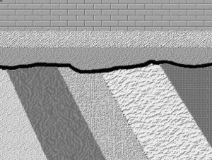

Perhaps no place on Earth better exemplifies the principles geologists use to determine the ages of rocks than Arizona’s Grand Canyon National Park.**KEY CONCEPTS**

- Explain the difference between relative time and numeric time
- Describe the five principles of stratigraphy
- Apply relative dating principles to a block diagram and interpret the sequence of geologic events
- Define an isotope, and explain alpha decay, beta decay, and electron capture as mechanisms of radioactive decay
- Describe how radioisotopic dating is accomplished and list the four key isotopes used
- Explain how carbon-14 forms in the atmosphere and how it is used in dating recent events
- Explain how scientists know the numeric age of the Earth and other events in Earth’s history
- Explain how sedimentary sequences can be dated using radioisotopes and other techniques
- Define a fossil and describe types of fossil preservation
- Outline how natural selection takes place as a mechanism of evolution
- Describe stratigraphic correlation
- List the eons, eras, and periods of the geologic time scale and explain the purpose behind the divisions
- Explain the relationship between time units and corresponding rock units—chronostratigraphy versus lithostratigraphy

The geologic time scale and basic outline of Earth’s history were worked out long before we had any scientific means of assigning numerical age units, like years, to events of Earth’s history. Figuring out Earth’s history depended on applying some key principles of relative time. Nicolas Steno (1638-1686) introduced the basic principles of stratigraphy, the study of layered rocks, in 1669. William Smith (1769-1839), working with the strata of English coal mines, noticed that strata and their sequence were consistent throughout the region. Eventually, he produced the first national geologic map of Britain, becoming known as “the Father of English Geology.” Nineteenth-century scientists developed a relative time scale using Steno’s principles, with names derived from the characteristics of the rocks in those areas. The original geologic time scale (figure below) includes the names of the units and subunits. Using this time scale, geologists can place all events of Earth’s history in order without ever knowing their numerical ages. The specific events within Earth’s history are discussed in Chapter 8.

## 7.1 Relative Dating

**Relative dating** is the process of determining if one rock or geologic event is older or younger than another, without knowing their specific ages—without knowing how many years ago the rock formed or the event occured. The principles of relative time are simple, even obvious now, but were not generally accepted by scholars until the scientific revolution of the 17th and 18th centuries. James Hutton (see Chapter 1) realized geologic processes are slow and his ideas on uniformitarianism (i.e., “the present is the key to the past”) provided a basis for interpreting rocks of the Earth using scientific principles and relative age dating.

### 7.1.1 Relative Dating Principles

**Stratigraphy **is the study of layered sedimentary rocks. This section discusses principles of relative time used in all of geology that are especially useful when studying stratigraphy.

Lower strata are older than those lying on top of them.****Principle of Superposition: ****In an otherwise undisturbed sequence of sedimentary strata, or rock layers, the layers on the bottom are the oldest, and the layers above them are younger.

****Principle of Original Horizontality: ****Layers of rocks deposited from above, such as sediments and lava flows, are originally laid down horizontally. The exception to this principle is at the margins of basins, where the strata can slope slightly downward into the basin.

**Principle of Lateral Continuity: **Within a depositional basin, strata are continuous in all directions until they thin out at the edge of that basin. Of course, all strata eventually end, either by hitting a geographic barrier, such as a ridge, or when the depositional process extends too far from its source, either a sediment source or a volcano. However, strata that are cut by a canyon or some other feature later remain continuous on either side of the feature.

Dark dike cutting across older rocks, the lighter of which is younger than the grey rock.**Principle of Cross-Cutting Relationships:**  Deformation events like folds, faults, and igneous intrusions that cut across rocks, are younger than the rocks they deform or cut across.

**Principle of I****nclusions: **When one rock formation contains pieces or inclusions of another rock, the included rock is older than the host rock.

****Principle** of Fossil Succession: **Evolution has produced a succession of unique fossils that correlate to the units of the geologic time scale. Assemblages of fossils contained in strata are unique to the time they lived and can be used to correlate rocks of the same age across a wide geographic distribution. Assemblages of fossils refer to groups of several unique fossils occurring together.

### **7.1.2 Grand Canyon Example**

The Grand Canyon of Arizona illustrates the stratigraphic principles. The photo shows layers of rock on top of one another in order, from the oldest at the bottom to the youngest at the top, based on the principle of superposition. The predominant white layer just below the canyon rim is the Coconino Sandstone. This layer is laterally continuous, even though the intervening canyon separates its outcrops. All the rock layers exhibit the principle of lateral continuity, as they are found on both sides of the Grand Canyon which has been carved by the Colorado River.

The diagram called “Grand Canyon’s Three Sets of Rocks” shows a cross-section of the rocks exposed on the walls of the Grand Canyon, illustrating the principle of cross-cutting relationships, superposition, and original horizontality. In the lowest parts of the Grand Canyon are the oldest sedimentary formations, with igneous and metamorphic rocks at the bottom. The principle of cross-cutting relationships shows the sequence of these events. The metamorphic schist (#16) is the oldest rock formation and the cross-cutting granite intrusion (#17) is younger. As seen in the figure, the other layers on the walls of the Grand Canyon are numbered in reverse order with #15 being the oldest and #1 the youngest. This illustrates the principle of superposition. The Grand Canyon region lies in the Colorado Plateau, which is characterized by horizontal or nearly horizontal strata, which follow the principle of original horizontality. These rock strata have been barely disturbed from their original deposition, except by a broad regional uplift.

The red, layered rocks of the Grand Canyon Supergroup overlying the dark-colored rocks of the Vishnu schist represents a type of unconformity called a nonconformity.The photo of the Grand Canyon here shows strata that were originally deposited in a flat layer on top of older igneous and metamorphic “basement” rocks, per the original horizontality principle. Because the formation of the basement rocks and the deposition of the overlying strata is not continuous but broken by events of metamorphism, intrusion, and erosion, the contact between the strata and the older basement is termed an **unconformity**. An unconformity represents a period during which deposition did not occur or erosion removed rock that had been deposited, so there are no rocks that represent events of Earth’s history during that span of time at that place. Unconformities appear in cross sections and stratigraphic columns as wavy lines between formations. Unconformities are discussed in the next section.

### **7.1.3 Unconformities**

There are three types of unconformities, nonconformity, disconformity, and angular unconformity. A nonconformity occurs when sedimentary rock is deposited on top of igneous and metamorphic rocks as is the case with the contact between the sedimentary strata and basement rocks at the bottom of the Grand Canyon.

The strata in the Grand Canyon represent alternating marine transgressions and regressions where sea level rose and fell over millions of years. During transgressions, when the sea level was high, marine strata formed. During regressions, when sea-level fell, the land was exposed to erosion creating an unconformity. In the Grand Canyon cross-section above, this erosion is shown as heavy wavy lines between the various numbered strata. This is a type of unconformity called a **disconformity**, where either non-deposition or erosion took place. In other words, layers of rock that could have been present, are absent. The time that could have been represented by such layers is instead represented by the disconformity. Disconformities are unconformities that occur between parallel layers of strata indicating either a period of no deposition or erosion.

In the lower part of the picture is an angular unconformity in the Grand Canyon known as the Great Unconformity. Notice flat-lying strata over dipping strata (Source: Doug Dolde).The Phanerozoic strata in most of the Grand Canyon are horizontal.  However, near the bottom horizontal strata overlie tilted strata. This is known as the Great Unconformity and is an example of an **angular unconformity**. The lower strata were tilted by tectonic processes that disturbed their original horizontality and caused the strata to be eroded. Later, horizontal strata were deposited on top of the tilted strata creating the angular unconformity.

Here are three graphical illustrations of the three types of unconformity.

**Disconformity**, where there is a break or stratigraphic absence between strata in an otherwise parallel sequence of strata.

**Nonconformity**, where sedimentary strata are deposited on crystalline (igneous or metamorphic) rocks.

**Angular unconformity**, where sedimentary strata are deposited on a terrain developed on sedimentary strata that have been deformed by tilting, folding, and/or faulting. so that they are no longer horizontal.

### 7.1.4 Applying Relative Dating Principles

Block diagram to apply relative dating principles. The wavy rock is a old metamorphic gneiss, A and F are faults, B is an igneous granite, D is a basaltic dike, and C and E are sedimentary strata.In the block diagram, the sequence of geological events can be determined by using the relative-dating principles and known properties of igneous, sedimentary, and metamorphic rock (see Chapter 4, Chapter 5, and Chapter 6). The sequence begins with the folded metamorphic gneiss on the bottom. Next, the gneiss is cut and displaced by the fault labeled A. Both the gneiss and fault A are cut by the igneous granitic intrusion called batholith B; its irregular outline suggests it is an igneous granitic intrusion emplaced as magma into the gneiss. Since batholith B cuts both the gneiss and fault A, batholith B is younger than the other two rock formations. Next, the gneiss, fault A, and batholith B were eroded forming a nonconformity as shown with the wavy line. This unconformity was actually an ancient landscape surface on which sedimentary rock C was subsequently deposited perhaps by a marine transgression. Next, igneous basaltic dike D cut through all rocks except sedimentary rock E. This shows that there is a disconformity between sedimentary rocks C and E. The top of dike D is level with the top of layer C, which establishes that erosion flattened the landscape prior to the deposition of layer E, creating a disconformity between rocks D and E. Fault F cuts across all of the older rocks B, C and E, producing a fault scarp, which is the low ridge on the upper-left side of the diagram. The final events affecting this area are current erosion processes working on the land surface, rounding off the edge of the fault scarp, and producing the modern landscape at the top of the diagram.

**▶ Did you get it? Click here to find out.**

                            if (window.qmn_quiz_data === undefined) {
                                    window.qmn_quiz_data = new Object();
                            }
                    window.qmn_quiz_data["147"] = {"quiz_id":"147","quiz_name":"07.1-1","disable_answer":0,"ajax_show_correct":0,"progress_bar":"0","contact_info_location":0,"qpages":{"1":{"id":"1","quizID":"64","pagekey":"6qgpbQ2z","hide_prevbtn":"0"}},"skip_validation_time_expire":0,"timer_limit_val":0,"disable_scroll_next_previous_click":0,"disable_scroll_on_result":0,"disable_first_page":"0","enable_result_after_timer_end":0,"enable_quick_result_mc":"1","end_quiz_if_wrong":0,"form_disable_autofill":0,"disable_mathjax":0,"enable_quick_correct_answer_info":"2","quick_result_correct_answer_text":"Correct","quick_result_wrong_answer_text":"Incorrect","quiz_processing_message":"","quiz_limit_choice":"Limit of choice is reached.","not_allow_after_expired_time":0,"scheduled_time_end":false,"error_messages":{"email_error_text":"Not a valid e-mail address!","number_error_text":"This field must be a number!","incorrect_error_text":"The entered text is not correct!","empty_error_text":"Please complete all required fields!","url_error_text":"The entered URL is not valid!","minlength_error_text":"Required atleast %minlength% characters.","maxlength_error_text":"Maximum %maxlength% characters allowed.","recaptcha_error_text":"ReCaptcha is missing"}}
                    

07.1-1 Which stratigraphic principle states that sedimentary rocks are deposited in layers perpendicular to the direction of gravity? 

cross-cutting relationships 

					original horizontality					

superposition 

lateral continuity 

					faunal succession					

None

 Time's upCancel
                            if (window.qmn_quiz_data === undefined) {
                                    window.qmn_quiz_data = new Object();
                            }
                    window.qmn_quiz_data["148"] = {"quiz_id":"148","quiz_name":"07.1-2","disable_answer":0,"ajax_show_correct":0,"progress_bar":"0","contact_info_location":0,"qpages":{"1":{"id":"1","quizID":"64","pagekey":"6qgpbQ2z","hide_prevbtn":"0"}},"skip_validation_time_expire":0,"timer_limit_val":0,"disable_scroll_next_previous_click":0,"disable_scroll_on_result":0,"disable_first_page":"0","enable_result_after_timer_end":0,"enable_quick_result_mc":"1","end_quiz_if_wrong":0,"form_disable_autofill":0,"disable_mathjax":0,"enable_quick_correct_answer_info":"2","quick_result_correct_answer_text":"Correct","quick_result_wrong_answer_text":"Incorrect","quiz_processing_message":"","quiz_limit_choice":"Limit of choice is reached.","not_allow_after_expired_time":0,"scheduled_time_end":false,"error_messages":{"email_error_text":"Not a valid e-mail address!","number_error_text":"This field must be a number!","incorrect_error_text":"The entered text is not correct!","empty_error_text":"Please complete all required fields!","url_error_text":"The entered URL is not valid!","minlength_error_text":"Required atleast %minlength% characters.","maxlength_error_text":"Maximum %maxlength% characters allowed.","recaptcha_error_text":"ReCaptcha is missing"}}
                    

07.1-2 Which type of unconformity is usually easy to spot, since multiple sedimentary layers lie at different tilts? 

					nod-depositonal unconformity					

					nonconformity					

disconformity 

					paraconformity					

					angular unconformity 

None

 Time's upCancel
                            if (window.qmn_quiz_data === undefined) {
                                    window.qmn_quiz_data = new Object();
                            }
                    window.qmn_quiz_data["149"] = {"quiz_id":"149","quiz_name":"07.1-3","disable_answer":0,"ajax_show_correct":0,"progress_bar":"0","contact_info_location":0,"qpages":{"1":{"id":"1","quizID":"64","pagekey":"6qgpbQ2z","hide_prevbtn":"0"}},"skip_validation_time_expire":0,"timer_limit_val":0,"disable_scroll_next_previous_click":0,"disable_scroll_on_result":0,"disable_first_page":"0","enable_result_after_timer_end":0,"enable_quick_result_mc":"1","end_quiz_if_wrong":0,"form_disable_autofill":0,"disable_mathjax":0,"enable_quick_correct_answer_info":"2","quick_result_correct_answer_text":"Yes. The layers are all parallel so it is hard to spot any breaks between them.","quick_result_wrong_answer_text":"Incorrect","quiz_processing_message":"","quiz_limit_choice":"Limit of choice is reached.","not_allow_after_expired_time":0,"scheduled_time_end":false,"error_messages":{"email_error_text":"Not a valid e-mail address!","number_error_text":"This field must be a number!","incorrect_error_text":"The entered text is not correct!","empty_error_text":"Please complete all required fields!","url_error_text":"The entered URL is not valid!","minlength_error_text":"Required atleast %minlength% characters.","maxlength_error_text":"Maximum %maxlength% characters allowed.","recaptcha_error_text":"ReCaptcha is missing"}}
                    

07.1-3 Which kind of unconformity is probably the hardest to recognize among layered rocks because the angle of rocks above and below the erosional surface is the same? 

					non-depositonal unconformity					

					nonconformity					

					disconformity					

					paraconformity					

					angular unconformity 

None

 Time's upCancel

## 7.2 Absolute Dating

Relative time allows scientists to tell the story of Earth’s events but does not provide specific numeric ages, and thus, the rate at which geologic processes operate. Based on Hutton’s principle of uniformitarianism (see Chapter 1), early geologists surmised that geological processes worked slowly and that the Earth is very old. Relative dating principles were how scientists interpreted Earth’s history until the end of the 19th Century.

Because science advances as technology advances, the discovery of radioactivity in the late 1800s provided scientists with a new scientific tool called **radioisotopic dating**, or **radiometric dating**. Using this new technology, they could assign specific time units, in this case years, to mineral grains within a rock. These numerical values are not dependent on comparisons with other rocks such as with relative dating, so this dating method is called **absolute dating**. There are several types of absolute dating discussed in this section but radioisotopic dating is the most common and therefore is the focus of this section.

### **7.2.1 Radioactive Decay**

Most elements on the Periodic Table of Elements (see Chapter 3) contain multiple isotopes. An isotope is an atom of an element that contains a different number of neutrons than another atom of the same element. For example, hydrogen (H) always has 1 proton in its nucleus (the atomic number), but the number of neutrons can vary among three isotopes. Hydrogen atoms may contain 0, 1, or 2 neutrons. Recall that the number of neutrons added to the number of protons gives the atomic mass. When hydrogen has 1 proton and 0 neutrons it is sometimes called protium (1H), when hydrogen has 1 proton and 1 neutron it is called deuterium (2H), and when hydrogen has 1 proton and 2 neutrons it is called tritium (3H).

Many elements have both stable and unstable isotopes. For the hydrogen example, 1H and 2H are stable, but 3H is unstable. Unstable isotopes, called **radioactive isotopes**, spontaneously decay over time, releasing subatomic particles or energy in a process called **radioactive decay**. When this occurs, an unstable isotope becomes a more stable isotope of another element. For example, carbon-14 (14C) decays to nitrogen-14 (14N).

Simulation of half-life. On the left, 4 simulations with only a few atoms. On the right, 4 simulations with many atoms.The radioactive decay of any individual atom is a completely unpredictable and random event. However, some rock specimens have an enormous number of radioactive isotopes, perhaps trillions of atoms, and this large group of radioactive isotopes does have a predictable pattern of radioactive decay. The radioactive decay of *half* of the radioactive isotopes in this group takes a specific amount of time. The time it takes for half of the atoms in a substance to decay is called the **half-life**. In other words, the half-life of an isotope is the amount of time it takes for half of a group of unstable isotopes to decay to a stable isotope. The half-life is constant and measurable for a given radioactive isotope, so it can be used to calculate the age of a rock. For example, the half-life of uranium-238 (238U) is 4.5 billion years and the half-life of 14C is 5,730 years.

The principles behind this dating method require two key assumptions. First, the mineral grains containing the isotope formed at the same time as the rock, such as minerals in an igneous rock that crystallized from magma. Second, the mineral crystals remain a closed system, meaning they are not subsequently altered by elements moving in or out of them.

These requirements place some constraints on the kinds of rock suitable for dating, with igneous rock being the best. Metamorphic rocks are crystalline, but the processes of metamorphism may reset the clock and derived ages may represent a smear of different metamorphic events rather than the age of original crystallization. Detrital sedimentary rocks contain mineral grains and clasts from separate parent rocks from unknown locations and derived ages are thus meaningless. However, sedimentary rocks with precipitated minerals, such as evaporites, may contain elements suitable for radioisotopic dating.

Igneous pyroclastic layers and lava flows within a sedimentary sequence can be used to date the sequence. Cross-cutting igneous rocks and sills can be used to bracket the ages of affected, older sedimentary rocks. The resistant mineral zircon, found as clasts in many ancient sedimentary rocks, has been successfully used for establishing very old dates, including the age of Earth’s oldest known rocks. Knowing that zircon minerals in metamorphosed sediments came from older rocks that are no longer available for study, scientists can date zircon to establish the age of the pre-metamorphic source rocks.

There are several ways radioactive atoms decay.  We will consider three of them here—**alpha decay, beta decay, **and** electron capture**. **Alpha decay** is when an alpha particle, which consists of two protons and two neutrons, is emitted from the nucleus of an atom. Alpha particles are equivalent to be the nucleus of a helium atom; so helium gas may get trapped between atoms in a mineral in which alpha decay has taken place. When an atom loses two protons from its nucleus duirng alpha decay, lowering its atomic number, it is transformed into an element that is two atomic numbers lower on the Periodic Table of the Elements.

Periodic Table of the ElementsThe loss of four particles, in this case, two neutrons and two protons, lowers the mass of the atom by four. For example, alpha decay takes place in the unstable isotope 238U, which has an atomic number of 92 (92 protons) and mass number of 238 (total of all protons and neutrons). When 238U spontaneously emits an alpha particle, it becomes thorium-234 (234Th). The radioactive decay product of an element is called its **daughter isotope** and the original element is called the **parent isotope**. In this case, 238U is the parent isotope and 234Th is the daughter isotope. The half-life of 238U is 4.5 billion years. That is the time it takes for half of the parent isotope atoms to decay into the daughter isotope. This isotope of uranium, 238U, can be used for absolute dating the oldest materials found on Earth, and even meteorites and materials from the earliest events in our solar system.

***β***

Beta decay is when a neutron in an atom nucleus splits into an electron and a proton. The electron is emitted from the nucleus as a beta ray. The new proton increases the element’s atomic number by one, forming a new element with the same atomic mass as the parent isotope. For example, 234Th is unstable and undergoes beta decay to form protactinium-234 (234Pa), which also undergoes beta decay to form uranium-234 (234U). Notice these are all isotopes of different elements but they have the same atomic mass of 234.

The decay process of radioactive elements like uranium keeps producing radioactive parents and daughters until a stable, or non-radioactive, daughter is formed. Such a series is called a **decay chain**. The decay chain of the radioactive parent isotope 238U progresses through a series of alpha (red arrows on the adjacent figure) and beta decays (blue arrows) until it forms the stable daughter isotope, lead-206 (206Pb).

The two paths of electron capture**Electron capture** is when a proton in the nucleus captures an electron from one of the electron shells; the proton then becomes a neutron. This produces one of two different effects: 1) an electron jumps in to fill the missing spot of the departed electron and emits an X-ray, or 2) in what is called the Auger process, another electron is released and changes the atom into an ion. The atomic number is reduced by one and the mass number remains the same. An example of an element that decays by electron capture is potassium-40 (40K). Radioactive 40K makes up a tiny percentage (0.012%) of naturally occurring potassium, most of which is not radioactive. 40K decays to argon-40 (40Ar) with a half-life of 1.25 billion years, so it is very useful for dating geological events. Below is a table of some of the more commonly used radioactive dating isotopes and their half-lives.

**Elements**
**Parent symbol**
**Daughter symbol**
**Half-life**

Uranium-238/Lead-206
238U
206Pb
4.5 billion years

Uranium-235/Lead-207
235U
207Pb
704 million years

Potassium-40/Argon-40
40K
40Ar
1.25 billion years

Rubidium-87/Strontium-87
87Rb
87Sr
48.8 billion years

Carbon-14/Nitrogen-14
14C
14N
5,730 years

*Some common isotopes used for radioisotopic dating.*

### **7.2.2 Radioisotopic Dating**

For a given sample of rock, how is the dating procedure carried out? First, the parent and daughter isotopes are separated from the mineral using chemical extraction. Then they are analyzed. For uranium age dating, 238U and 235U isotopes are separated out together, as are the 206Pb and 207Pb isotopes. The amounts of each isotope in the sample are subsequently measured with an instrument called a mass spectrometer.

Graph of number of half-lives vs. amount of daughter isotope in the sample up to 4 half-livesHere is a simple example of age calculation using the daughter-to-parent ratio of isotopes. When the mineral initially forms, it consists of 0% daughter and 100% parent isotope, so the daughter-to-parent ratio (D/P) is 0. After one half-life, half the parent has decayed so there is 50% daughter and 50% parent, a 50/50 ratio, with D/P = 1. After two _**half-lives**_, there is 75% daughter and 25% parent (75/25 ratio) and D_**/P = **_3. This can be further calculated for a series of half-lives as shown in the table below. The table does not show more than 10 half-lives because after 10 half-lives the amount of remaining parent is so small it becomes too difficult to accurately measure via chemical analysis.

Applying the uranium/lead technique to any given sample provides two separate clocks running at the same time, 238U and 235U. The existence of these two clocks in the same sample gives a cross-check between the two. Many geological samples contain multiple parent/daughter pairs, so cross-checking the clocks confirms that radioisotopic dating is highly reliable. Modern applications of this method have achieved remarkable accuracies of plus or minus two million years in 2.5 billion years (that’s ±0.055%).

**Half-lives**
**(#)**
**Parent present (%)**
**Daughter present **
**(%)**
**Daughter/**
**Parent ratio**
**Parent/ **
**Daughter ratio**

Start the clock
100
0
0
 infinite

1
50
50
1
1

2
25
75
3
0.33

3
12.5
87.5
7
0.143

4
6.25
93.75
15
0.0667

5
3.125
96.875
31
0.0325

10
0.098
99.9
1023
0.00098

*Ratio of parent to daughter in terms of half-life.*

Schematic of carbon going through a mass spectrometer.Another radioisotopic dating method involves carbon and is useful for dating archaeologically important samples containing organic substances like wood or bone. **Radiocarbon dating**, also called **carbon dating**, uses the unstable isotope carbon-14 (14C) and the stable isotope carbon-12 (12C). Carbon-14 is constantly being created in the atmosphere by the interaction of cosmic particles with atmospheric nitrogen-14 (14N). Cosmic particles strike the nitrogen nucleus, kicking out a proton but leaving the neutron in the nucleus. The collision reduces the atomic number by one, changing it from seven to six, changing the nitrogen into carbon with the same mass number of 14. The 14C quickly bonds with oxygen (O) in the atmosphere to form carbon dioxide (14CO2) that mixes with other atmospheric carbon dioxide (12CO2) and this mix of gases is incorporated into living matter. While an organism is alive, the ratio of 14C/12C in its body doesn’t really change since CO2 is constantly exchanged with the atmosphere. However, when it dies, the radiocarbon clock starts ticking as the 14C decays back to 14N by beta decay. Subsequently, the ratio 14C/12C gives the age of the specimen. 14C has a half-life of 5,730 years. The radiocarbon dating technique is thus useful for 57,300 years or so, about 10 half-lives back.

Radiocarbon dating relies on daughter-to-parent ratios derived from a known quantity of parent 14C. Early applications of carbon dating assumed the production and concentration of 14C in the atmosphere remained fairly constant for the last 50,000 years. However, it is now known that the amount of parent 14C levels in the atmosphere has varied. Comparisons of carbon ages with tree-ring data and other data for known events have allowed reliable calibration of the radiocarbon dating method. Carbon-14 baseline levels have been calibrated against other reliable dating methods, and carbon dating is today a reliable method for dating archaeological specimens and very recent geologic events.

### **7.2.3 Age of the Earth**

Artist’s impression of Earth in the Hadean Eon, early in Earth’s history.The work of Hutton and other scientists gained attention after the Renaissance (see Chapter 1), spurring exploration into the idea of an ancient Earth. In the late 19th century William Thompson, a.k.a. Lord Kelvin, applied his knowledge of physics to the problem. He assumed that the Earth started as a hot molten sphere and then cooled and solidified. Kelvin estimated the Earth to be 98 million years old, but because of uncertainties in his calculations reported the age as a range between 20 and 400 million years. This animation illustrates how Kelvin calculated this range and why his numbers were so far off, which has to do with unequal heat transfer within the Earth. It has also been pointed out that Kelvin failed to consider pliability and convection in the Earth’s mantle as a heat transfer mechanism. Kelvin’s estimate for Earth’s age was considered plausible but not without challenge, and the discovery of radioactivity provided a more accurate method for determining ancient ages.

In the 1950’s, Clair Patterson (1922–1995) thought he could determine the age of the Earth using radioactive isotopes from meteorites, which he considered to be early solar system remnants that were present at the time Earth was forming. Patterson analyzed meteorite samples for uranium and lead using a mass spectrometer. He used the uranium/lead dating technique in determining the age of the Earth to be 4.55 billion years, give or take about 70 million (± 1.5%). The current estimate for the age of the Earth is 4.54 billion years, give or take 50 million (± 1.1%). It is remarkable that Patterson, who was still a graduate student at the University of Chicago, came up with a result that has been little altered in over 60 years, even as technology has improved dating methods.

### **7.2.4 Dating Geological Events**

Radioactive isotopes of elements that are common in mineral crystals are useful for radioisotopic dating. The uranium/lead method, with its two cross-checking clocks, is most often used with crystals of the mineral zircon (ZrSiO4) where uranium can substitute for zirconium in a crystal structure. Zircon is resistant to weathering which makes it useful for dating geological events in ancient rocks. During metamorphic events, zircon crystals may form multiple crystal layers, with each layer recording the isotopic age of an event, thus tracing the progress of several metamorphic events.

Geologists have used zircon grains to do some amazing studies that illustrate how scientific conclusions can change with technological advancements. Zircon crystals from the Jack Hills of Western Australia that formed when the crust first differentiated from the mantle 4.4 billion years ago have been determined to be the oldest known terrestrial mineral grains. Only minerals in some meteorites give older ages.

The Jack Hills zircon grains were incorporated into metasedimentary host rocks, sedimentary rocks showing signs of having undergone partial metamorphism. The host rocks were not very old but the embedded zircon grains, created 4.4 billion years ago, survived the subsequent processes of weathering, erosion, deposition, and metamorphism. From other properties of the zircon crystals, researchers concluded that not only were continental rocks exposed above sea level, but also that conditions on the early Earth were cool enough for liquid water to exist in oceans on the surface. The presence of liquid water allowed the processes of weathering and erosion to take place. Researchers at UCLA studied 4.1 billion-year-old zircon crystals and found carbon in the zircon crystals that may be biogenic in origin, meaning that life may have existed on Earth much earlier than previously thought.

Igneous rocks are best suited for radioisotopic dating because their primary minerals provide dates of crystallization from magma. Metamorphic processes tend to reset the clocks and smear the igneous rock’s original date. Detrital sedimentary rocks are less useful because they are made of minerals derived from multiple parent sources with potentially many dates. However, scientists can use igneous events to date sedimentary sequences. For example, if sedimentary strata are between a lava flow and volcanic ash bed with radioisotopic dates of 54 million years and 50 million years, then geologists know the sedimentary strata and its fossils formed between 54 and 50 million years ago. Another example would be a 65 million-year-old volcanic dike that cut across sedimentary strata. This provides an upper limit age on the sedimentary strata, so these strata would be older than 65 million years. Potassium is common in evaporite sediments and has been used for potassium/argon dating. Primary sedimentary minerals containing radioactive isotopes like 40K, have provided dates for important geologic events.

### 7.2.5 Other Absolute Dating Techniques

Thermoluminescence, a type of luminescence dating**Luminescence (aka Thermoluminescence):** Radioisotopic dating is not the only way scientists determine numeric ages. Luminescence dating measures the time elapsed since some silicate minerals, such as coarse-sediments of silicate minerals, were last exposed to light or heat at the surface of the Earth. All buried sediments are exposed to radiation from normal background radiation from the decay process described above. Some of these electrons get trapped in between atoms of silicate minerals like quartz. When exposed at the surface, ultraviolet radiation and heat from the Sun releases these electrons, but when the minerals are buried just a few inches below the surface, the electrons get trapped again. Samples of coarse sediments collected just a few feet below the surface are analyzed by stimulating them with light in a lab. This stimulation releases the trapped electrons as a photon of light which is called luminescence. The amount of luminescence released indicates how long the sediment has been buried. Luminescence dating is only useful for dating young sediments that are less than 1 million years old. In Utah, luminescence dating is used to determine when coarse-grained sediment layers were buried near a fault. This is one technique used to determine the recurrence interval of large earthquakes on faults like the Wasatch Fault that primarily cut coarse-grained material and lack buried organic soils for radiocarbon dating.

Apatite from Mexico.**Fission Track:** Fission track dating relies on damage to the crystal atomic structures produced when unstable 238U decays to the daughter product 234Th and releases an alpha particle. These two decay products move in opposite directions from each other through the crystal leaving a visible track of damage. This is common in uranium-bearing mineral grains such as apatite. The tracks are large and can be visually counted under an optical microscope. The number of tracks corresponds to the age of the grains. Fission track dating works from about 100,000 to 2 billion (1 × 105 to 2 × 109) years ago. Fission track dating has also been used as a second clock to confirm dates obtained by other methods.

**▶ Did you get it? Click here to find out.**

                            if (window.qmn_quiz_data === undefined) {
                                    window.qmn_quiz_data = new Object();
                            }
                    window.qmn_quiz_data["151"] = {"quiz_id":"151","quiz_name":"07.2-1","disable_answer":0,"ajax_show_correct":0,"progress_bar":"0","contact_info_location":0,"qpages":{"1":{"id":"1","quizID":"64","pagekey":"6qgpbQ2z","hide_prevbtn":"0"}},"skip_validation_time_expire":0,"timer_limit_val":0,"disable_scroll_next_previous_click":0,"disable_scroll_on_result":0,"disable_first_page":"0","enable_result_after_timer_end":0,"enable_quick_result_mc":"1","end_quiz_if_wrong":0,"form_disable_autofill":0,"disable_mathjax":0,"enable_quick_correct_answer_info":"2","quick_result_correct_answer_text":"Correct","quick_result_wrong_answer_text":"Incorrect","quiz_processing_message":"","quiz_limit_choice":"Limit of choice is reached.","not_allow_after_expired_time":0,"scheduled_time_end":false,"error_messages":{"email_error_text":"Not a valid e-mail address!","number_error_text":"This field must be a number!","incorrect_error_text":"The entered text is not correct!","empty_error_text":"Please complete all required fields!","url_error_text":"The entered URL is not valid!","minlength_error_text":"Required atleast %minlength% characters.","maxlength_error_text":"Maximum %maxlength% characters allowed.","recaptcha_error_text":"ReCaptcha is missing"}}
                    

07.2-1 Which mineral listed is the most commonly used for dating very old rocks? 

					diamond					

					uranium					

					carbon-14					

zircon 

					quartz					

None

 Time's upCancel
                            if (window.qmn_quiz_data === undefined) {
                                    window.qmn_quiz_data = new Object();
                            }
                    window.qmn_quiz_data["152"] = {"quiz_id":"152","quiz_name":"07.2-2","disable_answer":0,"ajax_show_correct":0,"progress_bar":"0","contact_info_location":0,"qpages":{"1":{"id":"1","quizID":"64","pagekey":"6qgpbQ2z","hide_prevbtn":"0"}},"skip_validation_time_expire":0,"timer_limit_val":0,"disable_scroll_next_previous_click":0,"disable_scroll_on_result":0,"disable_first_page":"0","enable_result_after_timer_end":0,"enable_quick_result_mc":"1","end_quiz_if_wrong":0,"form_disable_autofill":0,"disable_mathjax":0,"enable_quick_correct_answer_info":"2","quick_result_correct_answer_text":"Right","quick_result_wrong_answer_text":"Incorrect","quiz_processing_message":"","quiz_limit_choice":"Limit of choice is reached.","not_allow_after_expired_time":0,"scheduled_time_end":false,"error_messages":{"email_error_text":"Not a valid e-mail address!","number_error_text":"This field must be a number!","incorrect_error_text":"The entered text is not correct!","empty_error_text":"Please complete all required fields!","url_error_text":"The entered URL is not valid!","minlength_error_text":"Required atleast %minlength% characters.","maxlength_error_text":"Maximum %maxlength% characters allowed.","recaptcha_error_text":"ReCaptcha is missing"}}
                    

07.2-2 Which best describes half-life? 

beta decay 

					half time between a decay					

					time for half of identical radioactive isotopes to decay					

					half of the time between decay events					

					the time it takes for an isotope to lose half its mass					

None

 Time's upCancel
                            if (window.qmn_quiz_data === undefined) {
                                    window.qmn_quiz_data = new Object();
                            }
                    window.qmn_quiz_data["155"] = {"quiz_id":"155","quiz_name":"07.2-3","disable_answer":0,"ajax_show_correct":0,"progress_bar":"0","contact_info_location":0,"qpages":{"1":{"id":"1","quizID":"64","pagekey":"6qgpbQ2z","hide_prevbtn":"0"}},"skip_validation_time_expire":0,"timer_limit_val":0,"disable_scroll_next_previous_click":0,"disable_scroll_on_result":0,"disable_first_page":"0","enable_result_after_timer_end":0,"enable_quick_result_mc":"1","end_quiz_if_wrong":0,"form_disable_autofill":0,"disable_mathjax":0,"enable_quick_correct_answer_info":"2","quick_result_correct_answer_text":"Yes","quick_result_wrong_answer_text":"Incorrect","quiz_processing_message":"","quiz_limit_choice":"Limit of choice is reached.","not_allow_after_expired_time":0,"scheduled_time_end":false,"error_messages":{"email_error_text":"Not a valid e-mail address!","number_error_text":"This field must be a number!","incorrect_error_text":"The entered text is not correct!","empty_error_text":"Please complete all required fields!","url_error_text":"The entered URL is not valid!","minlength_error_text":"Required atleast %minlength% characters.","maxlength_error_text":"Maximum %maxlength% characters allowed.","recaptcha_error_text":"ReCaptcha is missing"}}
                    

07.2-3 Samarium-147 decays to neodymium-143 in one step. Which decay process does this? 

					beta					

					gamma					

					alpha					

					neutron capture					

					electron capture					

None

 Time's upCancel
                            if (window.qmn_quiz_data === undefined) {
                                    window.qmn_quiz_data = new Object();
                            }
                    window.qmn_quiz_data["156"] = {"quiz_id":"156","quiz_name":"07.2-4","disable_answer":0,"ajax_show_correct":0,"progress_bar":"0","contact_info_location":0,"qpages":{"1":{"id":"1","quizID":"64","pagekey":"6qgpbQ2z","hide_prevbtn":"0"}},"skip_validation_time_expire":0,"timer_limit_val":0,"disable_scroll_next_previous_click":0,"disable_scroll_on_result":0,"disable_first_page":"0","enable_result_after_timer_end":0,"enable_quick_result_mc":"1","end_quiz_if_wrong":0,"form_disable_autofill":0,"disable_mathjax":0,"enable_quick_correct_answer_info":"2","quick_result_correct_answer_text":"Correct. Meteorites give the oldest ages and are thought to have formed at the same time Earth formed.","quick_result_wrong_answer_text":"Incorrect","quiz_processing_message":"","quiz_limit_choice":"Limit of choice is reached.","not_allow_after_expired_time":0,"scheduled_time_end":false,"error_messages":{"email_error_text":"Not a valid e-mail address!","number_error_text":"This field must be a number!","incorrect_error_text":"The entered text is not correct!","empty_error_text":"Please complete all required fields!","url_error_text":"The entered URL is not valid!","minlength_error_text":"Required atleast %minlength% characters.","maxlength_error_text":"Maximum %maxlength% characters allowed.","recaptcha_error_text":"ReCaptcha is missing"}}
                    

07.2-4 What materials were used to determine the age of the Earth? 

zircons from Australia					

meteorites 

					rock samples from the outer core 

					gneisses from continental shields 

					samples of the oceanic crust from the northwest Pacific sea floor					

None

 Time's upCancel

## 7.3 Fossils and Evolution

Archaeopteryx lithographica, specimen displayed at the Museum für Naturkunde in Berlin.**Fossils** are any evidence of past life preserved in rocks. They may be actual remains of body parts (rare), impressions of soft body parts, casts and molds of body parts (more common), body parts replaced by minerals (common), or evidence of animal behavior such as footprints and burrows. The body parts of living organisms range from the hard bones and shells of animals, soft cellulose of plants, soft bodies of jellyfish, down to single cells of bacteria and algae. Which body parts can be preserved? The vast majority of life today consists of soft-bodied and/or single-celled organisms, and will not likely be preserved in the geologic record except under unusual conditions. The best environment for preservation is the ocean, yet marine processes can dissolve hard parts and scavenging can reduce or eliminate remains. Thus, even under ideal conditions in the ocean, the likelihood of preservation is quite limited. For terrestrial life, the possibility of remains being buried and preserved is even more limited. In other words, the fossil record is incomplete and records only a small percentage of life that existed. Although incomplete, fossil records are used for stratigraphic correlation, using the Principle of Faunal Succession, and provide a method used for establishing the age of a formation on the Geologic Time Scale.

### 7.3.1 Types of Preservation

Trilobites had a hard exoskeleton and are often preserved by permineralization.Remnants or impressions of hard parts, such as a marine clam shell or dinosaur bone, are the most common types of fossils. The original material has almost always been replaced with new minerals that preserve much of the shape of the original shell, bone, or cell. The common types of fossil preservation are actual preservation, permineralization, molds and casts, carbonization, and trace fossils.

**Actual preservation **is a rare form of fossilization where the original materials or hard parts of the organism are preserved. Preservation of soft tissue is very rare since these organic materials easily disappear because of bacterial decay. Examples of actual preservation are unaltered biological materials like insects in amber or original minerals like mother-of-pearl on the interior of a shell. Another example is mammoth skin and hair preserved in post-glacial deposits in the Arctic regions.  Rare mummification has left fragments of soft tissue, skin, and sometimes even blood vessels of dinosaurs, from which proteins have been isolated and evidence for DNA fragments have been discovered.

Mosquito preserved in amber

Permineralization in petrified wood

**Permineralization**

groundwater

website

**Molds** and **casts** form when the original material of the organism dissolves and leaves a cavity in the surrounding rock. The shape of this cavity is an external mold. If the mold is subsequently filled with sediments or a mineral precipitate, the organism’s external shape is preserved as a cast. Sometimes internal cavities of organisms, such as internal casts of clams, snails, and even skulls are preserved as internal casts showing details of soft structures. If the chemistry is right, and burial is rapid, mineral nodules form around soft structures preserving the three-dimensional detail. This is called **authigenic mineralization**.

External mold of a clam

Carbonized leaf

**Carbonization**

volatiles

.

**Trace fossils** are indirect evidence left behind by an organism, such as burrows and footprints, as it lived its life. **Ichnology** is specifically the study of prehistoric animal tracks. Dinosaur tracks testify to their presence and movement over an area, and even provide information about their size, gait, speed, and behavior. Burrows dug by tunneling organisms tell of their presence and mode of life. Other trace fossils include fossilized feces called **coprolites** and stomach stones called **gastroliths** that provide information about diet and habitat.

Footprints of the early crocodile Chirotherium

Fossil animal droppings (coprolite)

### 7.3.2 Evolution

The British naturalist Charles Darwin (1809-1882) recognized that life forms evolve into progeny life forms. During this process, old species may change into new ones. Darwin proposed **natural selection**—which operated on organisms living under environmental conditions that posed challenges to survival—was the mechanism driving the process of evolution forward. **Evolution** has created a variety of ancient fossils that are important tools for stratigraphic correlation. (See Chapter 7 and Chapter 5) This section is a brief discussion of the process of evolution.

The basic classification unit of life is the **species**: a population of organisms that exhibit shared characteristics and are capable of reproducing fertile offspring. All members of a population are not, however, identical. Variation occurs by the natural mixing of genes through sexual reproduction or from naturally occurring mutations. Some of this genetic variation can introduce advantageous characteristics that increase the individual’s chances of survival. While some species in the fossil record show little morphological change over time, others show gradual or punctuated changes, within which intermediate forms can be seen.

Individuals within a particular species population are faced with challenges posed by the environment where they live. For a species to survive, individuals must survive them long enough to reproduce. Within the natural variations present in any population, there may be individuals possessing characteristics that give them greater ability to handle environmental challenges. These individuals are more likely to reproduce and pass the favored characteristics on to successive generations. If sufficient individuals in a population fail to surmount the challenges of the environment, and the population cannot produce enough viable offspring, the species becomes extinct.

The average lifespan of a species in the fossil record is around a million years. That life still exists on Earth shows the role and importance of evolution as a natural process in meeting the continual challenges posed by our dynamic Earth. If the inheritance of certain distinctive characteristics is sufficiently favored over time, populations may evolve to be genetically isolated from one another, eventually resulting in the evolution of separate species. This genetic isolation may also be enhanced by a geographic barrier, such as an island surrounded by ocean. This theory of evolution by natural selection was elaborated by Darwin in his book *On the Origin of Species* (see Chapter 1). Since Darwin’s original ideas, technology has provided many tools and mechanisms to study how evolution and speciation take place and this arsenal of tools is growing. Evolution is well beyond the hypothesis stage and is a well-established theory of modern science.

**▶ Did you get it? Click here to find out.**

                            if (window.qmn_quiz_data === undefined) {
                                    window.qmn_quiz_data = new Object();
                            }
                    window.qmn_quiz_data["157"] = {"quiz_id":"157","quiz_name":"07.3-1","disable_answer":0,"ajax_show_correct":0,"progress_bar":"0","contact_info_location":0,"qpages":{"1":{"id":"1","quizID":"64","pagekey":"6qgpbQ2z","hide_prevbtn":"0"}},"skip_validation_time_expire":0,"timer_limit_val":0,"disable_scroll_next_previous_click":0,"disable_scroll_on_result":0,"disable_first_page":"0","enable_result_after_timer_end":0,"enable_quick_result_mc":"1","end_quiz_if_wrong":0,"form_disable_autofill":0,"disable_mathjax":0,"enable_quick_correct_answer_info":"2","quick_result_correct_answer_text":"Correct","quick_result_wrong_answer_text":"Incorrect","quiz_processing_message":"","quiz_limit_choice":"Limit of choice is reached.","not_allow_after_expired_time":0,"scheduled_time_end":false,"error_messages":{"email_error_text":"Not a valid e-mail address!","number_error_text":"This field must be a number!","incorrect_error_text":"The entered text is not correct!","empty_error_text":"Please complete all required fields!","url_error_text":"The entered URL is not valid!","minlength_error_text":"Required atleast %minlength% characters.","maxlength_error_text":"Maximum %maxlength% characters allowed.","recaptcha_error_text":"ReCaptcha is missing"}}
                    

07.3.1 Darwin’s explanation ofeEvolution as the origin of species proposed what as a mechanism? 

					DNA					

					sexual reproduction					

					asexual reproduction					

					Mendelian heredity					

					natural selection					

None

 Time's upCancel
                            if (window.qmn_quiz_data === undefined) {
                                    window.qmn_quiz_data = new Object();
                            }
                    window.qmn_quiz_data["158"] = {"quiz_id":"158","quiz_name":"07.3-2","disable_answer":0,"ajax_show_correct":0,"progress_bar":"0","contact_info_location":0,"qpages":{"1":{"id":"1","quizID":"64","pagekey":"6qgpbQ2z","hide_prevbtn":"0"}},"skip_validation_time_expire":0,"timer_limit_val":0,"disable_scroll_next_previous_click":0,"disable_scroll_on_result":0,"disable_first_page":"0","enable_result_after_timer_end":0,"enable_quick_result_mc":"1","end_quiz_if_wrong":0,"form_disable_autofill":0,"disable_mathjax":0,"enable_quick_correct_answer_info":"2","quick_result_correct_answer_text":"Correct","quick_result_wrong_answer_text":"Incorrect","quiz_processing_message":"","quiz_limit_choice":"Limit of choice is reached.","not_allow_after_expired_time":0,"scheduled_time_end":false,"error_messages":{"email_error_text":"Not a valid e-mail address!","number_error_text":"This field must be a number!","incorrect_error_text":"The entered text is not correct!","empty_error_text":"Please complete all required fields!","url_error_text":"The entered URL is not valid!","minlength_error_text":"Required atleast %minlength% characters.","maxlength_error_text":"Maximum %maxlength% characters allowed.","recaptcha_error_text":"ReCaptcha is missing"}}
                    

07.3.2 Why are fossils so uncommon in older rocks? 

					more old rocks are available					

					organisms look like mammals					

					evolution was too fast					

					ancient life contained few hard parts					

					organisms are too hard to find					

None

 Time's upCancel
                            if (window.qmn_quiz_data === undefined) {
                                    window.qmn_quiz_data = new Object();
                            }
                    window.qmn_quiz_data["159"] = {"quiz_id":"159","quiz_name":"07.3-3","disable_answer":0,"ajax_show_correct":0,"progress_bar":"0","contact_info_location":0,"qpages":{"1":{"id":"1","quizID":"64","pagekey":"6qgpbQ2z","hide_prevbtn":"0"}},"skip_validation_time_expire":0,"timer_limit_val":0,"disable_scroll_next_previous_click":0,"disable_scroll_on_result":0,"disable_first_page":"0","enable_result_after_timer_end":0,"enable_quick_result_mc":"1","end_quiz_if_wrong":0,"form_disable_autofill":0,"disable_mathjax":0,"enable_quick_correct_answer_info":"2","quick_result_correct_answer_text":"Right","quick_result_wrong_answer_text":"Incorrect","quiz_processing_message":"","quiz_limit_choice":"Limit of choice is reached.","not_allow_after_expired_time":0,"scheduled_time_end":false,"error_messages":{"email_error_text":"Not a valid e-mail address!","number_error_text":"This field must be a number!","incorrect_error_text":"The entered text is not correct!","empty_error_text":"Please complete all required fields!","url_error_text":"The entered URL is not valid!","minlength_error_text":"Required atleast %minlength% characters.","maxlength_error_text":"Maximum %maxlength% characters allowed.","recaptcha_error_text":"ReCaptcha is missing"}}
                    

07.3.3 Which of the following is NOT an example of a trace fossils? 

					a burrow mold					

					a petrified nest					

					a dinosaur footprint					

fossil poop (coprolites)					

					fossilized bone					

None

 Time's upCancel

## 7.4 Correlation

Image showing fossils that connect the continents of Gondwana (the southern continents of Pangea). Wegener used correlation to help develop the idea of continental drift.Correlation is the process of matching sedimentary strata of the same age that are geographically separated. Correlation can be determined using magnetic polarity reversals (Chapter 2), rock types, unique rock sequences, or index fossils. There are four main types of correlation: stratigraphic, lithostratigraphic, chronostratigraphic, and biostratigraphic.

### **7.4.1 Stratigraphic Correlation**

**Stratigraphic correlation** is the process of establishing which sedimentary strata are the same age at distant geographical areas by means of their stratigraphic relationship. Geologists construct geologic histories of areas by mapping and making stratigraphic columns which are detailed descriptions of the strata from bottom to top.

An excellent example of stratigraphic relationships and correlation involves Jurassic rocks of Canyonlands National Park and Zion National Park in Utah. At Canyonlands, the Navajo Sandstone overlies the Kayenta Formation which overlies the cliff-forming Wingate Formation. In Zion, the Navajo Sandstone overlies the Kayenta Formation which overlies the cliff-forming Moenave Formation. Based on the stratigraphic relationship, the Wingate and Moenave Formations correlate. These two formations have unique names because their composition and outcrop pattern are slightly different. Just like the Wingate and Moenave, other strata in the Colorado Plateau and their sequence can be recognized and correlated over thousands of square miles.

The cross section below shows rock units correlated over a distance of more than 100 miles in southwestern Utah. The cross section extends from Cedar Breaks National Monument (left) in the northwest to Bryce Canyon National Park, Zion Canyon National Park, and then to the Grand Canyon region (right). This region is called the Grand Staircase because of major cliff outcrops formed by the Pink Cliffs, Grey Cliffs, White cliffs, Vermillion Cliffs, and Chocolate Cliffs. These cliffs are made of different formations and are mostly tough, erosion resistant, sandstone.

### **7.4.2 Lithostratigraphic Correlation**

View of Navajo Sandstone from Angel’s Landing in Zion National Park**Lithostratigraphic correlation** establishes a similar age of strata based on the **lithology** that is the composition and physical properties of that strata.* Lithos* is Greek for stone and -logy comes from the Greek word for doctrine or science.  Lithostratigraphic correlation can be used to correlate whole formations long distances or can be used to correlate smaller strata within formations to trace their extent and regional depositional environments.

Stevens Arch in the Navajo Sandstone at Coyote Gulch some 125 miles away from Zion National ParkFor example, the Navajo Sandstone, a sandstone made of petrified sand dunes, makes up the prominent walls of Zion National Park. It is the same Navajo Sandstone that is found in Canyonlands National Park – the lithology of the two are identical even though they are hundreds of miles apart.  Extensions of the same Navajo Sandstone formation are found miles away in other parts of southern Utah, including Capitol Reef and Arches National Parks. Further, this same formation is called the Aztec Sandstone in Nevada and Nugget Sandstone near Salt Lake City because they are lithologically distinct enough to warrant new names. Yet, all these rocks formed from sediments deposited in a similar desert environment at about the same time.

### **7.4.3 Chronostratigraphic Correlation**

**Chronostratigraphic correlation** matches rocks of the same age, even though they are made of different lithologies. Different lithologies of sedimentary rocks can form at the same time in different places because depositional environments vary geographically. For example, consider a shoreline to marine setting. Depositional environments may range from beach to deep marine. They may include beach, near-shore area, shallow marine lagoon, reef, slope, and deep marine settings. Each depositional environment will be characterized by unique characteristic sediments, and subsequently, sedimentary rocks. On the figure below of the Permian Capitan Reef at Guadalupe National Monument in West Texas, the red line shows a chronostratigraphic timeline that represents a snapshot in time. Shallow-water marine lagoon/back reef area is light blue, the main Capitan reef is dark blue, and deep-water marine siltstone is yellow. All three of these unique lithologies were forming at the same time in the Permian along this red timeline.

Cross-section of the Permian El Capitan Reef at Guadalupe National Monument, Texas. The red line shows a chronostratigraphic timeline that represents a snapshot in time in which the shallow marine lagoon/back reef area (light blue), main Capitan reef (dark blue), and deep marine siltstones (yellow) were all being deposited at the same time.

The rising sea levels of transgressions create onlapping sediments, regressions create offlapping. Ocean water is shown in blue so the timeline is on the surface below the water. At the same time sandstone (buff color), limestone (gray), and shale (mustard color) are all forming at different depths of water.

### **7.4.4 Biostratigraphic Correlation**

**Biostratigraphic correlation** uses index fossils to determine strata ages. Index fossils are individual fossils or assemblages (identifiable groups of fossil organisms) that were uniquely present during specific intervals of geologic time. Fossils allow geologists to assign a formation to an absolute date range, such as the Jurassic Period (199 to 145 million years ago), rather than a relative time scale. In fact, most of the geologic time ranges are mapped to fossil assemblages. The most useful index fossils come from lifeforms that were geographically widespread and had a species lifespan that was limited to a narrow time interval. In other words, index fossils can be found in many places around the world, but the best index fossils are organism that only existed during a narrow time frame. Some of the best fossils for biostratigraphic correlation are microfossils**,** most of which came from single-celled organisms. As with microscopic organisms today, they are widely distributed across many environments throughout the world. Some of these microscopic organisms had hard parts, including exoskeletons or outer shells, making them better candidates for preservation. Foraminifera, small (less than half a millimeter) single-celled organisms with calcareous shells, are an example of an especially useful index fossil for the Cretaceous Period and younger rocks.

**Conodonts**, another example of microfossils useful for biostratigraphic correlation, are used in studies of Cambrian through Triassic Periods rocks. Conodonts are tooth-like phosphate parts of an eel-like multi-celled organism that had no other preservable hard parts. Conodont-bearing creatures lived in shallow marine environments all over the world. Upon death, the phosphatic hard parts were incorporated into marine sediments. The distinctive tooth-like structures are easily collected and separated from limestone in the laboratory.

Index fossils used for biostratigraphic correlation

Foraminifera, microscopic creatures with hard shells

Artist reconstruction of the conodont animal (right) alongside its teethBecause the conodont creatures were so widely abundant, rapidly evolving, and readily preserved in sediments, their fossils are especially useful for correlating strata, even though knowledge of the actual animal possessing them is sparse. Scientists in the 1960s carried out a fundamental biostratigraphic correlation that tied Triassic conodont zonation to ammonoids, which are extinct ancient cousins of the pearly nautilus that exist today. Up to that point, ammonoids were the only standard for Triassic correlation, so cross-referencing micro- and macro-index fossils enhanced the reliability of biostratigraphic correlation for either type. That conodont study went on to establish the use of conodonts to correlate international Triassic strata found in Europe, Western North America, and the Arctic Islands of Canada.

### 7.4.5 Geologic Time Scale

Geologic time on Earth, is represented circularly, to show the individual time divisions and important events. Ga=billion years ago, Ma=million years ago.Geologists have divided geologic time into a series of divisions of different duration. Eons are the largest divisions of time, followed by eras, periods, epochs, and ages. The partitions of the geologic time scale is the same everywhere on Earth. However, rocks of all ages may not be present at a given location depending on the geologic activity going on during a particular time. Thus, we have the concept of time vs. rock, in which time is an unbroken continuum but rocks may be missing and/or unavailable for study. The figure of the geologic time scale seen here represents time flowing continuously from the beginning of the Earth, with the time units presented in an unbroken sequence. But that does not mean there are rocks available for study for all of these time units.

The geologic time scale was developed during the 19th century using the principles of stratigraphy. The relative order of the time units was determined before geologists had the tools to assign numerical ages to periods and events. But geologists used biostratigraphic correlation (fossils) to assign era and period names to sedimentary rocks on a worldwide scale. With the expansion of science and technology, some geologists think the influence of humanity on natural processes has become so great they are suggesting a new geologic time period, known as the **Anthropocene**.

**▶ Did you get it? Click here to find out.**

                            if (window.qmn_quiz_data === undefined) {
                                    window.qmn_quiz_data = new Object();
                            }
                    window.qmn_quiz_data["160"] = {"quiz_id":"160","quiz_name":"07.4-1","disable_answer":0,"ajax_show_correct":0,"progress_bar":"0","contact_info_location":0,"qpages":{"1":{"id":"1","quizID":"64","pagekey":"6qgpbQ2z","hide_prevbtn":"0"}},"skip_validation_time_expire":0,"timer_limit_val":0,"disable_scroll_next_previous_click":0,"disable_scroll_on_result":0,"disable_first_page":"0","enable_result_after_timer_end":0,"enable_quick_result_mc":"1","end_quiz_if_wrong":0,"form_disable_autofill":0,"disable_mathjax":0,"enable_quick_correct_answer_info":"2","quick_result_correct_answer_text":"Correct","quick_result_wrong_answer_text":"Incorrect","quiz_processing_message":"","quiz_limit_choice":"Limit of choice is reached.","not_allow_after_expired_time":0,"scheduled_time_end":false,"error_messages":{"email_error_text":"Not a valid e-mail address!","number_error_text":"This field must be a number!","incorrect_error_text":"The entered text is not correct!","empty_error_text":"Please complete all required fields!","url_error_text":"The entered URL is not valid!","minlength_error_text":"Required atleast %minlength% characters.","maxlength_error_text":"Maximum %maxlength% characters allowed.","recaptcha_error_text":"ReCaptcha is missing"}}
                    

07.4.1 Which of these are the longest period of time? 

era 

					eon					

					age					

					epic					

period 

None

 Time's upCancel
                            if (window.qmn_quiz_data === undefined) {
                                    window.qmn_quiz_data = new Object();
                            }
                    window.qmn_quiz_data["161"] = {"quiz_id":"161","quiz_name":"07.4-2","disable_answer":0,"ajax_show_correct":0,"progress_bar":"0","contact_info_location":0,"qpages":{"1":{"id":"1","quizID":"64","pagekey":"6qgpbQ2z","hide_prevbtn":"0"}},"skip_validation_time_expire":0,"timer_limit_val":0,"disable_scroll_next_previous_click":0,"disable_scroll_on_result":0,"disable_first_page":"0","enable_result_after_timer_end":0,"enable_quick_result_mc":"1","end_quiz_if_wrong":0,"form_disable_autofill":0,"disable_mathjax":0,"enable_quick_correct_answer_info":"2","quick_result_correct_answer_text":"Correct. Metamorphic rocks may contain similar minerals but may not correlate in age.","quick_result_wrong_answer_text":"Incorrect","quiz_processing_message":"","quiz_limit_choice":"Limit of choice is reached.","not_allow_after_expired_time":0,"scheduled_time_end":false,"error_messages":{"email_error_text":"Not a valid e-mail address!","number_error_text":"This field must be a number!","incorrect_error_text":"The entered text is not correct!","empty_error_text":"Please complete all required fields!","url_error_text":"The entered URL is not valid!","minlength_error_text":"Required atleast %minlength% characters.","maxlength_error_text":"Maximum %maxlength% characters allowed.","recaptcha_error_text":"ReCaptcha is missing"}}
                    

07.4.2 Which of the following is not a way to correlating rocks? 

					they are similar rock types					

					they contain similar index fossils 

					they have similar rock ages					

					they contain similar metamorphic minerals					

					they contain similar trace fossils					

None

 Time's upCancel
                            if (window.qmn_quiz_data === undefined) {
                                    window.qmn_quiz_data = new Object();
                            }
                    window.qmn_quiz_data["162"] = {"quiz_id":"162","quiz_name":"07.4-3","disable_answer":0,"ajax_show_correct":0,"progress_bar":"0","contact_info_location":0,"qpages":{"1":{"id":"1","quizID":"64","pagekey":"6qgpbQ2z","hide_prevbtn":"0"}},"skip_validation_time_expire":0,"timer_limit_val":0,"disable_scroll_next_previous_click":0,"disable_scroll_on_result":0,"disable_first_page":"0","enable_result_after_timer_end":0,"enable_quick_result_mc":"1","end_quiz_if_wrong":0,"form_disable_autofill":0,"disable_mathjax":0,"enable_quick_correct_answer_info":"2","quick_result_correct_answer_text":"Correct","quick_result_wrong_answer_text":"Incorrect","quiz_processing_message":"","quiz_limit_choice":"Limit of choice is reached.","not_allow_after_expired_time":0,"scheduled_time_end":false,"error_messages":{"email_error_text":"Not a valid e-mail address!","number_error_text":"This field must be a number!","incorrect_error_text":"The entered text is not correct!","empty_error_text":"Please complete all required fields!","url_error_text":"The entered URL is not valid!","minlength_error_text":"Required atleast %minlength% characters.","maxlength_error_text":"Maximum %maxlength% characters allowed.","recaptcha_error_text":"ReCaptcha is missing"}}
                    

07.4.3 What are the characteristics of an index fossil? 

					widespread geographically, chronologically limited					

					localized geographically and chronologically					

					widespread geographically and chronologically					

					the largest fossils in an area					

					the most famous fossils in an area					

None

 Time's upCancel

## Chapter Summary

Events in Earth’s history can be placed in sequence using the five principles of relative dating. The geologic time scale was completely worked out in the 19th Century using these principles without knowing any actual numeric ages for the events. The discovery of radioactivity in the late 1800s enabled absolute dating, the assignment of numerical ages to events in the Earth’s history, using the decay of unstable radioactive isotopes. Accurately interpreting radioisotopic dating data depends on the type of rock tested and accurate assumptions about isotope baseline values. With a combination of relative and absolute dating, the history of geological events, the age of Earth, and a geologic time scale have been determined with considerable accuracy. Stratigraphic correlation is an additional tool used for understanding how depositional environments change geographically. Geologic time is vast, providing plenty of time for the evolution of various lifeforms, and some of these have become preserved as fossils that can be used for biostratigraphic correlation. The geologic time scale is continuous, although the rock record may be broken because rocks representing certain time periods may be missing.
