Spider Rock, within Canyon de Chelly National Monument, not only has a long human history with the Diné tribe, but also has a long geologic history. The rocks are Permian in age, and formed in the desert conditions that dominated North America toward the end of the Paleozoic through the middle Mesozoic. Erosion of the canyon occurred in the Cenozoic.**KEY CONCEPTS**

**By the end of this chapter, students should be able to:**

- Explain the big-bang theory and origin of the elements
- Explain the solar system’s origin and the consequences for Earth.
- Describe the turbulent beginning of Earth during the Hadean and Archean Eons
- Identify the transition to modern atmosphere, plate tectonics, and evolution that occurred in the Proterozoic Eon
- Describe the Paleozoic evolution and extinction of invertebrates with hard parts, fish, amphibians, reptiles, tetrapods, and land plants; and tectonics and sedimentation associated with the supercontinent Pangea
- Describe the Mesozoic evolution and extinction of birds, dinosaurs, and mammmals; and tectonics and sedimentation associated with the breakup of Pangea
- Describe the Cenozoic evolution of mammals and birds, paleoclimate, and tectonics that shaped the modern world

Geologic time on Earth, represented circularly, to show the individual time divisions and important events. Ga=billion years ago, Ma=million years ago.Earth history is not just one field. It is many fields. It includes paleogeography, paleontology, paleoecology, paleoclimatology, and paleotectonics – respectively, past landscapes, past organisms, past ecosystems, past environments, and past tectonism. Entire courses and careers have been based on these and other aspects of Earth’s past. These are dynamic fields, and during Earth’s long history, change has been the norm for all of them. Looking back in time, an untrained eye would see many unfamiliar landscapes, life forms, ecosystems, continents, and oceans. We cannot cover everything, so we will focus on the major physical and biological events that occurred in each of the different Eons and Eras. We will start by looking at the origin of the universe and our solar system, and then continue to the present day.

## **8.1 Origin of the Universe**

The universe appears to have an infinite number of galaxies and solar systems and our solar system occupies a small section of this vast entirety. The origins of the universe and solar system set the context for conceptualizing the Earth’s origin and early history.

### **8.1.1 Big-Bang Theory**

Timeline of expansion of the universeThe mysterious details of events prior to and during the origin of the universe are subject to great scientific debate. The prevailing idea about how the universe was created is called the **big-bang theory**. Although the ideas behind the big-bang theory feel almost mystical, they are supported by Einstein’s theory of general relativity. Other scientific evidence, grounded in empirical observations, supports the big-bang theory as well.

The big-bang theory proposes the universe was formed from an infinitely dense and hot core of material 13.8 billion years ago. The bang in the title suggests there was an explosive, outward expansion of all matter and space that created atoms. Spectroscopy confirms that hydrogen makes up about 74% of all matter in the universe. Since its creation, the universe has been expanding for 13.8 billion years and recent observations suggest the rate of this expansion is increasing.

#### Spectroscopy

The electromagnetic spectrum and properties of light across the spectrum.**Spectroscopy** is the investigation and measurement of spectra produced when materials interact with or emit electromagnetic radiation. *Spectra* is the plural for *spectrum* which is a particular range of wavelengths from the **electromagnetic spectrum**. Common spectra include the different colors of visible light, X-rays, ultraviolet waves, microwaves, and radio waves.

Each beam of visible light that we see is a mixture of wavelengths that combine to make the color we see. The light wavelengths are created or absorbed by atoms, and each wavelength signature matches a specific element. Even white light from the Sun, which seems like an uninterrupted continuum of wavelengths, has gaps in some wavelengths. The gaps correspond to elements present in the Earth’s atmosphere that act as filters for specific wavelengths. These missing wavelengths were famously observed by Joseph von Fraunhofer (1787–1826) in the early 1800s, but it took decades before scientists were able to relate the missing wavelengths to atmospheric filtering. Spectroscopy shows that the Sun is mostly made of hydrogen and helium. Applying this process to light from distant stars, scientists can calculate the abundance of elements in a specific star and visible universe as a whole.

#### Redshift

Click to animate. This animation demonstrates how the Doppler effect is heard as a car moves. The waves in front of the car are compressed together, making the pitch higher. The waves in the back of the car are stretched, and and the pitch gets lower.Spectroscopic information can be used as an interstellar speedometer.The **Doppler effect** is the same process that changes the pitch of the sound of an approaching car or ambulance from high to low as it passes. When an object emits waves, such as light or sound, while moving toward an observer, the wavelengths get compressed. In sound, this results in a shift to a higher pitch. When an object moves away from an observer, the wavelengths are extended, producing a lower pitched sound.

The Doppler effect is used to study light emitted from stars and galaxies to determine their speed and direction of travel. Scientists, including Vesto Slipher (1875–1969) and Edwin Hubble (1889–1953), examined galaxies both near and far and found that almost all galaxies outside of our galaxy are moving away from each other, and us. Because the light wavelengths of receding objects are extended, visible light is shifted toward the red end of the spectrum, called a **redshift**. In addition, Hubble noticed that galaxies that were farther away from Earth had the greater amount of redshift, and thus, they were traveling faster away from us. The only way to reconcile this information is to conclude the universe is still expanding. Hubble’s observation forms the basis of big-bang theory.

#### Cosmic Microwave Background Radiation

Heat map, showing slight variations in background heat in the universe, which is related to cosmic background radiation.**Cosmic microwave background radiation** also provides evidence that a big-bang occurred. Cosmic radiation was accidentally discovered by Arno Penzias (1933–) and Robert Woodrow Wilson (1936–) when they were trying to eliminate background noise from a communication satellite. They discovered very faint traces of energy, or heat, that are omnipresent across the universe. This energy was left behind from the big bang, like an echo.

### **8.1.2 Stellar Evolution**

Origin of the elements on the periodic table, showing the important role the star life cycle plays.Astronomers think the big bang created lighter elements, mostly hydrogen and smaller amounts of elements helium, lithium, and beryllium. Another process must be responsible for creating the other 90 heavier elements. The current model of stellar evolution explains the origins of these heavier elements.

#### Birth of a star

Section of the Eagle Nebula known as “The Pillars of Creation.”Stars start their lives as elements floating in cold, spinning clouds of gas and dust known as **nebulas**. Gravitational attraction or perhaps a nearby stellar explosion causes the elements to condense and spin into disk shape. In the center of this disk shape a new star is born as mass gathers because of the force of gravity. The spinning whirlpool concentrates material in the center, warming as it does, and the increasing gravitational forces collect even more mass. Eventually, the immensely concentrated mass of material reaches a critical point of such intense heat and pressure it initiates fusion.

#### Fusion

General diagram showing the series of fusion steps that occur in the sun.Fusion is not a chemical reaction. **Fusion** is a nuclear reaction in which two or more nuclei, the centers of atoms, are forced together and combine creating a new larger atom. This reaction gives off a tremendous amount of energy, usually as light and solar radiation. An element such as hydrogen combines or fuses with other hydrogen atoms in the core of a star to become a new element. Most commonly, two hydrogen atoms fuse to produce helium. Another product of this process is energy. Fusion in the sun produces solar radiation that leaves the Sun and comes to the Earth as light and heat. Fusion is a steady and predictable process, which is why we call this the main phase of a star’s life. During its main phase, a star turns hydrogen into helium. Since most stars contain plentiful amounts of hydrogen, the main phase may last billions of years, during which their size and energy output remains relatively steady.

Two main paths of a star’s life cycle, depending on mass.The giant phase in a star’s life occurs when the star runs out of hydrogen for fusion. If a star is large enough, it has sufficient heat and pressure to start fusing helium into heavier elements. This kind of fusion is more energetic and, as it occurs, higher energy and temperature expand the star to a larger size and brightness. This giant phase is predicted to happen to our Sun in another few billion years, growing the radius of the Sun to Earth’s orbit, which will render life impossible.

The mass of a star during its main phase is the primary factor in determining how it will evolve. If the star has enough mass and reaches a point at which the primary fusion element, such as helium, is exhausted, fusion continues using new, heavier elements. This occurs over and over in very large stars, forming progressively heavier elements like carbon and oxygen. Eventually, fusion reaches its limit as it forms iron and nickel. This progression explains the abundance of iron and nickel in rocky objects, like Earth, within the solar system. At this point, any further fusion absorbs energy instead of giving it off, which is the beginning of the end of the star’s life.

#### Death of a Star

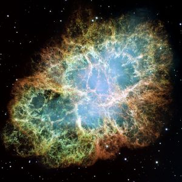

The death of a star can range from spectacular to other-worldly (see figure). Stars like the Sun eventually form a planetary nebula, which comes from the collapse of the star’s outer layers in an event like the implosion of a building. In the tug-of-war between gravity’s inward pull and fusion’s outward push, gravity instantly takes over when fusion ends, with the outer gasses puffing away to form a nebula. More massive stars do this as well but with a more energetic collapse, which starts another type of energy release mixed with element creation known as a supernova. In a **supernova**, the collapse of the core suddenly halts, creating a massive outward-propagating shock wave. A supernova is the most energetic explosion in the universe short of the big bang. The energy release is so significant the ensuing fusion can make every element up through uranium.

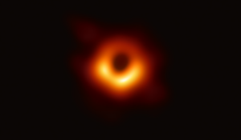

The death of a star can result in the creation of white dwarfs, neutron stars, or black holes. Following their deaths, stars like the Sun turn into white dwarfs.

White dwarfs are hot star embers, formed by packing most of a dying star’s mass into a small and dense object about the size of Earth. Larger stars may explode in a supernova that packs their mass even tighter to become neutron stars. Neutron stars are so dense that protons combine with electrons to form neutrons. The largest stars collapse their mass even further, becoming objects so dense that light cannot escape their gravitational grasp. These are the infamous black holes and the details of the physics of what occurs in them are still up for debate.

**▶ Did you get it? Click here to find out.**

                            if (window.qmn_quiz_data === undefined) {
                                    window.qmn_quiz_data = new Object();
                            }
                    window.qmn_quiz_data["164"] = {"quiz_id":"164","quiz_name":"08.1-1","disable_answer":0,"ajax_show_correct":0,"progress_bar":"0","contact_info_location":0,"qpages":{"1":{"id":"1","quizID":"64","pagekey":"6qgpbQ2z","hide_prevbtn":"0"}},"skip_validation_time_expire":0,"timer_limit_val":0,"disable_scroll_next_previous_click":0,"disable_scroll_on_result":0,"disable_first_page":"0","enable_result_after_timer_end":0,"enable_quick_result_mc":"1","end_quiz_if_wrong":0,"form_disable_autofill":0,"disable_mathjax":0,"enable_quick_correct_answer_info":"2","quick_result_correct_answer_text":"Correct, hydrogen formed as a result of the Big Bang.","quick_result_wrong_answer_text":"Incorrect","quiz_processing_message":"","quiz_limit_choice":"Limit of choice is reached.","not_allow_after_expired_time":0,"scheduled_time_end":false,"error_messages":{"email_error_text":"Not a valid e-mail address!","number_error_text":"This field must be a number!","incorrect_error_text":"The entered text is not correct!","empty_error_text":"Please complete all required fields!","url_error_text":"The entered URL is not valid!","minlength_error_text":"Required atleast %minlength% characters.","maxlength_error_text":"Maximum %maxlength% characters allowed.","recaptcha_error_text":"ReCaptcha is missing"}}
                    

8.1-1 How was hydrogen first created? 

					by a supernova					

					by a nebular					

					by star fusion					

					by the Big Bang					

					by black holes					

None

 Time's upCancel
                            if (window.qmn_quiz_data === undefined) {
                                    window.qmn_quiz_data = new Object();
                            }
                    window.qmn_quiz_data["165"] = {"quiz_id":"165","quiz_name":"08.1-2","disable_answer":0,"ajax_show_correct":0,"progress_bar":"0","contact_info_location":0,"qpages":{"1":{"id":"1","quizID":"64","pagekey":"6qgpbQ2z","hide_prevbtn":"0"}},"skip_validation_time_expire":0,"timer_limit_val":0,"disable_scroll_next_previous_click":0,"disable_scroll_on_result":0,"disable_first_page":"0","enable_result_after_timer_end":0,"enable_quick_result_mc":"1","end_quiz_if_wrong":0,"form_disable_autofill":0,"disable_mathjax":0,"enable_quick_correct_answer_info":"2","quick_result_correct_answer_text":"Correct. Elements heavier than hydrogen (up to iron or nickel) formed in a process called stellar nucleosynthesis that took place in stars.","quick_result_wrong_answer_text":"Incorrect","quiz_processing_message":"","quiz_limit_choice":"Limit of choice is reached.","not_allow_after_expired_time":0,"scheduled_time_end":false,"error_messages":{"email_error_text":"Not a valid e-mail address!","number_error_text":"This field must be a number!","incorrect_error_text":"The entered text is not correct!","empty_error_text":"Please complete all required fields!","url_error_text":"The entered URL is not valid!","minlength_error_text":"Required atleast %minlength% characters.","maxlength_error_text":"Maximum %maxlength% characters allowed.","recaptcha_error_text":"ReCaptcha is missing"}}
                    

8.1-2 Where did the first atoms of carbon and iron come from? 

					the Big Bang 

					a supernova					

					black holes					

					star fusion 

					nebulas					

None

 Time's upCancel
                            if (window.qmn_quiz_data === undefined) {
                                    window.qmn_quiz_data = new Object();
                            }
                    window.qmn_quiz_data["167"] = {"quiz_id":"167","quiz_name":"08.1-3","disable_answer":0,"ajax_show_correct":0,"progress_bar":"0","contact_info_location":0,"qpages":{"1":{"id":"1","quizID":"64","pagekey":"6qgpbQ2z","hide_prevbtn":"0"}},"skip_validation_time_expire":0,"timer_limit_val":0,"disable_scroll_next_previous_click":0,"disable_scroll_on_result":0,"disable_first_page":"0","enable_result_after_timer_end":0,"enable_quick_result_mc":"1","end_quiz_if_wrong":0,"form_disable_autofill":0,"disable_mathjax":0,"enable_quick_correct_answer_info":"2","quick_result_correct_answer_text":"Yes. Fusion in stars created many elements heavier than hydrogen, but not the very heavy elements. They formed in supernovas.","quick_result_wrong_answer_text":"Incorrect","quiz_processing_message":"","quiz_limit_choice":"Limit of choice is reached.","not_allow_after_expired_time":0,"scheduled_time_end":false,"error_messages":{"email_error_text":"Not a valid e-mail address!","number_error_text":"This field must be a number!","incorrect_error_text":"The entered text is not correct!","empty_error_text":"Please complete all required fields!","url_error_text":"The entered URL is not valid!","minlength_error_text":"Required atleast %minlength% characters.","maxlength_error_text":"Maximum %maxlength% characters allowed.","recaptcha_error_text":"ReCaptcha is missing"}}
                    

8.1-3 How did elements like gold and uranium first form? 

					during star fusion					

					in supernovas					

					in nebulas					

					in black holes					

					by the Big Bang					

None

 Time's upCancel

## **8.2 Origin of the Solar System: The Nebular Hypothesis**

Small protoplanetary discs in the Orion NebulaThe **nebular hypothesis** is the idea that a spinning cloud of dust made of mostly light elements, called a nebula, flattened into a protoplanetary disk, and became a solar system consisting of a star with orbiting planets. According to this hypothesis,our solar system formed at the same time as our Sun. However, the spinning nebula collected the vast majority of material in its center, which is why the sun accounts for over 99% of the mass in our solar system.

### **8.2.1 Planet Arrangement and Segregation**

This disk is asymmetric, possibly because of a large gas giant planet orbiting relatively far from the star.As our solar system formed, the nebular cloud of dispersed particles developed distinct temperature zones. Temperatures were very high close to the center, only allowing condensation of metals and silicate minerals with high melting points. Farther from the Sun, the temperatures were lower, allowing the condensation of lighter gaseous molecules such as methane, ammonia, carbon dioxide, and water. This temperature differentiation resulted in the inner four planets of the solar system becoming rocky, and the outer four planets becoming gas giants.

Image by the ALMA telescope of HL Tauri and its protoplanetary disk, showing grooves formed as planets absorb material in the disk.Both rocky and gaseous planets have a similar growth model. Particles of dust, floating in the disc were attracted to each other by static charges and eventually, gravity. As the clumps of dust became bigger, they interacted with each other—colliding, sticking, and forming protoplanets. The planets continued to grow over the course of many thousands or millions of years, as material from the protoplanetary disc was added.

Both rocky and gaseous planets started with a solid core. Rocky planets built more rock on that core, while gas planets added gas and ice. Ice giants formed later and on the furthest edges of the disc, accumulating less gas and more ice. That is why the gas-giant planets Jupiter and Saturn are composed of mostly hydrogen and helium gas, more than 90%. The ice giants Uranus and Neptune are composed of mostly methane ices and only about 20% hydrogen and helium gases.

This artist’s impression of the water snowline around the young star V883 Orionis, as detected with ALMA.The planetary composition of the gas giants is clearly different from the rocky planets. Their size is also dramatically different for two reasons: First, the original planetary nebula contained more gases and ices than metals and rocks. There was abundant hydrogen, carbon, oxygen, nitrogen, and less silicon and iron, giving the outer planets more building material. Second, the stronger gravitational pull of these giant planets allowed them to collect large quantities of hydrogen and helium, which could not be collected by weaker gravity of the smaller planets.

A polished fragment of the iron-rich Toluca Meteorite, with octahedral Widmanstätten Pattern.Jupiter’s massive gravity further shaped the solar system and growth of the inner rocky planets. As the nebula started to coalesce into planets, Jupiter’s gravity accelerated the movement of nearby materials, generating destructive collisions rather than constructively gluing material together. These collisions created the asteroid belt, an unfinished planet, located between Mars and Jupiter. This asteroid belt is the source of most **meteorites** that currently impact the Earth. Study of asteroids and meteorites help geologist to determine the age of Earth and the composition of its core, mantle, and crust. Jupiter’s gravity may also explain Mars’ smaller mass, with the larger planet consuming material as it migrated from the inner to outer edge of the solar system.

#### Pluto and planet definition

Eight largest objects discovered past Neptune.The outermost part of the solar system is known as the Kuiper belt, which is a scattered collection of rocky and icy bodies. Beyond that is the Oort cloud, a zone filled with small and dispersed ice traces. The Kuiper Belt and Oort cloud are where most comets form and continue to orbit, and objects found there have relatively irregular orbits compared to the rest of the solar system. Pluto, formerly the ninth planet, is located in this region of space.

The XXVIth General Assembly of the International Astronomical Union (IAU) stripped Pluto of planetary status in 2006 because scientists discovered an object more massive than Pluto, which they named Eris. The IAU decided against including Eris as a planet, and therefore, excluded Pluto as well. The IAU narrowed the definition of a planet to three criteria: 1) enough mass to have gravitational forces that force it to be rounded, 2) not massive enough to create fusion, and 3) large enough to be in a cleared orbit, free of other planetesimals that should have been incorporated at the time the planet formed. Pluto passed the first two parts of the definition, but not the third. Pluto and Eris are currently classified as dwarf planets.

**▶ Did you get it? Click here to find out.**

                            if (window.qmn_quiz_data === undefined) {
                                    window.qmn_quiz_data = new Object();
                            }
                    window.qmn_quiz_data["168"] = {"quiz_id":"168","quiz_name":"08.2-1","disable_answer":0,"ajax_show_correct":0,"progress_bar":"0","contact_info_location":0,"qpages":{"1":{"id":"1","quizID":"64","pagekey":"6qgpbQ2z","hide_prevbtn":"0"}},"skip_validation_time_expire":0,"timer_limit_val":0,"disable_scroll_next_previous_click":0,"disable_scroll_on_result":0,"disable_first_page":"0","enable_result_after_timer_end":0,"enable_quick_result_mc":"1","end_quiz_if_wrong":0,"form_disable_autofill":0,"disable_mathjax":0,"enable_quick_correct_answer_info":"2","quick_result_correct_answer_text":"Correct! The heat of the protoplanetary disk only allowed rocky material to condense and form close to the sun. The gaseous planets and ices had to form further away.","quick_result_wrong_answer_text":"Incorrect","quiz_processing_message":"","quiz_limit_choice":"Limit of choice is reached.","not_allow_after_expired_time":0,"scheduled_time_end":false,"error_messages":{"email_error_text":"Not a valid e-mail address!","number_error_text":"This field must be a number!","incorrect_error_text":"The entered text is not correct!","empty_error_text":"Please complete all required fields!","url_error_text":"The entered URL is not valid!","minlength_error_text":"Required atleast %minlength% characters.","maxlength_error_text":"Maximum %maxlength% characters allowed.","recaptcha_error_text":"ReCaptcha is missing"}}
                    

8.2-1 Why are the rocky inner planets different than the gaseous outer planets? 

					The rocky inner planets got rocks from the sun later					

					Heat from the growing sun allowed rock to mainly form near the center of the solar system 

					Gas has more momentum and flies further away naturally					

					Solar wind pushing material away had more effect on metals					

					Gases come from further away from the center of the solar system 

None

 Time's upCancel
                            if (window.qmn_quiz_data === undefined) {
                                    window.qmn_quiz_data = new Object();
                            }
                    window.qmn_quiz_data["169"] = {"quiz_id":"169","quiz_name":"08.2-2","disable_answer":0,"ajax_show_correct":0,"progress_bar":"0","contact_info_location":0,"qpages":{"1":{"id":"1","quizID":"64","pagekey":"6qgpbQ2z","hide_prevbtn":"0"}},"skip_validation_time_expire":0,"timer_limit_val":0,"disable_scroll_next_previous_click":0,"disable_scroll_on_result":0,"disable_first_page":"0","enable_result_after_timer_end":0,"enable_quick_result_mc":"1","end_quiz_if_wrong":0,"form_disable_autofill":0,"disable_mathjax":0,"enable_quick_correct_answer_info":"2","quick_result_correct_answer_text":"Correct! The only part of the planet definition Pluto fails is \u201cclearing the orbital path.\u201d","quick_result_wrong_answer_text":"Incorrect","quiz_processing_message":"","quiz_limit_choice":"Limit of choice is reached.","not_allow_after_expired_time":0,"scheduled_time_end":false,"error_messages":{"email_error_text":"Not a valid e-mail address!","number_error_text":"This field must be a number!","incorrect_error_text":"The entered text is not correct!","empty_error_text":"Please complete all required fields!","url_error_text":"The entered URL is not valid!","minlength_error_text":"Required atleast %minlength% characters.","maxlength_error_text":"Maximum %maxlength% characters allowed.","recaptcha_error_text":"ReCaptcha is missing"}}
                    

8.2-2 What makes Pluto NOT a planet? 

					Other large objects are even further out					

					It is not round enough					

					It is too small to be a planet					

					There are too many other objects nearby in its orbital path					

					It does not have a moon					

None

 Time's upCancel
                            if (window.qmn_quiz_data === undefined) {
                                    window.qmn_quiz_data = new Object();
                            }
                    window.qmn_quiz_data["170"] = {"quiz_id":"170","quiz_name":"08.2-3","disable_answer":0,"ajax_show_correct":0,"progress_bar":"0","contact_info_location":0,"qpages":{"1":{"id":"1","quizID":"64","pagekey":"6qgpbQ2z","hide_prevbtn":"0"}},"skip_validation_time_expire":0,"timer_limit_val":0,"disable_scroll_next_previous_click":0,"disable_scroll_on_result":0,"disable_first_page":"0","enable_result_after_timer_end":0,"enable_quick_result_mc":"1","end_quiz_if_wrong":0,"form_disable_autofill":0,"disable_mathjax":0,"enable_quick_correct_answer_info":"2","quick_result_correct_answer_text":"Correct","quick_result_wrong_answer_text":"Incorrect","quiz_processing_message":"","quiz_limit_choice":"Limit of choice is reached.","not_allow_after_expired_time":0,"scheduled_time_end":false,"error_messages":{"email_error_text":"Not a valid e-mail address!","number_error_text":"This field must be a number!","incorrect_error_text":"The entered text is not correct!","empty_error_text":"Please complete all required fields!","url_error_text":"The entered URL is not valid!","minlength_error_text":"Required atleast %minlength% characters.","maxlength_error_text":"Maximum %maxlength% characters allowed.","recaptcha_error_text":"ReCaptcha is missing"}}
                    

8.2-3 _____ is the idea that a spinning cloud of dust flattened into a disk, known as the protoplanetary disk, and created a star with orbiting planets in a solar system. 

					The Big Bang theory 

					The solar theory					

					Solar system expansion (SSE)					

					A supernova 

					The nebular hypothesis					

None

 Time's upCancel

## 8.3 Hadean Eon

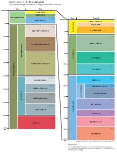

Geoscientists use the geological time scale to assign relative age names to events and rocks, separating major events in Earth’s history based on significant changes recorded in rocks and fossils. This section summarizes the most notable events of each major time interval. For a breakdown on how these time intervals are chosen and organized, see Chapter 7.

The Hadean Eon, named after the Greek god and ruler of the underworld Hades, is the oldest eon and dates from 4.5–4.0 billion years ago.

Artist’s impression of the Earth in the Hadean.This time represents Earth’s earliest history, during which the planet was characterized by a partially molten surface, volcanism, and asteroid impacts. Several mechanisms made the newly forming Earth incredibly hot: gravitational compression, radioactive decay, and asteroid impacts. Most of this initial heat still exists inside Earth. The Hadean was originally defined as beginning at the birth of Earth 4.0 billion years ago and preceded the existence of many rocks and life forms. However, more recently geologists have found minerals that formed 4.4 billion years ago, with evidence that liquid water was present at that time.  There is possibly even evidence of life existing over 4.0 billion years ago. However, the most reliable record for early life, the microfossil record, starts at about 3.5 billion years ago.

### **8.3.1 Origin of Earth’s Crust**

The global map of the depth of the moho, or thickness of the crust.As Earth cooled from its molten state, minerals started to crystallize and settle, resulting in a separation of minerals based on density and the creation of the crust, mantle, and core. The earliest Earth was chiefly molten material and would have been rounded by gravitational forces so it resembled a ball of lava floating in space. As the outer part of the Earth slowly cooled, the high melting-point minerals (see Bowen’s Reaction Series in Chapter 4) formed solid slabs of early crust. These slabs were probably unstable and easily reabsorbed into the liquid magma until the Earth cooled enough to allow many larger fragments to form a thin primitive crust. Scientists generally assume this crust was similar to today’s ocean crust and mafic in composition, and littered with impact craters, much like the Moon’s current crust.

There is still some debate about when plate tectonics started, which led to the formation of continental and felsic crust. Regardless of this uncertainty, as Earth cooled and solidified, less dense felsic minerals floated to the surface of the Earth to form the crust, while the denser mafic and ultramafic materials sank to form the mantle, and the highest-density iron and nickel sank into the core. This differentiated the Earth from a homogenous planet into a heterogeneous one with layers of felsic crust, mafic crust, ultramafic mantle, and iron and nickel core.

### **8.3.2 Origin of the Moon**

Dark side of the MoonSeveral unique features of Earth’s Moon have prompted scientists to develop the current hypothesis about its formation. The Earth and Moon are tidally locked, meaning that as the Moon orbits, one side always faces the Earth and the opposite side is not visible to us. Also and most importantly, the chemical compositions of the Earth and Moon show nearly identical isotope ratios and volatile content. Apollo missions returned from the Moon with rocks that allowed scientists to conduct very precise comparisons between Moon and Earth rocks. Other bodies in the solar system and meteorites do not share the same degree of similarity and show much higher variability. If the Moon and Earth formed together, this would explain why they are so chemically similar.

Artist’s concept of the giant impact from a Mars-sized object that could have formed the moon.Many ideas have been proposed for the origin of the Moon: The Moon could have been captured from another part of the solar system and formed in place together with the Earth, or the Moon could have been ripped out of the early Earth. None of proposed explanations can account for all the evidence. The currently prevailing hypothesis is the **giant-impact hypothesis**. It proposes a body about half of Earth’s size must have shared at least parts of Earth’s orbit and collided with it, resulting in a violent mixing and scattering of material from both objects. Both bodies would be composed of a combination of materials, with more of the lower density splatter coalescing into the Moon. This may explain why the Earth has a higher density and thicker core than the Moon.

*Computer simulation of the evolution of the Moon (2 minutes).*

### **8.3.3 Origin of Earth’s Water**

Water vapor leaves comet 67P/Churyumov–Gerasimenko.Explanations for the origin of Earth’s water include volcanic outgassing, comets, and meteorites. The volcanic outgassing hypothesis for the origin of Earth’s water is that it originated from inside the planet, and emerged via tectonic processes as vapor associated with volcanic eruptions.  Since all volcanic eruptions contain some water vapor, at times more than 1% of the volume, these alone could have created Earth’s surface water.

Another likely source of water was from space. Comets are a mixture of dust and ice, with some or most of that ice being frozen water. Seemingly dry meteors can contain small but measurable amounts of water, usually trapped in their mineral structures. During heavy bombardment periods later in Earth’s history, its cooled surface was pummeled by comets and meteorites, which could be why so much water exists above ground. There isn’t a definitive answer for what process is the source of ocean water. Earth’s water isotopically matches water found in meteorites much better than that of comets. However, it is hard to know if Earth processes could have changed the water’s isotopic signature over the last 4-plus billion years. It is possible that all three sources contributed to the origin of Earth’s water.

**▶ Did you get it? Click here to find out.**

                            if (window.qmn_quiz_data === undefined) {
                                    window.qmn_quiz_data = new Object();
                            }
                    window.qmn_quiz_data["171"] = {"quiz_id":"171","quiz_name":"08.3-1","disable_answer":0,"ajax_show_correct":0,"progress_bar":"0","contact_info_location":0,"qpages":{"1":{"id":"1","quizID":"64","pagekey":"6qgpbQ2z","hide_prevbtn":"0"}},"skip_validation_time_expire":0,"timer_limit_val":0,"disable_scroll_next_previous_click":0,"disable_scroll_on_result":0,"disable_first_page":"0","enable_result_after_timer_end":0,"enable_quick_result_mc":"1","end_quiz_if_wrong":0,"form_disable_autofill":0,"disable_mathjax":0,"enable_quick_correct_answer_info":"2","quick_result_correct_answer_text":"Correct! Impact craters are NOT the answer. The very close composition of Earth and Moon rocks, the tidal lock between the two, and the fact that the Moon is less dense and was apparently made from the splattered mantle and crust of the combined objects more than the Earth\u2019s core are evidence for the hypothesis.","quick_result_wrong_answer_text":"Incorrect","quiz_processing_message":"","quiz_limit_choice":"Limit of choice is reached.","not_allow_after_expired_time":0,"scheduled_time_end":false,"error_messages":{"email_error_text":"Not a valid e-mail address!","number_error_text":"This field must be a number!","incorrect_error_text":"The entered text is not correct!","empty_error_text":"Please complete all required fields!","url_error_text":"The entered URL is not valid!","minlength_error_text":"Required atleast %minlength% characters.","maxlength_error_text":"Maximum %maxlength% characters allowed.","recaptcha_error_text":"ReCaptcha is missing"}}
                    

8.3.1 Regarding the Moon’s formation, which IS NOT evidence for the Giant Impact Hypothesis? 

					similar compositions of Earth and the moon					

					Earth's density is greater than the moon's density					

					a tidal lock between Earth and the moon					

					the large number of impact craters on the moon					

None

 Time's upCancel
                            if (window.qmn_quiz_data === undefined) {
                                    window.qmn_quiz_data = new Object();
                            }
                    window.qmn_quiz_data["172"] = {"quiz_id":"172","quiz_name":"08.3-2","disable_answer":0,"ajax_show_correct":0,"progress_bar":"0","contact_info_location":0,"qpages":{"1":{"id":"1","quizID":"64","pagekey":"6qgpbQ2z","hide_prevbtn":"0"}},"skip_validation_time_expire":0,"timer_limit_val":0,"disable_scroll_next_previous_click":0,"disable_scroll_on_result":0,"disable_first_page":"0","enable_result_after_timer_end":0,"enable_quick_result_mc":"1","end_quiz_if_wrong":0,"form_disable_autofill":0,"disable_mathjax":0,"enable_quick_correct_answer_info":"2","quick_result_correct_answer_text":"Correct. Not heat from the sun. Higher radioactive decay, heat from the high number of impacts, and gravitational compression all heated up the Earth at its formation. This heat of formation and continuing radioactivity are still the main sources of Earth\u2019s internal heat.","quick_result_wrong_answer_text":"Incorrect","quiz_processing_message":"","quiz_limit_choice":"Limit of choice is reached.","not_allow_after_expired_time":0,"scheduled_time_end":false,"error_messages":{"email_error_text":"Not a valid e-mail address!","number_error_text":"This field must be a number!","incorrect_error_text":"The entered text is not correct!","empty_error_text":"Please complete all required fields!","url_error_text":"The entered URL is not valid!","minlength_error_text":"Required atleast %minlength% characters.","maxlength_error_text":"Maximum %maxlength% characters allowed.","recaptcha_error_text":"ReCaptcha is missing"}}
                    

8.3-2 What DID NOT contribute to the heat that made the Earth molten at the beginning of its creation? 

					impacts					

					radioactive decay					

					gravity					

					solar radiation					

None

 Time's upCancel
                            if (window.qmn_quiz_data === undefined) {
                                    window.qmn_quiz_data = new Object();
                            }
                    window.qmn_quiz_data["173"] = {"quiz_id":"173","quiz_name":"08.3-3","disable_answer":0,"ajax_show_correct":0,"progress_bar":"0","contact_info_location":0,"qpages":{"1":{"id":"1","quizID":"64","pagekey":"6qgpbQ2z","hide_prevbtn":"0"}},"skip_validation_time_expire":0,"timer_limit_val":0,"disable_scroll_next_previous_click":0,"disable_scroll_on_result":0,"disable_first_page":"0","enable_result_after_timer_end":0,"enable_quick_result_mc":"1","end_quiz_if_wrong":0,"form_disable_autofill":0,"disable_mathjax":0,"enable_quick_correct_answer_info":"2","quick_result_correct_answer_text":"Correct. The moon formed quite a while after water on Earth formed.","quick_result_wrong_answer_text":"Incorrect","quiz_processing_message":"","quiz_limit_choice":"Limit of choice is reached.","not_allow_after_expired_time":0,"scheduled_time_end":false,"error_messages":{"email_error_text":"Not a valid e-mail address!","number_error_text":"This field must be a number!","incorrect_error_text":"The entered text is not correct!","empty_error_text":"Please complete all required fields!","url_error_text":"The entered URL is not valid!","minlength_error_text":"Required atleast %minlength% characters.","maxlength_error_text":"Maximum %maxlength% characters allowed.","recaptcha_error_text":"ReCaptcha is missing"}}
                    

8.3-3 There are a number of competing hypotheses about the origin of water on Earth. Which of the following HAS NOT been proposed as a possible source of Earth's water? 

meteorites 

					comets					

					volcanism					

					the moon					

None

 Time's upCancel

## **8.4 Archean Eon**

Artist’s impression of the Archean.The **Archean Eon**, which lasted from 4.0–2.5 billion years ago, is named after the Greek word for beginning. This eon represents the beginning of the rock record. Although there is current evidence that rocks and minerals existed during the Hadean Eon, the Archean has a much more robust rock and fossil record.

### ****8.4.1 Late Heavy Bombardment

Objects were chaotically flying around when the solar system first began to form, creating planets and moons. There is evidence that after the planets formed, about 4.1–3.8 billion years ago, a large number of asteroids and comets impacted the Earth and Moon in an event called **late heavy bombardment**. 
At that time, meteorites and comets in stable or semi-stable orbits became unstable and started impacting objects throughout the solar system.

The late heavy bombardment is also is called the lunar cataclysm because most of the Moons craters are from this event. During late heavy bombardment, the Earth, Moon, and all planets in the solar system were pummeled by material from the asteroid and Kuiper belts. Evidence of this bombardment was found within samples collected from the Moon.

Simulation of before, during, and after the late heavy bombardment.It is universally accepted that the solar system experienced extensive asteroid and comet bombardment at its start; however, some other process must have caused the second increase in impacts hundreds of millions of years later. A leading theory blames gravitational resonance between Jupiter and Saturn for disturbing orbits within the asteroid and Kuiper belts based on a similar process observed in the Eta Corvi star system.

### **8.4.2 Origin of the Continents**

The layers of the Earth. Physical layers include lithosphere and asthenosphere; chemical layers are crust, mantle, and core.For plate tectonics to work as it does currently, it is necessary to have continents. However, the easiest way to create continental material is via assimilation and differentiation of existing continents (see Chapter 4). This chicken-and-egg quandary over how continents were made in the first place is not easily resolved because of the great age of continental material and the loss of much evidence during tectonic events and by erosion. While the timing and specific processes are still debated, volcanic action must have brought the first continental material to the Earth’s surface during the Hadean, 4.4 billion years ago. We have continental material from that time.

Although the exact mechanism is unknown, the continents formed by some incremental process during the early history of Earth. The best idea is that density differences allowed lighter felsic materials to float upward and heavier ultramafic materials and metallic iron to sink. These density differences led to the layering of the Earth, the layers that are now detected by seismic studies. Early protocontinents accumulated felsic materials as developing plate-tectonic processes brought lighter material from the mantle to the surface.

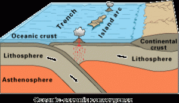

The first solid evidence of modern plate tectonics is found in rocks that formed at the end of the Archean, indicating at least some continental lithosphere must have been in place. This evidence does not necessarily mark the starting point of plate tectonics; remnants of earlier tectonic activity could have been erased by the rock cycle.

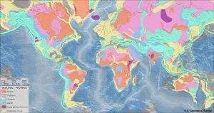

The stable interiors of the current continents are called **cratons** and were mostly formed in the Archean Eon. Cratons have two main parts: a **shield**, which is crystalline basement rock near the surface, and a **platform** made of sedimentary rocks covering the shield. Most cratons have remained relatively unchanged for a long time, with most tectonic activity having occurred around cratons instead of within them. Whether they were created by plate tectonics or another process, Archean continents gave rise to the Proterozoic continents that now dominate our planet.

The continent of ZealandiaThe general guideline as to what constitutes a continent and differentiates oceanic from continental crust is under some debate. At passive margins, continental crust grades into oceanic crust, making a distinction difficult. Even island-arc and hot-spot material can seem more closely related to continental crust than oceanic crust. Continents usually have a craton in the middle that contains felsic igneous rocks. Continental crust that does not contain a craton is called a continental fragment, such as the island of Madagascar off the east coast of Africa. There is aslso evidence that submerged masses like Zealandia, that includes present-day New Zealand, should be considered a continent.

### **8.4.3 First Life on Earth**

Fossils of microbial mats from SwedenLife most likely started during the late Hadean or early Archean Eons. The earliest evidence of life are chemical signatures, microscopic filaments, and microbial mats. Carbon found in 4.1 billion year old zircon grains have a chemical signature suggesting an organic origin. Other evidence of early life are 3.8–4.3 billion-year-old microscopic filaments from a hydrothermal vent deposit in Quebec, Canada. While the chemical and microscopic filaments evidence is not as robust as fossils, there is significant fossil evidence for life at 3.5 billion years ago. These first well-preserved fossils are photosynthetic microbial mats, called stromatolites, found in Australia.

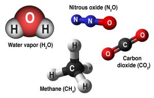

Although the origin of life on Earth is unknown, hypotheses include a chemical origin in the early atmosphere and ocean, deep-sea hydrothermal vents, and delivery to Earth by comets or other objects. One hypothesis is that life arose from the chemical environment of the Earth’s early atmosphere and oceans, which was very different than today. The oxygen-free atmosphere produced a reducing environment with abundant methane, carbon dioxide, sulfur, and nitrogen compounds. This is what the atmosphere is like on other bodies in the solar system. In the famous Miller-Urey experiment, researchers simulated early Earth’s atmosphere and lightning within a sealed vessel. After igniting sparks within the vessel, they discovered the formation of amino acids, the fundamental building blocks of proteins.  In 1977, when scientists discovered an isolated ecosystem around hydrothermal vents on a deep-sea mid-ocean ridge (see Chapter 4), it opened the door for another explanation of the origin of life. The hydrothermal vents have a unique ecosystem of critters with chemosynthesis as the foundation of the food chain instead of photosynthesis. The ecosystem is deriving its energy from hot chemical-rich waters pouring out of underground towers. This suggests that life could have started on the deep ocean floor and derived energy from the heat from the Earth’s interior via chemosynthesis. Scientists have since expanded the search for life to more unconventional places, like Jupiter’s icy moon Europa.

[if lt IE 9]><![endif]
https://opengeology.org/textbook/wp-content/uploads/2017/03/Miller-Urey_experiment_-_Work_by_the_C3BC_consortium_licensed_under_CC-BY-3.0.webm.480p.webm

*Animation of the original Miller-Urey 1959 experiment that simulated the early atmosphere and created amino acids from simple elements and compounds. *

Another possibility is that life or its building blocks came to Earth from space, carried aboard comets or other objects. Amino acids, for example, have been found within comets and meteorites. This intriguing possibility also implies a high likelihood of life existing elsewhere in the cosmos.

**▶ Did you get it? Click here to find out.**

                            if (window.qmn_quiz_data === undefined) {
                                    window.qmn_quiz_data = new Object();
                            }
                    window.qmn_quiz_data["174"] = {"quiz_id":"174","quiz_name":"08.4-1","disable_answer":0,"ajax_show_correct":0,"progress_bar":"0","contact_info_location":0,"qpages":{"1":{"id":"1","quizID":"64","pagekey":"6qgpbQ2z","hide_prevbtn":"0"}},"skip_validation_time_expire":0,"timer_limit_val":0,"disable_scroll_next_previous_click":0,"disable_scroll_on_result":0,"disable_first_page":"0","enable_result_after_timer_end":0,"enable_quick_result_mc":"1","end_quiz_if_wrong":0,"form_disable_autofill":0,"disable_mathjax":0,"enable_quick_correct_answer_info":"2","quick_result_correct_answer_text":"Correct. Not magmatic processes. Amino acids in comets\/meteorites, black smokers, and Miller-Urey lightning in the primordial atmosphere are all ideas for life\u2019s origin on Earth.","quick_result_wrong_answer_text":"Incorrect","quiz_processing_message":"","quiz_limit_choice":"Limit of choice is reached.","not_allow_after_expired_time":0,"scheduled_time_end":false,"error_messages":{"email_error_text":"Not a valid e-mail address!","number_error_text":"This field must be a number!","incorrect_error_text":"The entered text is not correct!","empty_error_text":"Please complete all required fields!","url_error_text":"The entered URL is not valid!","minlength_error_text":"Required atleast %minlength% characters.","maxlength_error_text":"Maximum %maxlength% characters allowed.","recaptcha_error_text":"ReCaptcha is missing"}}
                    

8.4-1 Which of these HAVE NOT been proposed to account for the first life on Earth? 

					Life was brought to Earth by comets					

					Life was created by mineral processes as magma cooled					

					Life resulted from atmospheric processes involving lightning					

					The first life formed by chemical processes around hydrothermal vents in the ocean floor					

None

 Time's upCancel
                            if (window.qmn_quiz_data === undefined) {
                                    window.qmn_quiz_data = new Object();
                            }
                    window.qmn_quiz_data["175"] = {"quiz_id":"175","quiz_name":"08.4-2","disable_answer":0,"ajax_show_correct":0,"progress_bar":"0","contact_info_location":0,"qpages":{"1":{"id":"1","quizID":"64","pagekey":"6qgpbQ2z","hide_prevbtn":"0"}},"skip_validation_time_expire":0,"timer_limit_val":0,"disable_scroll_next_previous_click":0,"disable_scroll_on_result":0,"disable_first_page":"0","enable_result_after_timer_end":0,"enable_quick_result_mc":"1","end_quiz_if_wrong":0,"form_disable_autofill":0,"disable_mathjax":0,"enable_quick_correct_answer_info":"2","quick_result_correct_answer_text":"Correct. But, they are best also known for the long periods of time they have been stable -- the long times since tectonism affected them","quick_result_wrong_answer_text":"Incorrect","quiz_processing_message":"","quiz_limit_choice":"Limit of choice is reached.","not_allow_after_expired_time":0,"scheduled_time_end":false,"error_messages":{"email_error_text":"Not a valid e-mail address!","number_error_text":"This field must be a number!","incorrect_error_text":"The entered text is not correct!","empty_error_text":"Please complete all required fields!","url_error_text":"The entered URL is not valid!","minlength_error_text":"Required atleast %minlength% characters.","maxlength_error_text":"Maximum %maxlength% characters allowed.","recaptcha_error_text":"ReCaptcha is missing"}}
                    

8.4-2 In comparison with other parts of the Earth's crust, cratons are known for their _____________. 

					thinness					

					strength					

					young age					

					high density					

					high elevation					

None

 Time's upCancel
                            if (window.qmn_quiz_data === undefined) {
                                    window.qmn_quiz_data = new Object();
                            }
                    window.qmn_quiz_data["176"] = {"quiz_id":"176","quiz_name":"08.4-3","disable_answer":0,"ajax_show_correct":0,"progress_bar":"0","contact_info_location":0,"qpages":{"1":{"id":"1","quizID":"64","pagekey":"6qgpbQ2z","hide_prevbtn":"0"}},"skip_validation_time_expire":0,"timer_limit_val":0,"disable_scroll_next_previous_click":0,"disable_scroll_on_result":0,"disable_first_page":"0","enable_result_after_timer_end":0,"enable_quick_result_mc":"1","end_quiz_if_wrong":0,"form_disable_autofill":0,"disable_mathjax":0,"enable_quick_correct_answer_info":"2","quick_result_correct_answer_text":"Correct. The moon\u2019s craters are the main evidence since erosion and plate tectonics has erased much of the evidence on Earth.","quick_result_wrong_answer_text":"Incorrect","quiz_processing_message":"","quiz_limit_choice":"Limit of choice is reached.","not_allow_after_expired_time":0,"scheduled_time_end":false,"error_messages":{"email_error_text":"Not a valid e-mail address!","number_error_text":"This field must be a number!","incorrect_error_text":"The entered text is not correct!","empty_error_text":"Please complete all required fields!","url_error_text":"The entered URL is not valid!","minlength_error_text":"Required atleast %minlength% characters.","maxlength_error_text":"Maximum %maxlength% characters allowed.","recaptcha_error_text":"ReCaptcha is missing"}}
                    

8.4-3 Where is most of the evidence for the Late Heavy Bombardment found? 

volcanic belts					

					ocean floors					

					continental interiors					

continental shelves					

					on the moon					

None

 Time's upCancel

## **8.5 Proterozoic Eon**

Diagram showing the main products and reactants in photosynthesis. The one product that is not shown is sugar, which is the chemical energy that goes into constructing the plant, and the energy that is stored in the plant which is used later by the plant or by animals that consume the plant.The **Proterozoic Eon**, meaning “earlier life,” came after the Archean Eon. It occurred from 2.5 billion to 541 million years ago. During this time, most of the central parts of the continents had formed and plate tectonic processes had started. Photosynthesis by microbial organisms, such as single-celled cyanobacteria, had been slowly adding oxygen to the oceans. As cyanobacteria evolved into multicellular organisms, they completely transformed the oceans and later the atmosphere by adding massive amounts of free oxygen gas (O2) and initiated what is called the **Great Oxygenation Event (GOE**). This drastic environmental change decimated the anaerobic bacteria, which could not survive in the presence of free oxygen. On the other hand, aerobic organisms could thrive in ways they could not earlier.

An oxygenated world also changed the chemistry of our planet in significant ways. For example, iron remained in solution in the non-oxygenated environment of the earlier Archean Eon. In chemistry, this is known as a reducing environment. Once the environment was oxygenated, iron combined with free oxygen to form solid precipitates of iron oxide, such as the minerals hematite or magnetite. These precipitates accumulated into large mineral deposits known as banded iron formations that contain iron oxides, red chert, and sometimes carbonates. The oldest are about 2 billion years old.

Alternating bands of iron-rich and silica-rich mud, formed as oxygen combined with dissolved iron.The formation of iron oxide minerals and red chert (see figure) in the oceans lasted a long time and prevented oxygen levels from increasing significantly, since precipitation took the oxygen out of the water and deposited it into the rock strata. As oxygen continued to be produced and mineral precipitation leveled off, dissolved oxygen gas eventually saturated the oceans and started bubbling out into the atmosphere.

Oxygenation of the atmosphere is the single biggest event that distinguishes the Archean and Proterozoic environments. In addition to changing mineral and ocean chemistry, the GOE is also tabbed as triggering Earth’s first glaciation event around 2.1 billion years ago, the Huron Glaciation. Free oxygen reacted with methane in the atmosphere to produce carbon dioxide. Carbon dioxide and methane are called greenhouse gases because they trap heat within the Earth’s atmosphere, like the insulated glass of a greenhouse. Methane is a more effective insulator than carbon dioxide, so as the proportion of carbon dioxide in the atmosphere increased, the greenhouse effect decreased, and the planet cooled.

### **8.5.1 Rodinia**

One possible reconstruction of Rodinia 1.1 billion years ago. Source: John Goodge, modified from Dalziel (1997).By the Proterozoic Eon, lithospheric plates had formed and were moving according to plate tectonic forces that were similar to current times. As the moving plates collided, the ocean basins closed to form a **supercontinent** called **Rodinia**. The supercontinent formed about 1 billion years ago and broke up about 750 to 600 million years ago, at the end of the Proterozoic. One of the resulting fragments was a continental mass called **Laurentia** that would later become North America. Geologists have reconstructed Rodinia by matching and aligning ancient mountain chains, assembling the pieces like a jigsaw puzzle, and using paleomagnetics to orient to magnetic north.

The disagreements over these complex reconstructions is exemplified by geologists proposing at least six different models for the breakup of Rodinia to create Australia, Antarctica, parts of China, the Tarim craton north of the Himalaya, Siberia, or the Kalahari craton of eastern Africa. This breakup created lots of shallow-water, biologically favorable environments that fostered the evolutionary breakthroughs marking the start of the next eon, the Phanerozoic.

### **8.5.2 Life Evolves**

Modern cyanobacteria (as stromatolites) in Shark Bay, Australia.Early life in the Archean and earlier is poorly documented in the fossil record. Based on chemical evidence and evolutionary theory, scientists propose this life would have been single-celled photosynthetic organisms, such as the cyanobacteria that created **stromatolites**. Cyanobacteria produced free oxygen in the atmosphere through photosynthesis. Cyanobacteria, archaea, and bacteria are **prokaryotes**—primitive organisms made of single cells that lack cell nuclei and other organelles.

Fossil stromatolites in Saratoga Springs, New York.A large evolutionary step occurred during the Proterozoic Eon with the appearance of **eukaryotes** around 2.1 to 1.6 billion years ago. Eukaryotic cells are more complex, having nuclei and organelles. The nuclear DNA is capable of more complex replication and regulation than that of prokaryotic cells. The organelles include mitochondria for producing energy and chloroplasts for photosynthesis. The eukaryote branch in the tree of life gave rise to fungi, plants, and animals.

Another important event in Earth’s biological history occurred about 1.2 billion years ago when eukaryotes invented sexual reproduction. Sharing genetic material from two reproducing individuals, male and female, greatly increased genetic variability in their offspring. This genetic mixing accelerated evolutionary change, contributing to more complexity among individual organisms and within ecosystems (see Chapter 7).

Proterozoic land surfaces were barren of plants and animals and geologic processes actively shaped the environment differently because land surfaces were not protected by leafy and woody vegetation. For example, rain and rivers would have caused erosion at much higher rates on land surfaces devoid of plants. This resulted in thick accumulations of pure quartz sandstone from the Proterozoic Eon such as the extensive quartzite formations in the core of the Uinta Mountains in Utah.

Dickinsonia, a typical Ediacaran fossil.Fauna that formed during the Ediacaran Period, 635.5 to 541 million years ago, known as the **Ediacaran fauna**, provide a first glimpse of the diversity of ecosystems that evolved near the end of the Proterozoic. These soft-bodied organisms were among the first multicellular life forms on Earth and probably were similar to jellyfish and worms. Ediacaran fauna did not have hard parts like shells and so were not well preserved in the rock records. However, studies suggest they were widespread in the Earth’s oceans. Scientists still debate how many species were evolutionary dead-ends that later became extinct and how many were ancestors of modern groupings. The transition of soft-bodied Ediacaran life to life forms with hard body parts occurred at the end of the Proterozoic and beginning of the Phanerozoic Eons. This evolutionary explosion of biological diversity, and the development of life with hard parts, made a dramatic difference in scientists’ ability to understand the history of life on Earth. All of a sudden, fossils of many different organisms began to be preserved in rocks for future study.

**▶ Did you get it? Click here to find out.**

                            if (window.qmn_quiz_data === undefined) {
                                    window.qmn_quiz_data = new Object();
                            }
                    window.qmn_quiz_data["177"] = {"quiz_id":"177","quiz_name":"08.5-1","disable_answer":0,"ajax_show_correct":0,"progress_bar":"0","contact_info_location":0,"qpages":{"1":{"id":"1","quizID":"64","pagekey":"6qgpbQ2z","hide_prevbtn":"0"}},"skip_validation_time_expire":0,"timer_limit_val":0,"disable_scroll_next_previous_click":0,"disable_scroll_on_result":0,"disable_first_page":"0","enable_result_after_timer_end":0,"enable_quick_result_mc":"1","end_quiz_if_wrong":0,"form_disable_autofill":0,"disable_mathjax":0,"enable_quick_correct_answer_info":"2","quick_result_correct_answer_text":"Correct","quick_result_wrong_answer_text":"Incorrect","quiz_processing_message":"","quiz_limit_choice":"Limit of choice is reached.","not_allow_after_expired_time":0,"scheduled_time_end":false,"error_messages":{"email_error_text":"Not a valid e-mail address!","number_error_text":"This field must be a number!","incorrect_error_text":"The entered text is not correct!","empty_error_text":"Please complete all required fields!","url_error_text":"The entered URL is not valid!","minlength_error_text":"Required atleast %minlength% characters.","maxlength_error_text":"Maximum %maxlength% characters allowed.","recaptcha_error_text":"ReCaptcha is missing"}}
                    

8.5-1 What important evolutionary step occurred in the Proterozoic? 

					the first bacteria and other protists appeared on Earth					

					the first trilobites and insects developed					

					the first fungi appeared on Earth					

					the first animals with gills developed					

					the first cell nucleus developed					

None

 Time's upCancel
                            if (window.qmn_quiz_data === undefined) {
                                    window.qmn_quiz_data = new Object();
                            }
                    window.qmn_quiz_data["178"] = {"quiz_id":"178","quiz_name":"08.5-2","disable_answer":0,"ajax_show_correct":0,"progress_bar":"0","contact_info_location":0,"qpages":{"1":{"id":"1","quizID":"64","pagekey":"6qgpbQ2z","hide_prevbtn":"0"}},"skip_validation_time_expire":0,"timer_limit_val":0,"disable_scroll_next_previous_click":0,"disable_scroll_on_result":0,"disable_first_page":"0","enable_result_after_timer_end":0,"enable_quick_result_mc":"1","end_quiz_if_wrong":0,"form_disable_autofill":0,"disable_mathjax":0,"enable_quick_correct_answer_info":"2","quick_result_correct_answer_text":"Correct! The Great Oxygenation Event, in which oxygen started to exist in the atmosphere, occurred at the start of the Proterozoic.","quick_result_wrong_answer_text":"Incorrect","quiz_processing_message":"","quiz_limit_choice":"Limit of choice is reached.","not_allow_after_expired_time":0,"scheduled_time_end":false,"error_messages":{"email_error_text":"Not a valid e-mail address!","number_error_text":"This field must be a number!","incorrect_error_text":"The entered text is not correct!","empty_error_text":"Please complete all required fields!","url_error_text":"The entered URL is not valid!","minlength_error_text":"Required atleast %minlength% characters.","maxlength_error_text":"Maximum %maxlength% characters allowed.","recaptcha_error_text":"ReCaptcha is missing"}}
                    

8.5-2 What very important thing occurred at the beginning of the Proterozoic? 

					fish evolved					

					one of the 5 great mass extinctions occurred					

Rodinia broke apart					

					Rodinia formed					

					Earth's atmosphere became oxygenated					

None

 Time's upCancel
                            if (window.qmn_quiz_data === undefined) {
                                    window.qmn_quiz_data = new Object();
                            }
                    window.qmn_quiz_data["179"] = {"quiz_id":"179","quiz_name":"08.5-3","disable_answer":0,"ajax_show_correct":0,"progress_bar":"0","contact_info_location":0,"qpages":{"1":{"id":"1","quizID":"64","pagekey":"6qgpbQ2z","hide_prevbtn":"0"}},"skip_validation_time_expire":0,"timer_limit_val":0,"disable_scroll_next_previous_click":0,"disable_scroll_on_result":0,"disable_first_page":"0","enable_result_after_timer_end":0,"enable_quick_result_mc":"1","end_quiz_if_wrong":0,"form_disable_autofill":0,"disable_mathjax":0,"enable_quick_correct_answer_info":"2","quick_result_correct_answer_text":"Correct! The breakup of Rodinia allowed a large amount of biologically-favorable shallow water to form, which may have spawned more evolutionary advances.","quick_result_wrong_answer_text":"Incorrect","quiz_processing_message":"","quiz_limit_choice":"Limit of choice is reached.","not_allow_after_expired_time":0,"scheduled_time_end":false,"error_messages":{"email_error_text":"Not a valid e-mail address!","number_error_text":"This field must be a number!","incorrect_error_text":"The entered text is not correct!","empty_error_text":"Please complete all required fields!","url_error_text":"The entered URL is not valid!","minlength_error_text":"Required atleast %minlength% characters.","maxlength_error_text":"Maximum %maxlength% characters allowed.","recaptcha_error_text":"ReCaptcha is missing"}}
                    

8.5-3 What tectonic process happened toward the end of the Proterozoic, which may have helped evolutionary advancements right after that time? 

					arid conditions across Rodinia					

					formation of Rodinia 

					mountain building along the margins, and perhaps in the center, of Rodinia					

					the breakup of Rodinia					

					volcanism associated with Rodinia 

None

 Time's upCancel
                            if (window.qmn_quiz_data === undefined) {
                                    window.qmn_quiz_data = new Object();
                            }
                    window.qmn_quiz_data["180"] = {"quiz_id":"180","quiz_name":"08.5-4","disable_answer":0,"ajax_show_correct":0,"progress_bar":"0","contact_info_location":0,"qpages":{"1":{"id":"1","quizID":"64","pagekey":"6qgpbQ2z","hide_prevbtn":"0"}},"skip_validation_time_expire":0,"timer_limit_val":0,"disable_scroll_next_previous_click":0,"disable_scroll_on_result":0,"disable_first_page":"0","enable_result_after_timer_end":0,"enable_quick_result_mc":"1","end_quiz_if_wrong":0,"form_disable_autofill":0,"disable_mathjax":0,"enable_quick_correct_answer_info":"2","quick_result_correct_answer_text":"Correct! Once they had developed, bacteria doing photosynthesis flooded the planet with oxygen.","quick_result_wrong_answer_text":"Incorrect","quiz_processing_message":"","quiz_limit_choice":"Limit of choice is reached.","not_allow_after_expired_time":0,"scheduled_time_end":false,"error_messages":{"email_error_text":"Not a valid e-mail address!","number_error_text":"This field must be a number!","incorrect_error_text":"The entered text is not correct!","empty_error_text":"Please complete all required fields!","url_error_text":"The entered URL is not valid!","minlength_error_text":"Required atleast %minlength% characters.","maxlength_error_text":"Maximum %maxlength% characters allowed.","recaptcha_error_text":"ReCaptcha is missing"}}
                    

8.5-4 The majority of the oxygen associated with the Great Oxygenation Event came from _____. 

					meteorite impacts					

					increased respiration from animals					

					volcanic eruptions					

					photosynthetic bacteria					

					evaporation of water					

None

 Time's upCancel

## **8.6 Phanerozoic Eon: Paleozoic Era**

The trilobites had a hard exoskeleton, and were an early arthropod, the same group that includes modern insects, crustaceans, and arachnids.The **Phanerozoic** Eon is the most recent, 541 million years ago to today. The Phanerozoic rock record is marked by an abundance of fossils; the word *phanerozoic* means “visible life.” Compared with Precambrian rocks, Phanerozoic rocks are younger, more common, and contain the majority of extant fossils, because Phanerozoic organisms had hard body parts including claws, scales, shells, and bones that were easily preserved as fossils. Older Precambrian rocks are less commonly found and rarely include fossils because Precambrian organisms had soft body parts.

The study of Phanerozoic rocks provides many details that allow the Phanerozoic to be subdivided. The eon is subdivided into three eras, from oldest to youngest they are Paleozoic (“ancient life”), Mesozoic (“middle life”), and Cenozoic (“recent life”) and the remaining three chapter headings are on these three important eras.

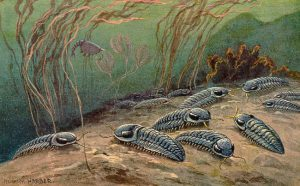

Life in the early **Paleozoic Era** was dominated by marine organisms, but by the middle of the era plants and animals evolved to live and reproduce on land. Fish developed jaws and fins evolved into jointed limbs. The development of lungs allowed animals to emerge from the sea and become the first air-breathing tetrapods (four-legged animals), including amphibians.

Reptiles with the amniotic eggs evolved from amphibians, and reptiles later evolved to produce early ancestors to birds. Near the end of the Paleozoic Era, the Carboniferous Period had some of the most extensive forests in Earth’s history. Their fossilized remains became the coal that powered the industrial revolution. The first mammals, however, had yet to appear.

### **8.6.1 Paleozoic Tectonics and Paleogeography**

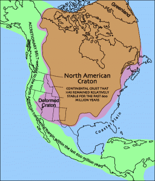

During the Paleozoic Era, sea-levels rose and fell four times. With each sea-level rise, the majority of North America was covered by a shallow tropical ocean. Evidence of these submersions are the abundant North American marine sedimentary rocks that include limestone with fossils corals and ooids. During this same time, extensive sea-level falls are documented by widespread unconformities. Today, the midcontinent contains thick sequences of marine sedimentary rocks from the Paleozoic, and western North America has thick layers of marine limestone on block faulted mountain ranges such as Mt. Timpanogos near Provo, Utah.

A reconstruction of Pangaea, showing approximate positions of modern continents.The assembly of supercontinent **Pangea**, sometimes spelled Pangaea, was completed by the late Paleozoic Era. Pangea formed when all of the major continents were grouped together and joined by a series of tectonic events including subduction, island-arc accretion, continental collisions, and ocean-basin closures. The name Pangea was originally coined by Alfred Wegener and means “all land.”

In North America, Pangea’s formation affected the east coast, involving a number of mountain-building events. They include the Taconic, Acadian, Caledonian, and Alleghanian orogenies. The Appalachian Mountains are the erosional remnants of these events.

A global ocean basin, known as the Panthalassa, surrounded Pangea. Continued plate movement expanded the ocean, creating a large bay called the Tethys Sea that eventually divided the Pangea land mass into two smaller supercontinents, Laurasia and Gondwana. Laurasia consisted of Laurentia (which later became present day North Ameirca) and Eurasia. Gondwana consisted of the remaining continents of South America, Africa, India, Australia, and Antarctica.

*Animation of plate movement the last 3.3 billion years. Pangea occurs at the 4:40 mark.*

While the east coast of North America was tectonically active during the Paleozoic Era, the west coast remained mostly inactive as a passive margin during the early Paleozoic. The western edge of North American continent was near the present-day Nevada-Utah border and was an expansive shallow continental shelf near the paleoequator. However, by the Devonian Period, the Antler orogeny started on the west coast and lasted until the Pennsylvanian Period. The Antler orogeny involved a volcanic island arc that was accreted onto western North America with the subduction direction away from North America. This created a mountain range on the west coast of North American called the Antler highlands and was the first part of building the land in the west that would eventually make most of California, Oregon, and Washington. In the late Paleozoic, the Sonoma orogeny began on the west coast; it involved another collision of an island arc. The Sonoma orogeny marks the change in subduction direction to be toward North America with a volcanic arc along the entire west coast of North America during the a late Paleozoic to early Mesozoic Eras.

By the end of the Paleozoic Era, the east coast of North America had a very high mountain range due to continental collision and the creation of Pangea. The west coast of North America had smaller and isolated volcanic highlands associated with island arc accretion. During the Mesozoic Era, the size of the mountains on either side of North America would flip, with the west coast being a more tectonically active plate boundary and the east coast changing into a passive margin after the breakup of Pangea.

### **8.6.2 Paleozoic Evolution**

Anomalocaris reconstruction by the MUSE science museum in Italy.The beginning of the Paleozoic Era is marked by the first appearance of hard body parts like shells, spikes, teeth, and scales; and the appearance in the rock record of most animal phyla known today. That is, most basic animal body plans appeared in the rock record during the Cambrian Period. This sudden appearance of biological diversity is called the **Cambrian Explosion. **Scientists debate whether this sudden appearance is more from a rapid evolutionary diversification as a result of a warmer climate following the late Proterozoic glacial environments, better preservation and fossilization of hard parts, or artifacts of a more complete and recent rock record. For example, fauna may have been diverse during the Ediacaran Period, setting the state for the Cambrian Explosion, but they lacked hard body parts and would have left few fossils behind. Regardless, during the Cambrian Period 541–485 million years ago marked the appearance of most animal phyla.

Original plate from Walcott’s 1912 description of Opabinia, with labels: fp = frontal appendage, e =   eye, ths = thoracic somites, i = intestine, ab = abdominal segment.One of the best fossil records of the Cambrian explosion, the **Burgess Shale** in western Canada, was discovered in 1909 by Charles Walcott (1850–1927). The Burgess Shale is a **Lagerstätte**, a site of exceptional fossil preservation that includes impressions of soft body parts. This discovery allowed scientists to study Cambrian animals in immense detail because soft body parts are not normally preserved and fossilized. Other Lagerstätte sites of similar age in China and Utah have allowed scientist to form a detailed picture of Cambrian biodiversity. The biggest mystery surrounds animals that do not fit existing lineages and are unique to that time. This includes many famous fossilized creatures: the first compound-eyed trilobites; *Wiwaxia*, a creature covered in spiny plates;* Hallucigenia*, a walking worm with spikes;* Opabinia*, a five-eyed arthropod with a grappling claw; and *Anomalocaris*, the alpha predator of its time, complete with grasping appendages and circular mouth with sharp plates. Most notably appearing during the Cambrian is an important ancestor to humans. A segmented worm called *Pikaia* is thought to be the earliest ancestor of the **Chordata** phylum that includes vertebrates, animals with backbones.

A modern coral reef.By the end of the Cambrian, mollusks, brachiopods, nautiloids, gastropods, graptolites, echinoderms, and trilobites covered the sea floor. Although most animal phyla appeared by the Cambrian, the biodiversity at the family, genus, and species level was low until the Ordovician Period. During the **Great Ordovician Biodiversification Event**, vertebrates and invertebrates (animals without backbone) became more diverse and complex at family, genus, and species level. The cause of the rapid speciation event is still debated but some likely causes are a combination of warm temperatures, expansive continental shelves near the equator, and more volcanism along the mid-ocean ridges. Some have shown evidence that an asteroid breakup event and consequent heavy meteorite impacts correlate with this diversification event. The additional volcanism added nutrients to ocean water helping support a robust ecosystem. Many life forms and ecosystems that would be recognizable in current times appeared at this time. Mollusks, corals, and arthropods in particular multiplied to dominate the oceans.

Guadalupe National Park is made of a giant fossil reef complex.One important evolutionary advancement during the Ordovician Period was the arrival of reef-building organisms, mostly colonial coral. Corals took advantage of the ocean chemistry, using calcite to build large structures that resembled modern reefs like the Great Barrier Reef off the coast of Australia. These reefs housed thriving ecosystems of organisms that swam around, hid in, and crawled over them. Reefs are important to paleontologists because of their preservation potential, massive size, and in-place ecosystems. Few other fossils offer more diversity and complexity than reef assemblages.

According to evidence from glacial deposits,  a small ice age caused sea-levels to drop and led to a major mass extinction by the end of the Ordovician. This is the earliest of five **mass extinction** events documented in the fossil record. During this mass extinction, an unusually large number of species abruptly disappear in the fossil record (see video).

*Video on mass extinctions.*

The armor-plated fish (placoderm) Bothriolepis panderi from the Devonian of Russia.Life bounced back during the Silurian period. The period’s major evolutionary event was the development of jaws from the forward pair of gill arches in bony fishes and sharks. Hinged jaws allowed fish to exploit new food sources and ecological niches. This period also included the start of armored fishes, known as the placoderms. In addition to fish and jaws, Silurian rocks provide the first evidence of terrestrial or land-dwelling plants and animals. The first vascular plant, *Cooksonia,* had woody tissues, pores for gas exchange, and veins for water and food transport. Insects, spiders, scorpions, and crustaceans began to inhabit moist, freshwater terrestrial environments.

Several different types of fish and amphibians that led to walking on land.The Devonian Period is called the Age of Fishes due to the rise in plated, jawed, and lobe-finned fishes . The lobe-finned fishes, which were related to the modern lungfish and coelacanth, are important for their eventual evolution into tetrapods, four-limbed vertebrate animals that can walk on land.  The first lobe-finned land-walking fish, named *Tiktaalik*, appeared about 385 million years ago and serves as a transition fossil between fish and early tetrapods. Though Tiktaalik was clearly a fish, it had some tetrapod structures as well. Several fossils from the Devonian are more tetrapod like than fish like but these weren’t fully terrestrial. The first fully terrestrial tetrapod arrived in the Mississippian (early Carboniferous) period. By the Mississippian (early Carboniferous) period, tetrapods had evolved into two main groups, amphibians and amniotes, from a common tetrapod ancestor. The amphibians were able to breathe air and live on land but still needed water to nurture their soft eggs. The first reptile (an amniote) could live and reproduce entirely on land with hard-shelled eggs that wouldn’t dry out.

Land plants had also evolved into the first trees and forests. Toward the end of the Devonian, another mass extinction event occurred. This extinction, while severe, is the least temporally defined, with wide variations in the timing of the event or events. Reef building organisms were the hardest hit, leading to dramatic changes in marine ecosystems.

A reconstruction of the giant arthropod (insects and their relatives) Arthropleura.The next time period, called the Carboniferous (North American geologists have subdivided this into the Mississippian and Pennsylvanian periods), saw the highest levels of oxygen ever known, with forests (e.g., ferns, club mosses) and swamps dominating the landscape . This helped cause the largest arthropods ever, like the millipede *Arthropleura*, at 2.5 meters (6.4 feet) long! It also saw the rise of a new group of animals, the reptiles. The evolutionary advantage that reptiles have over amphibians is the amniote egg (egg with a protective shell), which allows them to rely on non-aquatic environments for reproduction. This widened the terrestrial reach of reptiles compared to amphibians. This booming life, especially plant life, created cooling temperatures as carbon dioxide was removed from the atmosphere. By the middle Carboniferous, these cooler temperatures led to an ice age (called the Karoo Glaciation) and less-productive forests. The reptiles fared much better than the amphibians, leading to their diversification. This glacial event lasted into the early Permian.

Reconstruction of Dimetrodon.By the Permian, with Pangea assembled, the supercontinent evolved to a dryer climate, and even more diversification and domination by the reptiles. The groups that developed in this warm climate eventually radiated into dinosaurs. Another group, known as the synapsids, eventually evolved into mammals. Synapsids, including the famous sail-backed *Dimetrodon* are commonly confused with dinosaurs. Pelycosaurs (of the Pennsylvanian to early Permian like *Dimetrodon) *are the first group of synapsids that exhibit the beginnings of mammalian characteristics such as well-differentiated dentition: incisors, highly developed canines in lower and upper jaws and cheek teeth, premolars and molars. Starting in the late Permian, a second group of synapsids, called the therapsids (or mammal-like reptiles) evolve, and become the ancestors to mammals.

#### Permian Mass Extinction

Map of global flood basalts. Note the largest is the Siberian Traps.The end of the Paleozoic era is marked by the largest mass extinction in earth history. The Paleozoic era had two smaller mass extinctions,  but these were not as large as the **Permian Mass Extinction**, also known as the Permian-Triassic Extinction Event. It is estimated that up to 96% of marine species and 70% of land-dwelling (terrestrial) vertebrates went extinct. Many famous organisms, like sea scorpions and trilobites, were never seen again in the fossil record.

What caused such a widespread extinction event? The exact cause is still debated, though the leading idea relates to extensive volcanism associated with the **Siberian Traps**, which are one of the largest deposits of flood basalts known on Earth, dating to the time of the extinction event. The eruption size is estimated at over 3 million cubic kilometers that is approximately 4,000,000 times larger than the famous 1980 Mt. St. Helens eruption in Washington.  The unusually large volcanic eruption would have contributed a large amount of toxic gases, aerosols, and greenhouse gasses into the atmosphere. Further, some evidence suggests that the volcanism burned vast coal deposits releasing methane (a greenhouse gas) into the atmosphere. As discussed in Chapter 15, greenhouse gases cause the climate to warm. This extensive addition of greenhouse gases from the Siberian Traps may have caused a runaway greenhouse effect that rapidly changed the climate, acidified the oceans, disrupted food chains, disrupted carbon cycling, and caused the largest mass extinction.

**▶ Did you get it? Click here to find out.**

                            if (window.qmn_quiz_data === undefined) {
                                    window.qmn_quiz_data = new Object();
                            }
                    window.qmn_quiz_data["181"] = {"quiz_id":"181","quiz_name":"08.6-1","disable_answer":0,"ajax_show_correct":0,"progress_bar":"0","contact_info_location":0,"qpages":{"1":{"id":"1","quizID":"64","pagekey":"6qgpbQ2z","hide_prevbtn":"0"}},"skip_validation_time_expire":0,"timer_limit_val":0,"disable_scroll_next_previous_click":0,"disable_scroll_on_result":0,"disable_first_page":"0","enable_result_after_timer_end":0,"enable_quick_result_mc":"1","end_quiz_if_wrong":0,"form_disable_autofill":0,"disable_mathjax":0,"enable_quick_correct_answer_info":"2","quick_result_correct_answer_text":"Yes. Island arcs are NOT associated with continents. All the ohter things listed are.","quick_result_wrong_answer_text":"Incorrect","quiz_processing_message":"","quiz_limit_choice":"Limit of choice is reached.","not_allow_after_expired_time":0,"scheduled_time_end":false,"error_messages":{"email_error_text":"Not a valid e-mail address!","number_error_text":"This field must be a number!","incorrect_error_text":"The entered text is not correct!","empty_error_text":"Please complete all required fields!","url_error_text":"The entered URL is not valid!","minlength_error_text":"Required atleast %minlength% characters.","maxlength_error_text":"Maximum %maxlength% characters allowed.","recaptcha_error_text":"ReCaptcha is missing"}}
                    

8.6.1 What different tectonic settings WERE NOT present in North America during the Paleozoic? 

sedimentary basins 

					island arcs					

					passive margins					

					continental collision zones					

subduction zones					

None

 Time's upCancel
                            if (window.qmn_quiz_data === undefined) {
                                    window.qmn_quiz_data = new Object();
                            }
                    window.qmn_quiz_data["182"] = {"quiz_id":"182","quiz_name":"08.6-2","disable_answer":0,"ajax_show_correct":0,"progress_bar":"0","contact_info_location":0,"qpages":{"1":{"id":"1","quizID":"64","pagekey":"6qgpbQ2z","hide_prevbtn":"0"}},"skip_validation_time_expire":0,"timer_limit_val":0,"disable_scroll_next_previous_click":0,"disable_scroll_on_result":0,"disable_first_page":"0","enable_result_after_timer_end":0,"enable_quick_result_mc":"1","end_quiz_if_wrong":0,"form_disable_autofill":0,"disable_mathjax":0,"enable_quick_correct_answer_info":"2","quick_result_correct_answer_text":"Correct. Photosynthesis started long before the Cambrian.","quick_result_wrong_answer_text":"Incorrect","quiz_processing_message":"","quiz_limit_choice":"Limit of choice is reached.","not_allow_after_expired_time":0,"scheduled_time_end":false,"error_messages":{"email_error_text":"Not a valid e-mail address!","number_error_text":"This field must be a number!","incorrect_error_text":"The entered text is not correct!","empty_error_text":"Please complete all required fields!","url_error_text":"The entered URL is not valid!","minlength_error_text":"Required atleast %minlength% characters.","maxlength_error_text":"Maximum %maxlength% characters allowed.","recaptcha_error_text":"ReCaptcha is missing"}}
                    

8.6-2 Which of these WAS NOT something new that occurred during the Cambrian Explosion? 

					The new invention of hard parts led to an increase in fossil preservations					

					Many lineages that exist today were formed at that time					

					The first plants with photosynthesis evolved					

					Many lineages evolved but went extinct quickly, with almost no ancestors past the Cambrian 

None

 Time's upCancel
                            if (window.qmn_quiz_data === undefined) {
                                    window.qmn_quiz_data = new Object();
                            }
                    window.qmn_quiz_data["183"] = {"quiz_id":"183","quiz_name":"08.6-3","disable_answer":0,"ajax_show_correct":0,"progress_bar":"0","contact_info_location":0,"qpages":{"1":{"id":"1","quizID":"64","pagekey":"6qgpbQ2z","hide_prevbtn":"0"}},"skip_validation_time_expire":0,"timer_limit_val":0,"disable_scroll_next_previous_click":0,"disable_scroll_on_result":0,"disable_first_page":"0","enable_result_after_timer_end":0,"enable_quick_result_mc":"1","end_quiz_if_wrong":0,"form_disable_autofill":0,"disable_mathjax":0,"enable_quick_correct_answer_info":"2","quick_result_correct_answer_text":"Correct. Pangea formed during the late Paleozoic and Mesozoic. The Appalachians were created at this time. For a long time, most North American tectonism took place on the East Coast. This changed in the later parts of the Mesozoic.","quick_result_wrong_answer_text":"Incorrect","quiz_processing_message":"","quiz_limit_choice":"Limit of choice is reached.","not_allow_after_expired_time":0,"scheduled_time_end":false,"error_messages":{"email_error_text":"Not a valid e-mail address!","number_error_text":"This field must be a number!","incorrect_error_text":"The entered text is not correct!","empty_error_text":"Please complete all required fields!","url_error_text":"The entered URL is not valid!","minlength_error_text":"Required atleast %minlength% characters.","maxlength_error_text":"Maximum %maxlength% characters allowed.","recaptcha_error_text":"ReCaptcha is missing"}}
                    

8.6-3 Which mountain range is associated with the formation of Pangea? 

					Rockys					

					Alps					

					Appalachian					

					Himalaya					

					Sierra Nevada					

None

 Time's upCancel
                            if (window.qmn_quiz_data === undefined) {
                                    window.qmn_quiz_data = new Object();
                            }
                    window.qmn_quiz_data["184"] = {"quiz_id":"184","quiz_name":"08.6-4","disable_answer":0,"ajax_show_correct":0,"progress_bar":"0","contact_info_location":0,"qpages":{"1":{"id":"1","quizID":"64","pagekey":"6qgpbQ2z","hide_prevbtn":"0"}},"skip_validation_time_expire":0,"timer_limit_val":0,"disable_scroll_next_previous_click":0,"disable_scroll_on_result":0,"disable_first_page":"0","enable_result_after_timer_end":0,"enable_quick_result_mc":"1","end_quiz_if_wrong":0,"form_disable_autofill":0,"disable_mathjax":0,"enable_quick_correct_answer_info":"2","quick_result_correct_answer_text":"Correct. The first mammals appeared in the late Triassic (Mesozoic).","quick_result_wrong_answer_text":"Incorrect","quiz_processing_message":"","quiz_limit_choice":"Limit of choice is reached.","not_allow_after_expired_time":0,"scheduled_time_end":false,"error_messages":{"email_error_text":"Not a valid e-mail address!","number_error_text":"This field must be a number!","incorrect_error_text":"The entered text is not correct!","empty_error_text":"Please complete all required fields!","url_error_text":"The entered URL is not valid!","minlength_error_text":"Required atleast %minlength% characters.","maxlength_error_text":"Maximum %maxlength% characters allowed.","recaptcha_error_text":"ReCaptcha is missing"}}
                    

8.6-4 What important evolutionary advance DID NOT occur during the Paleozoic? 

					some eggs with hard shells developed					

					the first trees began to grow					

					the first shelled animals showed up					

					the first mammals evolved					

					animals walked on land					

None

 Time's upCancel

## **8.7 Phanerozoic Eon: Mesozoic Era**

Perhaps the greatest fossil ever found, a velociraptor attacked a protoceratops, and both were fossilized mid sequence.Following the Permian Mass Extinction, the **Mesozoic** (“middle life”) was from 252 million years ago to 66 million years ago. As Pangea started to break apart, mammals, birds, and flowering plants developed. The Mesozoic is probably best known as the age of reptiles, most notably, the dinosaurs.

### 8.7.1 Mesozoic Tectonics and Paleogeography

Animation showing Pangea breaking upPangea started breaking up (in a region that would become eastern Canada and United States) around 210  million years ago in the Late Triassic. Clear evidence for this includes the age of the sediments in the Newark Supergroup rift basins and the Palisades sill of the eastern part of North America and the age of the Atlantic ocean floor. Due to sea-floor spreading, the oldest rocks on the Atlantic’s floor are along the coast of northern Africa and the east coast of  North America, while the youngest are along the mid-ocean ridge.

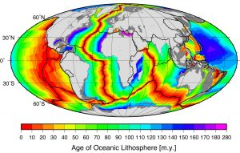

This age pattern shows how the Atlantic Ocean opened as the young Mid-Atlantic Ridge began to create the seafloor. This means the Atlantic ocean started opening and was first formed at this time. The southern Atlantic opened next, with South America separating from central and southern Africa. Last (happening after the Mesozoic ended) was the northernmost Atlantic, with Greenland and Scandinavia parting ways. The breaking points of each rifted plate margin eventually turned into the passive plate boundaries of the east coast of the Americas today.

https://opengeology.org/textbook/wp-content/uploads/2016/07/PangeaEADef.mp4

*Video of Pangea breaking apart and plates moving to their present locations. By Tanya Atwater.*

Sketch of the major features of the Sevier Orogeny.In western North America, an active plate margin had started with subduction, controlling most of the tectonics of that region in the Mesozoic. Another possible island-arc collision created the Sonoman Orogeny in Nevada during the latest Paleozoic to the Triassic. In the Jurassic, another island-arc collision caused the Nevadan Orogeny, a large Andean-style volcanic arc and thrust belt. The Sevier Orogeny followed in the Cretaceous, which was mainly a volcanic arc to the west and a thin-skinned fold and thrust belt to the east, meaning stacks of shallow faults and folds built up the topography. Many of the structures in the Rocky Mountains today date from this orogeny.

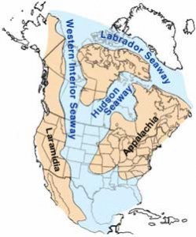

Tectonics created the Cretaceous Western Interior Foreland Basin, which flooded during high sea levels forming the **Cretaceous Interior Seaway**. The Farallon Plate, an oceanic plate connected to the Pacific Plate (seen today as remnants such as the Juan de Fuca Plate, off the coast of the Pacific Northwest) was subducting from the west. Subduction was shallow at this time because a very young, hot and less dense portion of the Farallon plate was subducted. This shallow subduction caused a downwarping in the central part of North America. High sea levels due to shallow subduction, and increasing rates of seafloor spreading and subduction, high temperatures, and melted ice also contributed to the high sea levels. These factors allowed a shallow epicontinental seaway, extending from the Gulf of Mexico to the Arctic Ocean, to divide North America into two separate land masses for 25 million years. Laramidia was in the west and Appalachia was in the east. Many of the coal deposits in Utah and Wyoming formed from swamps along the shores of this seaway. By the end of the Cretaceous, cooling temperatures caused the seaway to regress and eventually disappear.

### 8.7.2 Mesozoic Evolution

A Mesozoic scene from the late Jurassic.Reptiles, more specifically, the dinosaurs, dominate the Mesozoic Era. The Triassic Period started with devastated ecosystems that took over 30 million years to fully re-emerge after the Permian Mass Extinction.  The first appearance of many modern groups of animals that would later flourish occurred at this time.  This includes frogs (amphibians), turtles (reptiles), marine ichthyosaurs and plesiosaurs (marine reptiles), mammals, and the archosaurs.  The archosaurs (“ruling reptiles”) include ancestral groups that went extinct at the end of the Triassic, as well as the flying pterosaurs, crocodilians, and the dinosaurs.  Archosaurs, like the placental mammals after them, occupied all major environments: terrestrial (dinosaurs), in the air (pterosaurs), aquatic (crocodilians) and even fully marine habitats (marine crocodiles). The pterosaurs, the first vertebrate group to take flight, like the dinosaurs and mammals, start small in the Triassic.

A drawing of the early plesiosaur Agustasaurus from the Triassic of Nevada.At the end of the Triassic, another mass extinction event occurred, the fourth major mass extinction in the geologic record. This was perhaps caused by the Central Atlantic Magmatic Province flood basalt. The end-Triassic extinction made certain lineages go extinct and helped spur the evolution of survivors like mammals, pterosaurs (flying reptiles), ichthyosaurs/plesiosaurs/mosasaurs (marine reptiles), and dinosaurs.

Reconstruction of the small (<5″) Megazostrodon, one of the first animals considered to be a true mammal.Mammals, as previously mentioned, got their start from a reptilian synapsid ancestor, possibly in the late Paleozoic. Mammals stayed small, in mainly nocturnal niches, with insects being their largest prey. The development of warm-blooded circulation and fur may have been a response to this lifestyle.

Closed structure of a ornithischian hip, which is similar to a birds.In the Jurassic, species that were previously common, flourished due to a warmer and more tropical climate. The dinosaurs were relatively small animals in the Triassic period of the Mesozoic, but became truly massive in the Jurassic.  Dinosaurs are split into two groups based on their hip structure, i.e. orientation of the pubis and ischium bones in relationship to each other.  This is referred to as the “reptile hipped” saurischians and the “bird hipped” ornithischians. This has recently been brought into question by a new idea about dinosaur lineage.

Open structure of a saurischian hip, which is similar to a lizards.Most of the dinosaurs of the Triassic were saurischians, but all of them were bipedal. The major adaptive advantage dinosaurs had was changes in the hip and ankle bones, allowing them to tuck their legs under their bodies for improved locomotion as opposed to the semi-erect gait of crocodiles or the sprawling posture of reptiles. In the Jurassic, limbs (or a lack thereof) were also important to another group of reptiles, leading to the evolution of *Eophis*, the oldest snake.

Therizinosaurs, like Beipiaosaurus (shown in this restoration), are known for their enormous hand claws.There is a paucity of dinosaur fossils from the Early and Middle Jurassic, but late Jurassic fossils are plentiful. The saurischians diversified into the giant herbivorous (plant-eating), long-necked sauropods weighing up to 100 tons and bipedal carnivorous theropods, with the possible exception of the *Therizinosaurs*. All of the ornithischians (e.g *Stegosaurus, Iguanodon, Triceratops, Ankylosaurus, **Pachycephhlosaurus*) were herbivorous with a strong tendency to have a “turtle-like” beak at the tips of their mouths.

Iconic “Berlin specimen” Archaeopteryx lithographica fossil from Germany.The pterosaurs grew and diversified in the Jurassic, and another notable arial organism developed and thrived in the Jurassic: birds. When *Archeopteryx* was found in the Solnhofen Lagerstätte of Germany, a seeming dinosaur-bird hybrid, it started the conversation on the origin of birds. The idea that birds evolved from dinosaurs occurred very early in the history of research into evolution, only a few years after Darwin’s *On the Origin of Species*. A seminal study suggested that a remarkable fossil of *Archeopteryx* was from a transitional animal between dinosaurs and birds. Small meat-eating theropod dinosaurs were likely the branch that became birds due to their similar features. A significant debate still exists over how and when powered flight evolved. Some have stated a running-start model, while others have favored a tree-leaping gliding model or even a semi-combination: flapping to aid in climbing.

Reconstructed skeleton of Argentinosaurus, from Naturmuseum Senckenberg in Germany.The Cretaceous saw a further diversification, specialization, and domination of the dinosaurs and other fauna. One of the biggest changes on land was the transition to angiosperm-dominated flora. Angiosperms, which are plants with flowers and seeds, had originated in the Cretaceous, switching many plains to grasslands by the end of the Mesozoic. By the end of the period, they had replaced gymnosperms (evergreen trees) and ferns as the dominant plant in the world’s forests. Haplodiploid eusocial insects (bees and ants) are descendants from Jurassic wasp-like ancestors that co-evolved with the flowering plants during this time period. The breakup of Pangea not only shaped our modern world’s geography, but biodiversity at the time as well. Throughout the Mesozoic, animals on the isolated, now separated island continents (formerly parts of Pangea), took strange evolutionary turns. This includes giant titanosaurian sauropods (*Argentinosaurus*) and theropods (*Giganotosaurus*) from South America.

#### K-T Extinction

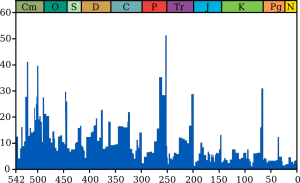

Similar to the end of the Paleozoic era, the Mesozoic Era ended with the **K-Pg Mass Extinction **(previously known as the **K-T Extinction**) 66 million years ago. This extinction event was likely caused by a large **bolide **(an extraterrestrial impactor such as an asteroid, meteoroid, or comet) that collided with earth. Ninety percent of plankton species, 75% of plant species, and all the dinosaurs went extinct at this time.

Artist’s depiction of an impact eventOne of the strongest pieces of evidence comes from the element iridium. Quite rare on Earth, and more common in meteorites, it has been found all over the world in higher concentrations at a particular layer of rock that formed at the time of the K-T boundary. Soon other scientists started to find evidence to back up the claim. Melted rock spheres, a special type of “shocked” quartz called stishovite, that only is found at impact sites, was found in many places around the world . The huge impact created a strong thermal pulse that could be responsible for global forest fires, strong acid rains, a corresponding abundance of ferns, the first colonizing plants after a forest fire, enough debris thrown into the air to significantly cool temperatures afterward, and a 2-km high tsunami inferred from deposits found from Texas to Alabama.

The land expression of the Chicxulub crater. The other side of the crater is within the Gulf of México.Still, with all this evidence, one large piece remained missing: the crater where the bolide impacted. It was not until 1991 that the crater was confirmed using petroleum company geophysical data. Even though it is the third largest confirmed crater on Earth at roughly 180 km wide, the **Chicxulub Crater** was hard to find due to being partially underwater and partially obscured by the dense forest canopy of the Yucatan Peninsula. Coring of the center of the impact called the peak ring contained granite, indicating the impact was so powerful that it lifted basement sediment from the crust several miles toward the surface. In 2010, an international team of scientists reviewed 20 years of research and blamed the impact for the extinction.

Geology of India, showing purple as Deccan Traps-related rocks.With all of this information, it seems like the case would be closed. However, there are other events at this time which could have partially aided the demise of so many organisms. For example, sea levels are known to be slowly decreasing at the time of the K-T event, which is tied to marine extinctions, although any study on gradual vs. sudden changes in the fossil record is flawed due to the incomplete nature of the fossil record. Another big event at this time was the **Deccan Traps** flood basalt volcanism in India. At over 1.3 million cubic kilometers of material, it was certainly a large source of material hazardous to ecosystems at the time, and it has been suggested as at least partially responsible for the extinction. Some have found the impact and eruptions too much of a coincidence, and have even linked the two together.

**▶ Did you get it? Click here to find out.**

                            if (window.qmn_quiz_data === undefined) {
                                    window.qmn_quiz_data = new Object();
                            }
                    window.qmn_quiz_data["185"] = {"quiz_id":"185","quiz_name":"08.7-1","disable_answer":0,"ajax_show_correct":0,"progress_bar":"0","contact_info_location":0,"qpages":{"1":{"id":"1","quizID":"64","pagekey":"6qgpbQ2z","hide_prevbtn":"0"}},"skip_validation_time_expire":0,"timer_limit_val":0,"disable_scroll_next_previous_click":0,"disable_scroll_on_result":0,"disable_first_page":"0","enable_result_after_timer_end":0,"enable_quick_result_mc":"1","end_quiz_if_wrong":0,"form_disable_autofill":0,"disable_mathjax":0,"enable_quick_correct_answer_info":"2","quick_result_correct_answer_text":"Correct. A shallow sea divided North America into two parts, and evolution did not follow the exact same path in both parts.","quick_result_wrong_answer_text":"Incorrect","quiz_processing_message":"","quiz_limit_choice":"Limit of choice is reached.","not_allow_after_expired_time":0,"scheduled_time_end":false,"error_messages":{"email_error_text":"Not a valid e-mail address!","number_error_text":"This field must be a number!","incorrect_error_text":"The entered text is not correct!","empty_error_text":"Please complete all required fields!","url_error_text":"The entered URL is not valid!","minlength_error_text":"Required atleast %minlength% characters.","maxlength_error_text":"Maximum %maxlength% characters allowed.","recaptcha_error_text":"ReCaptcha is missing"}}
                    

8.7-1 Cretaceous fossils in western North America are different from Cretaceous fossils in eastern North America. Why would this be? 

					There was a rift in central North America					

					There was a mountain range in central North America					

					There was a shallow sea in central North America					

					There was a subduction zone in central North America					

					There was a desert across central North America					

None

 Time's upCancel
                            if (window.qmn_quiz_data === undefined) {
                                    window.qmn_quiz_data = new Object();
                            }
                    window.qmn_quiz_data["186"] = {"quiz_id":"186","quiz_name":"08.7-2","disable_answer":0,"ajax_show_correct":0,"progress_bar":"0","contact_info_location":0,"qpages":{"1":{"id":"1","quizID":"64","pagekey":"6qgpbQ2z","hide_prevbtn":"0"}},"skip_validation_time_expire":0,"timer_limit_val":0,"disable_scroll_next_previous_click":0,"disable_scroll_on_result":0,"disable_first_page":"0","enable_result_after_timer_end":0,"enable_quick_result_mc":"1","end_quiz_if_wrong":0,"form_disable_autofill":0,"disable_mathjax":0,"enable_quick_correct_answer_info":"2","quick_result_correct_answer_text":"Correct. The age of the Atlantic Ocean floor is strong evidence for the breakup of Pangea in the early Jurassic.","quick_result_wrong_answer_text":"Incorrect","quiz_processing_message":"","quiz_limit_choice":"Limit of choice is reached.","not_allow_after_expired_time":0,"scheduled_time_end":false,"error_messages":{"email_error_text":"Not a valid e-mail address!","number_error_text":"This field must be a number!","incorrect_error_text":"The entered text is not correct!","empty_error_text":"Please complete all required fields!","url_error_text":"The entered URL is not valid!","minlength_error_text":"Required atleast %minlength% characters.","maxlength_error_text":"Maximum %maxlength% characters allowed.","recaptcha_error_text":"ReCaptcha is missing"}}
                    

8.7-2 What offers good evidence for the timing of Pangea's breakup? 

					volcanoes in North America					

					the Atlantic Ocean floor 

					the Pacific Ocean floor					

volcanoes in Asia					

					the extinction of many fauna					

None

 Time's upCancel
                            if (window.qmn_quiz_data === undefined) {
                                    window.qmn_quiz_data = new Object();
                            }
                    window.qmn_quiz_data["187"] = {"quiz_id":"187","quiz_name":"08.7-3","disable_answer":0,"ajax_show_correct":0,"progress_bar":"0","contact_info_location":0,"qpages":{"1":{"id":"1","quizID":"64","pagekey":"6qgpbQ2z","hide_prevbtn":"0"}},"skip_validation_time_expire":0,"timer_limit_val":0,"disable_scroll_next_previous_click":0,"disable_scroll_on_result":0,"disable_first_page":"0","enable_result_after_timer_end":0,"enable_quick_result_mc":"1","end_quiz_if_wrong":0,"form_disable_autofill":0,"disable_mathjax":0,"enable_quick_correct_answer_info":"2","quick_result_correct_answer_text":"Correct. Transition fossils like Archaeopteryx show that dinosaurs evolved into birds.","quick_result_wrong_answer_text":"Incorrect","quiz_processing_message":"","quiz_limit_choice":"Limit of choice is reached.","not_allow_after_expired_time":0,"scheduled_time_end":false,"error_messages":{"email_error_text":"Not a valid e-mail address!","number_error_text":"This field must be a number!","incorrect_error_text":"The entered text is not correct!","empty_error_text":"Please complete all required fields!","url_error_text":"The entered URL is not valid!","minlength_error_text":"Required atleast %minlength% characters.","maxlength_error_text":"Maximum %maxlength% characters allowed.","recaptcha_error_text":"ReCaptcha is missing"}}
                    

8.7-3 Dinosaurs evolved into what major animal group alive today? 

					turtles					

					lizards					

					mammals					

					birds					

					sharks and other fish					

None

 Time's upCancel
                            if (window.qmn_quiz_data === undefined) {
                                    window.qmn_quiz_data = new Object();
                            }
                    window.qmn_quiz_data["188"] = {"quiz_id":"188","quiz_name":"08.7-4","disable_answer":0,"ajax_show_correct":0,"progress_bar":"0","contact_info_location":0,"qpages":{"1":{"id":"1","quizID":"64","pagekey":"6qgpbQ2z","hide_prevbtn":"0"}},"skip_validation_time_expire":0,"timer_limit_val":0,"disable_scroll_next_previous_click":0,"disable_scroll_on_result":0,"disable_first_page":"0","enable_result_after_timer_end":0,"enable_quick_result_mc":"1","end_quiz_if_wrong":0,"form_disable_autofill":0,"disable_mathjax":0,"enable_quick_correct_answer_info":"2","quick_result_correct_answer_text":"Correct! The Chicxulub Crater in the Yucatan of Mexico formed by an asteroid impact, along with the forest fires\/tsunamis\/heat bursts that followed, killed the dinosaurs. Indian volcanic eruptions might be related but Chicxulub is definitive.","quick_result_wrong_answer_text":"Incorrect","quiz_processing_message":"","quiz_limit_choice":"Limit of choice is reached.","not_allow_after_expired_time":0,"scheduled_time_end":false,"error_messages":{"email_error_text":"Not a valid e-mail address!","number_error_text":"This field must be a number!","incorrect_error_text":"The entered text is not correct!","empty_error_text":"Please complete all required fields!","url_error_text":"The entered URL is not valid!","minlength_error_text":"Required atleast %minlength% characters.","maxlength_error_text":"Maximum %maxlength% characters allowed.","recaptcha_error_text":"ReCaptcha is missing"}}
                    

8.7-4 What events contributed to the killing of the dinosaurs? 

					cold climate and glaciers in Gondawana, and exceptionally warm conditions in Laurasia					

					a meteorite impact in Mexico and, perhaps, volcanic eruptions in India					

					a worldwide lowering of sea level and expansion of the ice caps					

					competition from mammals and introduction of diseases					

					a warming spell that melted all the ice caps and flooded all the continents					

None

 Time's upCancel

## **8.8 Phanerozoic Eon: Cenozoic Era**

Paraceratherium, seen in this reconstruction, was a massive (15-20 ton, 15 foot tall) ancestor of rhinos.The **Cenozoic**, meaning “new life,” is known as the age of mammals because it is in this era that mammals came to be a dominant and large life form, including human ancestors. Birds, as well, flourished in the open niches left by the dinosaur’s demise. Most of the Cenozoic has been relatively warm, with the main exception being the ice age that started about 2.558 million years ago and (despite recent warming) continues today. Tectonic shifts in the west caused volcanism, but eventually changed the long-standing subduction zone into a transform boundary.

### 8.8.1 Cenozoic Tectonics and Paleogeography

*Animation of the last 38 million years of movement in western North America. Note, that after the ridge is subducted, convergent turns to transform (with divergent inland).*

Shallow subduction during the Laramide Orogeny.In the Cenozoic, the plates of Earth moved into more familiar places, with the biggest change being the closing of the Tethys Sea with collisions that formed the Alps, Zagros, and Himalaya, a collision that started about 57 million years ago, and continues today. Maybe the most significant tectonic feature that occurred in the Cenozoic of North America was the conversion of the west coast of California from a convergent boundary subduction zone to a transform boundary.

Subduction off the coast of the western United States, which had occurred throughout the Mesozoic, had continued in the Cenozoic. After the Sevier Orogeny in the late Mesozoic, a subsequent orogeny called the Laramide Orogeny, occurred in the early Cenozoic. The Laramide was thick-skinned, different than the Sevier Orogeny. It involved deeper crustal rocks, and produced bulges that would become mountain ranges like the Rockies, Black Hills, Wind River Range, Uinta Mountains, and the San Rafael Swell. Instead of descending directly into the mantle, the subducting plate shallowed out and moved eastward beneath the continental plate affecting the overlying continent hundreds of miles east of the continental margin and building high mountains.  This occurred because the subducting plate was so young and near the spreading center and the density of the plate was therefore low and subduction was hindered.

Map of the San Andreas fault, showing relative motion.As the mid-ocean ridge itself started to subduct, the relative motion had changed. Subduction caused a relative convergence between the subducting Farallon plate and the North American plate. The Pacific plate was on the other side of the mid-ocean ridge from the Farallon plate; it was moving away from the North American plate. Thus, as the subduction zone consumed the mid-ocean ridge, the relative movement became transform instead of convergent, which went on to become the San Andreas Fault System.

As the San Andreas grew, it caused east-west directed extensional forces to spread over the western United States, creating the Basin and Range province. The transform fault switched position over the last 18 million years, twisting the mountains around Los Angeles, and new faults in the southeastern California deserts may become a future San Andreas-style fault. During this switch from subduction to transform, the nearly horizontal Farallon slab began to sink into the mantle. This caused magmatism as the subducting slab sank, allowing asthenosphere material to rise around it. This event is called the Oligocene ignimbrite flare-up, which was one of the most significant periods of volcanism ever, including the largest single confirmed eruption, the 5000 cubic kilometer Fish Canyon Tuff.

### 8.8.2 Cenozoic Evolution

Family tree of Hominids (Hominadae).There are five groups of early mammals in the fossil record, based primarily on fossil teeth, the hardest bone in vertebrate skeletons. For the purpose of this text, the most important group are the Eupantotheres, that diverge into the two main groups of mammals, the marsupials (like *Sinodelphys*) and placentals or eutherians (like *Eomaia*) in the Cretaceous and then diversified in the Cenozoic.  The marsupials dominated on the isolated island continents of South America and Australia, and many went extinct in South America with the introduction of placental mammals. Some well-known mammal groups have been highly studied with interesting evolutionary stories in the Cenozoic. For example, horses started small with four toes, ended up larger and having just one toe. Cetaceans (marine mammals like whales and dolphins) started on land from small bear-like (mesonychids) creatures in the early Cenozoic and gradually took to water. However, no study of evolution has been more studied than human evolution. **Hominids**, the name for human-like primates, started in eastern Africa several million years ago.

Lucy skeleton from the Cleveland Natural History Museum, showing real fossil (brown) and reconstructed skeleton (white).The first critical event in this story is an environmental change from jungle to more of a savanna, probably caused by changes in Indian Ocean circulation. While bipedalism is known to have evolved before this shift, it is generally believed that our bipedal ancestors (like *Australopithecus*) had an advantage by covering ground more easily in a more open environment compared to their non-bipedal evolutionary cousins. There is also a growing body of evidence, including the famous “Lucy” fossil of an Australopithecine, that our early ancestors lived in trees. Arboreal animals usually demand a high intelligence to navigate through a three-dimensional world. It is from this lineage that humans evolved, using endurance running as a means to acquire more resources and possibly even hunt. This can explain many uniquely human features, from our long legs, strong achilles, lack of lower gut protection, and our wide range of running efficiencies.

The hypothesized movement of the homo genus. Years are marked as to the best guess of the timing of movement.Now that the hands are freed up, the next big step is a large brain. There have been arguments from a switch to more meat eating, cooking with fire, tool use, and even the construct of society itself to explain this increase in brain size. Regardless of how, it was this increased cognitive power that allowed humans to reign as their ancestors moved out of Africa and explored the world, ultimately entering the Americas through land bridges like the Bering Land Bridge. The details of this worldwide migration and the different branches of the hominid evolutionary tree are very complex, and best reserved for its own course.

#### Anthropocene and Extinction

Graph showing abundance of large mammals and the introduction of humans.Humans have had an influence on the Earth, its ecosystems and climate. Yet, human activity can not explain all of the changes that have occurred in the recent past. The start of the Quaternary period, the last and current period of the Cenozoic, is marked by the start of our current ice age 2.58 million years ago. During this time period, ice sheets advanced and retreated, most likely due to Milankovitch cycles (see ch. 15). Also at this time, various cold-adapted megafauna emerged (like giant sloths, saber-tooth cats, and woolly mammoths), and most of them went extinct as the Earth warmed from the most recent glacial maximum. A long-standing debate is over the cause of these and other extinctions. Is climate warming to blame, or were they caused by humans? Certainly, we know of recent human extinctions of animals like the dodo or passenger pigeon. Can we connect modern extinctions to extinctions in the recent past? If so, there are several ideas as to how this happened. Possibly the most widely accepted and oldest is the hunting/overkill hypothesis. The idea behind this hypothesis is that humans hunted large herbivores for food, then carnivores could not find food, and human arrival times in locations has been shown to be tied to increased extinction rates in many cases.

Bingham Canyon Mine, Utah. This open pit mine is the largest man-made removal of rock in the world.Modern human impact on the environment and the Earth as a whole is unquestioned. In fact, many scientists are starting to suggest that the rise of human civilization ended and/or replaced the Holocene epoch and defines a new geologic time interval: the **Anthropocene**. Evidence for this change includes extinctions, increased tritium (hydrogen with two neutrons) due to nuclear testing, rising pollutants like carbon dioxide, more than 200 never-before seen mineral species that have occurred only in this epoch, materials such as plastic and metals which will be long lasting “fossils” in the geologic record, and large amounts of earthen material moved. The biggest scientific debate with this topic is the starting point. Some say that humans’ invention of agriculture would be recognized in geologic strata and that should be the starting point, around 12,000 years ago. Others link the start of the industrial revolution and the subsequent addition of vast amounts of carbon dioxide in the atmosphere. Either way, the idea is that alien geologists visiting Earth in the distant future would easily recognize the impact of humans on the Earth as the beginning of a new geologic period.

**▶ Did you get it? Click here to find out.**

                            if (window.qmn_quiz_data === undefined) {
                                    window.qmn_quiz_data = new Object();
                            }
                    window.qmn_quiz_data["189"] = {"quiz_id":"189","quiz_name":"08.8-1","disable_answer":0,"ajax_show_correct":0,"progress_bar":"0","contact_info_location":0,"qpages":{"1":{"id":"1","quizID":"64","pagekey":"6qgpbQ2z","hide_prevbtn":"0"}},"skip_validation_time_expire":0,"timer_limit_val":0,"disable_scroll_next_previous_click":0,"disable_scroll_on_result":0,"disable_first_page":"0","enable_result_after_timer_end":0,"enable_quick_result_mc":"1","end_quiz_if_wrong":0,"form_disable_autofill":0,"disable_mathjax":0,"enable_quick_correct_answer_info":"2","quick_result_correct_answer_text":"Correct! Africa, specifically the East African Rift Valley, is where scientists have traced the beginnings of hominids.","quick_result_wrong_answer_text":"Incorrect","quiz_processing_message":"","quiz_limit_choice":"Limit of choice is reached.","not_allow_after_expired_time":0,"scheduled_time_end":false,"error_messages":{"email_error_text":"Not a valid e-mail address!","number_error_text":"This field must be a number!","incorrect_error_text":"The entered text is not correct!","empty_error_text":"Please complete all required fields!","url_error_text":"The entered URL is not valid!","minlength_error_text":"Required atleast %minlength% characters.","maxlength_error_text":"Maximum %maxlength% characters allowed.","recaptcha_error_text":"ReCaptcha is missing"}}
                    

8.8-1 Human evolution started where? 

					Asia					

					North America					

					Africa					

					Australia					

					Antarctica					

None

 Time's upCancel
                            if (window.qmn_quiz_data === undefined) {
                                    window.qmn_quiz_data = new Object();
                            }
                    window.qmn_quiz_data["190"] = {"quiz_id":"190","quiz_name":"08.8-2","disable_answer":0,"ajax_show_correct":0,"progress_bar":"0","contact_info_location":0,"qpages":{"1":{"id":"1","quizID":"64","pagekey":"6qgpbQ2z","hide_prevbtn":"0"}},"skip_validation_time_expire":0,"timer_limit_val":0,"disable_scroll_next_previous_click":0,"disable_scroll_on_result":0,"disable_first_page":"0","enable_result_after_timer_end":0,"enable_quick_result_mc":"1","end_quiz_if_wrong":0,"form_disable_autofill":0,"disable_mathjax":0,"enable_quick_correct_answer_info":"2","quick_result_correct_answer_text":"Correct. This is when the San Andreas Fault developed.","quick_result_wrong_answer_text":"Incorrect","quiz_processing_message":"","quiz_limit_choice":"Limit of choice is reached.","not_allow_after_expired_time":0,"scheduled_time_end":false,"error_messages":{"email_error_text":"Not a valid e-mail address!","number_error_text":"This field must be a number!","incorrect_error_text":"The entered text is not correct!","empty_error_text":"Please complete all required fields!","url_error_text":"The entered URL is not valid!","minlength_error_text":"Required atleast %minlength% characters.","maxlength_error_text":"Maximum %maxlength% characters allowed.","recaptcha_error_text":"ReCaptcha is missing"}}
                    

8.8-2 What tectonic change occurred off the coast of western North America (specifically California) in the Cenozoic? 

					a transform boundary changed to a convergent boundary					

					a convergent boundary changed to a transform boundary					

					a divergent boundary changed to a convergent boundary					

					a convergent boundary changed to a subduction zone					

					a divergent boundary changed to a subduction zone					

None

 Time's upCancel
                            if (window.qmn_quiz_data === undefined) {
                                    window.qmn_quiz_data = new Object();
                            }
                    window.qmn_quiz_data["191"] = {"quiz_id":"191","quiz_name":"08.8-3","disable_answer":0,"ajax_show_correct":0,"progress_bar":"0","contact_info_location":0,"qpages":{"1":{"id":"1","quizID":"64","pagekey":"6qgpbQ2z","hide_prevbtn":"0"}},"skip_validation_time_expire":0,"timer_limit_val":0,"disable_scroll_next_previous_click":0,"disable_scroll_on_result":0,"disable_first_page":"0","enable_result_after_timer_end":0,"enable_quick_result_mc":"1","end_quiz_if_wrong":0,"form_disable_autofill":0,"disable_mathjax":0,"enable_quick_correct_answer_info":"2","quick_result_correct_answer_text":"Correct. The Pleistocene was a time of glaciation. After it ended, that planet warmed without human help.","quick_result_wrong_answer_text":"Incorrect","quiz_processing_message":"","quiz_limit_choice":"Limit of choice is reached.","not_allow_after_expired_time":0,"scheduled_time_end":false,"error_messages":{"email_error_text":"Not a valid e-mail address!","number_error_text":"This field must be a number!","incorrect_error_text":"The entered text is not correct!","empty_error_text":"Please complete all required fields!","url_error_text":"The entered URL is not valid!","minlength_error_text":"Required atleast %minlength% characters.","maxlength_error_text":"Maximum %maxlength% characters allowed.","recaptcha_error_text":"ReCaptcha is missing"}}
                    

8.8-3 Which of the following IS NOT evidence of the Anthropocene? 

					increased pollution					

					increased carbon dioxide in the air					

					never-before seen minerals					

					extinctions, especially of large fauna					

					warmer temperatures since the Pleistocene					

					ancient stone tools					

None

 Time's upCancel

## Summary

The changes that have occurred since the inception of Earth are vast and significant. From the oxygenation of the atmosphere, the progression of life forms, the assembly and deconstruction of several supercontinents, to the extinction of more life forms than exist today, having a general understanding of these changes can put present change into a more rounded perspective.
